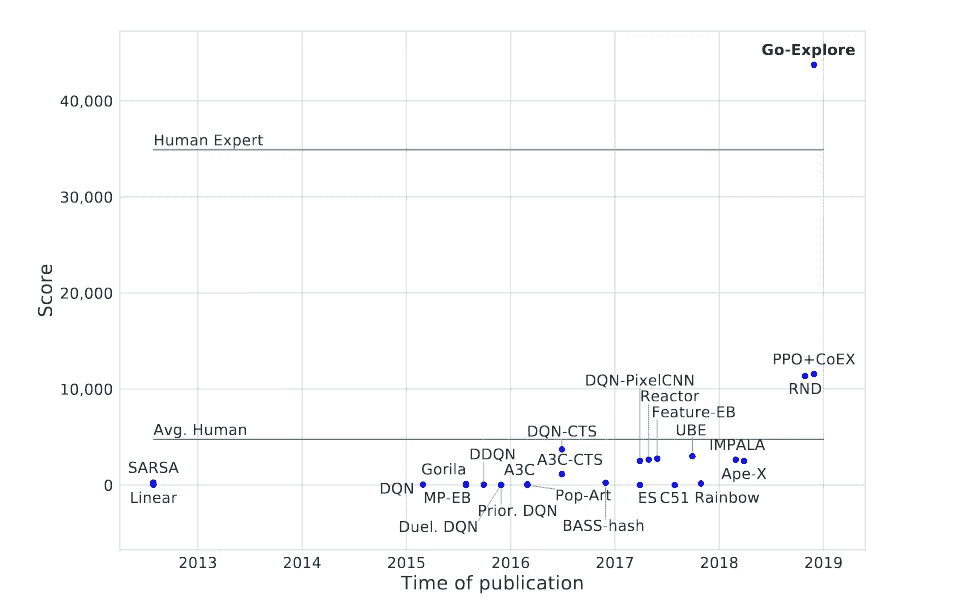

# Go-Explore 简介

> 原文：<https://towardsdatascience.com/a-short-introduction-to-go-explore-c61c2ef201f0?source=collection_archive---------36----------------------->

## 如何打败最难的雅达利游戏

照片由[杰米街](https://unsplash.com/@jamie452?utm_source=medium&utm_medium=referral)在 [Unsplash](https://unsplash.com?utm_source=medium&utm_medium=referral)

# 介绍

这些天我们在机器学习社区看到的是一场真正的军备竞赛:每个月，每个星期研究人员都发表新的论文，声称在数据集上产生最先进的(SOTA)结果。总的来说，我对机器学习的很多领域都感兴趣，所以我真的很难跟上新论文的潮流。在这方面，有一个网站给了我很大的帮助，那就是 [paperswithcode](https://paperswithcode.com) ，它展示了对无数不同数据集的 SOTA 模型的全面概述。竞争极其激烈的领域之一是经典的雅达利游戏。就在今年，来自谷歌的研究人员提出了一种新方法来实现两个众所周知的困难游戏*陷阱*和*蒙特祖马的复仇的超人性能。下面是他们是如何做到的。*

# 为什么强化学习很难

首先，我们需要两个来理解为什么特别是这两场比赛如此艰难。强化学习的整个思想是代理人通过从环境中收集奖励来学习。代理人会尝试一系列的行动，并选择能产生最高综合回报的行动组合。最佳环境有非常密集的奖励，所以代理人立即得到反馈，它的行动有多好。这方面的一个例子是吃豆人，那里的迷宫充满了收集的硬币。如果奖励太少，就会出现问题。那么代理缺乏反馈来改进他的行动。根据谷歌的论文，那些稀疏的奖励引发的两个主要问题是**脱离**和**出轨**

## 超脱

为了解决奖励稀少的问题，人们提出了内在奖励的概念。在这里，奖励被人为地均匀分布在整个环境中，以鼓励代理人去探索。

说明超脱的最简单的方法是通过一个简单的图片。请看图 1。这里的 im 是绿色的，分布在两个迷宫中。

图 1:拆卸图[【1】](https://arxiv.org/pdf/1901.10995v2.pdf)

代理从中间开始，首先探索左侧的迷宫。大多数强化学习算法的行为是随机的，所以在某个时间点，代理可能会决定开始探索正确的迷宫。现在的问题是在左边的迷宫中还有一些部分没有被探索，因此仍然有奖励，但是代理不太可能收集它们。原因是强化学习中的另一个问题叫做**灾难性遗忘**。当一个代理探索一个新的区域时，它会覆盖它过去的经验，因此它访问某个区域的时间越长，情况就越糟。

## 出轨

为了理解这个问题，我们需要稍微了解一下强化学习算法。在许多环境中，在**探索**和**开发**之间存在冲突，即代理人可以采取一条已经众所周知的路径，在这条路径上保证有好的回报(开发)，或者执行新的行动，希望这会导致更高的回报，但有接受更低回报的风险(探索)。为了应对这种冲突，许多算法采用了某种ɛ-greedy 策略。这意味着，在大多数情况下，代理将执行尽其所知最佳的动作(利用)，但在某些概率下，它将执行随机动作(探索)。这可能会有问题。想象一个智能体想要达到某个状态，而这个状态只有通过一系列动作的组合才能达到。代理甚至不太可能达到这种状态，因为在这个过程中，它将执行许多不同的动作，偏离了实际所需的路径。

# 去探索

谷歌的研究人员已经开发出一种方法来解决分离和出轨。它包括两个不同的阶段，即探索阶段和强健阶段。

## 第一阶段:探索

这个阶段**没有**使用任何神经网络或其他机器学习算法，而是完全基于随机(可能是半指导)探索。在这里，作者介绍了细胞的概念。单元格是实际游戏帧的缩小和灰度图像(图 2)。

图 2:从帧到单元格[【1】](https://arxiv.org/pdf/1901.10995v2.pdf)

这里的主要目标是找到**感兴趣的细胞**。那些是什么？有趣的细胞，以前没有发现，并在那里的代理收集了高奖励，以达到目的。每当发现新的单元时，四个值被添加到单元档案中:

1.  这个细胞的完整轨迹
2.  该牢房的环境状况
3.  该轨迹实现的总回报
4.  这个轨迹的长度

如果遇到已经在档案中的细胞，则相应的条目被更新，以防它“更好”，即更高的总回报或更短的轨迹。

在每次迭代中，该算法执行以下操作:

1.  **Go:** 使用试探法选择一个“好的”单元格，然后前往该单元格。试探可能选择具有最高总回报、最少访问等的单元。
2.  **探索:**执行随机动作，从这个有希望的细胞中寻找新的细胞。同样:这是随机的，没有政策或网络来选择一个动作。

这两个步骤有助于防止脱轨和脱离。我们建立了一个状态以及如何到达那里的档案，所以好的状态不会丢失(防止分离)。第一步，我们直接去国家，没有政策，因此没有随机行动。出轨也因此得以避免。

## 第二阶段:强健

第一阶段做了一个巨大的隐含假设:我们的环境是决定性的。为了从我们的档案中“转到”某个单元，我们需要能够重置环境，并确保我们存储的一系列操作确实会导致我们想要的“好”单元。这在电脑游戏中很容易实现，尤其是在简单的 Atari 游戏中，因为在这里相同的动作总是会导致相同的结果。但是当然，人们也想在现实世界中使用强化方法，这通常很难确定。这就是我们需要这个第二阶段的目的:使我们通过随机探索发现的良好结果细胞的轨迹对噪声和非确定性更加鲁棒。

为此，本文使用了所谓的向后算法。图中，我们有一系列单元格 c(1)，c(2)，…，c(n-1)，c(n)，我们在探索阶段发现这些单元格非常好，现在想做得更健壮。在第一步中，我们将我们的环境设置为 c(n-1 ),并训练一个强化算法来执行达到 c(n)所必需的动作。如果这个算法找到了一条轨迹，与我们随机找到的相比，它得到了相同或更高的回报，我们就返回到 c(n-2)，并试图从那里到达 c(n)。这是一个不断重复的过程，直到我们找到一个好的策略，找到一系列从 c(1)(开始状态)到 c(n)(结束状态)的动作。

如上所述，Atari 游戏是确定性的，但我们希望使我们的策略对非确定性更加鲁棒。那么，该怎么办呢？在我们的环境中引入噪声有两种相对简单的方法:

1.  没有操作:雅达利游戏有一个内置的计时器，它可以确定某些危险是否存在，或者危险和敌人在哪里。因此，如果我们在游戏开始时等待随机数量的帧，世界将总是处于稍微不同的状态。
2.  粘性动作:人类玩得不完美。他们的反应需要一些时间，所以他们有时按下按钮的时间比他们应该按的时间要长。强化算法通过粘性动作来模拟这一点，即根据算法的策略，随机执行动作的时间比应该执行的时间稍长。

# 结果

使用 Go-Explore 方法获得的结果是杰出的:不仅比任何其他强化算法执行得更好，而且它们还在超人的水平上运行(图 3)。

图 3:Go-探索蒙特祖马的复仇与其他方法的性能对比[【1】](https://arxiv.org/pdf/1901.10995v2.pdf)

# 来源

[1] A. Ecoffet，J. Huizinga，J. Lehman，K. O. Stanley 和 J. Clune: [Go-Explore:一种解决难探索问题的新方法](https://arxiv.org/pdf/1901.10995v2.pdf) (2020)