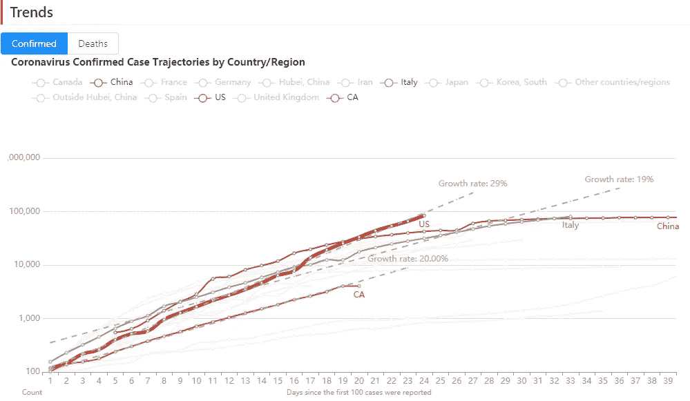
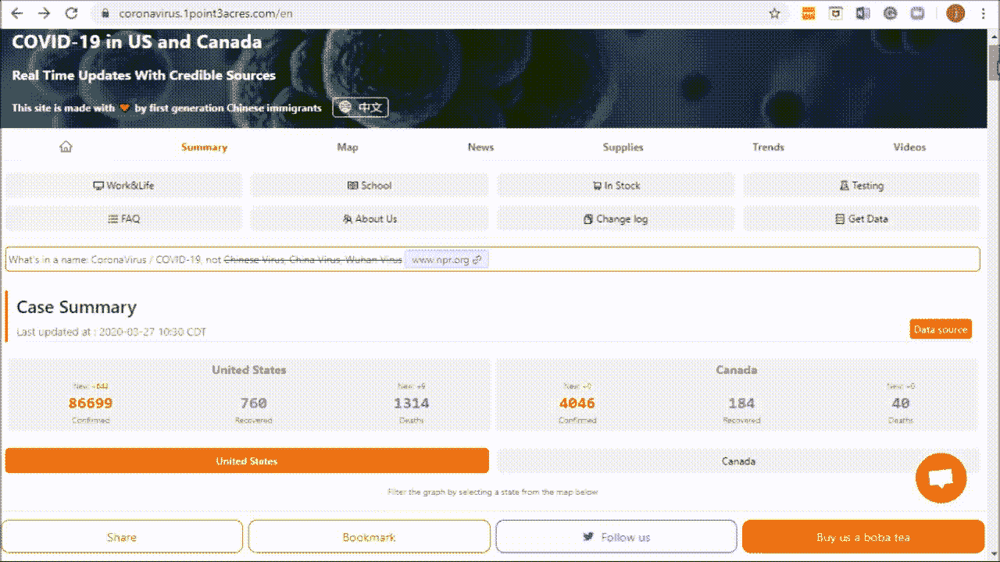
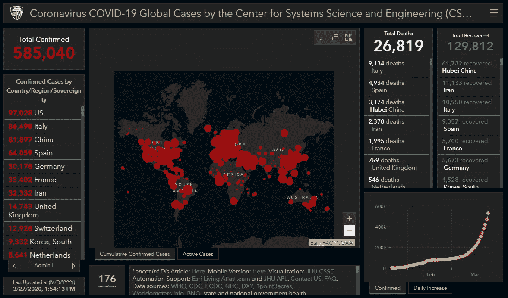
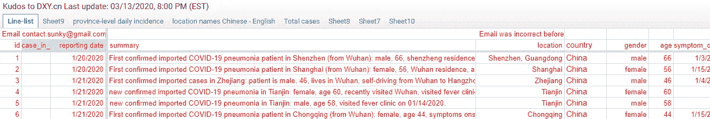
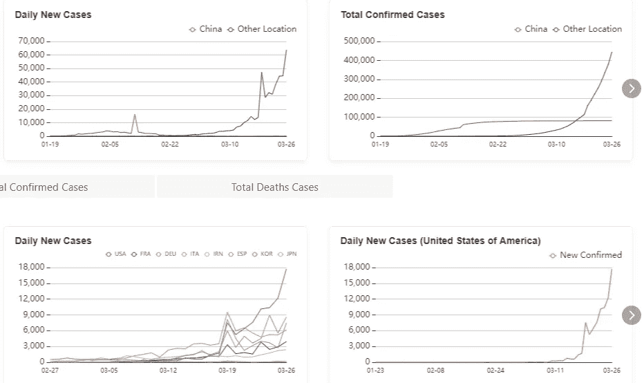

# 新冠肺炎数据来源简评

> 原文：<https://towardsdatascience.com/a-short-review-of-covid-19-data-sources-ba7f7aa1c342?source=collection_archive---------11----------------------->

## 一些流行的新冠肺炎数据源的利与弊

作为一名数据科学家，我一直在寻找分析疫情冠状病毒的“最佳”数据源。不幸的是，周围有这么多不同的来源，每一个都有点不同。以下是截至 2020 年 3 月 26 日的简短回顾。我将介绍以下数据源的优点和缺点，以便您可以选择最适合您需求的数据源:

1.  [1.3 亩](https://coronavirus.1point3acres.com/en)
2.  [约翰·霍普金斯 CSSE](https://github.com/CSSEGISandData/COVID-19)
3.  [COVID 跟踪项目](https://covidtracking.com/)
4.  [ka ggle 新型冠状病毒数据集](https://www.kaggle.com/sudalairajkumar/novel-corona-virus-2019-dataset)
5.  [丁香元](https://ncov.dxy.cn/ncovh5/view/en_pneumonia?from=dxy&source=&link=&share=)

更新 2020–03–30:[世界计量](https://www.worldometers.info/coronavirus/)、[美国事实、](https://usafacts.org/visualizations/coronavirus-covid-19-spread-map/)和[纽约时报](https://github.com/nytimes/covid-19-data)在#5 丁香元之后讨论。

简而言之，如果不需要 API，那么 [**1Point3Acres**](https://coronavirus.1point3acres.com/en) 的数据和可视化最好。

如果你确实需要一个 API，那么 [**【约翰霍普金斯】**](https://github.com/CSSEGISandData/COVID-19) 的数据，连同**[**COVID 跟踪项目**](https://covidtracking.com/) 的信息，为测试提供了一个很好的起点。**

**以下是详细内容。**

## **[1.3 亩](https://coronavirus.1point3acres.com/en):**

**如果您正在寻找美国新冠肺炎数据，并且您不需要 API，那么就不要再找了。这是最好的网站。**

**优势:**

*   **有关于确认和死亡人数的县级详细信息。这是我找到的唯一包含此信息的数据源。**
*   **来自许多其他来源的综合信息。比如测试数据(来自[https://covidtracking.com/](https://covidtracking.com/))、各种来源的新闻、来自 YouTube 的相关视频等。**
*   **非常可靠和高质量的数据，甚至美国疾病控制和预防中心[每天都使用它的数据](https://www.linkedin.com/feed/update/urn:li:activity:6642161036537532416/?commentUrn=urn%3Ali%3Acomment%3A%28activity%3A6642161036537532416%2C6648851561869045760%29)。**
*   **非常好的视觉效果。便于读者选择自己感兴趣的状态。和其他国家对比也毫不费力。而[《赛车》条形图](https://public.flourish.studio/visualisation/1693725/?utm_source=showcase&utm_campaign=visualisation/1693725)(使用[花枝](https://flourish.studio/)作为后端)也很有信息量，在其他网站很少见到。**

********

**缺点:**

*   **没有公共 API。如果您想以编程方式使用他们的数据，那么您需要联系他们。**
*   **关注美国和加拿大。如果你的主要兴趣在其他地方，那么这不是你的来源。**

## **[约翰霍普金斯 CSSE](https://github.com/CSSEGISandData/COVID-19) (系统科学与工程中心)**

**如果您正在寻找全球数据，这是要去的数据源。自冠状病毒流行早期以来，它就被广泛引用。**

**优势:**

*   **涵盖世界各地的数据封面。**
*   **2020 年 3 月 22 日及之后的数据包含美国的县级数据。**
*   **数据在 [GitHub](https://github.com/CSSEGISandData/COVID-19) 中公开，并在世界各地积极开发和使用。这样你就可以轻松地自己玩了。事实上，大多数其他数据源都是建立在这个数据集之上的。例如，您可以通过以下方式获取 2020 年 3 月 25 日的每日报告 CSV:**

**缺点:**

*   **2020 年 3 月 22 日之后的美国县级信息。考虑到美国已于 2020 年 3 月 13 日宣布全国进入紧急状态，这并不理想。[纽约时报数据源](https://github.com/nytimes/covid-19-data)(本文后面会提到)有自 2020 年 1 月 21 日以来的县级信息。**
*   **[仪表板](https://coronavirus.jhu.edu/map.html) GUI 的信息量小于 1Point3Acres。除了地图，您只能看到确诊病例和每日增加病例的时间序列图。您无法比较不同的区域，无法查看对数比例的图，等等。**

****

## **[COVID 跟踪项目](https://covidtracking.com/)**

**如果您只需要美国的数据，并且您需要一个 API，那么这就是要去的数据源。**

**这是一个独特的数据源，因为它不仅包含已确认/死亡人数，还包含美国的测试数据，即阳性和阴性结果、待定测试和测试总人数。这些信息非常有价值，因为它揭示了许多尚未“确认”的“实际”患者人数的信息。这些测试数据也被 [1Point3Acres](https://coronavirus.1point3acres.com/en/test) 用在他们的网站上。**

**优势:**

*   **包含测试数据**
*   **API (Google sheet、CSV、JSON、download 和 API 端点)公开[可用](https://covidtracking.com/api/)，并且非常容易使用。例如，您可以通过以下方式获取每日 JSON 和 CSV:**

**缺点:**

*   **没有县级数据**
*   **没有全局数据**

## **[ka ggle 新型冠状病毒数据集](https://www.kaggle.com/sudalairajkumar/novel-corona-virus-2019-dataset)**

**如果您想要构建医疗细节的统计数据，这是首选的数据源。**

**优势:**

*   **使用约翰霍普金斯大学 CSSE 分校的数据作为主要的底层数据源**
*   **有几千个病例的医学细节，如症状、旅行史、慢性病等。它还可以通过谷歌[电子表格](https://docs.google.com/spreadsheets/d/e/2PACX-1vQU0SIALScXx8VXDX7yKNKWWPKE1YjFlWc6VTEVSN45CklWWf-uWmprQIyLtoPDA18tX9cFDr-aQ9S6/pubhtml)格式获得。**

****

**弱点:**

*   **与约翰霍普金斯大学的数据基本相同。在 2020 年 3 月 22 日之前没有县数据，也没有测试数据。**

## **[Ding Xiang Yuan](https://ncov.dxy.cn/ncovh5/view/en_pneumonia?from=dxy&source=&link=&share=) (丁香园)**

**如果你正在为中国寻找最好的数据，这是可以去的数据源。这是公众可以获得的最早的数据来源。自 2020 年 1 月冠状病毒爆发以来，它已被广泛使用。**

**优势:**

*   **包含中国最早和最详细的(市级)数据**

**缺点:**

*   **没有公共 API。但是，你可以在 GitHub 中找到网络爬虫，它从丁象元获取数据。比如艾萨克·林的[时间序列数据仓库](https://github.com/BlankerL/DXY-COVID-19-Data)。这也是我在[这篇媒体文章](/behind-the-coronavirus-mortality-rate-4501ef3c0724)中为自己的 [GitHub 项目](https://github.com/jianxu305/nCov2019_analysis)分析中国疫情数据时使用的数据源。**
*   **网站上的可视化是原始的。没有适当的组织，所有的图都挤在一起，并且没有可用的对数比例图。**
*   **全球数据只有国家总数，没有细分到各州。**

****

**更新 2020 年 3 月 30 日:**

## **[世界计量表](https://www.worldometers.info/coronavirus/)**

**总的来说，我更喜欢约翰·霍普金斯大学 CSSE 分校。在 Worldometers 没有提供太多的信息，但在约翰霍普金斯 CSSE 大学没有。查看该网站的唯一原因是它将已确认的数量分为轻度和严重/危急。然而，该网站没有说明这种分裂的来源或方法，因此很难判断他们有多可信。**

## **[美国事实](https://usafacts.org/issues/coronavirus/)**

**一般来说，我更喜欢 1Point3Acres 而不是 USAFacts。两个网站都提供县级信息。但是 1Point3Acres 具有更好的可视化效果，如对数标度图、州级图、赛车条形图等。此外，1Point3Acre 可以轻松地将数字与其他国家进行比较，而 USAFacts 则不能。**

**然而，尽管 USAFacts 没有任何 API，但它确实提供了县一级确诊和死亡人数的下载链接:**

**确诊病例:[https://usafactsstatic . blob . core . windows . net/public/data/新冠肺炎/covid _ confirmed _ USA facts . CSV](https://usafactsstatic.blob.core.windows.net/public/data/covid-19/covid_confirmed_usafacts.csv)**

**死亡:[https://usafactsstatic . blob . core . windows . net/public/data/新冠肺炎/covid_deaths_usafacts.csv](https://usafactsstatic.blob.core.windows.net/public/data/covid-19/covid_deaths_usafacts.csv)**

## **[纽约时报数据集](https://github.com/nytimes/covid-19-data)**

**纽约时报从 2020 年 3 月 27 日开始在 GitHub 上发布他们的数据集。如果您正在寻找美国的县级数据集，这是一个不错的去处。然而，据我所知，他们的县级数字加起来并不完全是州总数。另外，纽约时报的数据有点延迟，你可能要等到第二天才能得到更新的每日数据。**

**还有，他们没有测试数据，也没有国际数据。所以如果你需要这些信息，你需要从其他地方合并。**

## **最后的话**

**我见过的大多数其他数据源都是从这些数据源中的一个或多个派生出来的。如果你看到任何其他好的数据来源，请不要犹豫，给我留下评论。谢了。**

## **承认**

**我要感谢我的朋友 David Tian，他是一名机器学习工程师，他对本文提出了宝贵的建议。看看他有趣的自驾* [DeepPiCar](/deeppicar-part-1-102e03c83f2c) *博客。**