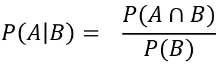

# 朴素贝叶斯分类及其实现的简短教程

> 原文：<https://towardsdatascience.com/a-short-tutorial-on-naive-bayes-classification-with-implementation-2f69183d8ce1?source=collection_archive---------17----------------------->

## 朴素贝叶斯从计数开始，然后转向概率


图片来源:Unsplash

朴素贝叶斯分类是数据挖掘或机器学习中最简单和最流行的算法之一(被 CRC Press Reference [1]列为十大流行算法)。朴素贝叶斯分类的基本思想非常简单。

(如果你觉得视频格式更适合你，可以跳[这里](https://www.youtube.com/watch?v=g71vdMhs57Q&list=PLTS7rWcD0Do2ZoO4Sad3jRxnVFyxHd6_S&index=2)你也可以去[笔记本](https://www.kaggle.com/saptarsi/naive-bayes-sg/)。)

# 基本直觉:

比方说，我们有两类书。一类是体育，一类是机器学习。我统计了“匹配”(属性 1)和“算法”(属性 2)这两个词的出现频率。让我们假设，我从这两个类别各有 6 本书，这 6 本书的字数如下图所示。


图 1:书籍中的字数

我们清楚地看到，“算法”这个词更多地出现在机器学习的书籍中，“比赛”这个词更多地出现在体育运动中。有了这些知识，假设我有一本书，它的类别是未知的。我知道属性 1 的值是 2，属性 2 的值是 10，我们可以说这本书属于体育类。

> 基本上，我们想要找出哪一个类别更有可能，给定属性 1 和属性 2 的值。


图 2:根据数量查找图书的类别

# **从计数到概率:**

这种基于计数的方法适用于少量类别和少量单词。使用**条件概率可以更好地遵循同样的直觉。**


图 3:条件概率(图片来源:作者)

有一个例子可以更好地理解条件概率

让我们假设

事件 A:面值为奇数|事件 B:面值小于 4

P(A) = 3/6(有利情况 1，3，5 总情况 1，2，3，4，5，6)类似地 P(B)也是 3/6(有利情况 1，2，3 总情况 1，2，3，4，5，6)。条件概率的一个例子是，给定一个小于 4 的奇数(A)的概率是多少(B)。为了找到这一点，我们首先找到事件 A 和 B 的交集，然后除以情况 B 中的案例数。更正式地说，这由以下等式给出



图 4:条件概率(图片来源:作者)

P(A|B)是条件概率，读作给定 B 的概率。这个等式构成了中心原则。现在让我们再回到我们的图书类别问题，我们想更正式地找到图书的类别。

# 条件概率到朴素贝叶斯分类器

让我们使用下面的符号 Book=ML 是事件 A，book=Sports 是事件 B,“属性 1 = 2，属性 2 = 10”是事件 C。事件 C 是一个联合事件，我们一会儿就会谈到这一点。

因此问题变成这样，我们计算 P(A|C)和 P(B|C)。假设第一个值为 0.01，第二个值为 0.05。那么我们的结论将是这本书属于第二类。这是一个贝叶斯分类器，**朴素贝叶斯假设属性是独立的。因此:**

P(属性 1 = 2，属性 2 = 10) = P(属性 1 = 2) * P(属性= 10)。我们把这些条件分别称为 x1 和 x2。


图 5:用条件概率寻找类(图片来源:作者)

因此，使用可能性和先验，我们计算后验概率。然后，我们假设属性是独立的，因此可能性扩展为


图 6:扩展条件概率

上面的等式显示了两个属性，但是，可以扩展到更多。因此，对于我们的特定场景，等式变为如下。它仅在 Book='ML '中显示，在 Book ='Sports '中也会类似地显示。


图 7:书籍的朴素贝叶斯方程示例(图片来源:

# **实施:**

让我们使用著名的朴素贝叶斯流感数据集，并导入它，你可以改变路径。你可以从[这里](https://www.kaggle.com/saptarsi/naiveflu)下载数据。

**导入数据:**


图 8:流感数据集

```
nbflu=pd.read_csv('/kaggle/input/naivebayes.csv')
```

**数据编码:**

我们将列存储在不同的变量中，并对它们进行相同的编码

```
**# Collecting the Variables**
x1= nbflu.iloc[:,0]
x2= nbflu.iloc[:,1]
x3= nbflu.iloc[:,2]
x4= nbflu.iloc[:,3]
y=nbflu.iloc[:,4]# **Encoding the categorical variables**
le = preprocessing.LabelEncoder()
x1= le.fit_transform(x1)
x2= le.fit_transform(x2)
x3= le.fit_transform(x3)
x4= le.fit_transform(x4)
y=le.fit_transform(y)**# Getting the Encoded in Data Frame**
X = pd.DataFrame(list(zip(x1,x2,x3,x4)))
```

**模型拟合:**

在这一步中，我们将首先训练模型，然后为患者进行预测

```
model = CategoricalNB()

*# Train the model using the training sets*
model.fit(X,y)

*#Predict Output*
*#['Y','N','Mild','Y']*
predicted = model.predict([[1,0,0,1]]) 
print("Predicted Value:",model.predict([[1,0,0,1]]))
print(model.predict_proba([[1,0,0,1]]))
```

**输出:**

```
Predicted Value: [1]
[[0.30509228 0.69490772]]
```

输出表明不流感的概率是 0.31，流感的概率是 0.69，因此结论是流感。

**结论**:

朴素贝叶斯作为基线分类器工作得非常好，它速度快，可以处理较少数量的训练样本，可以处理有噪声的数据。挑战之一是它假设属性是独立的。

**参考:**

[1]吴 X，库马尔 V，编者。数据挖掘的十大算法。CRC 出版社；2009 年 4 月 9 日。

[2][https://towards data science . com/all-about-naive-Bayes-8e 13 cef 044 cf](/all-about-naive-bayes-8e13cef044cf)