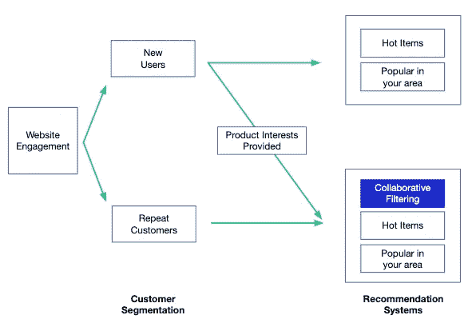
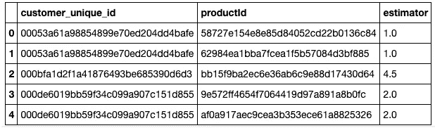
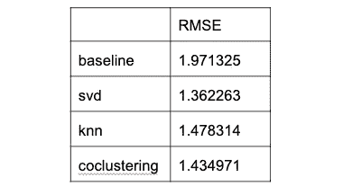
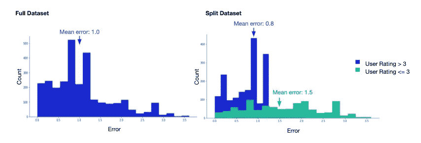

# 一种构建推荐系统的简单方法

> 原文：<https://towardsdatascience.com/a-simple-approach-to-building-a-recommendation-system-d0f4de1a1f50?source=collection_archive---------16----------------------->

## 利用惊喜包在 Python 中构建协同过滤推荐器



具有协同过滤的示例推荐系统。莫莉·里伯斯金图片。

要理解推荐系统的力量，最简单的方法就是关注网飞，他最先进的推荐系统让我们在电视机前呆上几个小时。然而，推荐人是极其多样化的，他们在交叉销售产品、确定具有相似技能的员工候选人以及寻找会对促销信息做出回应的客户方面发挥着作用。这些例子仅仅触及了如何使用推荐系统的表面。

尽管推荐器可能非常复杂，但有两种简单的方法可以作为一个良好的起点。

*   基于内容的过滤:使用项目特征来推荐与用户以前喜欢或交互过的项目相似的项目。潘多拉的音乐基因组项目识别每首歌曲的音乐属性，并利用这些信息找到相似的歌曲并做出推荐。
*   协同过滤:根据相似用户对每个项目的评价来确定用户喜欢的项目。网飞通过确定相似用户观看的内容来识别用户喜欢的节目和电影。

这篇文章将重点介绍使用巴西电子商务公司 Olist 发布的[销售交易数据](https://www.kaggle.com/olistbr/brazilian-ecommerce)开发一个协同过滤推荐系统。

# 入门指南

为了构建推荐器，我们将使用 [Surprise](https://surprise.readthedocs.io/en/stable/) ，一个为协同过滤而构建的 Python [scikit](https://www.scipy.org/scikits.html) 包。

第一步是加载我们需要的包和数据集。数据集由 8 个表组成，但是出于演示的目的，我已经连接了表并隔离了我们需要的列。完整代码在这里[。](https://github.com/mollyliebeskind/Olist_Ecommerce_Recommendation_Engine)

```
#Import packages **import** pandas **as** pd
**import** matplotlib.pyplot **as** plt
**import** seaborn **as** sns**from** surprise **import** NormalPredictor, Reader, Dataset, accuracy, SVD, SVDpp, KNNBasic, CoClustering, SlopeOne**from** surprise.model_selection **import** cross_validate, KFold, GridSearchCV, train_test_split#import dataset
olist_data = pd.read_csv('olist_data.csv')
```

正如现实世界的数据经常发生的那样，这个数据集不是为创建协作推荐系统而完美构建的。这里的一个大挑战是，几乎 90%的用户都是第一次购买，这意味着我们没有他们以前的评分来确定喜欢的产品。相反，我们将把数据集分为重复用户和首次用户，并且只把重复用户输入到协作过滤模型中。对于第一次购买的顾客，我们仍然可以提供推荐，但它们会更加通用，侧重于商品的受欢迎程度和用户的位置。

```
**def** repeat_and_first_time(data): repeaters = data.groupby('customer_unique_id').filter(**lambda** x: len(x) > 1)
    first_timers = data.groupby('customer_unique_id').filter(**lambda** x: len(x) == 1)

    **return** repeaters, first_timers
```

# 利用惊喜

为了利用 surprise 内置的用户评级矩阵转换，我们需要提供一个包含用户 id 列、项目 id 列和评级列的数据框架。

```
**def** create_user_ratings_df(data):
    df = data.groupby(['customer_unique_id','product_id'])['review_score'].agg(['mean']).reset_index()

    df = df.rename({'mean':'estimator', 'product_id':'productId'}, axis=1)
    **return** dfuser_ratings_df = create_user_ratings_df(repeater_data)user_ratings_df.head()
```



用户评级矩阵示例。莫莉·里伯斯金图片。

从这里开始，Surprise 将帮助我们生成一个用户评级矩阵，其中每个用户 id 是一行，公司提供的每个产品是一列。这将产生与创建熊猫数据透视表相同的效果。我们将用 80/20 分区将数据帧分成训练集和测试集。

```
**def** surprise_df(data):

    scale = (data.estimator.min(), data.estimator.max())
    reader = Reader(rating_scale=scale)

    df = Dataset.load_from_df(data[['customer_unique_id',
                                    'productId',
                                    'estimator']], reader)

    **return** dfuser_ratings_matrix = surprise_df(user_ratings_df)train_set, test_set = train_test_split(user_ratings_matrix, test_size=0.2, random_state=19)
```

惊喜提供了 [11 种不同的预测算法](https://surprise.readthedocs.io/en/stable/prediction_algorithms_package.html)，包括各种 KNN 和维数缩减技术，如奇异值分解和 NMF。在本次演示中，我们将测试一些最常见的技术。

使用 5 重验证，我们将比较以下模型的结果。

*   NormalPredictor:根据假定为正态的训练集分布预测随机评级的基线模型。
*   奇异值分解:一种矩阵分解技术，作为网飞奖的一部分由[西蒙·芬克](https://sifter.org/~simon/journal/20061211.html)推广。
*   KNNBasic:利用余弦相似性(或用户确定的距离度量)来执行 KNN。
*   协同聚类:一种[算法](http://citeseerx.ist.psu.edu/viewdoc/download?doi=10.1.1.113.6458&rep=rep1&type=pdf)，以类似于 k-means 的方法为聚类分配点数。

有两种方法可以评估模型性能。定性地说，你可以观察一个给定的用户，考虑到他们喜欢的其他产品，确定这个推荐是否有意义。例如，如果有人喜欢恐怖电影，不喜欢浪漫喜剧，*《闪灵》*相对于*真爱*会是一个不错的推荐。对于这个数据集，我们没有每个产品的信息，只有一个产品 id，所以我们将使用一个定量的测量方法，[均方根误差](https://www.statisticshowto.datasciencecentral.com/rmse/)。这两种方法的结合是理想的，尽管定量测量在生产中更现实。

```
kf = KFold(n_splits=5, shuffle=**True**, random_state=19)**def** model_framework(train_data): #store the rmse values for each fold in the k-fold loop 
    normp_rmse, svd_rmse, knn_rmse, co_rmse, slope_rmse = [],[],[], [],[]

    **for** trainset, testset **in** kf.split(train_data):

        *#baseline*
        normp = NormalPredictor()
        normp.fit(trainset)
        normp_pred = normp.test(testset)
        normp_rmse.append(accuracy.rmse(normp_pred,verbose=**False**))

        *#svd*
        svd = SVD(n_factors=30, n_epochs=50,biased=**True**, lr_all=0.005, reg_all=0.4, verbose=**False**)
        svd.fit(trainset)
        svd_pred = svd.test(testset)
        svd_rmse.append(accuracy.rmse(svd_pred,verbose=**False**))

        *#knn*
        knn = KNNBasic(k=40,sim_options={'name': 'cosine', 'user_based': **False**}, verbose=**False**) 
        knn.fit(trainset)
        knn_pred = knn.test(testset)
        knn_rmse.append(accuracy.rmse(knn_pred,verbose=**False**))

        *#co_clustering*
        co = CoClustering(n_cltr_u=3,n_cltr_i=3,n_epochs=20)         
        co.fit(trainset)
        co_pred = co.test(testset)
        co_rmse.append(accuracy.rmse(co_pred,verbose=**False**))

    mean_rmses = [np.mean(normp_rmse),
                  np.mean(svd_rmse),
                  np.mean(knn_rmse),
                  np.mean(co_rmse),
                  np.mean(slope_rmse)]

    model_names = ['baseline','svd','knn','coclustering','slopeone']
    compare_df = pd.DataFrame(mean_rmses, columns=['RMSE'], index=model_names)

    **return** compare_dfcomparison_df = model_framework(train_set)
comparison_df.head()
```



莫莉·里伯斯金图片。

基于以上所述，我们确定 SVD 具有最低的 rmse，并且是我们将继续调整的模型。

# 模型调整:惊奇的网格搜索

这个令人惊讶的包提供了一个使用 GridSearchCV 调整参数的选项。我们将为 GridSearchCV 提供一个参数字典，并计算和比较每个参数组合的 rmse。

```
**def** gridsearch(data, model, param_grid):
    param_grid = param_grid
    gs = GridSearchCV(model, param_grid, measures=['rmse'], cv=5)
    gs.fit(data)

    new_params = gs.best_params['rmse']
    best_score = gs.best_score['rmse']

    print("Best score:", best_score)
    print("Best params:", new_params)

    **return** new_params, best_scoresvd_param_grid = {'n_factors': [25, 50,100],
                  'n_epochs': [20,30,50],       
                  'lr_all': [0.002,0.005,0.01],
                  'reg_all':[0.02,0.1, 0.4]}

svd_params, svd_score = gridsearch(train_set, SVD, svd_param_grid)
```

从该搜索中，我们得到一个输出，告诉我们获得的最佳分数(最低 rmse)是 1.27，它是使用参数{'n_factors': 25，' n_epochs': 50，' lr_all': 0.01，' reg_all': 0.1}产生的。

# 最终模型和指标

利用上面的参数，我们然后在没有交叉验证的完整训练集上运行该模型，并根据测试集获得准确度分数。

```
**def** final_model(train_set, test_set):
    params = {'n_factors': 10, 'n_epochs': 50, 'lr_all': 0.01, 
              'reg_all': 0.1} 

    svdpp = SVDpp(n_factors=params['n_factors'], 
                    n_epochs=params['n_epochs'],
                    lr_all=params['lr_all'], 
                    reg_all=params['reg_all'])
    svdpp.fit(train_set)

    predictions = svdpp.test(test_set)
    rmse = accuracy.rmse(predictions,verbose=**False**)

    **return** predictions, rmse

final_predictions, model_rmse = final_model(train_set, test_set)
```

的。测试属性输出预测，其中包含用户 id、项目 id、用户实际评级、模型估计评级以及可能做出预测的指示器。除了查看来自最终训练模型的 model_rmse 输出，我们还将查看所有预测的绝对误差分布。为此，我们将把预测输出打包到一个数据帧中，并添加一个列来指示每个预测的错误。然后，我们将通过绘制误差直方图来可视化结果。

```
results = pd.DataFrame(final_predictions, columns=['userid', 'item_id', 'user_rating', 'model_est', 'details'])     
results['err'] = abs(results.model_est - results.user_rating)
```

在下面的图中，我们看到，尽管完整数据集的误差为 1.0，但当用户给产品的评分高于 3 时，模型做出了更好的预测，误差仅为 0.8。相比之下，当用户给产品打 3 分或 3 分以下的分数时，误差明显更高，为 1.5 分。这是一个很好的结果，因为为了提供好的推荐，我们更关心准确预测用户喜欢并评分高于 3 的产品。



比较整体模型误差与等级> 3 和等级≤3 的误差的图。莫莉·里伯斯金图片。

然后，可以使用转储模块对模型进行打包，转储模块是 Pickle 的包装器。对于这个例子，协同过滤推荐只是整个系统的一部分。它根据每个地理区域的总体畅销产品和最佳表现者进行推荐。

# 附加注释

为了熟悉这个过程，Surprise 有一些很好的内置数据集，文档详细解释了不同的交叉验证方法、相似性度量和预测算法。

目前，Surprise 还不能处理隐式评级、执行内容过滤或生成混合推荐。然而，对于初学者来说，Surprise 是一个简单直接的协作过滤包。

你可以在 [github](https://github.com/mollyliebeskind/Olist_Ecommerce_Recommendation_Engine) 上找到这个例子的所有代码。