# Python 中的简单突破交易策略

> 原文：<https://towardsdatascience.com/a-simple-breakout-trading-strategy-in-python-eb043b868d8e?source=collection_archive---------10----------------------->

## 对客观的系统突破策略进行编码和回溯测试

***注来自《走向数据科学》的编辑:*** *虽然我们允许独立作者根据我们的* [*规则和指导方针*](/questions-96667b06af5) *发表文章，但我们不认可每个作者的贡献。你不应该在没有寻求专业建议的情况下依赖一个作者的作品。详见我们的* [*读者术语*](/readers-terms-b5d780a700a4) *。*

我刚刚出版了一本新书《Python 中的*新技术指标》。它对复杂的交易策略进行了更完整的描述和补充，Github 页面致力于不断更新代码。如果你对此感兴趣，请随时访问下面的链接，或者如果你喜欢购买 PDF 版本，你可以在 Linkedin 上联系我。*

*[](https://www.amazon.com/gp/product/B09919GQ22/ref=as_li_tl?ie=UTF8&camp=1789&creative=9325&creativeASIN=B09919GQ22&linkCode=as2&tag=sofien-20&linkId=bc5df3f6ab0f3af2df79641c56b949ba) [## 交易策略之书

### 亚马逊网站:交易策略之书(9798532885707): Kaabar，Sofien:书籍

www.amazon.com](https://www.amazon.com/gp/product/B09919GQ22/ref=as_li_tl?ie=UTF8&camp=1789&creative=9325&creativeASIN=B09919GQ22&linkCode=as2&tag=sofien-20&linkId=bc5df3f6ab0f3af2df79641c56b949ba)* 

*交易分为许多不同的策略，依赖于趋势跟踪、均值回归、波动性或其他因素。成功的策略依赖于当前的市场状态，例如，当市场趋势强劲时，均值回归策略往往会失败，因此我们必须相应地调整我们的市场方法。下面是一个突破策略，它使用了一个叫做唐奇安通道的指标。基本的想法是让区间尽可能客观(即可以衡量)，然后在突破时交易(即趋势的开始)。因此，本文的目的是看这个指标是否能增加我们整个交易系统的价值。它能提供好的信号吗？这些触发因素值得认真对待吗？*

# *唐奇安海峡*

*理查德·唐奇安创造了这个简单而伟大的指标，用来识别突破和反转。就像布林线一样，它的使用方式也差不多。我们的目标是通过超越或突破任何障碍来客观地确定区间出场。它的形成方法是首先计算最近 n 个周期高点的最大值和最近 n 个周期低点的最小值，然后计算它们的平均值。这给了我们三个小节:唐奇安高频带、低频带和中频带。下面是数学公式，随后是用于 OHLC 数据结构的 Python 代码。*

*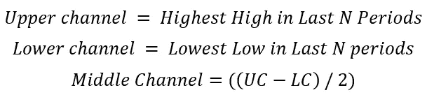*

```
*def donchian(Data, low, high, where_up, where_down, median, period):

    for i in range(len(Data)):
        try:
            Data[i, where_up] = max(Data[i - period:i + 1, 1])
        except ValueError:
            pass
    for i in range(len(Data)):
        try:
            Data[i, where_down] = min(Data[i - period:i + 1, 2]) 
        except ValueError:
            pass        
    for i in range(len(Data)): 
        try:
            Data[i, median] = (Data[i, where_up] + Data[i, where_down]) / 2 
        except ValueError:
            passdonchian(Data, 2, 1, 4, 5, 6, 20)'''
plt.plot(Data[-500:, 3], color = 'black')
plt.plot(Data[-500:, 4])
plt.plot(Data[-500:, 5])
plt.plot(Data[-500:, 6])
plt.grid()'''*
```

*从视觉上看，唐奇安通道似乎包围了价格，这是可以理解的，因为它考虑了当前的极端情况，因此市场永远不会位于通道之外。*

*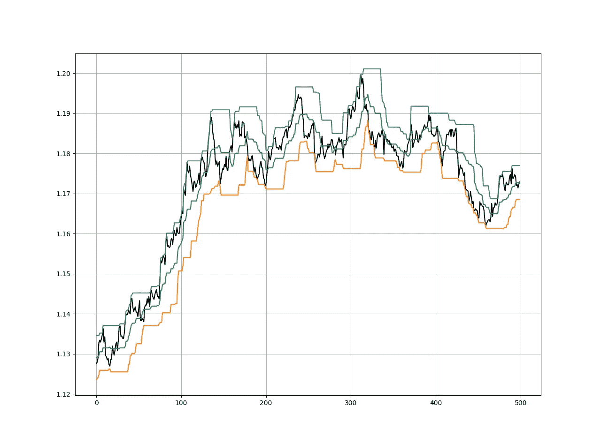*

*欧元兑美元 H3 时间框架和 20 期唐奇安通道。*

# *制定战略*

*唐奇安海峡的基本战略是突围战略。它直观而清晰，下面是规则:*

*   *当市场超过最后一个上升通道时买入。*
*   ***每当市场突破最后一个较低通道时，卖出(做空)。***

```
*def donchian_signals(Data, onwhat, donch_up, donch_down):

    for i in range(len(Data)):

          if Data[i, where_close] > Data[i - 1, donch_up]:
              Data[i, 6] = 1

          elif Data[i, where_close] < Data[i - 1, donch_down]:
              Data[i, 7] = -1 

    return Data# Note: The onwhat variable is the closing price*
```

*我们选择最后的唐奇安水平，因为我们想知道我们什么时候打破我们最后的高点或低点。请记住，该公式考虑了当前的最高价和最低价，因此当前价格永远不会突破它们。*

*回测选择的条件更多的是长期突破，因为我们使用的是 60 天的日线图。这意味着，如果市场超过了过去 60 天的上唐奇安通道，那么我们买入趋势。我在下面的三个测试货币对中加入了一个简单的 100 点的止损单。我选择了三个主要的货币对作为这个策略的代理，它们是欧元兑美元，美元兑瑞士法郎和 GBPUSD。下面的图表显示了三个后验测试的信号图。*

*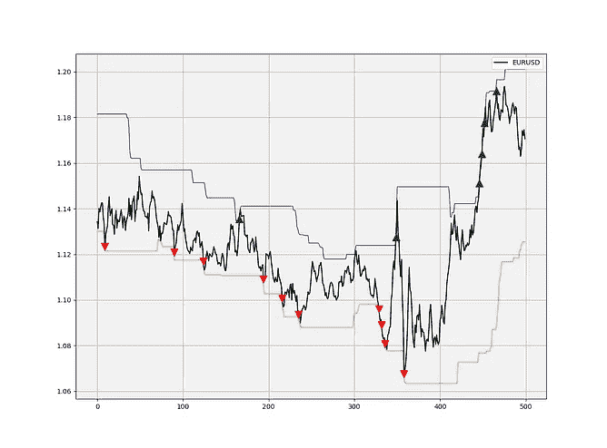**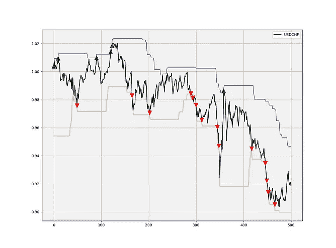**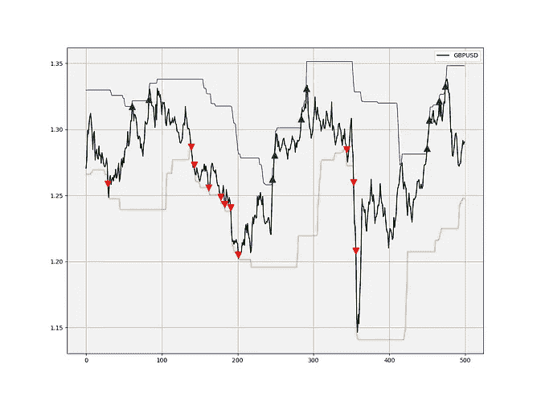*

*欧元兑美元、美元兑瑞郎和 GBPUSD 的信号图。绿色箭头表示买入订单，而红色箭头表示卖出订单。*

*出于比较的原因，在 10，000 美元的手数中，每笔交易 0.5 点后的净值曲线。初始余额为 1000 美元，因此杠杆比率为 1:100。*

*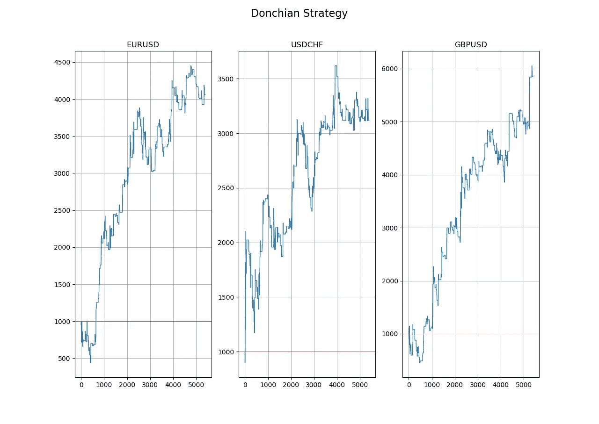*

*遵循唐奇安策略的权益曲线。*

*如果你也对更多的技术指标和使用 Python 创建策略感兴趣，那么我关于技术指标的畅销书可能会让你感兴趣:*

*[](https://www.amazon.com/gp/product/B08WZL1PNL/ref=as_li_tl?ie=UTF8&camp=1789&creative=9325&creativeASIN=B08WZL1PNL&linkCode=as2&tag=sofien-20&linkId=e3cb9716bb6a07cf6c8b9fb585412b07) [## Python 中的新技术指标

### 亚马逊网站:Python 中的新技术指标:9798711128861: Kaabar，Sofien 先生:书籍

www.amazon.com](https://www.amazon.com/gp/product/B08WZL1PNL/ref=as_li_tl?ie=UTF8&camp=1789&creative=9325&creativeASIN=B08WZL1PNL&linkCode=as2&tag=sofien-20&linkId=e3cb9716bb6a07cf6c8b9fb585412b07) 

显然，它需要一些改进，唐奇安通道应该有另一个指标，以确认信号或增加波动因素，稳定结果。

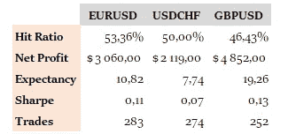

唐奇安突围战略的绩效表。* 

*这里还可以采用另一种策略。它依赖于中间波段。我们可以尝试使用与上述相同的回溯测试条件来开发基于它们的策略。从上面的介绍中我们知道，中间波段只是上下波段的平均值，因此它可以与布林线的移动平均值相比较。如果你有兴趣了解更多关于布林线的信息，你可以查看这篇文章，我提供了更多的回溯测试:*

*[](https://medium.com/swlh/creating-a-trading-strategy-using-the-rsi-the-bollinger-bands-new-ideas-using-python-4115e1fdfbba) [## 使用 RSI 和布林线创建交易策略。使用 Python 的新想法。

### 绝大多数交易者使用著名的相对强弱指数来帮助他们做决定，虽然它…

medium.com](https://medium.com/swlh/creating-a-trading-strategy-using-the-rsi-the-bollinger-bands-new-ideas-using-python-4115e1fdfbba) 

因此，中间波段策略的规则是:

*   **当市场超过中间波段时买入。**
*   每当市场突破中间波段时，卖出(做空)。

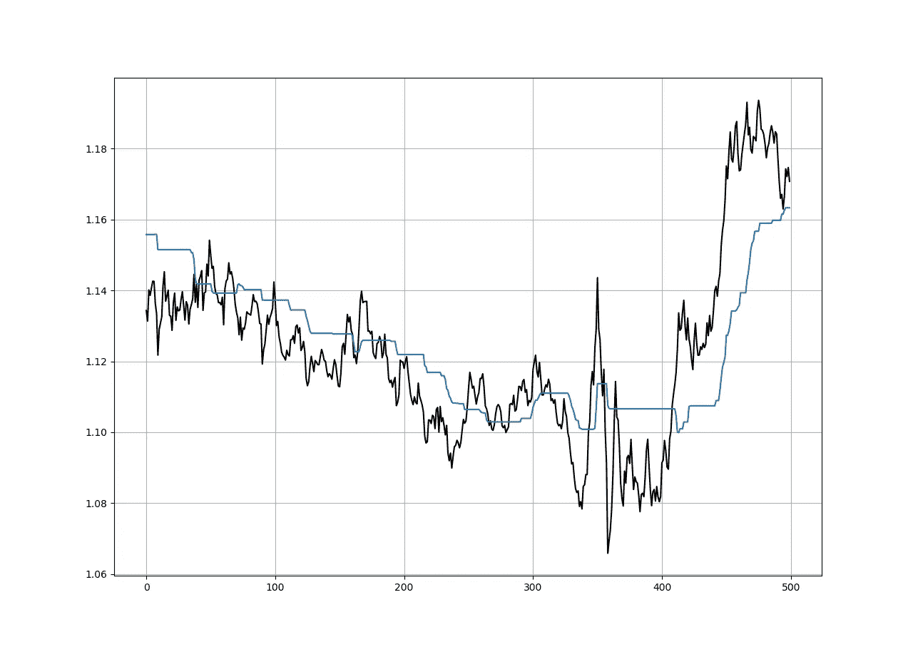

欧元兑美元日时间框架与唐奇安 60 天中间带。

```
def donchian_signals_middle(Data, onwhat, donch_middle, buy, sell):

    for i in range(len(Data)):

          if Data[i, onwhat] > Data[i, donch_middle] and Data[i - 1, onwhat]  < \
              Data[i, donch_middle]:
              Data[i, buy] = 1

          elif Data[i, onwhat] < Data[i, donch_middle] and Data[i - 1, onwhat] > \
              Data[i, donch_middle]:
              Data[i, sell] = -1# Note: The buy and sell variables are the triggers (equivalent to column 6 and 7 in the first strategy code)
```

第二种策略的信号图如下:

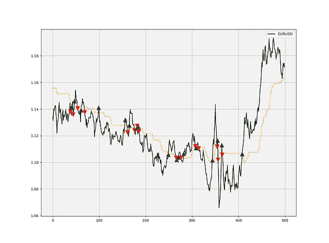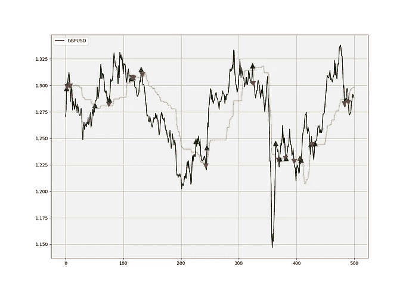

欧元兑美元、美元兑瑞郎和 GBPUSD 的信号图。绿色箭头表示买入订单，而红色箭头表示卖出订单。

股权曲线就没那么令人印象深刻了。


遵循唐奇安中带策略的权益曲线。

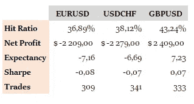

东中带突破策略表现表。

# 结论

虽然第一个策略显示了一些潜力，但第二个策略未能给人留下深刻印象。很明显，唐奇安通道还有很多事情要做，但是很高兴知道我们可以尝试量化范围和交易突破。


[https://pix abay . com/illustrations/entrepreneur-idea-competence-vision-4313671/](https://pixabay.com/illustrations/entrepreneur-idea-competence-vision-4313671/)*