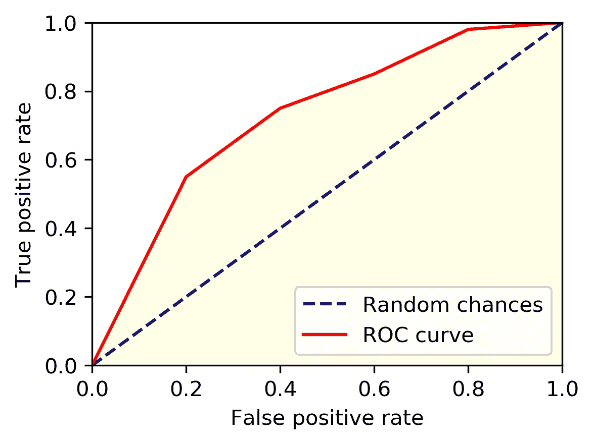
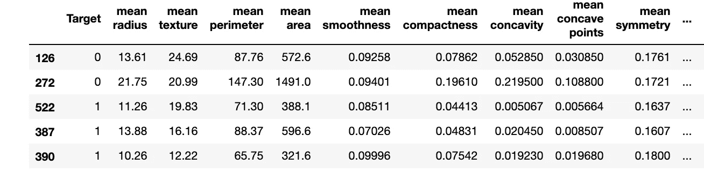
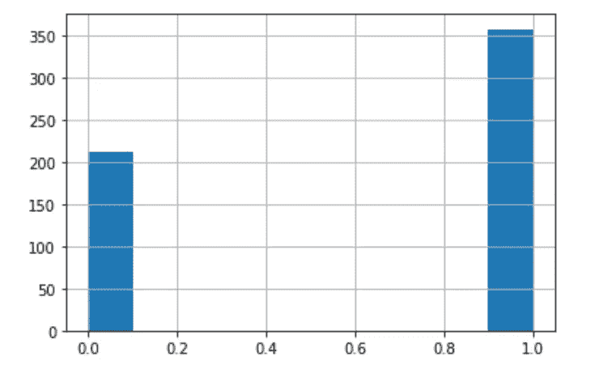
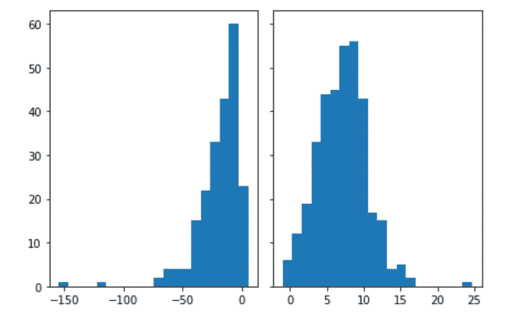
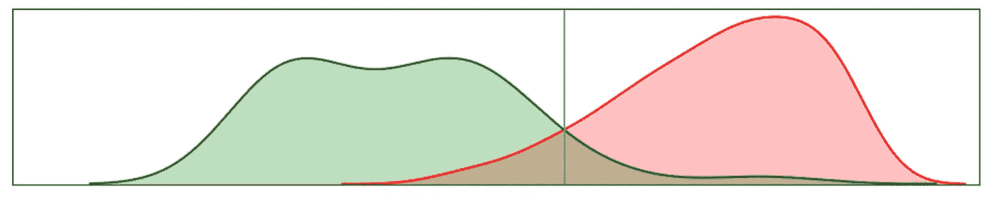
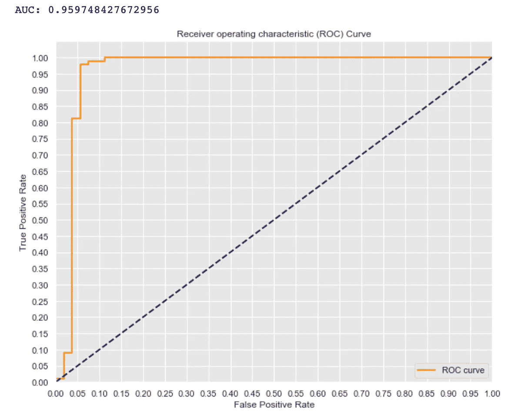

# ROC 曲线改变了我们看待分类问题的方式

> 原文：<https://towardsdatascience.com/a-simple-explanation-of-the-roc-curve-and-auc-64db32d75541?source=collection_archive---------18----------------------->

## 没有一种机器学习算法能最好地解决所有问题

**接收器工作特性(ROC)** 曲线是一条概率曲线，它说明了我们的二元分类在基于真阳性率和假阳性率进行分类时有多好。

**曲线下面积(AUC)** 是一个范围从 0 到 1 的指标。它是(ROC)曲线下的面积。



ROC 曲线和 AUC 的示例。资料来源:Huy Bui

## 动机

为什么理解 ROC 曲线和 AUC 对数据科学家很重要？为了回答这个问题，我们来看看下面的乳腺癌数据集:

```
from sklearn.datasets import load_breast_cancer
import pandas as pddata=load_breast_cancer()
columns=data.feature_names
X=pd.DataFrame(data.data, columns=columns)
y=pd.DataFrame(data.target, columns=['Target'])
df=pd.concat([y,X],axis=1)
```



乳腺癌数据集:591 个观察和 30 个特征。资料来源:Huy Bui

当处理分类问题时，应该考虑准确性的折衷。如果医院使用这些数据来检测乳腺癌，模型应该强调从患者身上检测癌症的能力。该模型还需要小心翼翼地将可能被错误标记为癌症的健康患者的数量降至最低，因为癌症治疗的副作用可能会很严重。

该数据集的目标是恶性(1)和良性(0)。让我们看看下面的直方图:



良性和恶性的分布。资料来源:Huy Bui

通常，对于这种类型的问题，数据集更加不平衡。根据美国乳腺癌统计数据，12%的美国女性在其一生中将发展为浸润性乳腺癌。然而，这只是出于教育目的，我们可以忽略数据集的现实方面。

如上所述，我们需要在**召回**和**假阳性率**之间找到一个好的平衡。你可能会问为什么是假阳性率而不是精确度。提醒一下:

**回忆:**也叫真阳性率(TPR)。TPR 是正确的癌症预测与癌症病例总数之间的比率。从数学上来说， **TPR=TP/(TP+FN)** 其中 FN 是那些被错误归类为良性的。

**精度**:所有正确癌症与预测癌症总数之比。**精度** = **TP/(TP+FP)**

**假阳性率:** **FPR=FP / (TN+FP)**

根据数学公式，我们可以看出精度和 FPR 之间的区别。Precision 关注模型检测癌症的能力。相反，FPR 关注的是癌症检测的失败率。如果你想了解更多，这里有一个关于精确召回(PR)和 FPR 召回(ROC)的长时间讨论。

简而言之，只有当正面类比负面类有趣得多，并且正面/负面比率很小(严重不平衡)时，我们才应该使用精确回忆。然而，在这种情况下，良性肿瘤约占恶性肿瘤的 4/7，这表明数据只是轻度不平衡。正如我们上面讨论的，错误分类的癌症可能会导致不良后果。因此，在这里使用 ROC 曲线是合理的。

注意:*精确召回的方法与 ROC 曲线非常相似，你可以在这里找到它的文档。*

## 受试者工作特征曲线

我们将要使用的模型是**逻辑回归**。通常，当我们进行分类时，输出已经被某个阈值四舍五入。ROC 曲线使用不同的阈值来绘制 TPR-FPR 之间的关系。因为我们想要研究 TPR、FPR 和阈值之间的关系，所以让我们在舍入之前先看看逻辑回归输出。

```
from sklearn.linear_model import LogisticRegressionlogreg = LogisticRegression(fit_intercept=False, C=1e12, solver='liblinear')
logreg.fit(X, y.values.flatten())
prediction=logreg.decision_function(X) #Values before the ouput#Define positive and negative
cancer_index=y[y.Target==1].index
no_cancer_index=y[y.Target==0].index
cancer_prob=prediction[cancer_index]
no_cancer_prob=prediction[no_cancer_index]#Histogram
n_bins = 20
fig, axs = plt.subplots(1, 2, sharey=True, tight_layout=True)
axs[0].hist(cancer_prob, bins=n_bins)
axs[1].hist(no_cancer_prob, bins=n_bins)
plt.show()
```



在做出边界决定之前，评估良性和恶性之间的频率。资料来源:Huy Bui

如果我们使用核密度估计将这两个直方图放在一起，并截断一些异常值，我们会获得一个漂亮的图形:



两类决策边界

蓝线是**决策边界**。它将图表分为 4 个部分:

*   纯绿色:无癌症(真阴性)
*   纯红色:癌症(真阳性)
*   左侧混合:有癌症，但被检测为无癌症(假阳性)
*   右混合:没有癌症，但被检测为患有癌症(假阴性)

注意，一个好的二进制分类模型将最小化混合区域。因此，在获得一个好的模型后，研究 ROC 曲线将告诉我们我们的模型是否在 TPR 和 FPR 之间做了很好的平衡。下面我们来看看 ROC 曲线:

```
from sklearn.metrics import roc_curve, auc# Normalize the Data
X = X.apply(lambda x : (x - x.min()) /(x.max() - x.min()),axis=0) 
X_train, X_test, y_train, y_test = train_test_split(X, y.values.flatten(), random_state=0)y_score = logreg.fit(X_train, y_train).decision_function(X_test)
fpr, tpr, thresholds = roc_curve(y_test, y_score)def ROC_curve(fpr,tpr):
    # Seaborn's beautiful styling
    sns.set_style('darkgrid', {'axes.facecolor': '0.9'})print('AUC: {}'.format(auc(fpr, tpr)))
    plt.figure(figsize=(10, 8))
    lw = 2
    plt.plot(fpr, tpr, color='darkorange',
             lw=lw, label='ROC curve')
    plt.plot([0, 1], [0, 1], color='navy', lw=lw, linestyle='--')
    plt.xlim([0.0, 1.0])
    plt.ylim([0.0, 1.05])
    plt.yticks([i/20.0 for i in range(21)])
    plt.xticks([i/20.0 for i in range(21)])
    plt.xlabel('False Positive Rate')
    plt.ylabel('True Positive Rate')
    plt.title('Receiver operating characteristic (ROC) Curve')
    plt.legend(loc='lower right')
    plt.show()

ROC_curve(fpr,tpr)
```



物流回归 ROC 曲线。资料来源:Huy Bui

模型中的虚线是随机选择(概率 50%)。因为有两类，这条线的斜率处处都是 1，因此我们得到单位正方形的对角线。注意这条线下的面积(AUC)是 0.5。

橙色线是 ROC 曲线。它位于虚线上方，表明我们的准确性优于随机选择。通过增加阈值的数值，越来越多的观察结果属于癌症类别。所以 TP 趋近于 1，FN 趋近于 0。这使得 **TPR 趋近于 1** 。类似地，增加阈值将导致 FP 接近 1，TN 接近 0。这会使 **FPR 趋近于 1。因此，我们得出结论，FPR、TPR 和阈值彼此成正比。ROC 曲线仅显示了 2 轴 FPR 和 TPR，但是现在我们知道阈值是产生该图的混杂变量。**

再看一下图表。AUC 评分为 0.96，接近完美。我们还想看看 ROC 曲线，看看在图中的哪个点我们有 FPR 和 TPR 的完美组合。例如，如果我们将当前模型调整为具有 97%的 TPR，则 FPR 大约为 6%。如果我们将 FPR 降低到 5%，那么 TPR 只有 82%。所有调整模型的不同方法都是不同领域的不同主题。

## 结论

我们可以使用 ROC 分析来选择基于成本背景或类别分布的可能的最优模型。ROC 分析也非常类似于诊断决策的成本/收益分析。这是一个伟大的工具，每个数据科学家都应该评估他们的分类器性能。

你可以从我的[库](https://github.com/williamhuybui/Blog-ROC-curve-and-AUC)中找到这个博客的完整代码。

请在下面留下任何评论、问题或建议。感谢您的阅读！