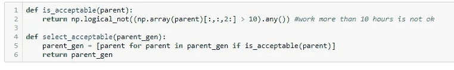

# Python 中一个简单的遗传算法

> 原文：<https://towardsdatascience.com/a-simple-genetic-algorithm-from-scratch-in-python-4e8c66ac3121?source=collection_archive---------8----------------------->

## 用遗传算法优化员工计划

染色体是遗传学的重要元素。[国家癌症研究所](https://unsplash.com/@nci?utm_source=unsplash&utm_medium=referral&utm_content=creditCopyText)在 [Unsplash](https://unsplash.com/s/photos/chromosome?utm_source=unsplash&utm_medium=referral&utm_content=creditCopyText) 上拍摄的照片。

# 遗传算法

遗传算法是模拟自然选择过程的优化算法。他们没有使用“数学技巧”，而是简单地复制了一个我们知道行得通的逻辑。

## 遗传算法中的自然选择

这种自然选择的过程是建立在适者生存的基础上的:自然界中让最优秀的个体(动物、植物或其他)生存下来的过程。那些最适合的个体然后互相交配，产生新的一代。自然也以基因突变的形式增加了一点随机性。

新一代是好的和坏的个体的混合体，但是在这里，好的个体会生存下来，然后交配，然后产生新一代。

结果是一代又一代的持续改进。

## 人员规划的遗传算法

员工规划是优化研究的一个主题，在许多公司都会出现。一旦一家公司有了很多员工，就很难找到既能满足业务需求又能遵守某些约束的计划。在其他现有的解决方案中，遗传算法是解决这个问题的一种优化方法。

## Python 实现

在之前的一篇文章中，我已经向[展示了如何使用 Python 中的 DEAP 库来实现开箱即用的遗传算法](/genetic-algorithms-in-python-using-the-deap-library-e67f7ce4024c)。在这篇文章中，我将更详细地说明如何理解遗传算法的不同部分。

下面的代码是遗传算法的生产代码的简化版本。它是为了更好地理解示例而优化的，而不是为了速度和可重用性。它包含应用于示例数据的每个列出的步骤。

# 6 步遗传算法代码演练

## 遗传算法的步骤:

1.  如何为遗传算法编码数据？
2.  如何评价遗传算法的解？
3.  如何为遗传算法编码交配(交叉)？
4.  如何为遗传算法编码突变？
5.  如何定义遗传算法的选择？
6.  如何定义遗传算法的迭代和停止？

[如果你想跟随笔记本，你可以**在这里下载。**](https://jooskorstanje.com/Genetic-Algorithm-from-scratch.html)

# 步骤 1——如何为遗传算法编码数据？

## **输入数据—两种类型的规划**

在这段代码中，我们将使用两种不同形状的相同人员计划。

***第一类规划——每名员工***

*为每个员工的遗传算法(类型 1 规划)编码数据。作者配图。*

第一个形状将是员工的员工计划，详细的看法。这个每周总计划是一个包含每天列表的列表(在我们的例子中是 5 天)。每个每日列表包含一个班次列表(在我们的例子中，员工有 11 个班次)。每个班次都是一个员工 id(从 0 到 11，仅供参考)、开始时间(0 到 24 点之间)和班次持续时间(0 到 10 小时之间)的列表。

我们的员工需要这种类型的计划来了解他们何时工作。

***类型 2 计划—每小时总计***

*遗传算法的编码数据-类型 2 规划-每小时总数。作者配图。*

第二种类型的计划是每小时配备的员工总数。店主将使用该计划来决定该计划是否符合商店的估计需求。

# 步骤 2——如何评估遗传算法的解？

为了评估一个小时制员工计划，我们需要定义一个目标情境。定义这个目标不是优化的一部分:这将是另一个项目的问题。

*定义遗传算法的评估——定义目标情况。作者配图。*

我们确实需要定义如何评估提议的计划和目标计划之间的差异。这将基于小时计划，通过合计过多的员工小时总数和缺少的员工小时数来完成。这将是一个我们需要最小化的成本函数。

*定义遗传算法的评估——定义成本函数。作者配图。*

我们可以为人员过多或不足添加权重，但在本例中，我让它们的权重相等。

# 步骤 3-如何为遗传算法编码交配(交叉)？

遗传算法中有两个关键步骤:交配(也称为交叉或重组)和变异。

在交配阶段，新的一代是由亲代个体的后代形成的，就像在自然选择中一样。

为了将这一点应用到我们的例子中，考虑到以后，我们将生成许多不太好的员工计划，并试图将最好的计划结合在一起。因此，我们需要定义一种方法来“混合”两个人(员工计划)。

在本例中，我决定将代码编写如下:

*   从人群中随机选择一个妈妈
*   从人群中随机选择一个爸爸
*   创建一个与父节点大小相同的子节点，但随机填充 0 和 1。
*   孩子有 1 的位置，我们从他父亲那里得到数据，孩子有 0 的位置，我们从他母亲那里得到数据。
*   我们对每个孩子重复这个过程(孩子的数量等于人口数量)

*为遗传算法定义交叉。作者配图。*

这是一种方法，还有许多其他可能的方法。为了使遗传算法工作，组合码中具有随机性是很重要的。当然，组合必须符合您在步骤 1 中选择的数据结构。

# 步骤 4——如何为遗传算法编码突变？

遗传算法的第二个重要步骤是变异。它包括给新一代增加一个完全随机的变化。这种随机变化允许向不再存在的群体添加新值。

例如，考虑这样一种情况，其中算法已经进行了几次迭代，并且由于选择和组合过程中的随机性，它已经取消选择了上午 10 点之前的所有开始时间。如果没有突变，算法将永远无法得到这个值，尽管它可能在以后实际上给出一个更好的解决方案。

随机插入(非常少量的)新值有助于算法摆脱这种情况。

*为遗传算法定义变异。作者配图。*

它在这里被编码为用 0 和 10 之间的随机值替换一个班次的持续时间或开始时间。如果我们指定一个 n_mutations 值，这可以重复。

# 步骤 5——如何定义遗传算法的选择？

选择过程非常简单:

*   首先，选择所有可行的解决方案:去掉那些员工工作时间超过 10 小时的方案。

*为遗传算法定义选择—可行性。作者配图。*

*   然后，将评估函数应用到每个个体(即每个员工规划)并选择最佳个体。所选个体的数量在代码中保持可变。

*定义遗传算法的选择——成本。作者配图。*

# 步骤 6——如何定义遗传算法的迭代和停止？

代码的最后一部分是将所有前面的构建块添加到一个迭代的整体代码中。

为遗传算法定义迭代*。作者配图。*

# 优化参数调整

为了使遗传算法完美地工作，选择正确的参数是很重要的:世代大小、n 次突变和 n 次最佳在这方面很重要。

调整这三者可以找到最佳组合，使两者:

*   收敛到一个解决方案(而不是在没有改进的情况下随意转向)
*   避免陷入局部最优

如果调整后你的算法仍然停滞不前，另一个改进的方向是调整交配和变异函数，看看会发生什么。

因为这篇文章的目标是从头开始开发一个简单实用的遗传算法，所以我不会详细讨论如何找到那些最佳参数:那需要另一篇文章。

*感谢您的阅读。不要犹豫，继续关注更多！*