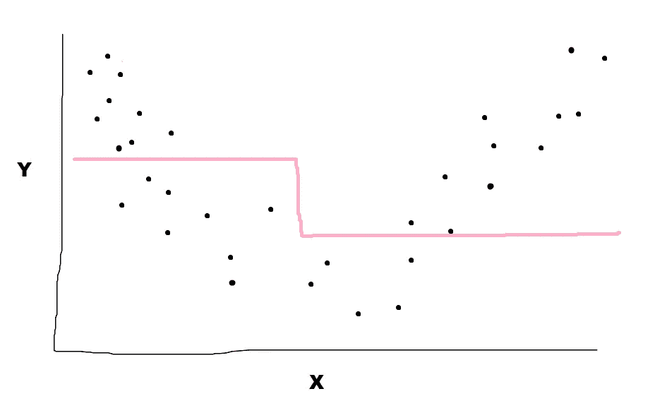

# 一个简单的梯度增强树解释

> 原文：<https://towardsdatascience.com/a-simple-gradient-boosting-trees-explanation-a39013470685?source=collection_archive---------50----------------------->

## 梯度推进树的简单介绍。

# 介绍

几年前，Kaggle 的官方博客“没有自由的预感”发布了一篇 Kaggle 大师本·戈尔曼(Ben Gorman)解释渐变增强的文章。文章发表后不久，我在博客上评论了这篇文章。快进到大约一年后，我正在为我的博客查看我的谷歌分析账户，我注意到我的评论得到了很多点击。在进一步的检查中，我发现原来的“没有自由的预感”文章被删除了，因此解释了为什么我的文章得到了这么多的点击(即人们在寻找原来的文章)。鉴于这些新信息，我更新了我的文章，并向人们介绍了我在 GitHub 上的一些工作，这些工作可能会有所帮助。有趣的是，我从来没有喜欢过卡格尔的原创文章。我有一些想法来真正削减脂肪和解释核心概念，这正是这篇文章！我希望这篇文章对那些刚刚开始理解梯度推进树的人有用。

在 [Unsplash](https://unsplash.com/s/photos/teach?utm_source=unsplash&utm_medium=referral&utm_content=creditCopyText) 上由 [Belinda Fewings](https://unsplash.com/@bel2000a?utm_source=unsplash&utm_medium=referral&utm_content=creditCopyText) 拍摄的照片

# 最简短的解释

在梯度推进树中，我们不断地在我们的模型误差上构建决策树，并且我们使用这些误差预测来修正\更新我们的原始模型预测。

照片由[主题照片](https://unsplash.com/@themephotos?utm_source=unsplash&utm_medium=referral&utm_content=creditCopyText)在 [Unsplash](https://unsplash.com/s/photos/repair?utm_source=unsplash&utm_medium=referral&utm_content=creditCopyText) 上拍摄

# 更详细的简短解释

我们建立一个决策树。这个模型对于每个数据点都有一个误差。如果我们可以在这些错误的基础上建立另一个决策树，并使用我们预测的错误来修改我们原来的预测，会怎么样？我们可以！我们可以根据错误建立另一个决策树，并使用这些预测来修改我们最初的预测。我们可以继续这个过程，直到我们决定停止！

# 更详细的简短解释+可视化

*注意:以下图片并非来自 Jupyter 或 Python 或任何实数，我们的可视化只是在 Microsoft Paint 中创建的草图。*

首先，我们有一些数据。

由作者在 Microsoft Paint 中创建

因此，我们想用 X 来预测 Y。在此之前，可以通过取 Y 的平均值来推导出一个简单的 Y 模型(所以先忽略 X)，我们可以在未来的所有情况下用它来预测 Y。

由作者在 Microsoft Paint 中创建

这种模式似乎在某些方面做得不错，而在其他方面做得很差。因此，每个数据点都有一个错误，下面用红色表示。

由作者在 Microsoft Paint 中创建

如果我们可以建立一个误差模型，这样我们就可以在未来修正我们的误差(因为我们手头没有因变量)。嗯，我们可以！

由作者在 Microsoft Paint 中创建

上面我们看到了 X 的残差图，我们可以使用 X 来帮助预测第一个模型的残差。这个模型说我们想要增加 X 低端的值，减少所有其他的值。我们可以用这些预测来更新我们原来的预测！

由作者在 Microsoft Paint 中创建

所以我们采用了最初的预测，并用第二个模型的预测误差对它们进行了修正。

我们可以一遍又一遍地继续这个过程。实际上，我们通常使用“学习率”来只取误差\误差更新的一小部分。当我们多次运行(包括学习率)时，我们可能会得到如下结果。

由作者在 Microsoft Paint 中创建

就是这样！

你可以看到这个算法是如何得到它的名字的，它的灵感来源于梯度下降。

# 技术细节和演示

要了解更多技术细节，以及使用 Python 的演示，您可以点击这里查看我在 GitHub [上的分类示例。](https://github.com/yeamusic21/Coursera-Machine-Learning-Specialization-Extra-Assignments/blob/master/Classification/Gradient%20Boosting.ipynb)

# 概括起来

*   梯度推进树只是根据我们的模型误差不断构建决策树的过程，我们使用这些预测来修改\更新我们的原始模型预测。
*   关于使用数据和代码的演示，你可以点击这里查看我在 GitHub [上的分类示例。](https://github.com/yeamusic21/Coursera-Machine-Learning-Specialization-Extra-Assignments/blob/master/Classification/Gradient%20Boosting.ipynb)

感谢阅读！！:-D