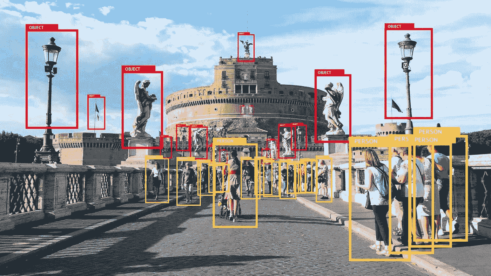
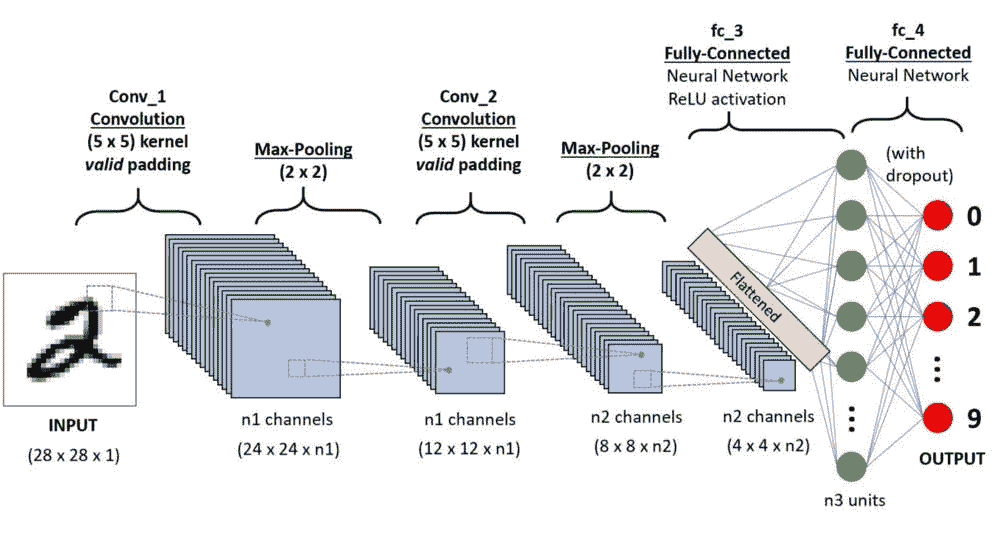
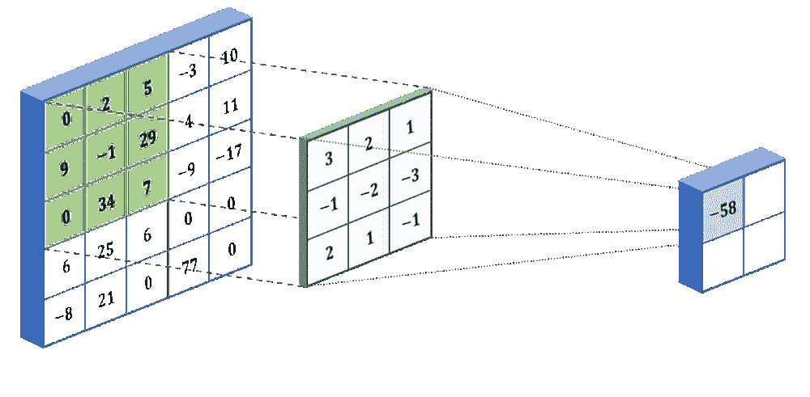
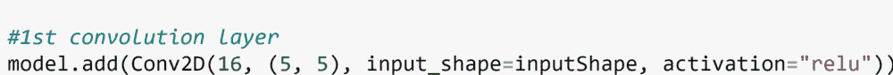
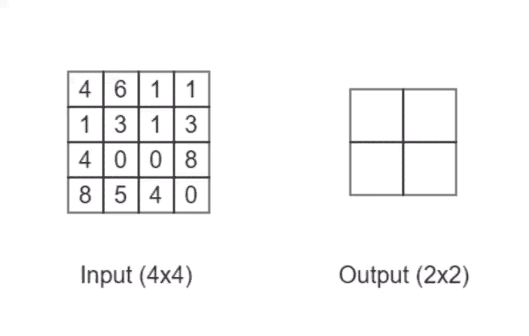
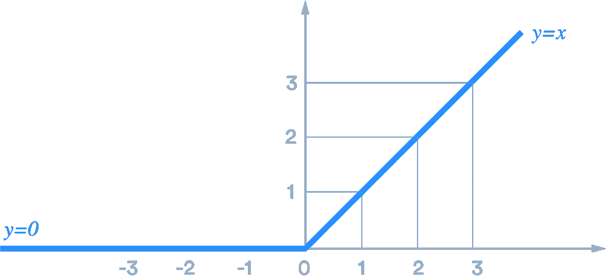
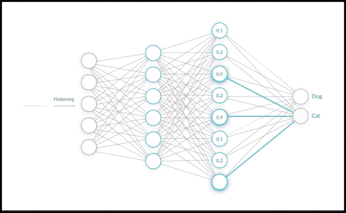
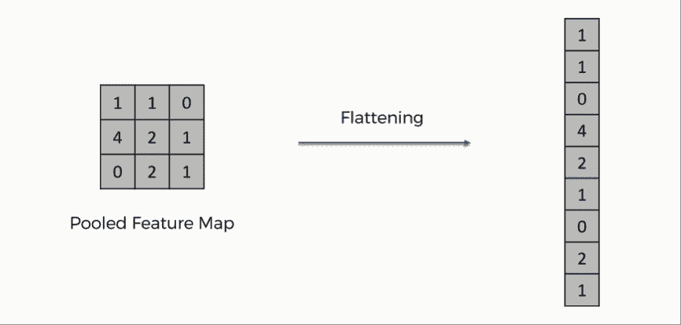
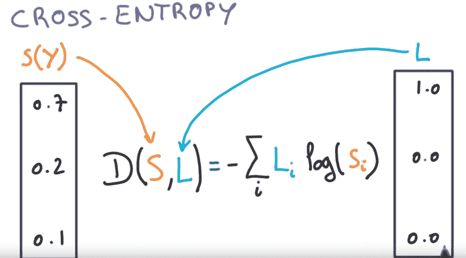

# 卷积神经网络的简单指南

> 原文：<https://towardsdatascience.com/a-simple-guide-to-convolutional-neural-networks-751789e7bd88?source=collection_archive---------11----------------------->

## 卷积神经网络揭秘没有任何花哨的技术术语！

识别人和物体的卷积神经网络[(来源)](https://martechtoday.com/how-visual-recognition-is-set-to-change-advertising-223719)

汽车可以识别路标。脸书知道你最好朋友的名字。可以用脸解锁手机。这都是由**魔法完成的。**

我只是在开玩笑，这里没有魔法，只是简单的，古老的数学。但是严肃地说，我刚才提到的所有东西都是 ***卷积神经网络的例子。***

但是在深入研究卷积网络的代码之前，让我们先了解一下什么是卷积神经网络(CNN)以及它是如何工作的。

# 第 0 部分:什么是 CNN？为什么要用？

那么，我们为什么要使用 CNN 而不是另一种类型的神经网络，比如多层感知器？这是因为 CNN 能够提取图像的特征，而像多层感知器(MLP)或递归神经网络(RNN)这样的算法不具备这种能力。

卷积神经网络的架构如下所示:

卷积神经网络的架构

我们应该从中注意到一些事情。网络从 2 个*卷积*和*最大池*层*、*开始，接着是 2 个*全连接*层，以一个输出层结束。卷积+最大池图层是识别影像(提取要素)的位置，完全连接图层是将影像分类到预定义类别的位置。

# 第 1 部分:图像识别

卷积神经网络中的第一部分过滤图像以从图像中提取特征，然后它汇集提取的特征以减少数据的大小，最后添加激活函数，使得网络是非线性函数。这可以归结为**卷积** + **汇集+激活**层。

## 盘旋

过滤器是从图像中提取特征的矩阵(这是学习发生的地方)。滤波器值和图像像素值之间的点积形成卷积层。

过滤张量是一个权重矩阵。每当网络执行反向传播时，滤波器矩阵中的值被更新。然而，滤波器矩阵的维数由程序员明确确定。

将滤波器张量与图像的像素值张量相乘。(来源)

在 CNN 中，有许多不同的过滤器来提取图像中的各种特征。随着我们在网络中前进，从图像中提取的特征变得越来越具体。让我们以停车标志为例。

由于第一层中的过滤器用于检测易于识别的特征，因此这可能是停车标志的八角形形状。第二层中的过滤器将用于检测更具体的内容，如文本“停止”。第三层中的过滤器可以用来检测更具体的东西，如“STOP”中的字母“S”。

在 Keras([tensor flow](https://www.tensorflow.org/guide/keras/overview/)中的深度学习框架)中，第一个卷积层的代码如下所示:

**注意**:我不会太深入地讲述代码是如何工作的，但我会简单谈谈架构。

所以在这里，我的卷积层是 16 X 16 X 3，一个 5 X 5 的过滤器。程序员必须明确定义滤波器的维数，但滤波器中的值是网络自学的。

## 联营

在图像通过第一个过滤器后，它将继续到池层。池层减小了过滤层的大小，这使我们可以更快地训练模型。此外，它通过丢弃滤波器张量中不需要的值来防止过拟合。

一种流行的汇集方法被称为**最大汇集**。这与滤波过程相同，但这次我们取最大值，而不是点积。看看下面的动画:

最大池层的动画

## 鲁热

现在，我们要增加数学。Re-Lu(校正线性单元)是神经网络中常用的激活函数。激活函数用于向神经网络添加非线性。这使得我们能够解决比我们的网络只是一个线性函数更复杂的问题。如果我们的网络中从来没有激活函数，它将是一个简单的线性回归算法。

Re-Lu 激活功能([源](https://miro.medium.com/max/2052/1*QkZ5OYHJvCnYPigMJ2SIyg.png))

Re-Lu 激活函数是一个只有当值大于零时才返回值的函数，有助于减少训练时间。

# 第 2 部分:图像分类

既然卷积层已经提取了图像的所有特征，那么是时候对图像进行分类了。

在完全连接的层中，每个神经元都与它之前和之后的层中的所有其他神经元共享连接。这就是为什么它被称为“完全连接”层。下面是它们的样子:

CNN 中的全连接层([来源](https://missinglink.ai/wp-content/uploads/2019/06/The-Role-of-a-Fully-Connected-Layer-in-a-CNN-700x430.png))

## 变平

在将我们复杂的输入输入到一个密集(全连接)层之前，我们必须**展平**张量(我们的输入)。扁平化就是把多维输入张量变成一维输入张量。例如，假设最后的卷积层输出一个(28，28，3)张量。展平此输出将为下一层提供(2352，1)的输入。2352 来自于乘以 28 X 28 X 3，这是前面输出张量的维数。

展平汇集张量的例子([来源](https://sds-platform-private.s3-us-east-2.amazonaws.com/uploads/73_blog_image_1.png))。

这意味着图像中总共有 2352 个像素。扁平化允许我们分析每一个像素，因为现在，图像中的每一个像素都有自己的神经元。

## 拒绝传统社会的人

输入展平后，它会穿过密集层。密集层完成了它的任务，然后就在我们到达最后一个密集层之前，我们做了一件叫做**辍学**的事情。放弃神经元是将一些输出神经元随机设置为零，只是为了加快训练和反向传播过程，并防止[过度拟合](https://www.investopedia.com/terms/o/overfitting.asp)我们的网络。

# 第 3 部分:训练网络

你刚刚学会如何建立一个 CNN，但一个未经训练的网络有什么用！要掌握 CNN 的艺术，你也必须知道如何训练他们。在本文中，我将讨论 CNN 中使用的**损失函数**和**优化器**。

## 损失函数

简而言之，损失函数是一种计算数据精确度的方法。任何优化问题(任何神经网络)的目标都是最小化代价函数。

有各种类型的损失函数。在 CNN 的，使用的损失函数是交叉熵。交叉熵计算概率分布(可以是向量、矩阵、张量等)之间的差异。)和标签的概率分布。

在我们的例子中(在 CNN 中)，数据用向量表示。交叉熵损失计算标签向量(y)中每个元素与网络输出向量(X)之间的差值，然后将所有这些值相加，得出网络的总损失。

交叉熵损失的可视化([来源:Udacity](https://www.youtube.com/watch?v=tRsSi_sqXjI)

那里陈述的公式包括一些非常密集的数学符号，所以如果你想在数学上更深入，我建议你去下面的链接。然而，你不需要精通数学来写 CNN(特别是在像 Keras 或 Pytorch 这样的框架中，因为你只需要写*“loss = cross _ entropy*”，Keras/Pytorch 会处理剩下的)。

## 最佳化

机器学习中的优化是找到将返回最低成本(损失)的最佳权重/偏差。优化器就是一种能做到这一点的算法。在 CNN(和大多数其他深度神经网络)中，我们使用 **Adam** 优化器。

如果你真的有兴趣学习更多关于 Adam 优化器的知识，戴上你的统计学和微积分头盔，点击下面的链接。

 [## Adam——深度学习优化的最新趋势。

### Adam 是一种自适应学习率优化算法，专为训练深度神经…

towardsdatascience.com](/adam-latest-trends-in-deep-learning-optimization-6be9a291375c) 

像以前一样，您不需要理解优化器如何工作背后的本质数学。在 Keras 中，使用 Adam 优化器仅仅是一行代码( *optimizer="Adam")*

# 这是一个总结！

厉害！你现在知道了 CNN 的基本知识，所以现在你应该选择一个你真正热爱的 CNN 项目，这样你就可以去应用你刚刚学到的东西。同时，看看下面这个很棒的教程，在那里我学会了如何写一个路标分类器！

 [## 基于 Keras 和深度学习的交通标志分类

### 在本教程中，您将学习如何训练自己的交通标志分类器/识别器能够获得 95%以上的…

www.pyimagesearch.com](https://www.pyimagesearch.com/2019/11/04/traffic-sign-classification-with-keras-and-deep-learning/) 

# 关键要点

总结一下这一切:

*   CNN 是一种深度神经网络，通常用于图像数据和复杂的分类问题。
*   CNN 的架构涉及各种类型的层，包括:卷积、最大池化、密集、丢弃。
*   **卷积层**通过将过滤矩阵与图像张量相乘，从图像中提取特征信息，创建图像的过滤层。这是所有学习发生的地方
*   然后，合并过滤层(过滤层的大小减小)。这是通过**最大池完成的。**
*   在图像通过几个卷积+最大池层后，它得到**展平**并进入**密集**层。
*   在致密层完成它的工作后，一些神经元被随机丢弃以防止过度拟合。
*   我们使用 **Adam** 优化器和**交叉熵**损失来训练我们的模型。

现在是时候建立你自己的 CNN 了！