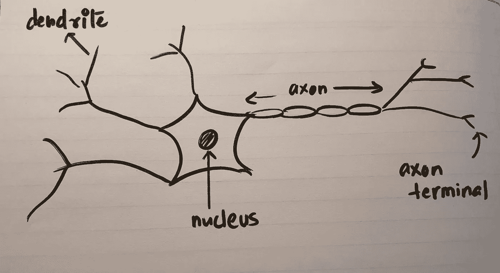
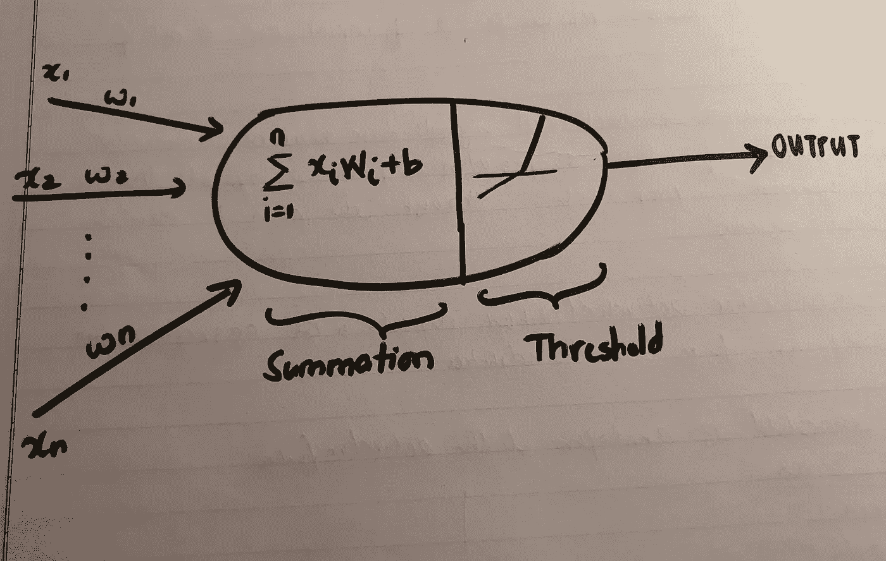
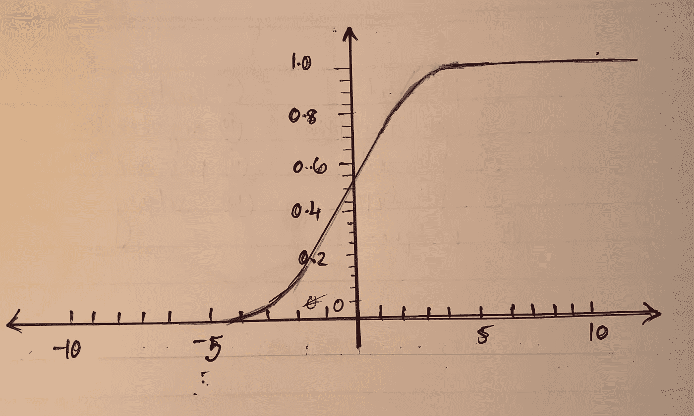
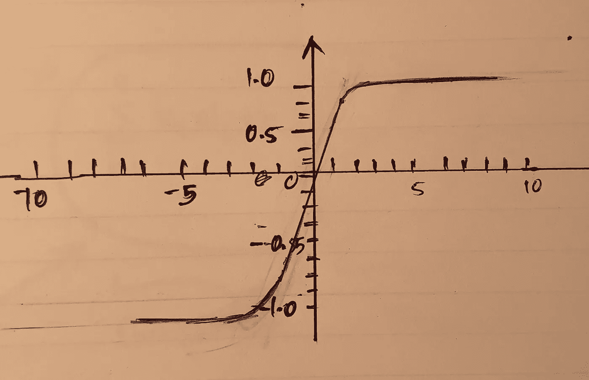
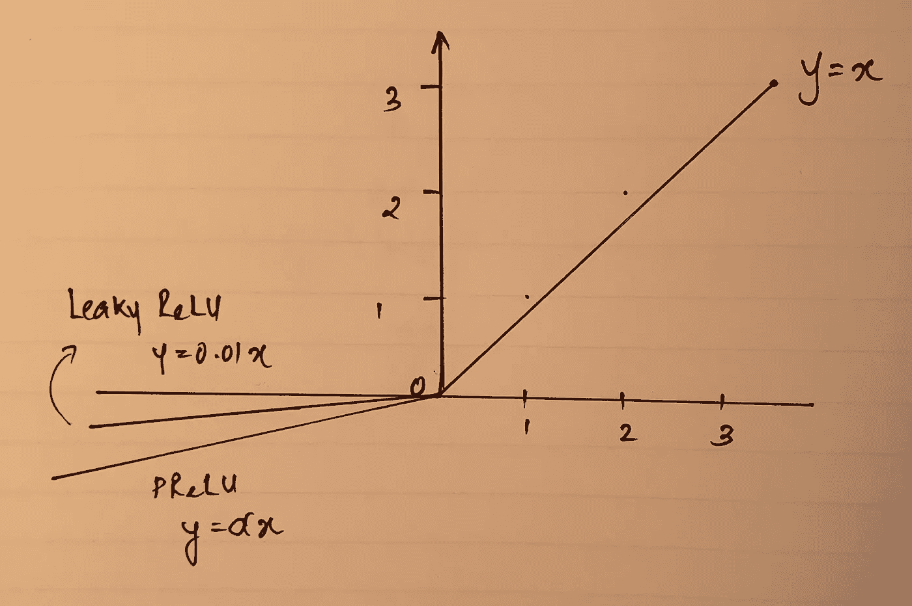

# 了解你的神经网络和激活的简单指南。

> 原文：<https://towardsdatascience.com/a-simple-guide-to-knowing-your-neural-network-and-activation-8d98ebfcd3fd?source=collection_archive---------55----------------------->

## 分析哪个功能似乎合适

[史蒂夫·赖特](https://unsplash.com/@stevenwright?utm_source=medium&utm_medium=referral)在 [Unsplash](https://unsplash.com?utm_source=medium&utm_medium=referral) 上拍照

# 生物神经网络一览。

为了更好地理解激活函数的意图和目的，让我们分析一下我们自身的一个等效模型——*神经元*(首先是*神经网络*的灵感)。一个生物神经网络简单来说就是由一个**细胞** **体**，**树突**(来自神经元的输入)和**轴突**(输出到其他神经元)。一个有用的术语是**突触**，它来自一个神经元与另一个神经元通信的接触点。树突上覆盖着由其他神经元轴突末端形成的突触。来自所有树突的突触在细胞体中累积，细胞体根据累积跨越的**阈值**(类似于各种**激活功能**)确定细胞的状态**激活/未激活**。然后这些突触穿过轴突，到达沿途交流的其他神经元。

神经元的简单解剖

# 人工神经网络

人工神经网络确实保持了其生物学等效物的完整性，尽管多了一些术语。

重量
偏差

## 神经元的处理过程

**输出=σ(权重*输入)+偏差**

这遵循线性方程**y = MX+c**其中权重对应于“m ”,偏差对应于“c”

## 重量(瓦特)

权重，通常是突触权重，代表一个神经元对另一个神经元的强度，使整体连接更强。

## 偏见

作为截距，偏差项使网络符合实际情况，而不是理想情况。如果缺少偏差项，训练点将只通过原点，这是一个太简单的分析。一个网络往往是更强大的偏差项，因为它是开放的，以新的方式考虑和拟合。此外，它还决定了激活功能生效的时间点。

# 选择您的激活功能

现在，我们已经对生物神经网络和人工神经网络进行了基本的比较，我们将看看各种激活函数，并检查它们的优点和局限性。

每个激活函数取一个值，并对其执行数学运算。

## 1.乙状结肠的

乙状结肠的

*   它接受一个实数值，并将其压缩到范围[0，1]内
*   其数学形式:**σ(x)= 1/(1+e x)**

但是，由于以下限制，它很少实现:

*   **乙状结肠饱和，从而消除梯度** 当激活在 1，0 达到饱和时，梯度减小到零。
    因此，在反向传播期间，该零梯度与梯度输出相乘，产生一个非常小的数字，阻碍信号流过权重和输入。
*   **非零中心输出** 如果进入神经元的数据总是正的，则反向传播期间的权重将产生全正或全负的梯度。这导致梯度更新中不期望的行为。

## **2。Tanh**

双曲正切

虽然与 sigmoid 函数相似，但 tanh 函数解决了它的一个限制:非零中心输出。

*   **tanh(x)= 2σ(2x)1**
*   它将一个实数值压缩到[-1，1]范围内

局限性:

*   它在与它的乙状结肠对应物相同的线上饱和。

## 3.热卢

热卢

*   **f(x)=max(0，x)**
*   随机梯度的收敛速度大约加快了 6 倍。
*   它将激活矩阵的阈值设置为零，并且由于没有指数或缺少指数，所以成本较低。
*   随着 x 的增加，不存在饱和。
*   然而，它提出了“垂死的 ReLU”问题的局限性。
    当零处的梯度为零时(当 x <为 0 时)，一个垂死的 ReLU 对任何输入产生相同的输出。梯度学习不会改变权重。
*   这是由于
    -一个非常高的学习率
    -一个大的负偏差

**4。泄漏的 ReLU**

泄漏的 ReLU 和 PReLU

泄漏的 ReLU 试图解决垂死的 ReLU 问题的局限性。

*   当 x < 0\.
    例如 y = 0.01x 时，泄漏 ReLU 具有小的负斜率
*   参数 ReLU ( PReLU)是泄漏 ReLU 的变体，其中斜率被视为要调整的参数。α代表斜率参数。y =α x
*   因此，由于负值斜率的存在，它确实会对相应的输入产生一个输出，从而产生变化。
*   然而，泄漏的 ReLU 并不总是一致的。

## 所以，问题。我应该选择哪个激活功能？

避免使用 sigmoid 函数。您可以选择 ReLU 或泄漏 ReLU(作为 ReLU 函数的替代)。不过，要监控你的学习速度。

你可以给 Tanh 一个机会，但是它可能产生比 ReLU 更差的结果。

# 资源

 [## 用于视觉识别的 CS231n 卷积神经网络

### 斯坦福 CS231n 课程材料和笔记:视觉识别的卷积神经网络。

cs231n.github.ioo](http://cs231n.github.io/)  [## ReLU -人类的机器学习- TinyMind

### TL；DR: ReLU 代表整流线性单位，是一种激活函数。数学上定义为 y…

www.tinymind.com](https://www.tinymind.com/learn/terms/relu)  [## 人与机器:人工神经网络和生物神经网络的比较

### 学习能力被认为是智慧生命的标志之一。机器学习现在有能力学习和…

news.sophos.com](https://news.sophos.com/en-us/2017/09/21/man-vs-machine-comparing-artificial-and-biological-neural-networks/)