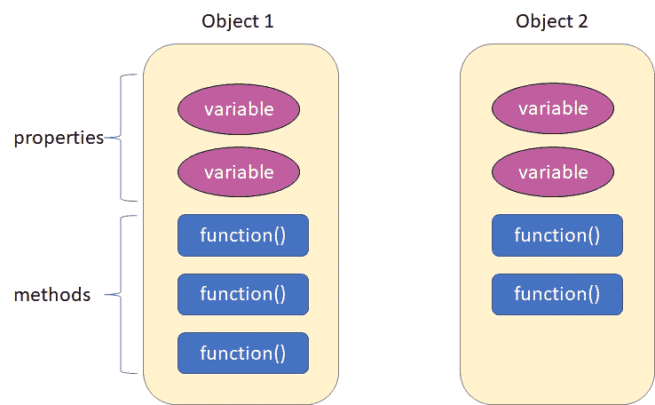
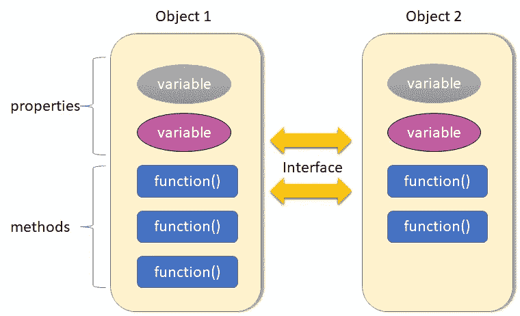

# 面向数据科学家的面向对象编程简单指南

> 原文：<https://towardsdatascience.com/a-simple-guide-to-object-oriented-programming-for-data-scientist-56224fee8f67?source=collection_archive---------13----------------------->

## 如何轻松阅读复杂的 Python 包？


照片由[克莱门特·H](https://unsplash.com/@clemhlrdt?utm_source=medium&utm_medium=referral)在 [Unsplash](https://unsplash.com?utm_source=medium&utm_medium=referral) 上拍摄

作为一名数据科学家，您可能不会像开发人员那样每天都编写面向对象(OO)代码。在您的整个职业生涯中，您可能永远都不需要编写 OO 代码！然而，在不知不觉中，您每天都在通过使用包和框架与面向对象编程(OOP)进行交互。关键的数据科学库，如 *pandas、numpy 和 scikit-learn* 都严重依赖 OOP。

看看这些库的源代码，它们充满了类、方法、属性等等。你可能还想知道为什么你需要声明一个回归模型(例如)作为一个类的实例，然后运行一个 fit 方法来训练你的机器学习模型。

如果你是一个非常好奇的人，你可能想阅读和理解一个很酷的机器学习包的源代码。理解 OOP 可以帮助你轻松做到这一点。如果有一天你想写一个 Python 包或者框架，这些知识将是极其有价值的。

在这篇文章中，我将解释一些主要的 OOP 原则来帮助你开始。

****Edit 2022:你也可以在我的 Youtube 频道上观看下面这篇整篇文章的视频版本，我在其中更详细地描述了 OOP 概念。***

# 首先，我们为什么需要 OOP？

如果我们不知道 OOP 能解决什么样的问题，我们就无法理解和欣赏它。

我们大多数人害怕意大利面条式的代码，因为它太混乱了，难以阅读和维护。但是意大利面代码是如何创建的呢？


意大利面条代码。来源:作者。

看看这个代码结构。希望你看着眼熟:)。我们可以看到 5 个不同的函数相互调用，还有一堆全局变量被一个或多个函数访问和使用。想象一下这个结构扩展几倍，事情会变得非常混乱，难以理解。OOP 通过两个原则解决了这个问题:封装和抽象。

## 包装



OOP 将变量和函数从我们上面的意大利面条式结构中组合在一起，形成称为“对象”的实体。对象内部的变量称为**属性/特性**，函数称为**方法**。把属性想象成一个物体的特征(比如一只猫有蓝色的眼睛)。另一方面，方法本质上是一个对象做事情的能力(比如一只猫知道怎么抓老鼠，会说“喵”)。

对象通过引用彼此的属性和调用彼此的方法进行交互。

封装使得代码**更容易复制和维护**。如果我们想将一个对象复制成 10 个对象，我们只需复制整个对象，而不是复制对象中的每个变量和函数。

## 抽象



当我们不希望其他对象访问和修改一个对象的属性时，我们对其他对象隐藏这些属性。理想情况下，只有一个对象的基本元素通过该对象的接口对其他对象可用。

这就是所谓的“抽象”。我们的手机是抽象的例子。它们的界面只为我们提供了使用它们的相关手柄，但芯片和存储卡等东西对我们来说是隐藏的。

# Python 中的 OOP

在 Python 中，**类**用作创建对象的代码模板。这类似于 JavaScript 中的[构造函数](https://www.w3schools.com/js/js_object_constructors.asp)。

使用类的构造函数创建对象。这个对象将被称为类的`instance`。在 Python 中，我们以下列方式创建实例:

```
Instance = class(arguments)
```

让我们看下面一个类的例子:


类的例子。来源:作者

一个类中的函数不能直接访问该类的属性，就像我们通常认为的“全局变量”一样。相反，我们需要使用`self`关键字来访问类的属性。这也类似于 JavaScript。在 Python 中，`self`关键字总是放在第一个参数中。

要实例化该类，我们只需调用:

`>>> MySuperCuteCat = SuperCuteCat()`

你也可能经常在 Python 类中看到 `__init__`方法。这个方法只是用来初始化一个类的几个属性。

我希望这篇文章能让你对 OOP 有一个更清晰的认识，并帮助你作为一名数据科学家更好地理解 Python 包和框架。如果你有兴趣学习更多关于面向对象的知识，这个页面可能会很有趣。

感谢您的阅读！享受学习。