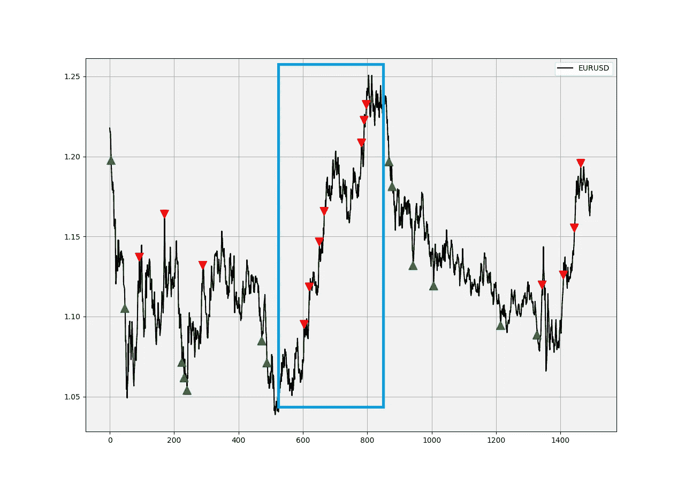
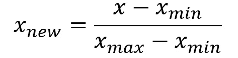
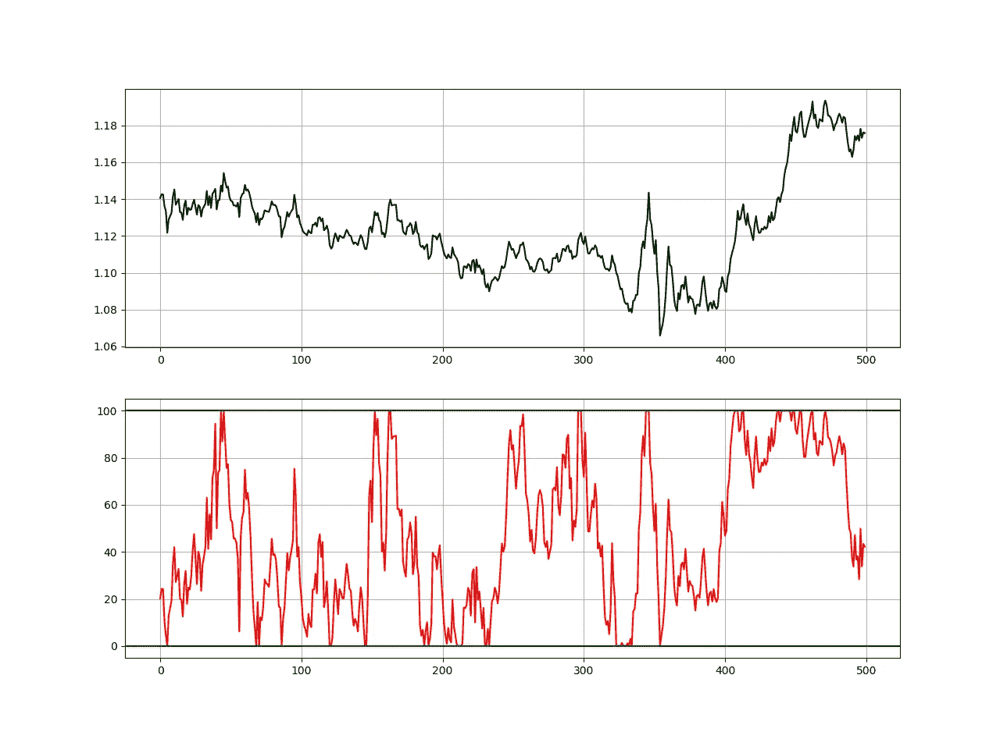
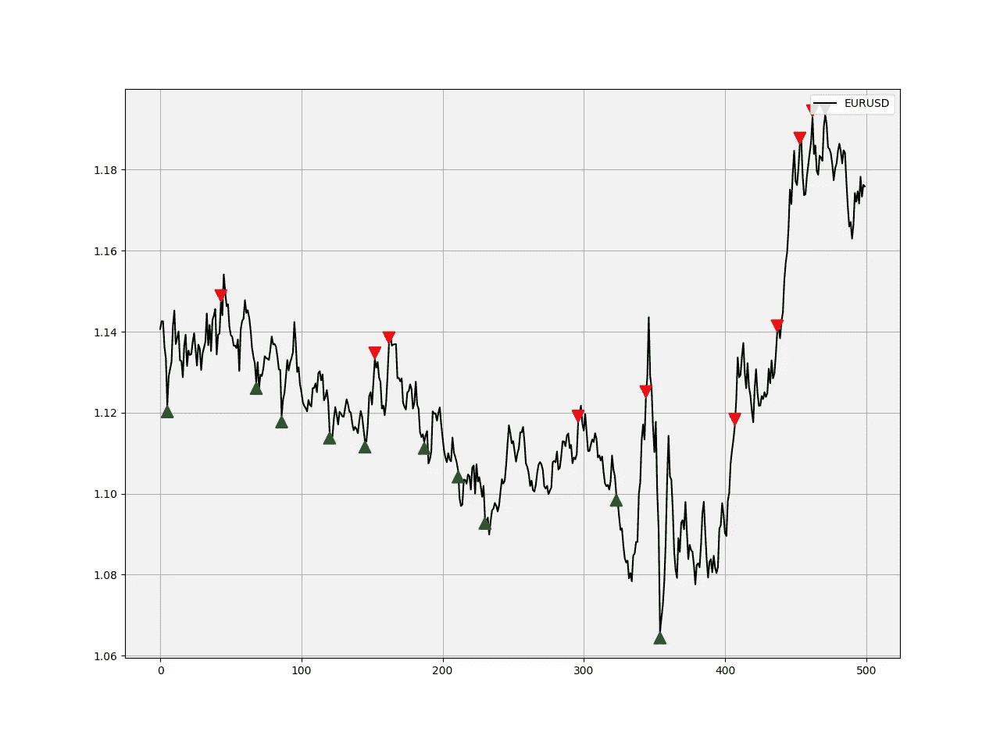
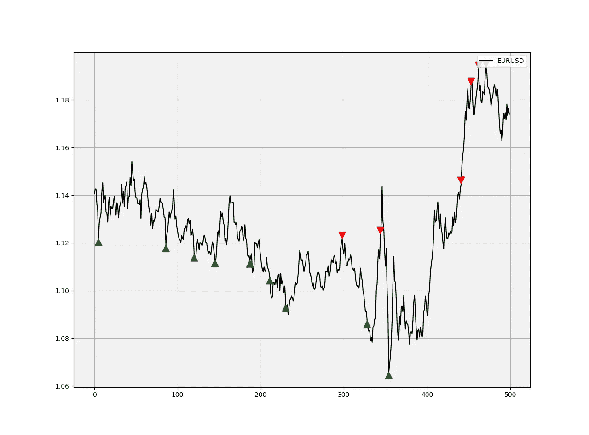
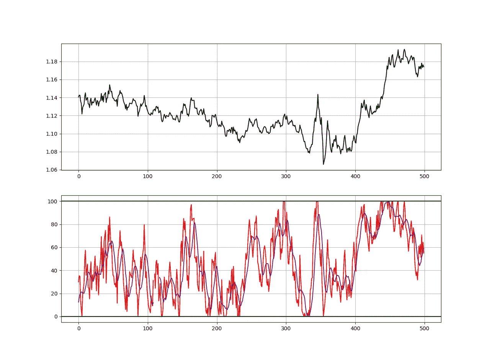

# 一个简单的指标添加到您的交易系统

> 原文：<https://towardsdatascience.com/a-simple-indicator-to-be-added-to-your-trading-system-ac65e70bbdd?source=collection_archive---------10----------------------->

## 提出一个简单的指标概念，应该包含在你的交易框架中

***注来自《走向数据科学》的编辑:*** *虽然我们允许独立作者根据我们的* [*规则和指导方针*](/questions-96667b06af5) *发表文章，但我们不认可每个作者的贡献。你不应该在没有寻求专业建议的情况下依赖一个作者的作品。详见我们的* [*读者术语*](/readers-terms-b5d780a700a4) *。*

金融研究是一个无穷无尽的令人兴奋的领域，有许多“**找到了”**和“**哦，不！”**瞬间。我们总是在寻找那个一直有效并让我们晚上睡得好的黄金策略，但是我们经常会遇到“哦，不！”瞬间。这很正常，我们是在大海捞针，针是一个体面的策略，而大海捞针是想法的无限可能性。

刚刚在 Python 中 ***新技术指标成功后出了新书。它对复杂的交易策略进行了更完整的描述和补充，Github 页面致力于不断更新代码。如果你对此感兴趣，请随时访问下面的链接，或者如果你喜欢购买 PDF 版本，你可以在 Linkedin 上联系我。***

[](https://www.amazon.com/gp/product/B09919GQ22/ref=as_li_tl?ie=UTF8&camp=1789&creative=9325&creativeASIN=B09919GQ22&linkCode=as2&tag=sofien-20&linkId=bc5df3f6ab0f3af2df79641c56b949ba) [## 交易策略之书

### 亚马逊网站:交易策略之书(9798532885707): Kaabar，Sofien:书籍

www.amazon.com](https://www.amazon.com/gp/product/B09919GQ22/ref=as_li_tl?ie=UTF8&camp=1789&creative=9325&creativeASIN=B09919GQ22&linkCode=as2&tag=sofien-20&linkId=bc5df3f6ab0f3af2df79641c56b949ba) 

有时候，简单是成功的关键。我们不需要几十个技术指标到处发出信号，到头来却发现自己成了净输家。我们必须了解关于技术指标的两件事:

*   它们是价格衍生的。这意味着他们取价格，分解价格，了解一些特征。因此，他们不是向前看，而是向后看。我们希望这种落后的关系在未来继续下去。例如，如果我们看到 RSI 出现背离，我们希望它会像往常一样导致价格衰竭。这种背离并没有窥视未来，它只是一个简单的数学观察。
*   他们不太可能独自提供成功的策略。如果是这样的话，那么为什么我们不都是依靠随机指标上的超买/超卖区成为百万富翁呢？交易比这复杂得多，需要更全面的方法来发现有利可图的交易。

考虑到这一点，我们应该把指标看作是我们信念的小帮手。例如，当我们发现足够的信息告诉我们做多(购买)一项资产时，我们可以检查技术指标，看看它们是否证实了这一点。*我们还应该检查当前的市场状态，以了解指标是否会提供良好的信号*。这意味着当我们处于趋势市场时，我们不应该使用均值回复指标。下图显示了原因。这是 RSI 在上升趋势市场中给出的卖出信号。请注意蓝色矩形内的价格趋势，很明显，信号的质量很差。



RSI 信号图——欧元兑美元每日时间框架。*(图片作者)*

现在，我们可以试着从一个很简单的想法中找到一个简单的指标，那就是归一化。标准化的好消息是，买卖条件已经列出来了，而且很直观，因此，我们要做的就是找到一个合适的周期(如 RSI 中的 14 默认周期)。我们将看到如何在不偏离指标的情况下找到这个周期。

# 规范化的概念

这个伟大的技术允许我们捕捉 0 和 1 之间的值(或者 0 和 100，如果我们想乘以 100 的话)。这个概念围绕着从当前值中减去某个回望周期中的最小值，再除以同一回望周期中的最大值减去最小值(在命名器中相同)。



*(图片作者)*

我们可以尝试用 python 编写这个公式。以下函数对给定的 OHLC 类型的时间序列进行归一化处理:

```
def normalizer(Data, lookback, onwhat, where):

    for i in range(len(Data)):

        try:

            Data[i, where] = (Data[i, onwhat] - min(Data[i - lookback + 1:i + 1, onwhat])) / (max(Data[i - lookback + 1:i + 1, onwhat]) - min(Data[i - lookback + 1:i + 1, onwhat]))
        except ValueError:
            pass

    Data[:, where] = Data[:, where] * 100return Data# The **onwhat** variable is what to normalize and the **where** variable is where to print the normalized values, i.e. which colum.
```

如果我们将该函数应用于欧元兑美元每日时间框架的收盘价，并有 50 个回望期(也就是说，该函数将查看最后 50 个值，并从中选择最小值和最大值)，我们将得到下图。



欧元兑美元每日时间框架及其标准化值。*(图片作者)*

现在，如果我们形成一个简单的策略，当归一化值等于 0 时买入，当归一化值等于 100 时做空，我们得到下图。这些信号似乎确实捕捉到了一些顶部和底部。就其本身而言，这是一个良好的开端，因为选择 50 是完全随意的。为简单起见，我们可以称归一化值:**归一化指数(NI)** 。

如果你也对更多的技术指标和使用 Python 创建策略感兴趣，那么我关于技术指标的畅销书可能会让你感兴趣:

[](https://www.amazon.com/gp/product/B08WZL1PNL/ref=as_li_tl?ie=UTF8&camp=1789&creative=9325&creativeASIN=B08WZL1PNL&linkCode=as2&tag=sofien-20&linkId=e3cb9716bb6a07cf6c8b9fb585412b07) [## Python 中的新技术指标

### 亚马逊网站:Python 中的新技术指标:9798711128861: Kaabar，Sofien 先生:书籍

www.amazon.com](https://www.amazon.com/gp/product/B08WZL1PNL/ref=as_li_tl?ie=UTF8&camp=1789&creative=9325&creativeASIN=B08WZL1PNL&linkCode=as2&tag=sofien-20&linkId=e3cb9716bb6a07cf6c8b9fb585412b07) 

欧元兑美元遵循 50 天标准化指标的信号图。*(图片作者)*

然而，我们希望从这种奇妙的技术(即规范化)中提取尽可能多的价值。怎么会？基本想法是这样的:

> 我们不想说 20 天周期比 50 天周期更适合标准化，因此我们可以形成一个全标准化指数(ANI ),它使用从 2 到 100 的回顾周期，并相应地对它们进行加权。这样，我们将有一个加权的标准化指数，它考虑了广泛的回望期。

如果 10 天期标准化指数显示值为 40，那么它在全标准化指数中的真实值为 40 / 100 = 0.40。因此，我们将拥有一个由 100 个规范化索引器组成的介于 0 和 100 之间的索引。

用 Pythonic 语言来说，我们将有以下创建全规范化索引(ANI)的循环语句，请记住，我们仍然处于 OHLC 数据结构中(第 0 列表示开放，第 1 列表示高，第 2 列表示低，第 3 列表示关闭):

```
# Starting from column 4 (i.e. the first Normalized Index)
b = 4# Looping and adding 1 so that the correct column will be populated
for a in range(2, 102): 
  Asset1 = normalizer(Asset1, a, 3, b)
  b = b + 1# Formatting
normalized_values = Asset1[:, 4:104]# Calculating the ANI
all_normalizer = np.sum(normalized_values, axis=1) / 100# Reshaping
all_normalizer = np.reshape(all_normalizer, (-1, 1))
Asset1 = deleter(Asset1, 4, 110)# Concatenating the OHLC Data with the ANI
Asset1 = np.concatenate((Asset1, all_normalizer), axis = 1)
Asset1 = adder(Asset1, 10)
Asset1 = Asset1[102:,]
```

让我们看看我们的新指标是什么样的。剧透警报，看起来像个指示器。顺便说一句，如果你喜欢通过 Python 研究和回测策略，那么我写的这本书可能会让你感兴趣， [**《回测之书:客观交易:回测和揭秘交易策略**](https://www.amazon.com/dp/B089CWQWF8) **。**


与 ANI 的欧元兑美元每日时间框架。*(图片作者)*

因此，上述指标是一百个标准化索引器的平均值，给我们的信号似乎稍微好一点(我们总是可以优化它)。让我们检查下面的信号图。



ANI 之后的欧元兑美元信号图。*(图片作者)*

我们可以在 ANI 上添加我们的触觉，因为信号有点稀少。加个 8 日均线怎么样？这可以根据均线何时穿过 ANI 给我们一些信号。下图说明了前一点，我们有更多的信号，移动平均线做得很好，平滑了 ANI。



与 ANI 和 8 日均线的欧元兑美元每日时间框架。*(图片作者)*

如果您对另一个标准化指标感兴趣，请查看我写的这篇文章:

[](https://medium.com/@kaabar.sofien/the-normalized-bollinger-indicator-another-way-to-trade-the-range-back-testing-in-python-db22c111cdde) [## 标准化的布林线指标。另一种交易范围的方式。Python 中的回溯测试。

### 深入挖掘并修改布林线。

medium.com](https://medium.com/@kaabar.sofien/the-normalized-bollinger-indicator-another-way-to-trade-the-range-back-testing-in-python-db22c111cdde) 

# 结论

这个指标有什么用？嗯，衡量动量是交易中的一个关键概念，标准化指数通过使用纯粹的收盘价数据完美地做到了这一点。如果随机振荡器使用稍微修改的归一化版本，那么后者可以帮助我们看到纯粹的收盘动量。如果你想取消一步棋，你可以向 ANI 确认你的观点。

经验法则是，如果 ANI 的读数高于 95，那么它支持你的看跌观点，如果 ANI 的读数低于 5，那么它支持你的看涨观点。我们可以使用 ANI 的另一个方法是它的移动平均线交叉。当然，8 期 MA 是个人选择，如果更适合你可以选择另一期。


图片由[皮克斯拜](https://pixabay.com/?utm_source=link-attribution&utm_medium=referral&utm_campaign=image&utm_content=4852537)的 Gerd Altmann 提供