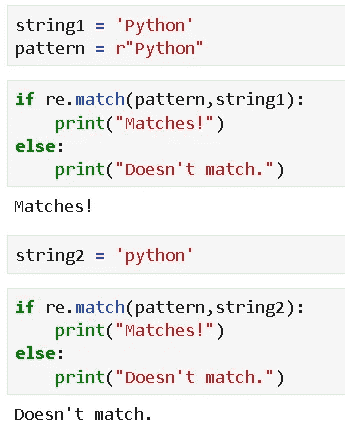
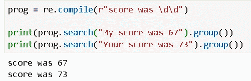
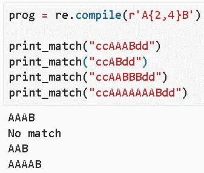
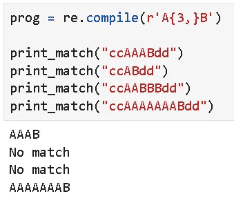

# Python 正则表达式的简单介绍

> 原文：<https://towardsdatascience.com/a-simple-intro-to-regex-with-python-14d23a34d170?source=collection_archive---------14----------------------->

## 我们将通过一些在 Python 中使用 Regex ( ***正则表达式*** )的基本例子，展示这个框架如何用于强大的文本处理。


图片来源: [Pixabay(免费商业使用)](https://pixabay.com/photos/book-paper-document-page-3089857/)

# 介绍

文本挖掘是当今数据科学的一个热门话题。文本数据的数量、种类和复杂性正以惊人的速度增长。

[根据本文](https://www.mordorintelligence.com/industry-reports/text-analytics-market)，2019 年全球文本分析市场价值为 54.6 亿美元，预计到 2025 年将达到 148.4 亿美元。


[**图像来源**](https://www.datanami.com/2015/01/16/predicting-consumer-behavior-drives-growth-text-analytics/)

正则表达式用于 ***识别*** 一个模式是否存在于一个给定的字符序列(字符串)中，也用于 ***定位*** 该模式在文本语料库中的位置。它们有助于操纵文本数据，这通常是涉及文本分析的数据科学项目的先决条件。

因此，对于初露头角的数据科学家来说，对于未来的项目和分析任务来说，初步了解这个强大的工具非常重要。

在 Python 中，有一个名为 **re** 的内置模块，需要导入该模块才能使用 Regex。

```
**import re**
```

这是官方文档页面 的 [**起点。**](https://docs.python.org/3/howto/regex.html)

在这篇简短的回顾中，我们将通过 Python 中的一些实际例子，介绍正则表达式在简单文本处理中的基本用法。

# “匹配”方法

我们使用`**match**`方法来检查一个模式是否匹配一个字符串/序列。它区分大小写。



# 一个``compile`d 程序

我们可以使用`**compile**`创建一个正则表达式程序并使用内置方法，而不是重复代码。


因此，编译后的程序返回特殊对象，如`**match**`对象。但是如果它们不匹配，它将返回`**None**`，这意味着我们仍然可以运行我们的条件循环！


# 位置匹配

我们可以很容易地使用`match`对象中的附加参数来检查字符串模式的位置匹配。


上面，我们注意到一旦我们用模式`thon`创建了一个程序`prog`，我们就可以用不同的字符串多次使用它。

另外，请注意，`pos`参数用于指示应该在哪里查找匹配。对于最后两个代码片段，我们改变了起始位置，得到了不同的匹配结果。虽然字符串是相同的。

# 一个简单的用例

让我们看一个用例。我们想知道列表中有多少单词的最后三个字母是 ing。


# “搜索”方法

为了解决上面的问题，我们可以使用一个简单的字符串方法。

> regex 有什么强大的地方？

答案是它可以匹配非常复杂的模式。但是要看这么高级的例子，我们先来探讨一下`**search**`的方法。


注意，`match`方法如何返回`None`(因为我们没有在文本中指定模式的正确起始位置)，但是`search`方法找到匹配的位置(通过扫描文本)。

自然，我们可以使用由`search`返回的`match`对象的`span()`方法来定位匹配模式的位置。


# ``findall`` 和` finditer '方法

`search`功能强大，但也仅限于查找文本中第一个出现的匹配。要发现一个长文本中的所有匹配，我们可以使用`findall`和`finditer`方法。

`findall`方法返回一个带有匹配模式的列表。你可以通过统计条目的数量来了解被搜索的条目在文本中出现的频率。

`finditer`方法产生一个[迭代器](https://www.programiz.com/python-programming/iterator)。我们可以使用它来查看更多信息，如下所示。


# 通配符匹配(使用单个字符)

现在，我们轻轻地进入 Regex 闪耀的竞技场。正则表达式最常见的用法与“通配符匹配”或“模糊匹配”有关。这是你没有完整的模式，但它的一部分，你仍然想找到在一个给定的文本中，类似的东西出现。

这里有各种各样的例子。这里我们还将对由`search`返回的对象应用`group()`方法，以返回匹配的字符串。

## 单点单字符匹配

点`.`匹配除换行符以外的任何单个字符。


## 小写\w 匹配任何单个字母、数字或下划线

DOT 仅限于字母字符，所以我们需要用其他工具来扩展曲目。


## (\W 或大写 W)匹配没有包含\w 的任何内容

除了字母、数字和下划线之外，还有其他符号。我们用\W 来捕捉它们。


## 用空白字符匹配模式

\s(小写 s)匹配单个空白字符，如空格、换行符、制表符、回车符。当然，这是用来搜索一个有空白的模式，比如一对单词。


## \d 匹配数字 0-9

这里有一个例子。



这是一个实际应用的例子。假设，我们有一篇描述一些学生在一次测试中的分数的文章。分数范围为 10-99，即两位数。其中一个分数被错打成了 3 位数(Romie 得了 72，却被打成了 721)。下面的简单代码片段使用\d 通配符匹配来捕获它。


## 字符串的开头

^(caret)匹配字符串开头的模式(但不匹配其他任何位置)。


## 字符串的结尾

＄(美元符号)匹配字符串末尾的模式。下面是一个实际的例子，我们只对苹果的专利信息感兴趣，而忽略其他公司。我们检查文本末尾的“Apple ”,只有当它匹配时，我们才使用前面显示的数字匹配代码取出专利号。


# 通配符匹配(有多个字符)

现在，我们可以转到更复杂的多字符通配符匹配，这让我们拥有更大的能力和灵活性。

## 匹配 0 次或更多次重复

`*****`匹配前面正则表达式的 0 次或多次重复。


## 匹配 1 次或多次重复

`**+**`使产生的 re 匹配前面 RE 的一次或多次重复。


## 精确匹配 0 或 1 次重复

`**?**`使结果 RE 精确匹配前一个 RE 的 0 或 1 次重复。


## 控制匹配的重复次数

`**{m}**`精确地指定了`**m**`RE 要匹配的副本。较少的匹配导致不匹配并返回`**None.**`


`**{m,n}**`精确指定`**m**`到`**n**`的副本 RE 来匹配。省略`**m**`指定下限为零，省略`**n**`指定上限无穷大。



`**{m,n}?**`指定`**m**`到`**n**`RE 的副本以非贪婪方式进行匹配。


## 匹配字符集

`**[x,y,z]**`匹配 x、y 或 z。


## 集合中的字符范围

在集合中可以匹配一系列字符。**这是使用最广泛的正则表达式技术之一**。我们用`**-**`来表示距离。例如，`a-z`或`A-Z`将匹配`a`和`z`或`A`和`Z`之间的任何内容，即整个英文字母表。

让我们假设，我们想要提取一个电子邮件 id。我们放入一个模式，用字母字符+ @ + .com 匹配正则表达式，但是它不能捕获一个包含一些数字的电子邮件 id。


因此，我们稍微扩展了一下正则表达式。但是我们只提取带有域名的电子邮件 id。' com '。因此，它无法捕捉其他领域的电子邮件。


这很容易扩展，但巧妙的电子邮件操作可能会阻止用这样的正则表达式提取。


## 通过 OR-ing 结合正则表达式的功能

像任何其他好的可计算对象一样，Regex 支持布尔运算来扩展它的范围和能力。单个正则表达式模式的 OR 运算特别有趣。

例如，如果我们想查找包含区号“312”的电话号码，下面的代码无法从第二个字符串中提取出区号。


我们可以如下创建正则表达式对象的组合来扩展功能，


## 一个组合的例子

现在，我们展示一个使用`findall()`从文本中提取有效电话号码的例子，以及我们到目前为止学到的多字符匹配技巧。

请注意，区号为 312 的有效电话号码是 312-xxx-xxxx 或 312.xxx.xxxx。


# 拆分方法

最后，我们讨论一种方法，它可以创造性地用于从不规则的语料库中提取有意义的文本。下面显示了一个简单的例子，我们用打乱了一个常规句子的外部字符构建了一个正则表达式模式，并使用`**split()**`方法从句子中去掉这些字符。


# 摘要

我们回顾了使用 Python 定义正则表达式对象和搜索模式的要点，以及如何使用它们从文本语料库中提取模式。

Regex 是一个庞大的主题，它本身几乎就是一种小型编程语言。鼓励读者，尤其是那些对文本分析感兴趣的读者，从其他权威来源更多地探索这个主题。这里有一些链接，

[](https://medium.com/free-code-camp/regular-expressions-demystified-regex-isnt-as-hard-as-it-looks-617b55cf787) [## 正则表达式不再神秘:正则表达式没有看起来那么难

### 你是那种因为正则表达式看起来像外语而远离它的人吗？我在……

medium.com](https://medium.com/free-code-camp/regular-expressions-demystified-regex-isnt-as-hard-as-it-looks-617b55cf787) 

对于 JavaScript 爱好者来说，

[](https://codeburst.io/an-introduction-to-regular-expressions-regex-in-javascript-1d3559e7ac9a) [## JavaScript 正则表达式(Regex)简介

### 正则表达式不是外来语言。在这里学习 JavaScript 中 Regex 的基础知识。

codeburst.io](https://codeburst.io/an-introduction-to-regular-expressions-regex-in-javascript-1d3559e7ac9a) 

十大最需要的正则表达式，现成的，

[](https://medium.com/factory-mind/regex-cookbook-most-wanted-regex-aa721558c3c1) [## 食谱——最想要的

### 十大最常用(也是最需要的)正则表达式

medium.com](https://medium.com/factory-mind/regex-cookbook-most-wanted-regex-aa721558c3c1) 

A lso，你可以查看作者的 [**GitHub**](https://github.com/tirthajyoti?tab=repositories) **知识库**获取机器学习和数据科学方面的代码、思想和资源。如果你和我一样，对人工智能/机器学习/数据科学充满热情，请随时[在 LinkedIn 上添加我](https://www.linkedin.com/in/tirthajyoti-sarkar-2127aa7/)或[在 Twitter 上关注我](https://twitter.com/tirthajyotiS)。

[](https://www.linkedin.com/in/tirthajyoti-sarkar-2127aa7/) [## Tirthajyoti Sarkar - Sr .首席工程师-半导体、人工智能、机器学习- ON…

### 通过写作使数据科学/ML 概念易于理解:https://medium.com/@tirthajyoti 开源和有趣…

www.linkedin.com](https://www.linkedin.com/in/tirthajyoti-sarkar-2127aa7/)