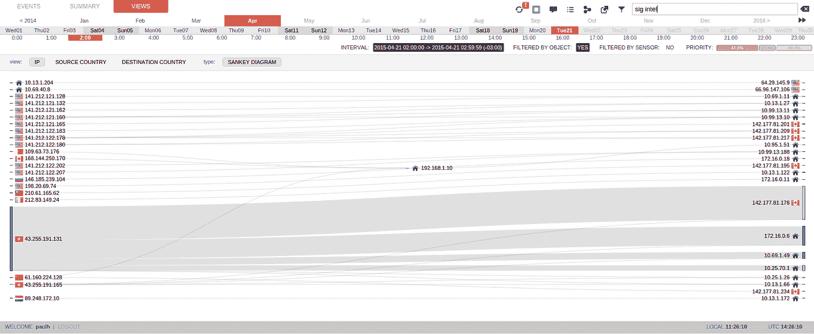

# 使用开源工具过渡到网络安全的简单介绍。

> 原文：<https://towardsdatascience.com/a-simple-introduction-to-transitioning-into-cybersecurity-using-open-source-tools-c44c7c2570ca?source=collection_archive---------20----------------------->

网络安全——胡安·卡西尼的艺术作品

现在是 2020 年 2 月，我已经看到多篇文章预测，由于缺乏信息安全方面的人才，大规模的末日正在向我们走来。有些是危言耸听吗？大概吧。但现实是，大多数行业都在向科技发展，而科技带来了网络威胁。因此，传统的 IT 部门不得不适应并开始将网络安全放在首位。随着 [IR35](https://www.gov.uk/topic/business-tax/ir35) 的变化将于 2020 年 4 月生效(*尽管它从 2000 年*就已经存在了)，雇佣承包商来保护你的安全将不再那么容易。这对 IT 部门意味着什么？对一些部门来说，这意味着招聘人才，无论是内部招聘还是着眼于当前市场？由于英国退出欧盟即将对英国移民体系进行改革，这可能会变得更加困难。然而，对于那些希望进入这个行业的人来说，这为进入一个需求巨大的行业提供了机会。

## 因此，让我们假设你已经在技术领域工作，并想将流转换为网络，你从哪里开始呢！

网络安全的角色那么多，知道自己的兴趣在哪里是一个很好的开始。解决这个问题的一个好方法是开始消费网络内容，可以是播客、书籍、YouTube，甚至是媒体阅读。 ***你*** 觉得什么有趣？如果你来自数据科学背景，并且热爱数据，那么网络安全🤝数据科学=一个豆荚里的两颗豌豆。这辈子，你要热爱你做的事情，当你热爱你做的事情的时候，感觉就不像工作了，对吧？你越喜欢你所做的事情，你就会变得越好奇，并且会走得更远。在网络安全领域，求知欲是必需的这可能是从同一所学院毕业、成绩相同的候选人之间的区别。

## 让我们从一些你需要的工具开始，⚒️

虚拟机将是你最好的朋友。这不仅是一个比建造你的实验室更环保的解决方案，而且它提供了一个复制*(在某种程度上，这是由你的家用机器有多强大决定的)*场景的机会，对于那些不习惯命令行的人来说也是一个机会。

VirtualBox 是大多数人用来部署虚拟机的最常见的开源虚拟化工具。一种常见的做法是部署一台易受攻击的机器(*让我们说一台具有已知漏洞*的邮件服务器)，然后部署另一台带有 [Kali Linux](https://www.kali.org/) 或 [Parrot OS](https://parrotlinux.org/) 的虚拟机，设置网络设置以确保它们可以通信，然后继续利用漏洞。

## 我应该试用什么操作系统？

Kali 通常是最推荐的网络安全操作系统，尤其是如果你正在进行渗透测试的话。然而，Kali 也是一把拥有许多工具的瑞士军刀，所以对于第一次使用的人来说，它可能会令人生畏，令人困惑，而且处理起来太多了。那么，你该如何应对呢？

## 熟能生巧！

好的，让我们假设您是一名 DBA，已经与数据库打交道很长时间了，但现在想转换立场，加入我们的 infosec。你知道数据库，但从未使用过 Kali，所以学习它的最好方法是用 MongoDB 构建一个 VM，并安装一个你知道有漏洞的版本。识别网络安全漏洞的标准被称为“常见漏洞和暴露”( **CVE** s)。例如，搜索 MongoDB 会返回 36 个 CVE，这些 CVE 现在都将被打补丁。但是，例如，如果您在虚拟机上下载并安装了一个没有为[CVE-2015–7882](https://nvd.nist.gov/vuln/detail/CVE-2015-7882)打补丁的 MongoDB 版本，该版本由于对版本 *3.0.0* 到 *3.0.6* *的 LDAP 身份验证处理不当而允许未经身份验证的客户端获得未经授权的访问*，那么您就可以练习使用类似 [Metasploit](https://www.metasploit.com/) 或其他数据库破解工具。这种方法背后的原理是让你使用 Kali 中的一些工具包，切换数据库和工具，并学习渗透测试的基础知识。人们常说进攻是最好的防御方式。这也适用，尤其是在网络安全领域。如果你不知道它是如何被攻击的，你就不能保护它，对吗？

## 但是网络安全不仅仅是渗透测试信不信由你！

这里是我最喜欢的虚拟机之一。这是一个完整的安全套件，可以用来加强您的家庭防御。这可能是开始使用你的数据作为学习手段的好方法。介绍[安全洋葱！](https://securityonion.net/)

> Security Onion 是一个免费的开源 Linux 发行版，用于入侵检测、企业安全监控和日志管理。它包括 Elasticsearch、Logstash、Kibana、Snort、Suricata、Bro、Wazuh、Sguil、Squert、CyberChef、NetworkMiner 和许多其他安全工具。

## 这里提到了许多工具，让我们来分解一下:

*   [**ELK Stack**](https://www.elastic.co/what-is/elk-stack)—Elastic Stack 由 Elasticsearch、Kibana 和 Logstash 组成，像 Voltron 一样，它们结合在一起共同工作，形成一个伟大的 SIEM 工具，Logstash 摄取&处理日志，Elasticsearch 存储和解析，Kibana 显示它们以供分析。

麋鹿栈还包括 Beats！——[承蒙弹力](https://www.elastic.co/what-is/elk-stack)

*   **SNORT** —是一款免费开源的网络入侵检测系统和入侵防御系统。由 Martin Roesch 于 1998 年创建，能够进行实时流量分析和数据包记录。

## 那么 SNORT 是如何工作的呢？

让我们以[CVE-2017–0144-Windows SMB 远程代码执行漏洞](https://cve.mitre.org/cgi-bin/cvename.cgi?name=cve-2017-0144)为例，也称为[永恒之蓝](https://en.wikipedia.org/wiki/EternalBlue)，它是 2017[wanna cry 流行病](https://en.wikipedia.org/wiki/WannaCry_ransomware_attack)的催化剂。SNORT 允许您在网络上设置规则，以阻止任何利用此漏洞的企图。例如，WannaCry 已知会与某个 sinkhole 进行通信，并检查某个 URL 是否是活动的，因为这是一个已知的指标，您网络中显示此行为的任何机器都很可能会受到危害，因此拥有检测和阻止此行为的规则将是一个很好的防御策略。数据科学家将喜欢使用 SNORT 规则和它生成的数据，结合 Kibana，您将能够构建图表并结合机器学习来预测&分析趋势。

通过 Kibana 发出 SNORT 警报——由 sý nesis 提供

*   [BRO](https://www.zeek.org/documentation/index.html) —现在叫 Zeek，但知道的人不多。但是 BRO 是一个网络分析框架，与典型的 IDS 有很大的不同。
*   [Wazuh](https://wazuh.com/) —是一款开源的企业级安全监控解决方案，用于威胁检测、完整性监控、事件响应和合规性。
*   Sguil 是由网络安全分析师为网络安全分析师打造的。Sguil 的主要组件是一个直观的 GUI，它提供对实时事件、会话数据和原始数据包捕获的访问。Sguil 促进了网络安全监控和事件驱动分析的实践。
*   [Squert](http://www.squertproject.org/) —是一个 web 应用程序，用于查询和查看存储在 [**Sguil**](http://sguil.net/) 数据库中的事件数据(通常是 IDS 警报数据)。Squert 是一个可视化工具，它试图通过使用元数据、时间序列表示以及加权和逻辑分组的结果集来为事件提供额外的上下文。希望这些观点能引发一些问题，否则这些问题可能不会被提出。

网络安全🤝良好的图形用户界面——由 Squert 项目提供。

从远处看，看到所有这些工具并思考我不知道自己在做什么可能会令人生畏，但控制你的环境，查看教程并努力解决任务和漏洞是一种很好的学习方式。每当我在 Kali 上执行任何活动时，我总是确保我在监控会话，然后返回并试图通过日志重放它。通过查看每个分析工具发生了什么，它帮助我在日常工作中识别和记住我以前见过的行为。

Windows 事件日志是实践中一个很好的例子。用户登录时会发生什么？如果通过 LDAP 服务器或 VPN 登录，哪些日志与登录相关联？能够看到成功的登录，并将它们与系统尝试的日志进行比较，有助于形成您对基础架构环境的理解。

## 推荐购买！

阅读团队现场手册— [本·克拉克写的一本书，我一直把它放在办公桌上！](https://amzn.to/2TVYD7s)

我总是把这本书放在身边，尤其是当命令行不是你的强项或者你正在使用 Windows CMD 并且需要复习常用命令的时候。绝对值得 4.94！这里可以买到[！](https://www.amazon.co.uk/Rtfm-Red-Team-Field-Manual/dp/1494295504)

## 想学笔考，但是没时间搭建环境？

在家学习是许多领域发展的关键，但在网络安全领域，这也是发现新人才和专业化的关键。但不是每个人都有时间或资源来建立他们的家庭实验室。这就是像 [Hack The Box](https://www.hackthebox.eu/invite) 这样的工具出现的原因。Hack The Box 由哈里斯·皮拉里诺斯(Haris Pylarinos)创建，提供了一个测试和提升渗透技能的在线平台。随着材料的不断变化，你现在可以在 YouTube 上找到有人如何侵入一个退休系统的视频。你只能找到退役系统的视频，顺便说一句，这是为了确保每个人都有公平的机会尝试新系统，并能在排行榜上排名。有趣的是，要获得一个账户，你必须黑进去。

是的，要得到你的邀请码，你必须黑进去。享受挑战吧！——[承蒙 HTB](https://www.hackthebox.eu/invite)

如果你正在进入网络安全领域，并且意识到有很多东西需要学习，一个好的记忆方法是开始写关于它的文章。了解[如何安装一个新的 GoPhish 钓鱼服务器？](https://medium.com/@Stephen_Chap/deploying-a-gophish-server-on-google-cloud-platform-445eadaf8b31?source=your_stories_page---------------------------)写一篇关于它的博客。你面临的问题，别人肯定会遇到，你的叙述甚至可能比我经常发现的文档更好。我会一直关注 Medium 来理解一个新工具，因为经常有人写我可能没有考虑过的替代方案，或者推荐优秀的内容来帮助学习。

## 延伸阅读:

*   这篇文章是我在 2017 年写的一篇关于[我如何获得我在网络安全领域的第一份工作的文章的更新版本。](https://medium.com/@Stephen_Chap/how-i-got-a-job-in-cyber-security-78810a1b6cd6)
*   [安全洋葱文档](https://securityonion.readthedocs.io/en/latest/)
*   [学习 Elasticsearch](https://www.youtube.com/watch?v=C3tlMqaNSaI) —本指南涵盖 6.3 版之前的 Elastic
*   [如何在 AWS 上部署安全洋葱](https://medium.com/@wan0net/deploying-security-onion-on-amazon-web-services-aws-using-virtual-private-cloud-vpc-mirroring-5f336dcd6312)作者 [Iain Dickson](https://medium.com/u/fd0c9e7a04e7?source=post_page-----c44c7c2570ca--------------------------------)

斯蒂芬·查彭达玛