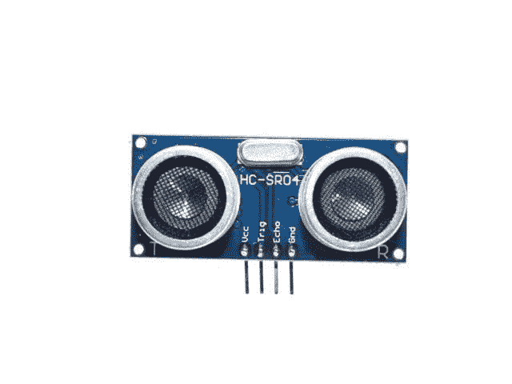
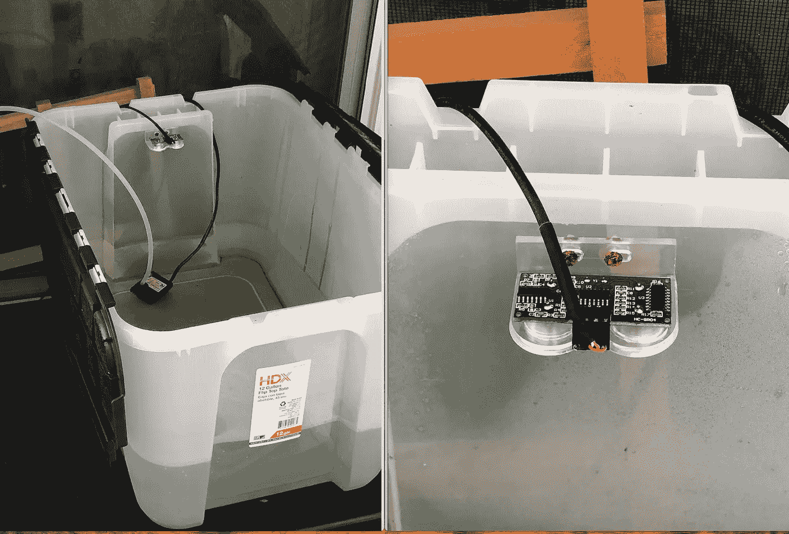
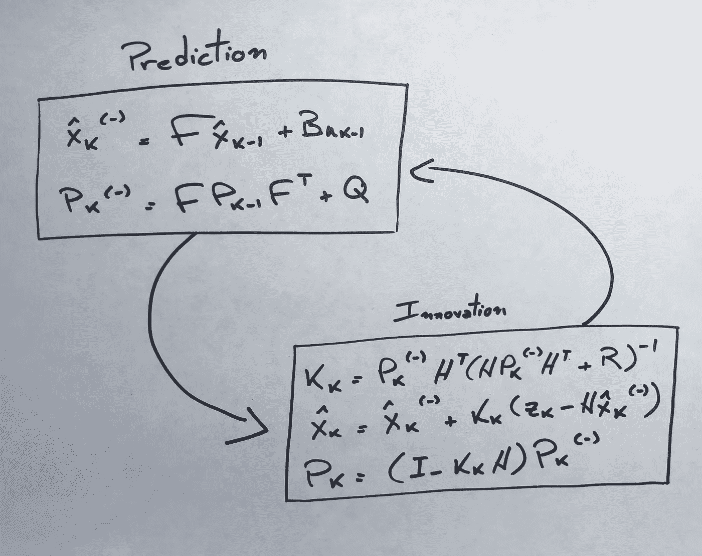
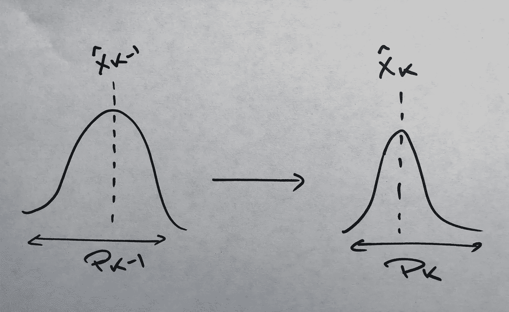
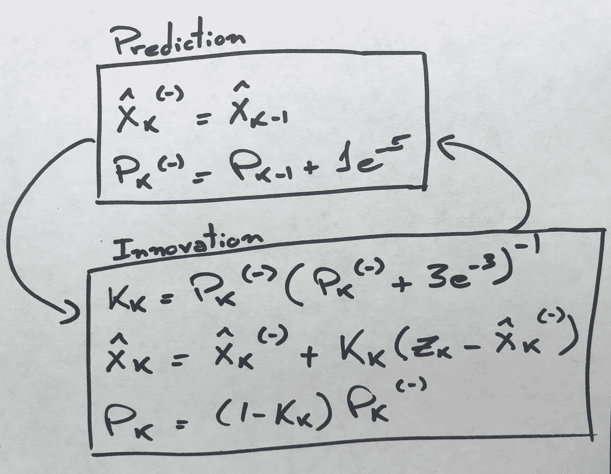
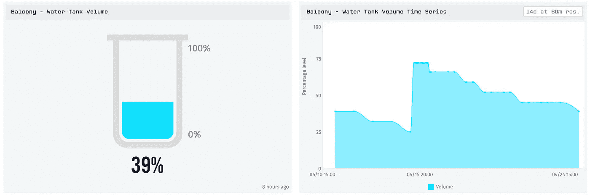

# 一种简单的卡尔曼滤波实现

> 原文：<https://towardsdatascience.com/a-simple-kalman-filter-implementation-e13f75987195?source=collection_archive---------15----------------------->

## 一个储罐液位测量应用程序，帮助你开发卡尔曼滤波器的直觉


泰勒·尼克斯在 [Unsplash](https://unsplash.com?utm_source=medium&utm_medium=referral) 上的照片

传感器本身并不能解决您的测量问题。它们本质上很吵，这可能会导致严重的问题。例如，当用作 PID 控制器的输入时，噪声数据可能会产生单位脉冲——高频信号的导数变得无穷大，导致执行器饱和，过程控制穿过窗口。

另一种需要准确性的情况是批量转移。在这种情况下，供应商希望尽可能精确地测量转移产品的体积，以防止损失金钱或向客户多收费。

在本文中，我们将演示一个简单的例子，说明如何开发一个卡尔曼滤波器来使用超声波传感器测量水箱的水位。

## 该传感器

HC-SR04 配有声学接收器和发射器。发射机发出一个波，这个波经过障碍物反射后到达接收机。传播时间除以两倍音速，得到传感器和感兴趣物体之间的距离。该传感器的工作范围为 2 至 400 厘米。



与许多传感器不同，这款传感器不需要模拟端口。通过微控制器的数字输出激活“Trig”引脚后，传感器将发出一个声波，该声波将反射并返回传感器，到达接收器，“Echo”引脚将变为高电平。“Trig”和“Echo”激活之间的时间除以 2 就是波传播时间。

## 该设置

我在公寓的阳台上养了一些植物，为此我在上面放了一个带水泵的水箱，定期给它们浇水。每次这个油箱低于 30%时，我都会收到系统的电子邮件通知。如果你有兴趣了解如何实现物联网，你可以看看我写的另一篇文章:

[](https://medium.com/@cunhafh/iot-home-irrigation-system-using-losant-and-particle-photon-130df98ce386) [## 使用氯生和粒子光子的物联网家庭灌溉系统

### 自动给植物浇水，获取警报，并分析数据

medium.com](https://medium.com/@cunhafh/iot-home-irrigation-system-using-losant-and-particle-photon-130df98ce386) 

我知道，我需要清理这个水箱。

## 卡尔曼滤波器

该算法分为预测和更新两个阶段。



不要让代数符号吓倒你，让我们分解这些方程。

在预测期间，系统通过执行过去的估计和系统输入的线性组合来估计储罐的容积。在我们的例子中，矩阵 F 将近似等于 1(为了简单起见，我们可以忽略蒸发的影响)，因此在给定时刻罐的体积将是过去时刻的体积减去由泵抽吸的体积(我的系统输入)。

因为我每天只灌溉植物一次，而且我的数据是通过 wi-fi 传输的，所以我想最小化负载。因此，我们可以忽略系统输入' *u* '的影响。但是请注意，这是有代价的，滤波器的动态响应将受到影响。

预测的第二步是估计协方差 Pk。我们不知道储罐液位的真实值，我们能做的最好的事情是估计最可能的值，并将其分配给最可能的方差。



在创新步骤中，我们将添加更多的信息，并尝试改进这一估计。让我们来看看:

首先，我们需要计算增益 k，现在忽略计算的数学过程，我们将简化它。

一旦计算出 K，我们就可以计算出'*后验*'状态估计。注意，该量对应于预测状态和‘T4’新息的线性组合，新息由增益和误差的乘积定义。

最后，我们需要更新协方差 p。

> 算法将总是从产生较小 p 值的组件(预测或创新)获得更多贡献。

因此，对于我们的状态观测器，我们将有:

f =[1]
B =[0]
H =[1]
Q =[1e-5]
R =[3e-3]

所以我们可以把方程改写成:



## 密码

有大量的 C++卡尔曼滤波器库可供您使用。我仍然认为编写自己的代码来巩固知识是有用的。在我的例子中，我在本地声明了所有的变量，这样它们就可以被函数访问，但是还有更好的方法。

```
int kalman_filter(){
    //prediction
    x_hat_k_a_priori = x_hat_k_minus_1;
    P_k_a_priori = P_k_minus_1 + Q;

    //obtaining z_k: my tank height = 25.4, calculates %
    digitalWrite(trigger, LOW);
    delayMicroseconds(2);
    digitalWrite(trigger, HIGH);
    delayMicroseconds(10);
    digitalWrite(trigger, LOW);
    duration = pulseIn(echo, HIGH);
    z_k = (25.4-duration*0.017)/25.4; 

    //innovation 
    K_k = P_k_a_priori * (P_k_a_priori + R);
    x_hat_k = x_hat_k_a_priori + K_k * (z_k - x_hat_k_a_priori);
    P_k = (1 - K_k) * P_k_a_priori;

    return x_hat_k;
}
```

## 结果

下图显示了获得的结果。注意时间序列是平滑的。



储罐液位瞬时和历史测量值

体积的突然增加是由于油箱重新装满。由于泵的激活，出现了小的下降。

## 结论

实施并测试 KF 算法以从超声波传感器 HC-SR04 获取数据。测试结果表明，该算法能够显著降低噪声。

卡尔曼滤波器可用于多种应用，如传感器融合、不可及变量的状态估计甚至股票市场预测。

如果你喜欢这篇文章或者想分享你的想法，请不要犹豫，在下面留下你的评论。

谢谢！