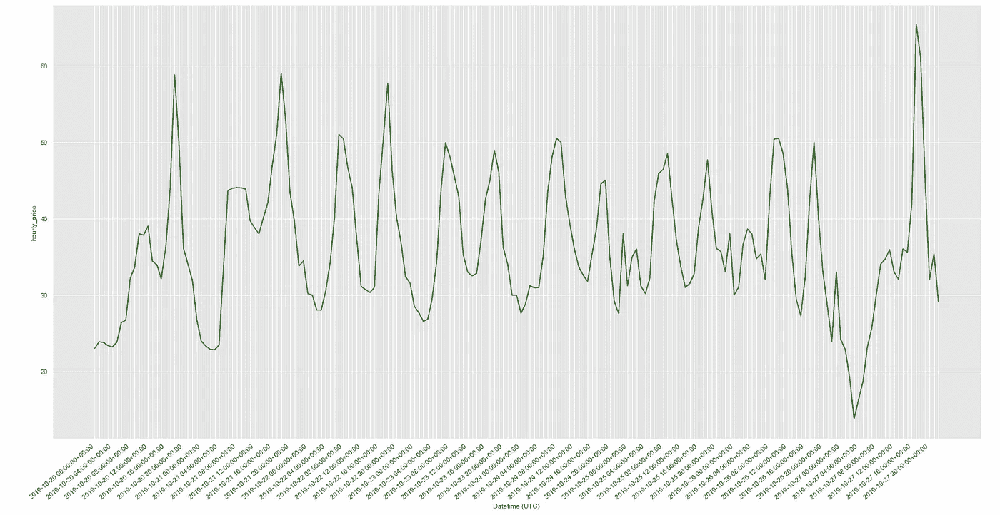
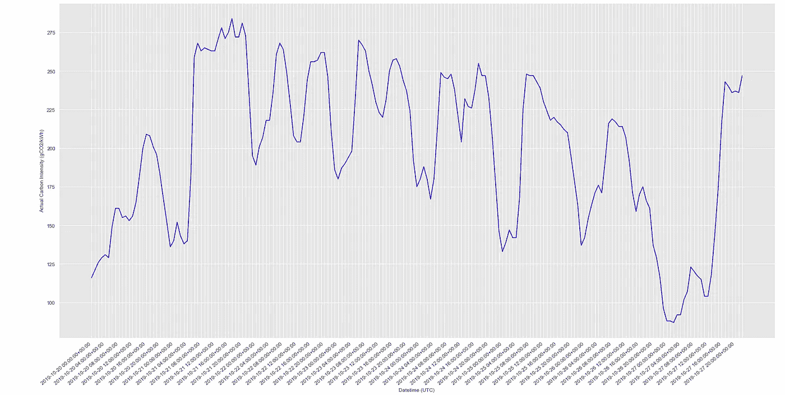
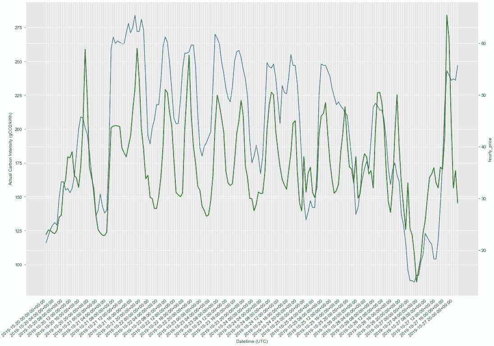
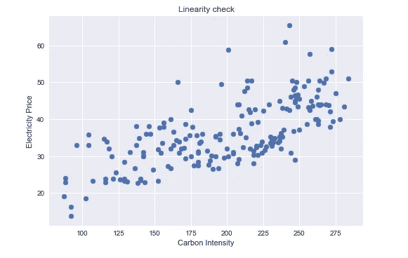
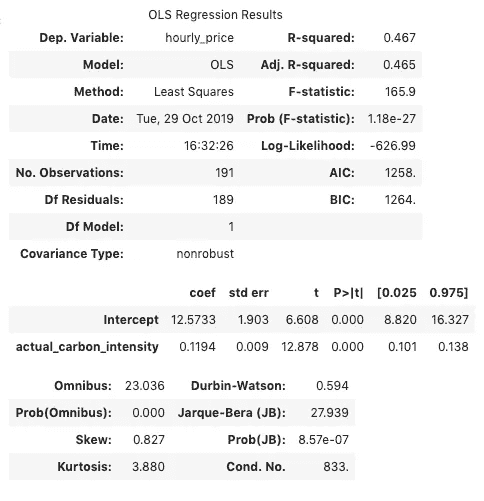
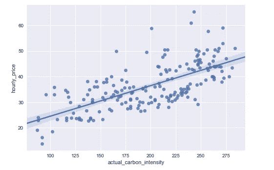
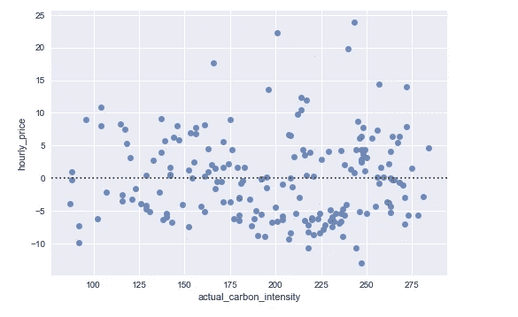
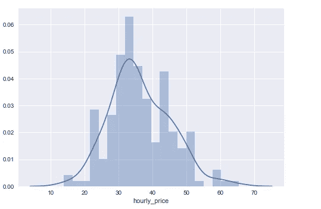
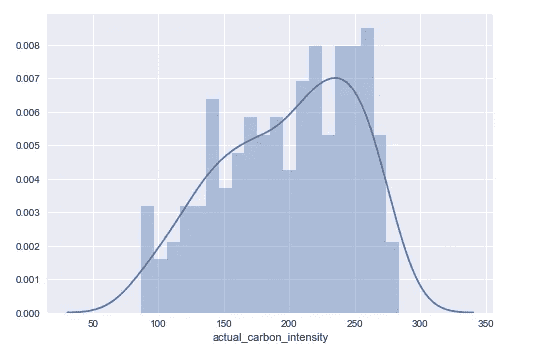

# 一个简单的线性回归模型

> 原文：<https://towardsdatascience.com/a-simple-linear-regression-model-f2a53ed61a21?source=collection_archive---------19----------------------->

## 探索电价与碳排放数据之间的关系

回归分析是一种强大的统计方法，能够在感兴趣的变量之间进行检查。它可以用来评估变量之间关系的强度，并对它们之间的未来关系进行建模。

经济学家痴迷于回归。这可能就是为什么它们是我大学生活中不可或缺的一部分。这种定量估计是理解经济理论最重要和最常用的工具之一。

在经济学中，相关性是常见的，但识别两个或更多变量之间的相关性是否是因果关系却很难做到。回归分析使我们能够预测变化的方向和距离，以及变量之间这种关系的重要性。

它也是统计学、数据科学和机器学习中最广为人知和理解的算法之一。它的简单意味着它是一个很好的起点，对于那些想进入这个领域的人来说。

我之前的工作让我参与了能源行业的一个科技初创企业，特别是电力行业。鉴于我的非能源背景，我有很多关于电力市场运作的东西要学。

我通过接触这个行业获得的一个信息片段——简单易懂，但不是每个人都知道——是电价和电网的碳排放强度是相关的。

这些变量构成了我的线性回归的基础。

# 查找数据

***碳强度***

任何数据科学项目的第一部分都是寻找数据。国家电网提供了一个交互式网站，并托管了一个易于使用的 API。我选择了一周的每小时碳强度数据来分析最近的电网排放。

它们还提供了对未来 48 小时的估计。他们这样做是为了尝试和鼓励公司根据他们的预测，使用他们的 API 来自动化 IOT 设备的电力消耗。想想用风力而不是煤炭发电机充电的电动汽车。

我只选择了 2019 年 10 月 20 日至 27 日的日期，来看看上周的情况。

【www.carbonintensity.org.uk】**)**

****电价****

*当我们以家庭为单位消耗电力时，我们被给予固定的小时费率，而不管一天中的什么时间。然而，公用事业对批发市场有一些敞口。为了最大限度地减少这种情况，大型企业确保绝大多数英国电力通过双边协议出售，远离公开市场，从而限制了它们的价格风险。*

*然而，因为电力不能大规模储存，所以供给必须始终等于需求。这意味着必须建立一些市场机制来确保平衡。其中之一，前一天市场，正如它听起来的那样——买家和卖家提前 24 小时出价。有各种更不稳定的短期市场机制，确保市场清算和平衡，但是 NordPool 集团的数据相对容易处理。*

*[(*www.nordpoolgroup.com*T3)](https://www.nordpoolgroup.com/)*

# *可视化*

**前一天市场上一周内每兆瓦时的价格。**

**

**电网平均碳强度(gC02/kWh)**

**

*上面的图表直观地展示了我们一天中不同的电力需求(和供应)的结果。总体情况是，价格和碳强度在早上上升，在上午 8 点达到峰值，白天下降，然后在晚上再次上升，在晚上 8 点达到峰值。这在碳强度和价格方面大体相似。*

*下面作图，可以更清楚的看到这种关系。*

**

*这些可视化可以证明是获得数据感觉的有用工具，但在变量之间的相互作用的统计分析中是有限的。*

*虽然看起来有某种相关性，但线性回归允许我们进一步研究这种关系。*

# ***假设***

*线性回归需要满足五个关键假设:*

*   *线性关系*
*   *多元正态性*
*   *没有或很少多重共线性*
*   *无自相关*
*   *同方差性*

**

# *普通最小二乘法*

*我导入并运行了 stats models——一个 python 库——来执行普通的最小二乘回归(OLS)。*

*OLS 发现 Y(电价)的平均变化是由 X(碳强度)的变化引起的。最小二乘法是指通过绘制最佳拟合线来找到这一平均变化。它采用实际数据和预测值(最佳拟合线)之间的距离，计算误差并对其求平方，以找到预测值的实际距离。如果模型可以改进，直线会移动到该点，直到它与所有数据点的距离尽可能小。*

**

*Statsmodels 使用它的 summary()超级功能提供了一个非常棒的模型摘要，这正是我选择使用它而不是其他也可以执行回归分析的库的原因*

*可视化可以再次帮助描绘模型。*

**

*该模型显示了变量之间的平均关系。如果我们知道哪些发电机目前正在运行，它们的碳强度和当前输出，我们将应该能够参考这条线并估计价格。然而，其准确性取决于通过各种统计测试来评估其显著性。*

*在这种情况下，由于其低 **durbin-watson** 结果，它不符合无自相关的假设。除此之外，它的 **Jarque-Bera** 比可接受的高得多，表明非正态分布。这可能会使我们的模型失效。*

*误差分布:*

**检查同质性**

**

*首先，当价格正态分布时:*

**

*碳强度不是:*

**

# ***结果讨论***

*因此，我们的模型在统计学上充其量是可疑的，但这并不意味着某种关系不存在。如果我有更多的时间，或者得到别人的帮助，这段关系肯定会很有趣。最重要的是，如此小的数据集不可能产生这些无关紧要的结果。*

*极度简化的高碳密度燃料和高价格是相互关联的，因为可再生能源发电不需要燃料，以及随之而来的所有成本:采购燃料、购买土地、钻探或挖掘燃料、提炼燃料、运输燃料、处理废物。*

*煤炭是效率最低的燃料来源，也是我们电网中最脏的，在转换成电力时会损失 70%的能量。另一方面，风能最终成为最有效的能源，产生的电能比它所消耗的能量多 1126%。*

**(*[*https://blogs . wsj . com/numbers/what-is-the-most-efficient-source-of-electricity-1754/？ns = prod/accounts-wsj*](https://blogs.wsj.com/numbers/what-is-the-most-efficient-source-of-electricity-1754/?ns=prod/accounts-wsj)*)**

# *继续进一步建模*

*为了进一步分析电价指标，我们可以使用各种方法来强化我们的模型:*

***包含更多数据:***

*这可能包括更长时间内的数据，或来自其他国家的数据——前提是我们还可以访问或计算电网的碳强度。(这通常很难计算)*

***包含更多变量:***

*包括其他变量，如全球油价、天然气和煤炭价格，显然是帮助预测价格的有力竞争者。除此之外，我们还可以研究太阳能电池板成本和风力涡轮机成本，甚至探索局部天气数据的粒度，预测电力需求(大型体育赛事往往会产生有趣的结果——尽管橄榄球世界杯没有)。*

*使用线性回归作为分析电价的基础可以证明是能源转型的有用工具。如果我们想摆脱对化石燃料的依赖，将我们的能源需求转向可再生和低碳发电是至关重要的。*

*分析和预测是让我们实现这一目标的第一步，有像 Nest 这样的公司帮助控制大量房屋的能源消耗，以限制我们的碳足迹。*

*这一点尤其重要，因为我们的交通工具实现了电气化，电力消耗激增。如果所有这些额外的需求都由煤炭而不是风力来提供，那么关键的好处将会丧失。*