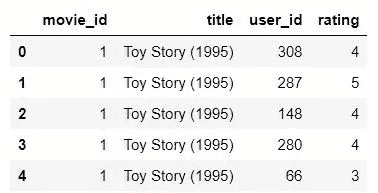
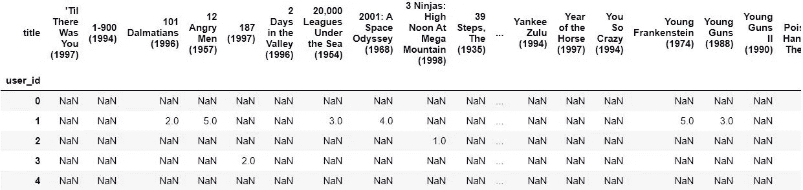
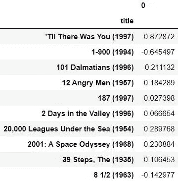
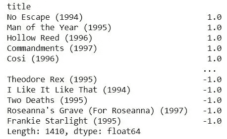
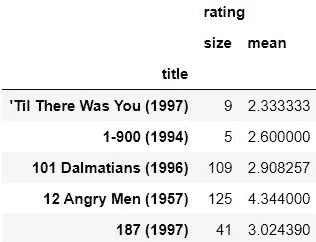
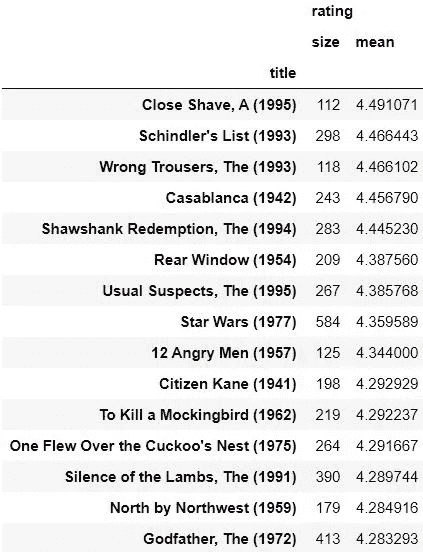
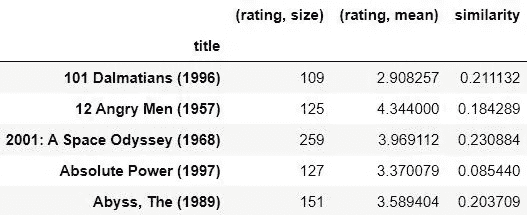
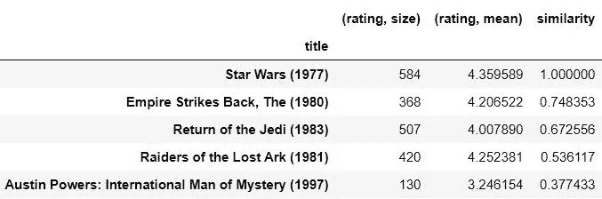

# 一个简单的电影推荐系统

> 原文：<https://towardsdatascience.com/a-simple-movie-recommendation-system-d135cfd0a22d?source=collection_archive---------18----------------------->

## 基于亚马逊基于商品的协同过滤

机器学习领域的推荐系统已经变得非常流行，对于网飞、亚马逊等科技巨头来说，这是一个巨大的优势，可以让他们的内容面向特定的受众。这些推荐引擎在预测方面非常强大，它们可以根据用户与应用程序的交互动态改变用户在页面上看到的内容的状态。


格伦·卡斯滕斯-彼得斯在 [Unsplash](https://unsplash.com?utm_source=medium&utm_medium=referral) 上拍摄的照片

# 基于项目的协同过滤

基于项目的协同过滤是由 Amazon 开发的一种方法，用于推荐系统中，主要基于数据集中各种项目之间的相似性向用户提供推荐。这些推荐是基于用户对该特定项目的评级来计算的。

# 一种电影推荐系统

我们将在这个项目中使用的数据集来自 [MovieLens](https://grouplens.org/datasets/movielens/100k/) 。

让我们从将数据集导入笔记本开始。有两个文件特别需要导入。因此，将用户的评级导入到 **r_cols** 数据帧中，将电影导入到 **m_cols** 数据帧中。我们还将把编码类型设置为 **utf-8** 。

```
import pandas as pdr_cols = ['user_id', 'movie_id', 'rating']
ratings = pd.read_csv('ml-100k/u.data', sep='\t', names=r_cols, usecols=range(3), encoding="ISO-8859-1")m_cols = ['movie_id', 'title']
movies = pd.read_csv('ml-100k/u.item', sep='|', names=m_cols, usecols=range(2), encoding="ISO-8859-1")
```

现在，我们必须合并这两个数据帧，以获得一个完整的数据帧，该数据帧包含任何给定电影的用户评级。

```
ratings = pd.merge(movies, ratings)
```

让我们看看这个数据帧是什么样子的，

```
ratings.head()
```



下一步是旋转这个表，创建一个用户和他们评价的电影的矩阵。这个表格是为了让我们了解哪个用户看过什么电影，以及他们提供了什么样的评级。

```
movieRatings = ratings.pivot_table(index=['user_id'],columns=['title'],values='rating')
movieRatings.head()
```



我们将对 1977 年的星球大战电影进行分析。所以，让我们把所有星球大战的这些值分配给一个叫做**星球大战等级**的数据框架。

```
starWarsRatings = movieRatings['Star Wars (1977)']
starWarsRatings.head()
```


我们将使用 pandas corr()函数来查找与星球大战相关的所有列之间的成对相关性。

```
similarMovies = movieRatings.corrwith(starWarsRatings) # pairwise correlation of Star Wars vector of user rating with every other movie
```

让我们放弃任何没有数据的结果，

```
similarMovies = similarMovies.dropna() # Drop any results that have no data
```

构建具有关于星球大战的每部电影的相关分数的新鲜的新数据帧。

```
df = pd.DataFrame(similarMovies) # Construct a new Dataframe of movies and their correlation score to Star Wars
```

让我们看看这个数据框里有什么，

```
df.head(10)
```



现在让我们根据分数对这些值进行排序，

```
similarMovies.sort_values(ascending=False)
```



是的，这些结果没有任何意义。

这是因为我们的结果被那些只被一小撮人评级的电影搞砸了，他们也给《星球大战》评级。让我们来看看这些条目。

```
import numpy as np
movieStats = ratings.groupby('title').agg({'rating': [np.size, np.mean]})
movieStats.head()
```



让我们去掉那些少于 100 人评价的条目。

```
popularMovies = movieStats['rating']['size'] >= 100 # Ignore movies rated by less than 100 people
movieStats[popularMovies].sort_values([('rating', 'mean')], ascending=False)[:15]
```



将这些数据与类似于《星球大战》的原始电影集结合起来。

```
df = movieStats[popularMovies].join(pd.DataFrame(similarMovies, columns=['similarity']))
```

现在让我们来看看我们的数据框。

```
df.head()
```



最后，根据相似性得分对这些值进行排序。

```
df.sort_values(['similarity'], ascending=False)[:5]
```



# 结果

瞧😆！你可以看到，我们刚刚获得的最终输出中的前三个条目都是星球大战电影。接下来的几部电影基于相似的类型，即动作和冒险。我们刚刚建立了一个令人惊叹的电影推荐系统，它能够建议用户观看与他们过去观看过的内容相关的电影。

你可以在我的 [GitHub](https://github.com/K-G-PRAJWAL/Machine-Learning-Projects/blob/master/Movie%20Recommendation/RecommenderSystem(MovieSimilarities).ipynb) 上找到完整的代码。如有任何疑问，请随时通过我的 [LinkedIn](https://www.linkedin.com/in/k-g-prajwal-a6b3b517a/) 联系我。

## 谢谢你。