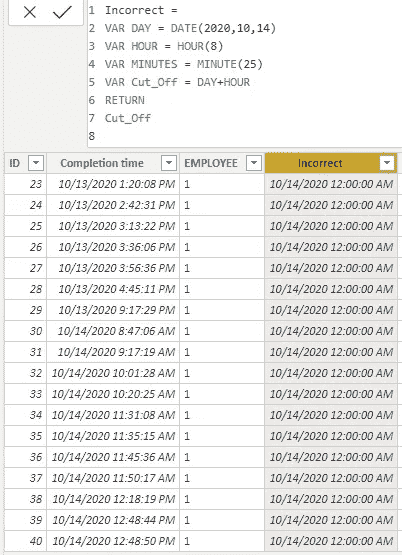
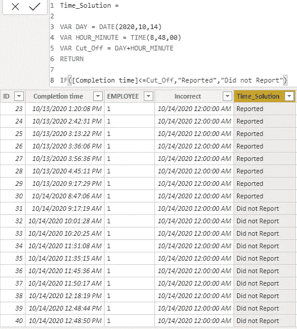

# 功率 BI 中的简单时间计算

> 原文：<https://towardsdatascience.com/a-simple-problem-98329b0e49f4?source=collection_archive---------48----------------------->

## …DAX 日期、小时和分钟。


Johannes Plenio 在 [Unsplash](https://unsplash.com?utm_source=medium&utm_medium=referral) 上拍摄的照片

我今天遇到了一个“简单”的问题。在我开始做之前，我觉得这很简单。见鬼，这太简单了，我甚至说我可以在 5 分钟内解决这个问题。有时候一个简单的问题对每个人来说可能都不简单。

5 分钟变成了一个小时，还需要大量的谷歌搜索。


作者图片

我真的不需要处理精确到分钟的时间分析，所以如果这听起来对你来说是一个简单的问题，那么你能够解决它就很好了。

背景:

我有一个调查的完成时间栏。它包括日期和时间，如下所示。


我只想做一个声明说，“所有在 10 月 14 日上午 8:48 之前回复的人”说“已报告”。

我尝试了下面的计算列。

```
Incorrect =VAR DAY = DATE(2020,10,14)VAR HOUR = HOUR(8)VAR MINUTES = MINUTE(48)VAR Cut_Off = DAY+HOUR+MINUTERETURNCut_Off
```

好像不管用。



作者图片

至少对我来说是合理的。Power BI 将日、小时和分钟相加，并将其与[完成时间]列进行比较。

它并不完全有效。权力毕没有拿起我的意思是小时和分钟。我想要的不是 12 点。现在是早上 8 点 48 分。

然后我意识到可能是因为时间的原因，也可能不是日期时间数据类型，所以我把它改成了下面的。

```
Time_Solution =VAR DAY = DATE(2020,10,14)VAR HOUR_MINUTE = TIME(8,48,00)VAR Cut_Off = DAY+HOUR_MINUTERETURNCut_Off
```

成功了:)。现在，我刚刚添加了 If 语句，它非常有效。



作者图片

然后我泡了一杯咖啡，意识到了一些事情。

有一个索引栏可以帮我。我知道当有更多的回答者时，这个索引栏会自动填充。它总是以 1 为增量增加。随着调查结果的出现，数字会变得更高，所以我会做相应的调整。

现在我有两个解决方案:

1)将 ID 用作比较器— Id_Solution

2)使用时间作为比较器—时间解决方案

我的表现在看起来像这样。

```
Id_Solution = IF([ID]<=30,"Reported","Did not Report")
```


作者图片

我甚至不需要时间去做我想做的事情。我想用最短的代码来代替 Id 解决方案。

问题是很难有人知道为什么我用 30 这个数字作为比较。

因为还有其他人在使用这个文件，所以我只能选择最容易解释的。也就是时间解。

这种情况让我想起了一句名言。

> "的确，通过帮助他人成功，你可以最快最好地获得成功。"拿破仑·希尔。

一个问题有很多解决方案，但是有时候对你来说最明显的一个可能对所有人来说都不是最明显的。

最好实施一个每个人都理解的解决方案，而不仅仅是你。如果团队中的每个人都理解你的解决方案，这对每个人都是一个胜利。

## 带走:

*   可以使用 TIME()函数添加日、小时、分钟、秒钟。不需要单独的列。
*   索引列可能比您想象的更有用。
*   想想你的队友。他们会理解你的措施在做什么吗？容易解释吗？[车型](/power-bi-modelling-bcd4431f49f9?source=friends_link&sk=1f054aeeeb14c96238fd6e4f8e192ee2)怎么样？
*   帮助你的队友成功，你也会成功

如果你想知道如何在 Power BI 中使用日期和日历，这里有一篇[文章给你](/dates-in-power-bi-ada30f85e4b3?source=friends_link&sk=190b88af071a4b3700462eaa33aeb4bf)。

保重，注意安全！