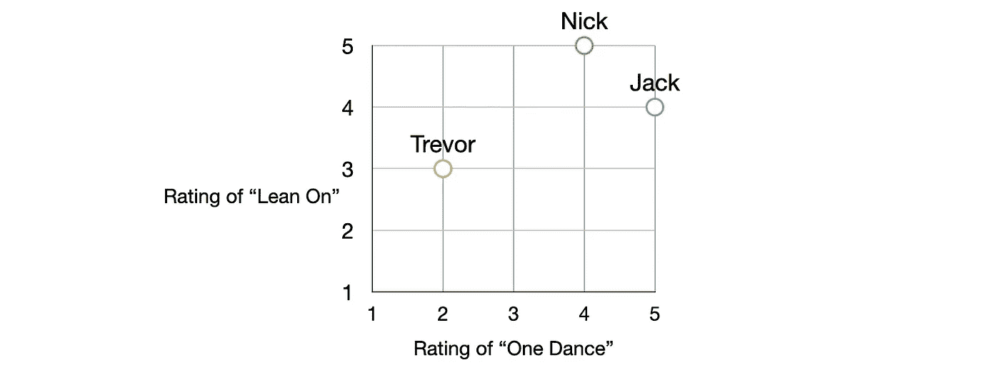
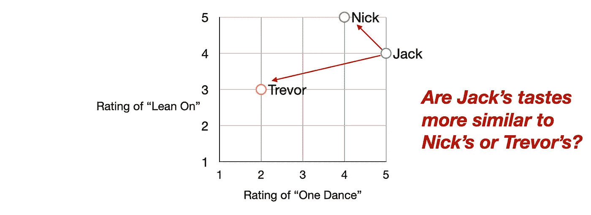
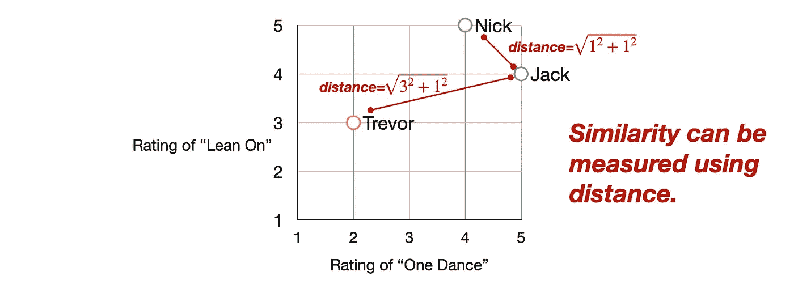
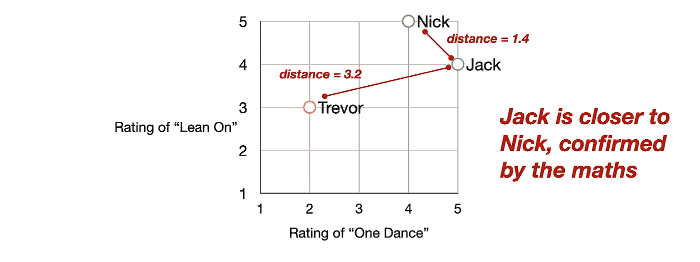

# 一个简单的 Python 歌曲推荐系统(教程)

> 原文：<https://towardsdatascience.com/a-simple-song-recommender-system-in-python-tutorial-3e4c111198d6?source=collection_archive---------31----------------------->

## 协同过滤和推荐系统的基础，以及为什么脸书和谷歌似乎知道你在说什么，即使他们不记录你的谈话。

本材料基于我在 2020 年 4 月教授的一个研讨会的内容。


DJ R3X 在 Oga 的酒吧策划歌曲。[图片来源](https://www.billboard.com/articles/news/8528161/disneys-star-wars-galaxys-edge-cantina-music-album-playlist-one) : [约书亚·苏多克](https://disneyparks.disney.go.com/blog/author/joshua-sudock/)(迪斯尼公园)

我们大多数人现在每天都在使用基于人工智能的推荐系统:在网飞上寻找一个节目，在社交媒体上滚动，在 YouTube 上观看“up next”视频，在 Spotify 上收听“Discover Weekly”播放列表。

那么这些推荐器是如何工作的呢？

他们变得非常好，在某些情况下，好得令人毛骨悚然。我们中的许多人都收到了一些推荐和广告，这让我们不禁要问:“*他们在给我录音吗？*“一般来说，公司不会通过窃听你的麦克风，录下你的对话来做推荐。相反，他们会给你做一个模型，或者像特里斯坦·哈里斯所说的那样，“一个小小的巫毒娃娃，你的化身版本”，然后对那个娃娃做出预测。我会把这个娃娃称为你品味的数学模型。

本教程中的方法远没有谷歌、脸书和 Spotify 使用的方法复杂，它们不会产生任何令人毛骨悚然的好推荐。尽管如此，大多数建议的工作原理都是一样的，分为三个步骤:

1.  公司为你和其他人建立了一个数学模型
2.  他们利用这些模型来寻找和你相似的人
3.  他们发现那些相似的人喜欢什么，并推荐给你

我将重复这三个步骤两次，首先是一个简单的可视化示例，然后是一个更大的基于代码的示例。

# 第 1 部分:视觉介绍

## 为你的品味建立一个数学模型

让我们首先考虑三个人(杰克、尼克和特雷弗)以及他们如何在 1 到 5 的范围内给三首歌曲(一支舞、向前一步和向日葵)评分。这是一个简单的表格:

我们现在有了一个简单的音乐品味的数学模型。在现实世界中，Spotify 使用其他信号来确定这个评级，比如你听了一首歌多少次。不管怎样，原则是*把你的喜好转化成一串数字，*其中也被称为向量、矩阵或数组。不管你怎么称呼它们，把这些数字形象化在图表上是很有帮助的。下面，我们将“一支舞”的评分放在 x 轴上，将“倚在”的评分放在 y 轴上:



## 使用该模型寻找相似的人

我们现在有了一个记录你音乐品味的数字列表，所以我们可以进入下一步:找到有相似品味的人。让我们回到图表:



在视觉表征中，相似的人只是附近的人。因此，找出谁与杰克“最相似”只是找出谁与杰克最接近的问题。我们可以用中学几何中古老的毕达哥拉斯定理来测量这个距离:



酷！我们快到了。我们已经可以看出，杰克最像尼克，而不是特雷弗，但让我们把它正式化:



数学证实:在歌曲品味的小宇宙中，杰克离特雷弗有 3.2 个单位的距离，但离尼克只有 1.4 个单位。

## 推荐相似的人喜欢的东西

现在我们知道杰克和尼克有相似的品味，我们可以根据尼克是否喜欢向日葵来预测杰克是否会喜欢《向日葵》。只需要在表中查找:

尼克给了“向日葵”5/5 的评分，所以我们可以预测杰克可能也会喜欢这首歌。

显然，这个微小宇宙的规模比 Spotify 的宇宙要小很多。我们看了三首歌和三个人，而 Spotify [据称拥有超过 5000 万首歌曲和超过 2.71 亿活跃用户](https://newsroom.spotify.com/company-info/)。所以现在，我们要扩大规模。

# 第 2 部分:用 Python 编写示例代码

## 为你的品味建立一个数学模型

为了生成更大的数据集，我们将加载一个更大的表。[这里的](https://gist.github.com/jackbandy/5cd988ab5c3d95b79219364dce7ee5ae)是一个有 25 首歌和 8 个人的:

在 Python 中，您可以使用 Pandas 通过以下命令加载这些数据:

```
from pandas import read_csvdata_url = 'https://gist.githubusercontent.com/jackbandy/5cd988ab5c3d95b79219364dce7ee5ae/raw/731ecdbecc7b33030f23cd919e6067dfbaf42feb/song-ratings.csv'ratings = read_csv(data_url,index_col=0)
```

## 使用该模型寻找相似的人

现在，让我们试着预测一下我(还是杰克)会不会喜欢《7 响》这首歌。就像在视觉示例中一样，我们会找到离我最近的人。使用勾股定理，二维空间中的距离函数就是`distance=sqrt(a^2 + b^2)`，我们可以这样写:

```
def distance(person1,person2):
  a_squared = (person1[0] - person2[0])**2
  b_squared = (person1[1] - person2[1])**2
  c = sqrt(a_squared+b_squared)
  return c
```

但这一次，有 25 个维度，而不仅仅是 2 个。当我们有 25 个维度而不是只有一个 x 轴和一个 y 轴时，我们如何找到最接近的人？

事实证明，可信的毕达哥拉斯定理非常普遍。(大多数推荐器使用其他距离度量，如余弦距离，但在本教程中我们将忽略它)。如果有三个维度，我们可以称之为`a`、`b`、`c`，然后在平方根下面加上:`distance=sqrt(a^2 + b^2 + c^2)`就可以了。实际上我们可以在任何维度上这样做:`distance=sqrt(a^2 + b^2 + c^2 + d^2 + ... + n^2)`。

scipy 库编写了一个函数来完成我们需要的功能:计算任意维数的欧几里德距离。让我们使用它:

```
from scipy.spatial.distance import euclideandef distance(person1,person2):
  distance = euclidean(person1,person2)
  return distance
```

现在，我们可以使用距离函数来查看任何两个人之间的相似性。唯一的问题是我们需要使用`fillna`用“0”填充空白。下面的块执行该操作，然后检索这三个人的数据行:

```
ratings=ratings.fillna(0)jack=ratings.loc['Jack']
nick=ratings.loc['Nick']
trevor=ratings.loc['Trevor']
```

然后，我们可以看看杰克和另外两个人之间的距离:

```
print("Distance between Jack and Nick:")
print(distance(jack,nick))
# 10.63014581273465print("Distance between Jack and Trevor:")
print(distance(jack,trevor))
# 13.490737563232042
```

就像在《小宇宙》中，杰克离尼克(10.63 个单位远)比离特雷弗(13.49 个单位远)更近。但实际上，我们想看看杰克和其他人之间的距离。下面是一个使用“for 循环”来实现这一目的的函数:

```
def most_similar_to(name):
  person = ratings.loc[name]
  closest_distance=float('inf')
  closest_person='' for other_person in ratings.itertuples():
    if other_person.Index==name:
      # don't compare a person to themself
      continue distance_to_other_person = distance(person,ratings.loc[other_person.Index]) if distance_to_other_person < best_similarity:
      # new high score! save it
      closest_distance = distance_to_other_person
      closest_person = other_person.Index return closest_person
```

开头是这样说的:“到目前为止最亲近的人，在无限远的地方。”然后，它循环查看每个人，并询问“这个人比目前为止最亲近的人更亲近吗？”回答“和 Jack 最相似的人是 Jack”并没有太大帮助，这也是为什么名字相同的话循环会跳过(即`continue`)。

现在，我们可以只调用`most_similar_to`来查看谁与任何人最接近。让我试试(杰克):

```
print("Jack is most similar to:")
person_most_similar_to_jack = most_similar_to('Jack')
print(person_most_similar_to_jack)
print(distance)# Meg
# 8.660254037844387
```

## 推荐相似的人喜欢的东西

最后，我们可以通过看和我最相似的用户来预测我是否会喜欢“7 环”。当时资料上说这是梅格，那我们来看看梅格是怎么评价这首歌的:

```
print(ratings.at['Meg', '7 Rings (Ariana Grande)'])
# 3.0
```

梅格对这首歌的评价是 3/5，所以我可能不会对它太着迷。

*一个 Google Colab 笔记本全部代码都有* [*这里*](https://colab.research.google.com/drive/1HdMr5uPnCstdpfObJkxAZxDYOcspYP2i) *。*

# 后续步骤

如果你真的想做 Spotify 正在做的事情，你会利用每个 T21 人的音乐品味做出预测，而不仅仅是最亲近的人。例如，也许如果我知道特雷弗和我一直有非常不同的品味，认识到特雷弗喜欢《7 环》可能会告诉我，我会不喜欢这首歌。我可能会在未来的教程中涉及到这一点，所以如果您感兴趣，请告诉我！