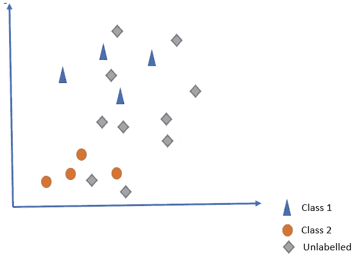
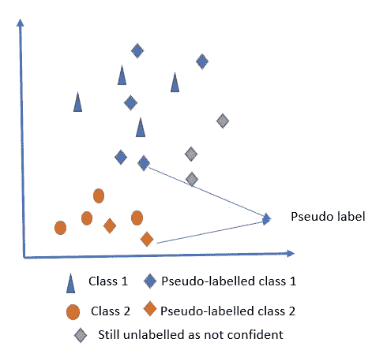
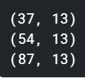
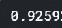
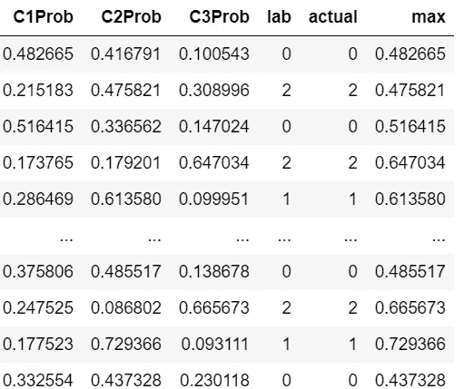
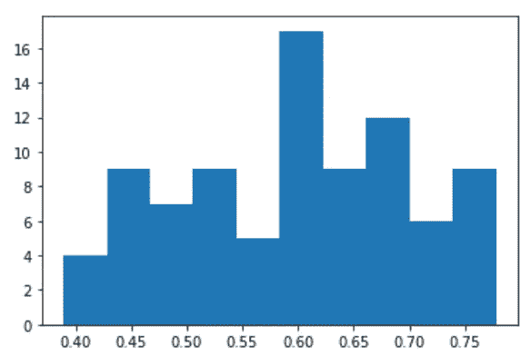
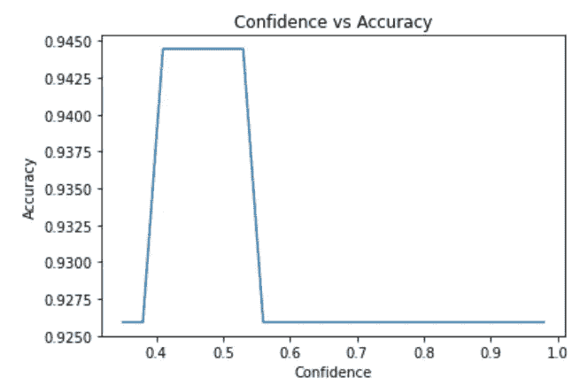

# 一个简单的基于 SVM 的半监督学习实现

> 原文：<https://towardsdatascience.com/a-simple-svm-based-implementation-of-semi-supervised-learning-f44eafb0a970?source=collection_archive---------30----------------------->

## 扫清半监督学习的迷雾


来源:-[https://unsplash.com/photos/GhFn3mddePk](https://unsplash.com/photos/GhFn3mddePk)

我们都遇到过作为一种机器学习问题的半监督学习。但这是一个没有被很好理解的概念。最好通过弄脏我们的手来理解这一点，而这正是我们正在带来的。

用例很简单，我们有一些数据，可能有 100 个观察值，其中 30 个是有标签的(有监督的)，其余的是无标签的(无监督的)，我们正在解决一个分类问题。我想大家都会同意，如果我们可以使用所有 100 个观察值，那么通过对 30 个案例或观察值进行训练所能达到的性能会更低，不幸的是，其中 70 个没有标记。



图 1:无监督学习场景(来源:作者)

本质上这是一个二元分类问题。这两个类别由蓝色三角形和红色圆圈表示。灰色菱形表示未标记的数据。

我们的第一个策略是

步骤 1:在标记的数据上建立一个分类器(常规的东西)

第二步:用这个来预测未标记的数据。**然而，除了预测，你还要检查你的信心水平。**

第三步:将这些观察结果添加到你有一定把握的训练数据中。这些被称为**伪标记**与标记数据相对照。

步骤 4:使用这个**扩充数据集**，现在用于训练，并使用这个模型。

由于我们使用非监督数据来增加监督学习的训练数据，这介于两者之间，因此称为半监督。



图 2:扩展数据集

在上图中，说明了训练数据的扩展。对于我们有信心的观察结果，我们使用了伪标签，而对于我们没有信心的观察结果，我们仍然保持不加标签。

让我们现在跳到代码

我们正在创建一个虚拟场景，其中我们将数据集(wine)分为 train(已标记)、unl(未标记)和 test。

```
X_train, X_test, y_train, y_test = train_test_split(
    X, y, test_size=0.3, random_state=1)
X_train, X_unl, y_train, y_unl = train_test_split(
    X_train, y_train, test_size=0.7, random_state=1)
```

这里分别是训练、测试和未标记的形状。请注意，我们不会考虑 unl 部分的标签信息，因此将其视为未标记



数据集的形状(图片来源:作者)

接下来，我们简单地在标记的部分进行训练，它刚刚走了 19 行。

```
clf = svm.SVC(kernel='linear', probability=True,C=1).fit(X_train, y_train)
clf.score(X_test, y_test)
```

获得的精度如下



初始分类准确性(来源:作者)

接下来，我们对未标记的数据进行预测

```
df = pd.DataFrame(clp, columns = ['C1Prob', 'C2Prob','C3Prob']) 
df['lab']=lab
df['actual']=y_unl
df['max']=df[["C1Prob", "C2Prob","C3Prob"]].max(axis=1)
```

你可能已经注意到了，我们使用了预测概率，它预测了类别概率，而不是标签，这实际上会帮助我们找到有把握的猜测



对预测的信心(来源:作者)

我们只看预测概率之间的绝对差异

*   当这三个类别的概率相等时，则所有类别的概率大约为 0.33
*   任何大于这个值的值都显示出一定的可信度

本质上，我们希望在训练中添加这些概率差异较大的观察值。代码如下

下图给出了置信度的分布，以最有可能的类别的概率表示。



对预测的信心(图片来源:作者)

接下来，我们运行一个循环，对于最可能类的不同阈值，将数据添加到观察值中。



不同阈值下的准确性(来源:-作者)

*   当最可能的类的概率大于 0.4 且高达 0.55 时，情况会有所改善
*   在那之后，几乎没有任何改善，因为在那些我们超级自信的人身上，这并没有增加知识，因为观察结果与标记非常相似。

**尾注:**

在本教程中，我们已经展示了如何使用 SVM 来采用简单的半监督策略。这种技术可以很容易地扩展到其他分类器。影响将取决于类的重叠或区分程度、要素的信息量等等。

参考资料:

[1][https://www . ka ggle . com/saptarsi/a-simple-semi-supervised-strategy-based-on-SVM](https://www.kaggle.com/saptarsi/a-simple-semi-supervised-strategy-based-on-svm)

[2][https://towards data science . com/supervised-learning-but-a-lot-better-semi-supervised-learning-a 42 dff 534781](/supervised-learning-but-a-lot-better-semi-supervised-learning-a42dff534781)