# 一种在不同服务器之间自动化和安排 SQL Server 数据库复制的简单方法

> 原文：<https://towardsdatascience.com/a-simple-way-of-automating-and-scheduling-sql-server-database-replication-between-different-servers-fa53fe22b856?source=collection_archive---------13----------------------->

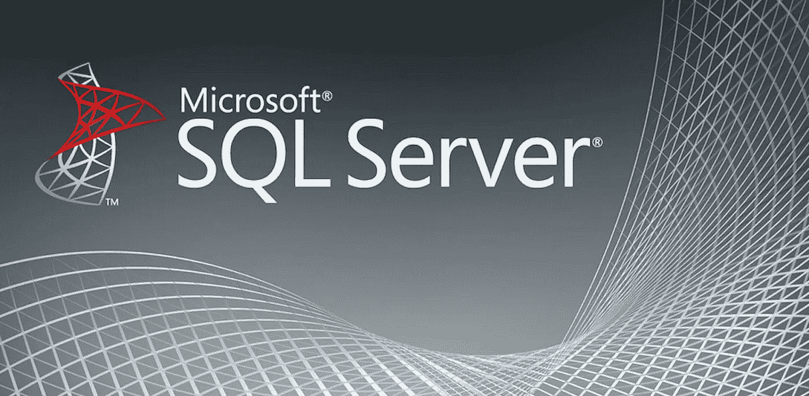

图片提供:[https://www . spiria . com/site/assets/files/2398/2016-SQL-server-logo。-large.jpg](https://www.spiria.com/site/assets/files/2398/2016-sql-server-logo.-large.jpg)

微软 SQL Server 提供了`SQL Server Replication`功能，我们可以利用这些功能将一个数据库设置为`Publisher`和另一个数据库为`Subscriber`，这样我们就可以在脚本中通过定制来复制数据库。但是，有时需求可能没有那么复杂，因此 SQL Server 复制可能有点过头了。

例如，最近我的一个客户想要启动一个概念验证项目来构建一个数据仓库。他们担心他们赖以保持业务运行的生产数据库。因此，在我们从数据库中提取数据来构建数据仓库之前，我们需要复制数据库，以便所有的开发工作都可以在这些副本上进行。

在这种情况下，没有必要在复制过程中包括任何定制，这只是简单地镜像数据库。在本文中，我将介绍一种在不同服务器之间自动复制 SQL Server 数据库的非常简单的方法。

# 在 Azure 中创建 SQL 服务器

让我们首先为这个实验创建两个 SQL 服务器。强烈建议使用 Azure，否则，您需要准备两台不同的机器，获得适当的 SQL Server 许可证并安装 SQL Server 软件，这可能需要一整天的时间。

如果你是 Azure 的新用户，当你注册 Azure 为新用户时，你将获得 200 美元的积分(一个月内)。

转到您的 Azure 订阅，首先创建一个资源组，这将是 SQL 服务器的容器。然后，去 marketplace 搜索“sql server”，如截图所示选择 Windows Server 2016 上的 SQL Server 2017。

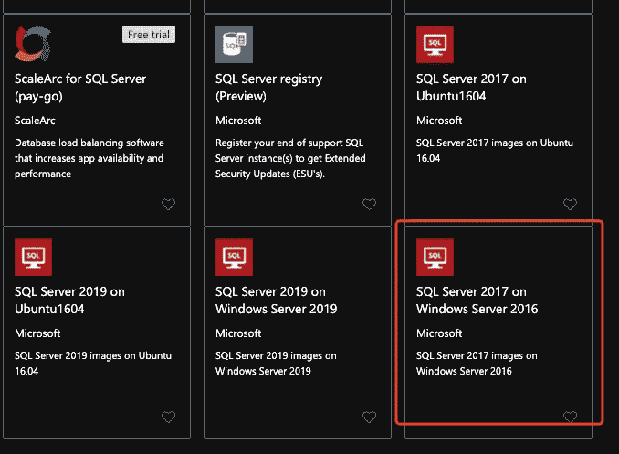

在下拉手册中，选择标准版以拥有所有标准功能。然后，单击“从预设配置开始”以节省时间。

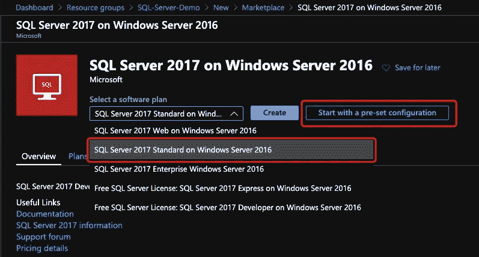

在这里，我们可以选择开发/测试环境和 D 系列虚拟机(都是最小的)来节省成本，特别是如果您已经用完了所有的免费积分。然后，单击“创建虚拟机”

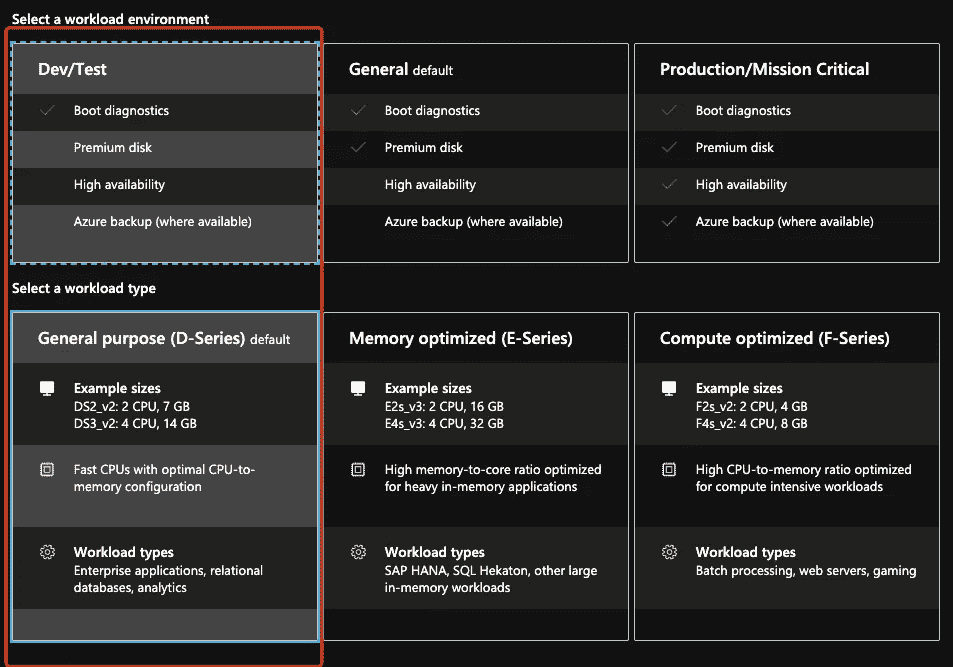

确保您选择了为此创建的资源组。然后，单击下一步。

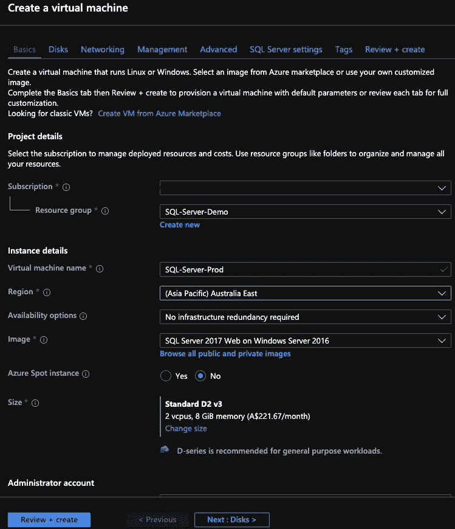

填写管理员凭据。


磁盘对这个实验不重要，所以我们可以跳过。然而，虚拟网络非常重要。确保您创建了一个新的虚拟网络和子网，更重要的是，如果您不想在这个实验中产生一些可访问性问题，那么稍后创建的另一个 SQL Server 必须在同一个虚拟网络和子网中。另外，为了方便起见，打开 RDP 端口 3389。

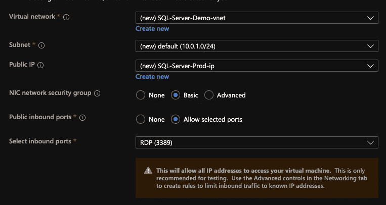

不要更改默认端口号并创建 SQL 身份验证。之后，我们已经完成了配置。点击创建按钮在 Azure 中创建资源。

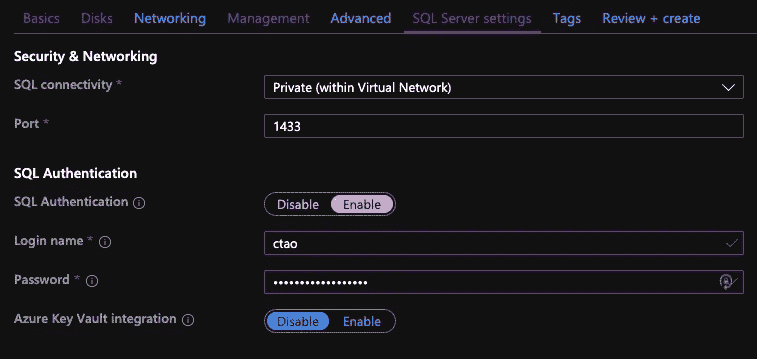

在等待部署资源的同时，我们可以创建另一个 SQL Server。我就叫它`SQL-Server-Test`。

# 准备“生产”SQL Server

在部署了第一个 SQL Server 之后，转到资源组并找到用于`SQL-Server-Prod`的 Windows VM。因为我们已经为该机器打开了 RDP 端口，所以我们可以使用它的公共 IP 地址来远程控制该虚拟机。

请记录私有 IP 地址，稍后测试机器将使用该地址连接到该产品机器

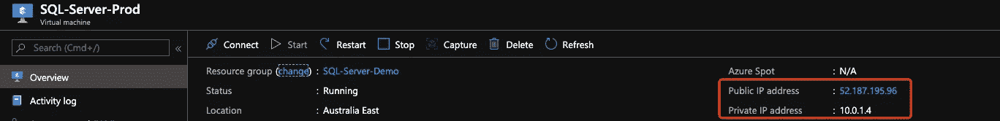

## 下载一个示例数据库

让我们安装一个来自微软的示例数据库。在生产机器上，下载数据库备份:[https://github . com/Microsoft/SQL-server-samples/releases/download/adventureworks/adventureworks 2017 . bak](https://github.com/Microsoft/sql-server-samples/releases/download/adventureworks/AdventureWorks2017.bak)

在 SSMS，使用默认的 Windows 管理员帐户登录数据库实例。

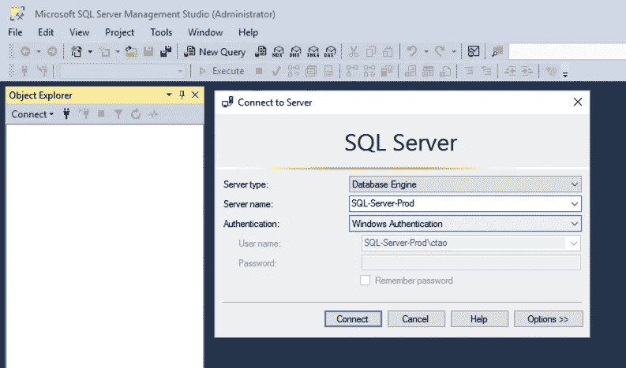

## 恢复示例数据库

右键单击“数据库”并选择“恢复数据库”。

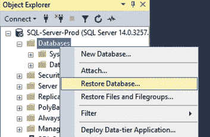

在弹出窗口中，单击“设备”单选按钮右侧的浏览按钮->添加->浏览您刚刚下载的 bak 文件->确定->确定->确定。恢复整个数据库可能需要大约 1 分钟。

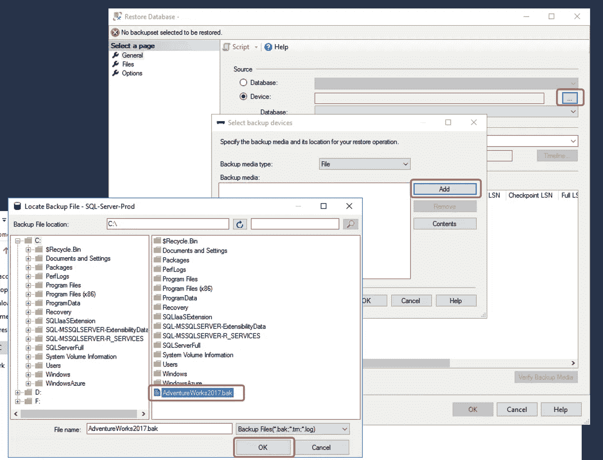

## 准备备份路径

接下来，我们需要创建一个文件夹来存放备份文件。此外，我们需要在网络中共享这个文件夹，以便测试机器可以访问备份文件并恢复它。

我创建了目录`C:\backup\`。然后，将该文件夹共享到另一台机器上的同一个管理员帐户。

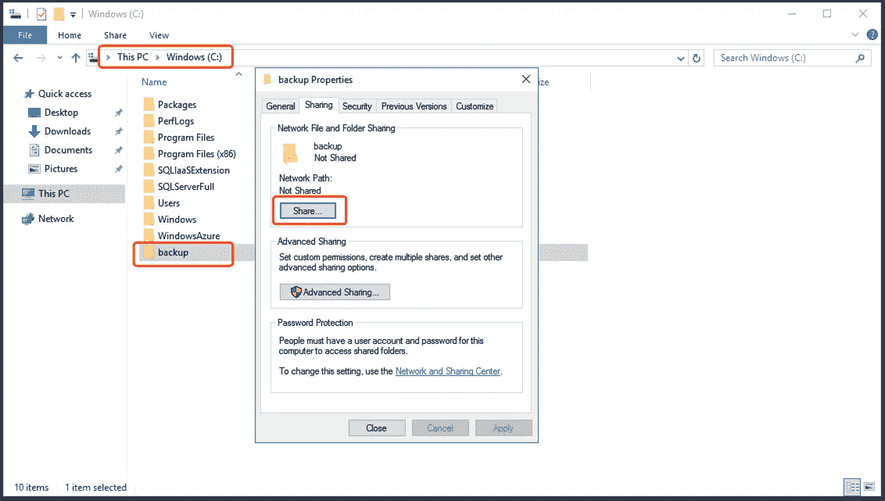

请注意，将`MSSQLSERVER`用户添加到共享中很重要。否则，共享后 SQL Server 可能无法将备份文件写入此文件夹。只需输入`MSSQLSERVER`用户名并点击添加按钮，然后确保授予它读/写权限。

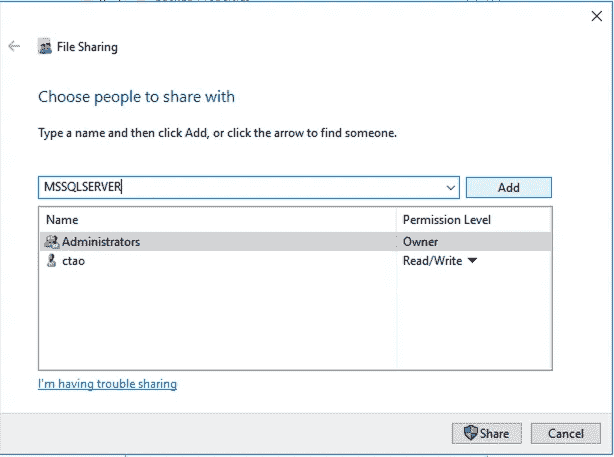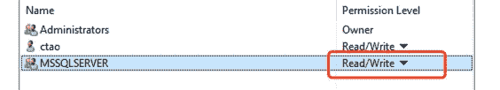

在测试机器上，我们现在将能够访问`backup`目录。

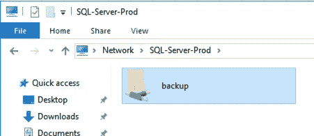

# 在 SQL-Server-Production 上创建备份

因为 SQL Server 代理在默认情况下是禁用的，所以我们需要再次远程控制生产机器来启用它。右键点击`SQL-Server-Agent` - >开始。然后，在弹出的确认窗口中点击`Yes`。

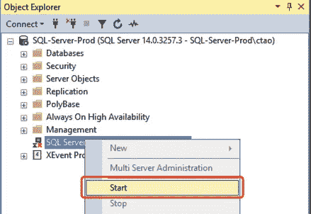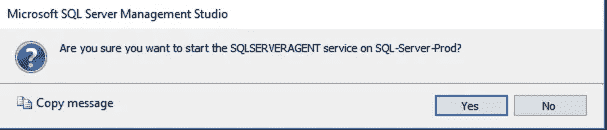

等到 SQL Server 代理启动后，返回测试计算机。您需要重新连接生产 SQL Server 才能看到 SQL 代理的启用。

右键`Jobs`->-`New Job...`。

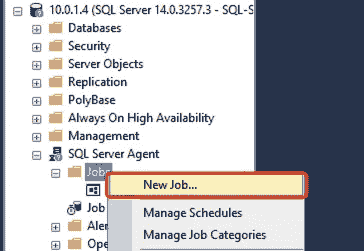

在`New Job`窗口中，输入名称并转到`Steps`选项卡。

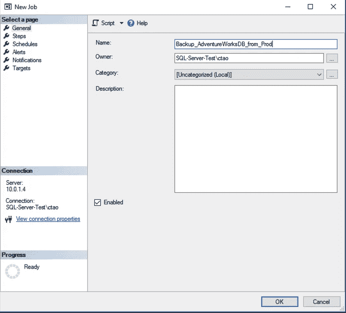

在`Steps`页签中，点击`New`按钮。

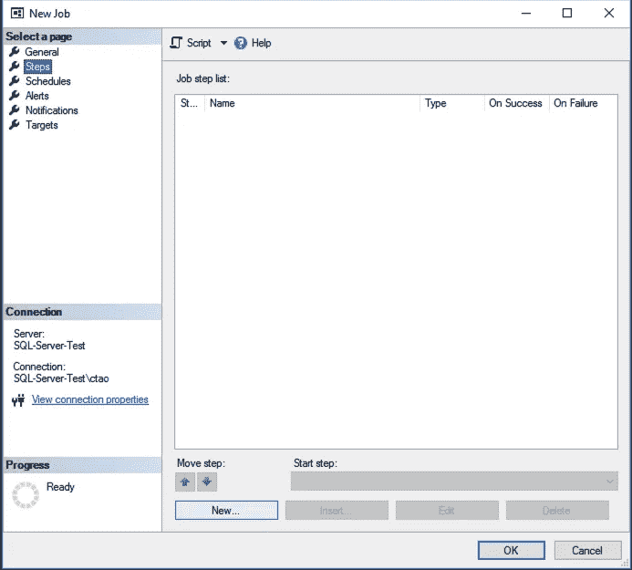

在`New Job Step`窗口中，输入步骤名称和脚本如下:

```
USE AdventureWorks2017
GODECLARE [@filename](http://twitter.com/filename) varchar(255)
DECLARE [@date](http://twitter.com/date) datetimeSELECT [@date](http://twitter.com/date)=getdate()
SELECT [@filename](http://twitter.com/filename)='C:\backup\AdventureWorks2017-' + CAST(DATEPART(yyyy, [@date](http://twitter.com/date)) as varchar) + '-' + CAST(DATEPART(mm, [@date](http://twitter.com/date)) as varchar) + '-' +  CAST(DATEPART(dd, [@date](http://twitter.com/date)) as varchar) + '.bak'BACKUP DATABASE AdventureWorks2017 TO DISK=[@filename](http://twitter.com/filename) WITH INIT
GO
```

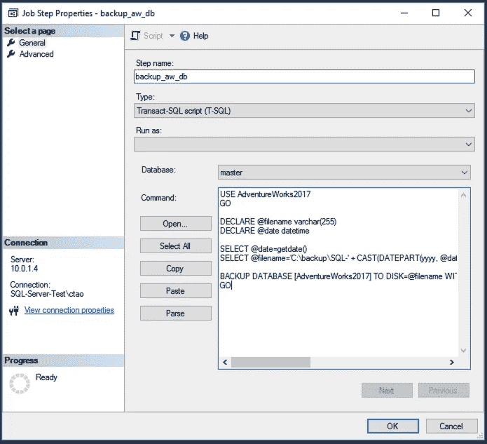

之后，进入`Advanced`选项卡，配置成功和失败行为。这里，你需要考虑你的情况，比如你的数据库有多大等等。

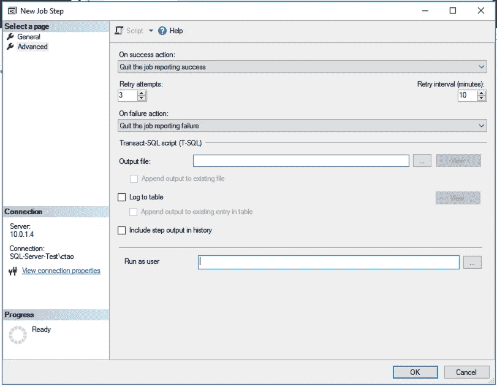

点击确定确认应用作业步骤，然后转到`Schedule`选项卡并点击新建按钮。您可以根据自己的需求配置时间表。在本例中，我将让备份在每天凌晨 1:00 进行。然后，单击“确定”按钮确认该计划。


您可能还希望创建警报或通知，例如在作业失败时发送电子邮件。在这个实验中，我们将跳过这一步，因为并不总是需要。

现在，与其等到明天凌晨 1 点，我想测试一下这个作业。我们可以右键单击我们创建的作业，然后选择“在第…步启动作业”来测试该作业。由于我们在此作业中只有 1 个步骤，它将直接启动并运行备份步骤。

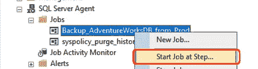

过一会儿，作业就成功了，您也可以在备份目录中找到备份文件。

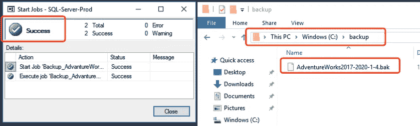

# 在 SQL-Server-Test 上还原备份

首先，我们通过 access `\\SQL-Server-Prod\backup\<backup-file>`来检查一下测试机上备份文件的可访问性。

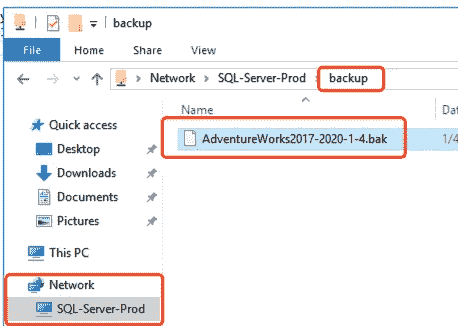

另一个关键步骤是将远程备份文件夹装载到本地驱动器。这是因为 SQL Server Windows 服务通常是作为无权使用网络/远程资源的服务帐户运行的，因此远程资源对它是不可见的。

只需右键单击备份文件夹并选择“映射网络驱动器…”。

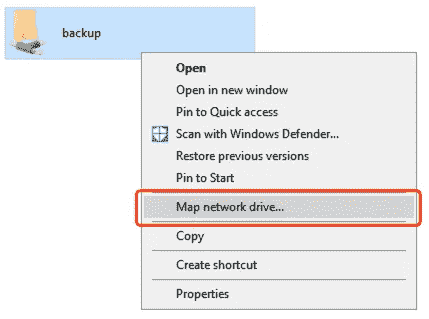

让我们将它安装到测试机上的 Z: drive。

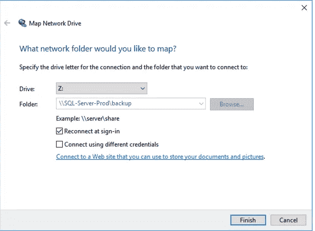

然后，我们需要让 SQL Server 使用`xp_cmdshell`命令识别网络驱动器。默认情况下，这个命令是不启用的，所以我们需要启用它。打开一个新的查询表，并运行以下脚本来启用它。

```
EXEC sp_configure 'show advanced options', 1;
GO
RECONFIGURE;
GO

EXEC sp_configure 'xp_cmdshell',1
GO
RECONFIGURE
GO
```

然后，使用`xp_cmdshell`定义网络驱动器。您可以使用任何可以访问该网络驱动器的 Windows 用户。注意，您只需要运行这个命令一次，所以密码不会以明文格式保存在任何地方。

```
EXEC XP_CMDSHELL 'net use Z: \\SQL-Server-Prod\backup <password> /USER:<username>'
```

在 result 面板中，您应该会看到输出，表明它是成功的。

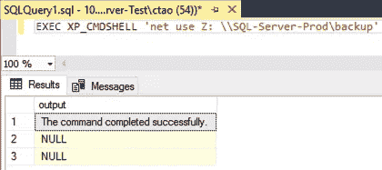

我们也可以通过下面的脚本来测试它是否有效。

```
EXEC XP_CMDSHELL 'dir Z:'
```

如果可以，您应该会看到包含备份文件的文件列表。

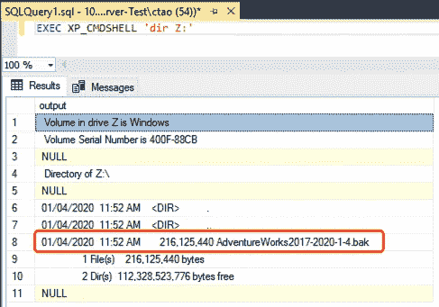

之后，我们只需要创建另一个 SQL Server 代理作业，其中包含从所标识的网络驱动器还原数据库的步骤。该步骤的脚本如下:

```
DECLARE [@filename](http://twitter.com/filename) varchar(255)
DECLARE [@date](http://twitter.com/date) datetimeSELECT [@date](http://twitter.com/date)=getdate()
SELECT [@filename](http://twitter.com/filename)='Z:\AdventureWorks2017-' + CAST(DATEPART(yyyy, [@date](http://twitter.com/date)) as varchar) + '-' + CAST(DATEPART(mm, [@date](http://twitter.com/date)) as varchar) + '-' +  CAST(DATEPART(dd, [@date](http://twitter.com/date)) as varchar) + '.bak'RESTORE DATABASE AdventureWorks2017
FROM DISK=[@filename](http://twitter.com/filename)
WITH REPLACEGO
```

然后，重复我们之前在生产计算机中所做的操作，右键单击代理作业并选择“在步骤启动作业”来测试作业。等待一段时间，直到恢复完成，右键单击“数据库”刷新数据库列表，你会看到恢复的数据库！

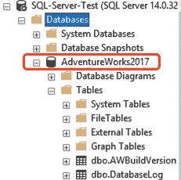[](https://medium.com/@qiuyujx/membership) [## 通过我的推荐链接加入灵媒-陶

### 作为一个媒体会员，你的会员费的一部分会给你阅读的作家，你可以完全接触到每一个故事…

medium.com](https://medium.com/@qiuyujx/membership) 

如果你觉得我的文章有帮助，请考虑加入 Medium 会员来支持我和成千上万的其他作者！(点击上面的链接)

# 资源

使网络路径对 SSMS 的 SQL Server 备份和恢复可见:
https://www . MSSQL tips . com/SQL Server tip/3499/make-Network-Path-Visible-For-SQL-Server-Backup-and-Restore-in-ssms/

BACKUP 语句(Transact-SQL，微软官方文档):
[https://Docs . Microsoft . com/en-us/SQL/t-SQL/Statements/BACKUP-Transact-SQL？view=sql-server-ver15](https://docs.microsoft.com/en-us/sql/t-sql/statements/backup-transact-sql?view=sql-server-ver15)

RESTORE 语句(Transact-SQL，微软官方文档):
[https://Docs . Microsoft . com/en-us/SQL/t-SQL/Statements/RESTORE-Statements-Transact-SQL？view=sql-server-ver15](https://docs.microsoft.com/en-us/sql/t-sql/statements/restore-statements-transact-sql?view=sql-server-ver15)