# 用 Python 分析学生成绩数据的简单方法

> 原文：<https://towardsdatascience.com/a-simple-way-to-analyze-student-performance-data-with-python-cc09c7508c4c?source=collection_archive---------26----------------------->


斯蒂芬·道森在 Unsplash 上拍摄的照片

## 探索如何使用 Python 和 Dremio 以高效的方式分析数据和构建信息图表

# 介绍

数据分析和数据可视化是数据科学的重要组成部分。实际上，在机器学习时代之前，所有的数据科学都是关于用不同的工具解释和可视化数据，并对数据的本质做出结论。如今，这些任务仍然存在。他们只是众多杂项数据科学工作中的一个。通常，所谓的 EDA(探索性数据分析)是机器学习管道中的一个必需部分。它允许更好地理解数据、其分布、纯度、特征等。此外，建议可视化，以向不同的利益相关者呈现机器学习工作的结果。他们可能不熟悉复杂的数据科学原理，但查看图形和图表对他们来说很方便。此外，如果不需要深入挖掘数据，数据分析和可视化可以作为独立的任务来完成。无论如何，一个好的数据科学家应该知道如何分析和可视化数据。

在本教程中，我们将展示如何分析数据，以及如何构建美观且信息丰富的图表。我们将使用流行的 Python 库进行可视化，即 matplotlib 和 seaborn。此外，我们将使用 Pandas 作为操纵数据帧的工具。我们将使用的数据集是[学生表现数据集](https://archive.ics.uci.edu/ml/datasets/Student+Performance)。我们将演示如何将数据加载到 AWS S3，以及如何通过 Dremio 将数据导入 Python。Dremio 也是数据管理和预处理的完美工具。这就是为什么我们会在 Dremio 中立即对数据做一些事情，然后再将它放入 Python 的手中。

# 假设

本文假设您拥有对 Dremio 的访问权限，并且拥有一个 T2 AWS 账户。我们将使用 [Python 3.6](https://www.python.org/downloads/release/python-360/) 和 [Pandas](https://pandas.pydata.org/) 、 [Seaborn](https://seaborn.pydata.org/) 和 [Matplotlib](https://matplotlib.org/) 包。要将 Dremio 连接到 Python，还需要 Dremio 的 [ODBC](https://www.dremio.com/drivers/) 驱动。所有 Python 代码都是在 [Jupyter Notebook](https://jupyter.org/) 环境下编写的。

将数据加载到 AWS S3 有两种方式，通过 AWS web 控制台或以编程方式。在本教程中，我们将展示如何直接从 Python 代码向 S3 发送数据。为了能够从 Python 管理 S3，我们需要创建一个用户，您将代表该用户从代码中执行操作。为此，从 AWS 控制台的服务列表中选择，单击，然后按按钮:

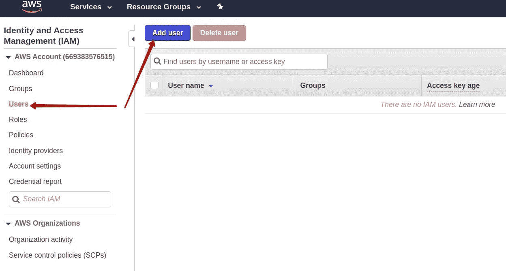

给新用户起一个名字(在我们的例子中，我们选择了 *test_user* )并为这个用户启用编程访问:

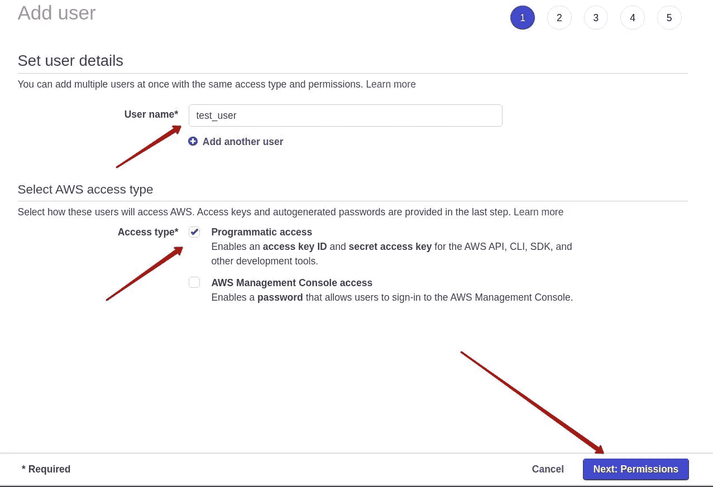

下一步，您必须设置权限。在大多数情况下，这是一个重要的阶段，您可以为不同的用户调整权限。您甚至可以在这里创建自己的访问策略。但是在本教程中，为了简单起见，只给用户对 AWS S3 的完全访问权:

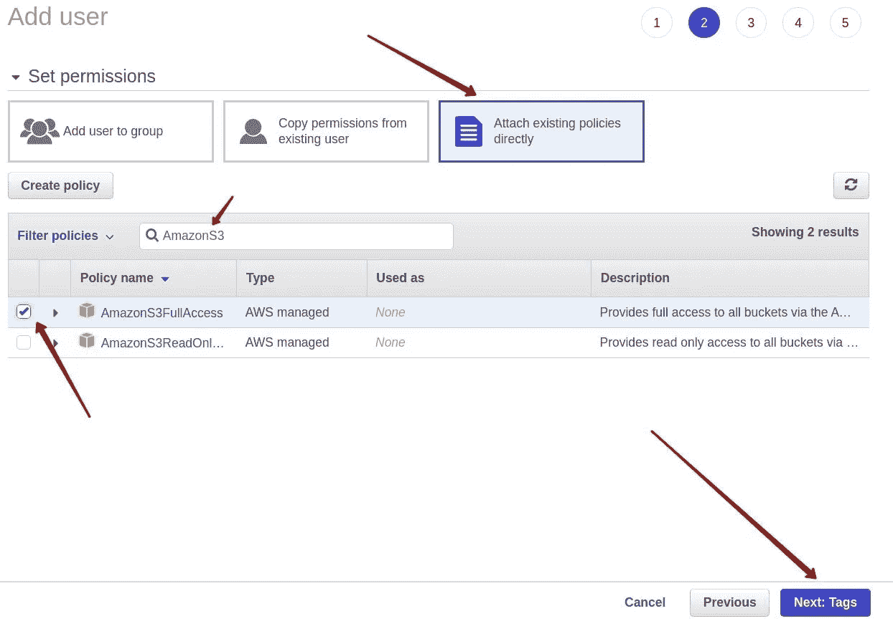

创建用户后，您应该复制所需的凭证(访问密钥 ID 和秘密访问密钥)。您将在后面的代码中使用它们向 AWS S3 发出请求。

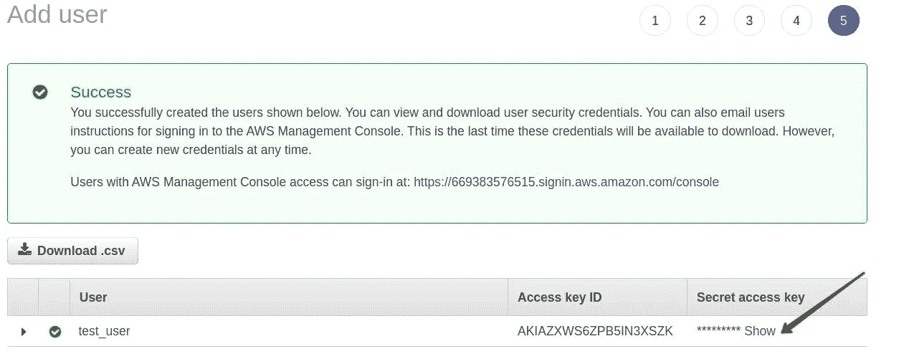

在配置文件中，设置要为其创建存储桶的区域，等等。在 S3:

现在一切都为编码做好了准备！先做点简单的吧。例如，显示 S3 的现有时段:

在上面的代码中，我们导入库 *boto3* ，然后创建*客户端*对象。作为一个参数，我们指定“ *s3* ”来表明我们想要使用这个 AWS 服务。之后，我们使用创建的对象的 *list_buckets()* 方法来检查可用的桶。下面是我们在响应变量中得到的结果(一个带有桶的空列表):

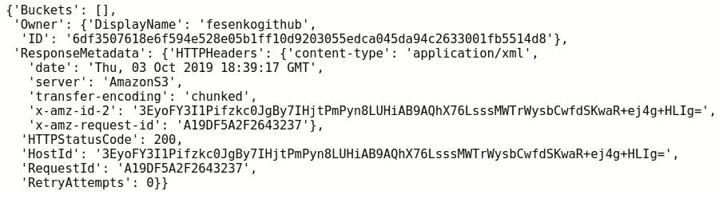

现在让我们创建一个桶。为此，使用客户端对象的 *create_bucket()* 方法:

下面是创建存储桶后， *list_buckets()* 方法的输出:

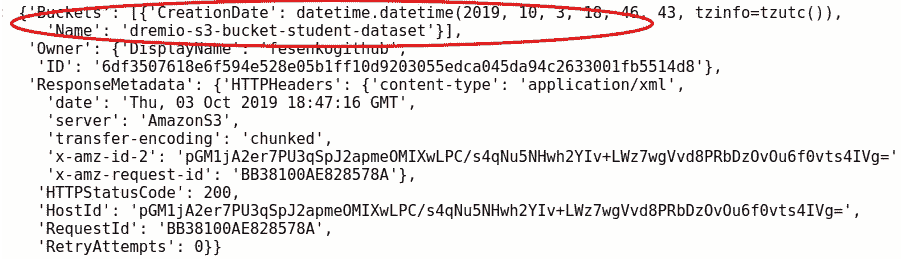

您还可以在 AWS web 控制台中看到创建的存储桶:

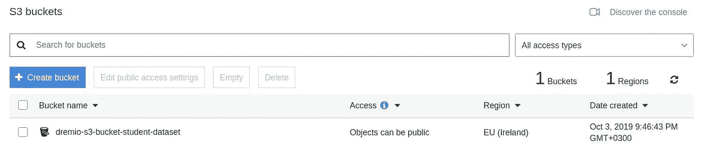

我们有两个文件需要加载到亚马逊 S3， *student-por.csv* 和 *student-mat.csv* 。为了加载这些文件，我们使用客户端对象的 *upload_file()* 方法:

最后，您应该能够在 AWS web 控制台中看到这些文件(在前面创建的存储桶中):

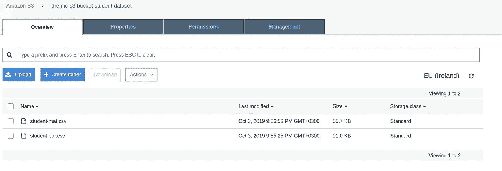

# 连接到您的 AWS S3 数据源

要连接 Dremio 和 AWS S3，首先转到服务列表中的部分，选择 ***删除根访问密钥*** 选项卡，然后按下 ***管理安全凭证*** 按钮。然后选择 ***访问键*** 选项卡然后点击 ***新建访问键*** 按钮。按下 ***显示访问键*** 后，复制 *AWS 访问键*和*AWS 访问密码*:

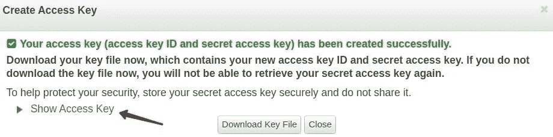

在 Dremio GUI 中，单击按钮添加新源。然后选择 ***亚马逊 S3*** 。应该会出现以下窗口:

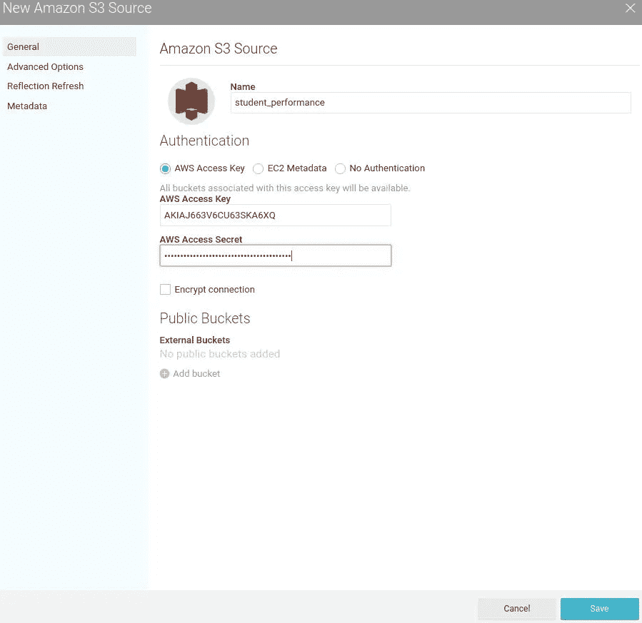

在上面的窗口中，您应该指定源的名称( *student_performance* )以及您在上一步中生成的凭证。

# 准备您的数据

在这部分教程中，我们将展示如何处理关于学生在葡萄牙语课上表现的数据框架。然而，需要同样的行动来管理其他数据框架(关于数学课的表现)。

首先，打开 *student_performance* 源文件中的 *student-por.csv* 文件。请务必更改字段分隔符的类型(“；”)，行分隔符(" \n ")，并勾选 ***提取字段名*** 复选框，如下图所示:

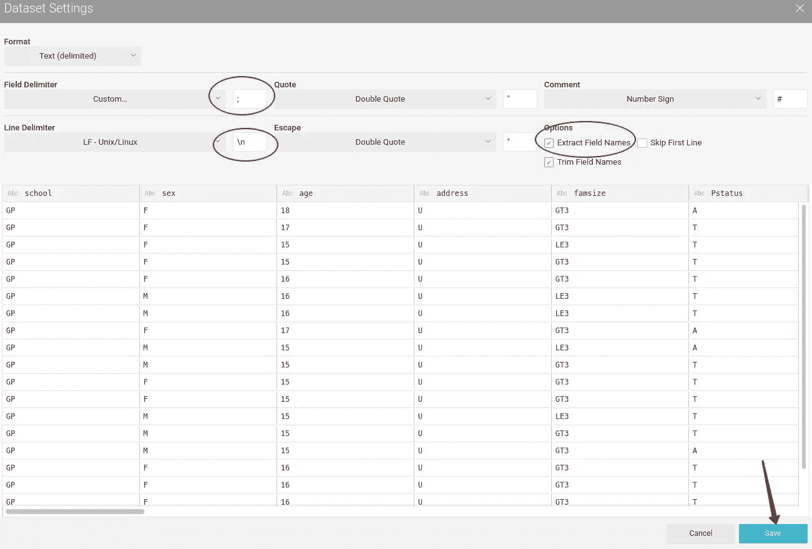

我们不需要 *G1* 和 *G2* 列，我们把它们去掉吧。单击每列名称旁边的箭头，调出上下文菜单。然后从菜单中选择选项:

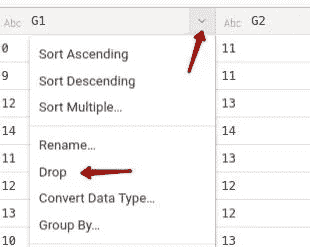

通过同一个下拉菜单，我们可以将 *G3* 列重命名为 *final_target* 列:

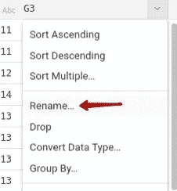

接下来，我们注意到所有的数值都是字符串数据类型。我们想把它们转换成整数。为此，单击列名附近的小 ***Abc*** 按钮，然后选择所需的数据类型:

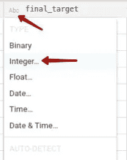

结果中将出现以下窗口:

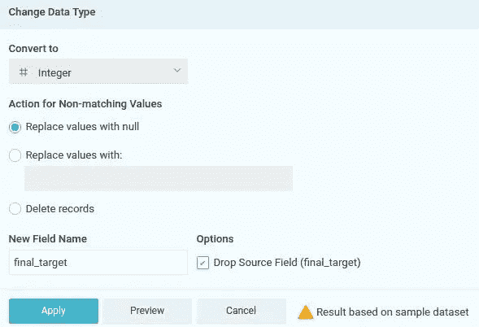

在这个窗口中，我们需要指定新列的名称(具有新数据类型的列)，还需要设置一些其他参数。准备好后，按下按钮。我们应该对所有数字列进行类型转换，这些数字列是字符串: *age、Medu、Fedu、traveltime、studytime、failures、famrel、freetime、goout、Dalc、Walc、health、absenties*。

在对数据执行上述所有操作后，我们将数据帧保存在名为*端口 1* 的*学生性能空间*中。

在 Dremio 中，您所做的一切都会在 SQL 代码中得到反映。例如，我们上面描述的所有操作都生成了下面的 SQL 代码(您可以通过点击 ***SQL 编辑器*** 按钮来检查):

此外，您可以编写自己的 SQL 查询。假设我们想要创建新的列 *famsize_bin_int* 。该列应为二进制。当来自列 *famsize* 的给定行中的值等于“GT3”时，它应该包含“1”；当 famsize 列中的相应值等于“LE3”时，它应该包含“0”。下面是实现这一想法的 SQL 代码:

在下图中，您可以看到在单击按钮后，列 *famsize_int_bin* 出现在 dataframe 中:

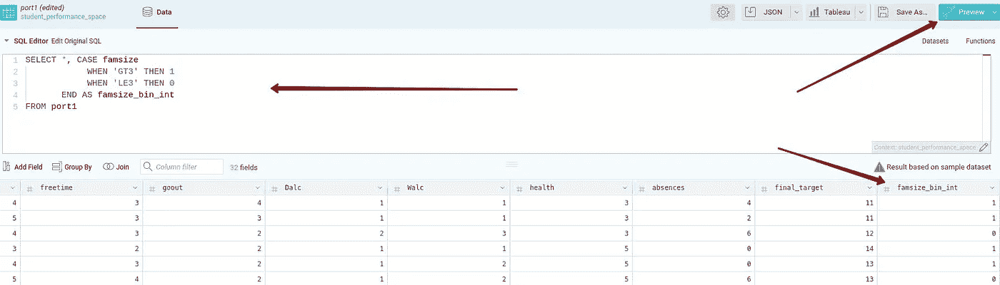

最后，我们希望根据 *final_target* 列对 dataframe 中的值进行排序。我们希望在表格顶部看到分数最低的学生，因此我们从下拉菜单中选择 ***升序*** 选项:

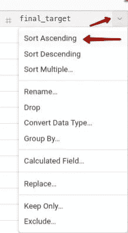

最后，我们在*student _ performance _ space*中以 *port_final* 的名字保存策划的数据帧。数学数据集也是如此(我们将其保存为 *mat_final* 表)。

# 连接到 Python

要连接 Dremio 和 Python 脚本，我们需要使用 PyODBC 包。下面的代码用于将 *port_final* 和 *mat_final* 表作为 pandas dataframes 导入 Python。

如您所见，我们需要指定主机、端口、dremio 凭证和 Dremio ODBC 驱动程序的路径。然后我们使用 PyODBC 对象的方法 connect()建立连接。Pandas 使用 read_sql()方法从远程数据源获取数据。在创建 SQL 查询时，我们使用了表的完整路径(name _ of _ the _ space . name _ of _ the _ data frame)。

# Python 中的数据分析和可视化

探索性数据分析的主要目标是理解数据。它可以作为一项独立的任务，也可以作为机器学习过程中的准备步骤。EDA 有助于确定您的数据具有哪些特征，分布情况如何，是否需要进行数据清理和预处理等。

可能每个 EDA 都是从探索数据集的形状和浏览数据开始的。为了显示 dataframe 中的前 5 条记录，可以在 Pandas dataframe 上调用 *head()* 方法。您还可以将行数指定为该方法的参数。换句话说，5 是该方法显示的默认行数，但是您可以将其更改为 10，例如。

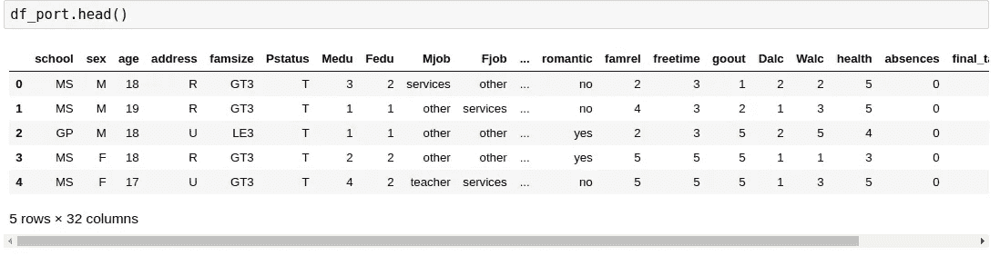

要检查数据的形状，使用数据帧的*形状*属性:

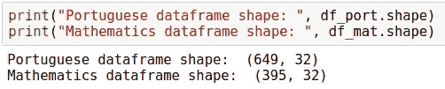

你可以看到葡萄牙语数据框中的行数远远多于数学数据框中的行数。此外，在本教程中，我们将只使用葡萄牙语数据帧，以避免文本过载。但是这些数据框架是完全相同的，如果你愿意，你可以用数学数据框架做同样的操作，并比较结果。

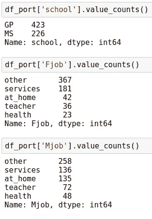

现在我们只想看看来自市区的学生。为此，我们只提取那些在地址*列*中包含值“U”的行:

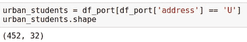

从上面的输出，我们可以说来自城市地区的学生比来自农村地区的学生多。例如，如果我们继续进一步研究机器学习模型，我们可能会发现这些信息对一些特征工程很有用。

除了 head()函数，还有另外两个 Pandas 方法允许查看数据帧的子样本。 *tail()* 方法从表的末尾返回行。 *sample()* 方法从 dataframe 返回随机的 *N* 行。如果您不仅想查看表的开头或结尾，还想显示数据帧不同部分的不同行，这可能会很有帮助:

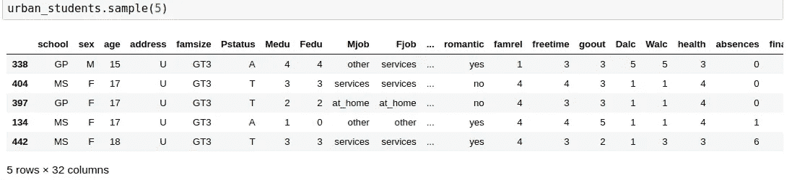

为了检查你的数据框架有哪些列，你可以使用*列*属性:

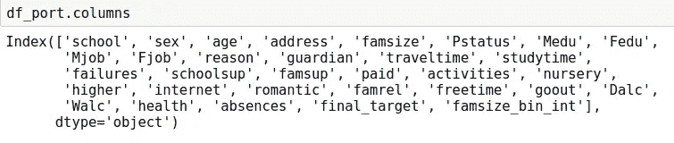

如果需要编写代码来处理列名，可以使用 Python 的原生列表轻松完成。

任何 EDA 中的一个重要步骤是检查数据帧是否包含空值。对于熊猫，这不需要任何复杂的代码就可以完成。只需在数据帧上调用 *isnull()* 方法，然后使用 *sum()* 方法聚合值:

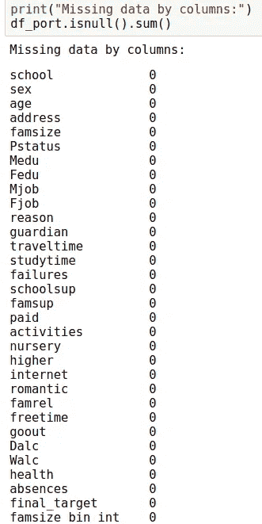

正如我们所看到的，我们的数据帧经过了很好的预处理，它不包含丢失的值。

同样，您可能希望查看不同列的数据类型。数据类型可通过 dataframe 的 *dtypes* 属性访问:

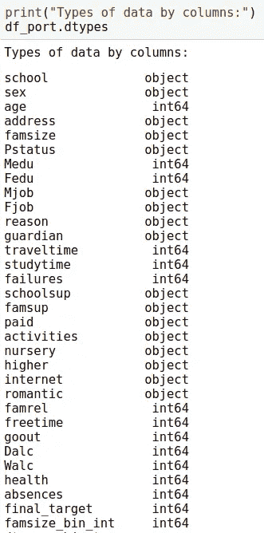

我们数据集中的所有列要么是数字型(整数)，要么是分类型(对象)。

了解数据集的基本统计数据通常很有用。在 Pandas 中，您可以通过调用 *describe()* 方法来实现这一点:

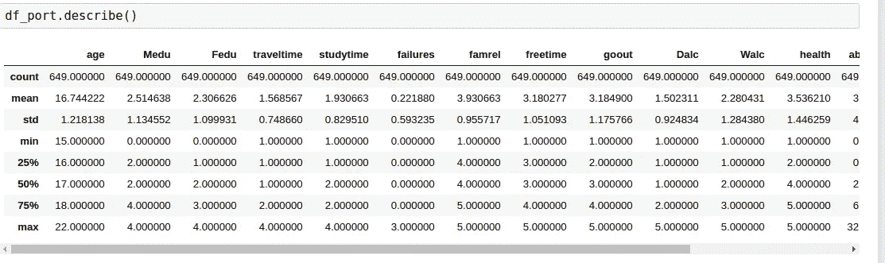

此方法返回统计数据(计数、平均值、标准偏差、最小值、最大值等)。)关于数据帧的每个数字列。要查看关于分类特性的一些信息，您应该指定 *describe()* 方法的 *include* 参数，并将其设置为 *['O']* (见下图)。但是对于分类列，该方法只返回计数、唯一值的数量、最频繁的值及其频率。我们的大多数分类列都是二元的:

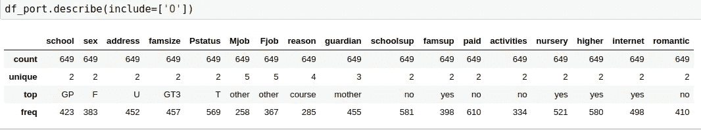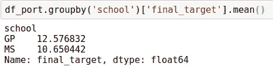

现在我们要用 Matplotlib 和 Seaborn 构建可视化。但是首先，我们需要导入这些包:

```
import matplotlib.pyplot as plt import seaborn as sns
```

让我们看看数据集中男性和女性的比例。为此，我们选择列*性别*，然后使用 *value_counts()* 方法，其中 normalize 参数等于 *True* 。然后我们调用 *plot()* 方法。这将使用 Matplotlib 来构建一个图形。我们可以看到数据集中的女生(大约 60%)比男生(大约 40%)多。相应的代码和可视化你可以在下面找到。

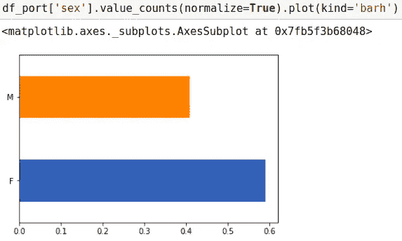

我们已经看到了性别特征在数据集中的分布。但是通常，最有趣的列是目标列。在我们的例子中，这个列叫做 *final_target* (它代表一个学生的最终成绩)。这次我们将使用 Seaborn 制作一个图表。Seaborn 包有用于此目的的 *distplot()* 方法。我们指定的参数是*颜色*(绿色)和*箱数* (10)。代码和图像如下:

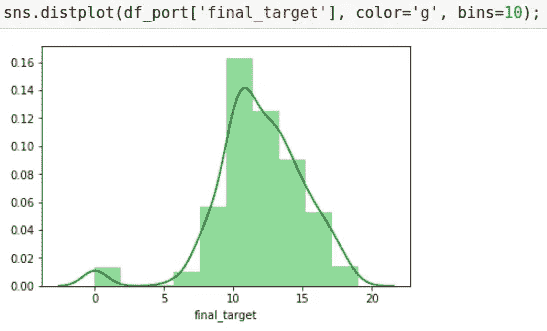

从上面的直方图中，我们可以说最频繁的等级在 10–12 左右，但是从左侧开始有一个尾部(接近零)。也许在未来，在建立模型之前，值得对目标变量的分布进行转换，使其更接近正态分布。

Seaborn 包有很多方便的比较图形的函数。其中一个函数是 *pairplot()* 。您可以选择要分析的列，Seaborn 将在对角线上构建这些列的分布，并在所有其他位置构建散点图。每个散点图显示两个指定列之间的相互关系。在我们的例子中，这种可视化可能没有它应有的用处。它更适合连续的特征，而不是整数。但是，您可以理解这种可视化的要点:

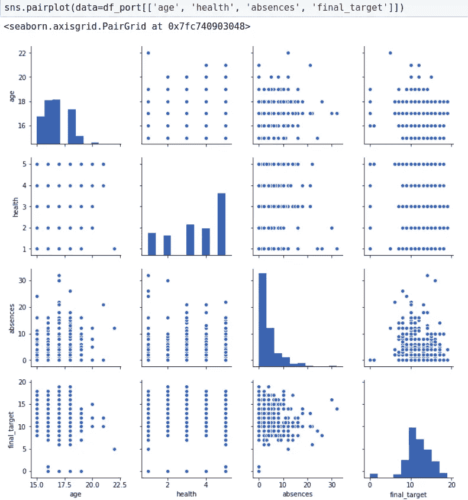

让我们使用 Matplotlib 来看看数据集中所有数字列的分布。首先，我们创建一个只有数字列的 data frame(*df _ num*)。为此，我们使用 select_dtypes() Pandas 方法。我们指定只接受 *float64* 和 *int64* 数据类型，但是对于这个数据集，只接受整数列就足够了(没有浮点值)。此外，我们删除了 *famsize_bin_int* 列，因为它最初不是数字。

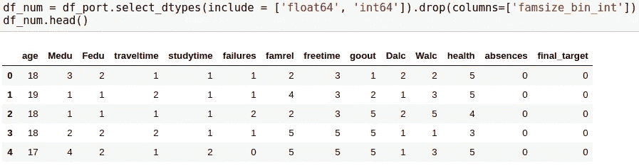

现在，我们在 *df_num* dataframe 上使用 *hist()* 方法来构建一个图:

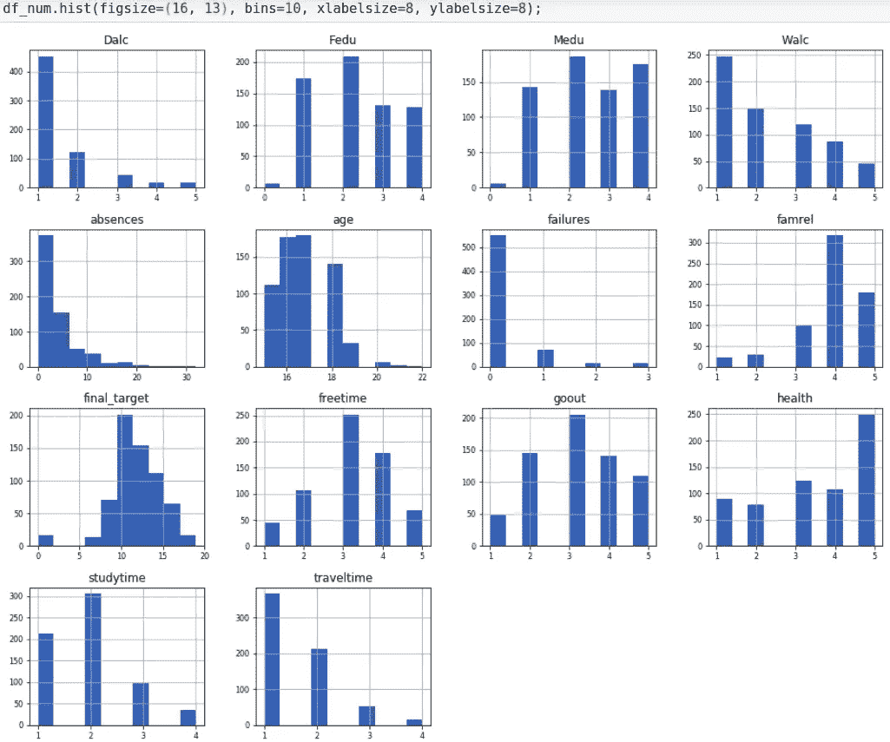

在 *hist()* 方法的参数中，我们已经指定了绘图的大小、标签的大小和容器的数量。

或许，分析不同列和特定条件下的值的范围是很有趣的。这是如何工作的。我们想看看 *final_target* 列的范围如何根据学生父母的工作而变化。为此，我们使用 Seaborn 的函数 *boxplot()* 。在此之前，我们使用 Matplotlib 调整绘图的大小。父亲工作的图表如下所示:

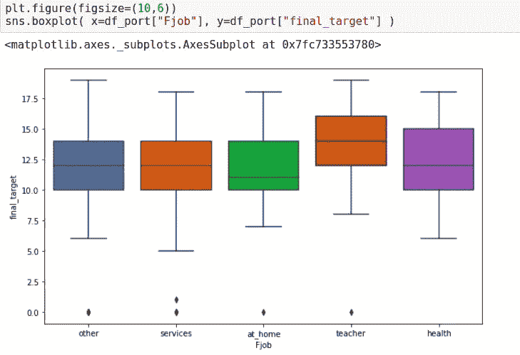

这是母亲工作的图表:

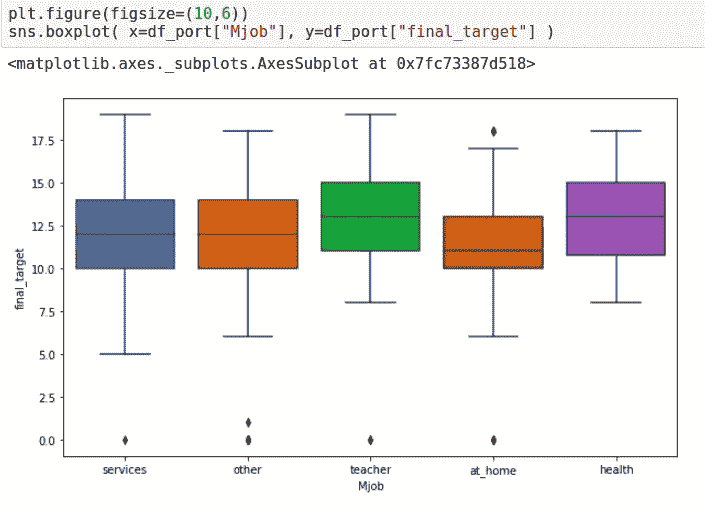

箱线图允许查看平均值以及数据的高低四分位数。胡须显示了分布的其余部分。胡须外的点代表异常值。

从上面的图表中你可以得到一个有趣的认识，那就是如果学生的父亲或母亲是老师，那么这个学生很有可能获得高分。

同样的，我们可以看到女生在学业上比男生更成功:

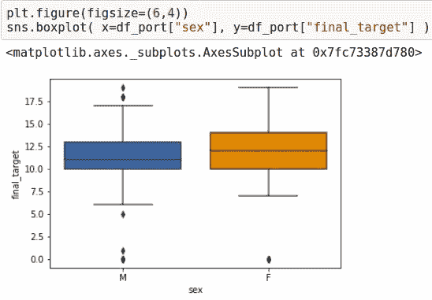

EDA 最有趣的一点是探索变量之间的相关性。我们可以分析相关性，然后使用 Seaborn 将其可视化。这里我们只看数字列。在为机器学习模型训练做真正的准备时，科学家应该对分类变量进行编码，并像处理数字列一样处理它们。但是这超出了我们教程的主题。

下面代码的第一行使用方法 *corr()* 来计算不同列和 *final_target* 特性之间的相关性。我们丢弃最后一条记录，因为它是 *final_target* (我们对 *final_target* 与自身具有完美相关性这一事实不感兴趣)。

代码的第二行过滤掉所有弱相关性。在我们的例子中，我们只想看相关性，它大于 0.12(绝对值)。我们还想对列表进行降序排序。

第三行只是打印出结果。

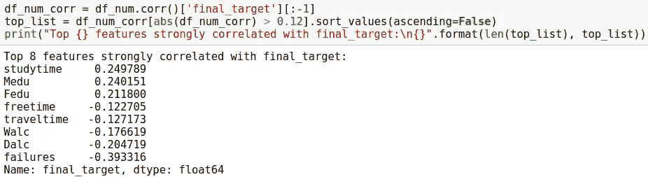

我们可以看到，有 8 个特征与目标变量密切相关。有些是正相关，有些是负相关。例如，最强的负相关性与*故障*特征相关。如果学生过去成绩不好，他/她将来也可能继续学习不好，这是合理的。

此外，学生在周末或工作日饮酒越多，他/她的最终成绩越低。在*空闲时间*和*行程时间*变量之间也存在负相关性。学生的空闲时间越多，他/她的表现就越差。旅行越多的学生成绩也越差。

同时，我们有 3 个与目标变量正相关:studytime，Medu，Fedu。很明显，你花在学习上的时间越多，你的学习成绩就越好。有趣的事实是，父母的教育程度也与孩子的表现密切相关。

在热图上，您不仅可以看到与目标变量的相关性，还可以看到变量之间的相关性。例如，父亲和母亲的教育程度、学生外出的时间和饮酒量、失败次数和学生年龄等之间有很强的相关性。

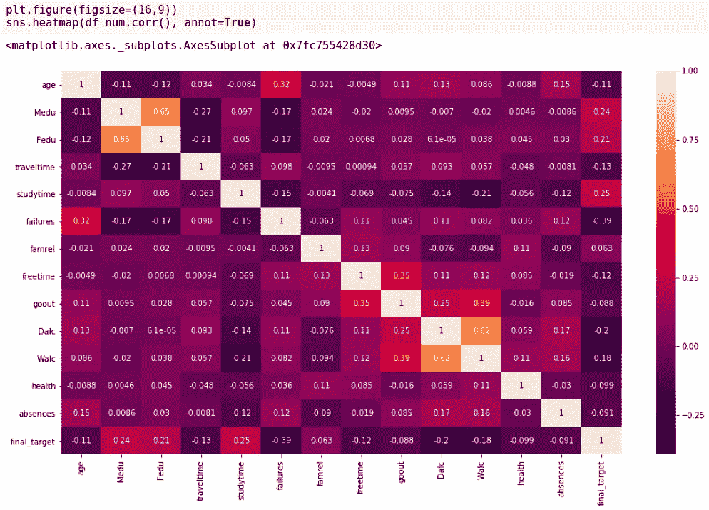

探索相关性是 EDA 中最重要的步骤之一。它允许理解哪些功能可能是有用的，哪些是多余的，以及哪些新功能可以人工创建。

# 结论

在本文中，我们介绍了如何以编程方式将数据加载到 AWS S3，如何使用 Dremio 准备存储在 AWS S3 中的数据，以及如何在 Python 中分析和可视化这些数据。我们还展示了如何使用 Dremio 以及 Dremio 和 Python 代码连接到您的数据湖。在工作过程中，我们使用了 Matplotlib 和 Seaborn 包。

*最初发表于*[*【https://www.dremio.com】*](https://www.dremio.com/tutorials/analyzing-student-performance-with-dremio-python/)*。*