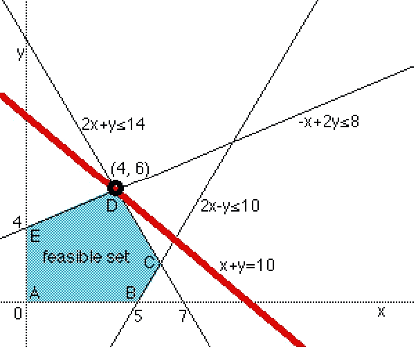
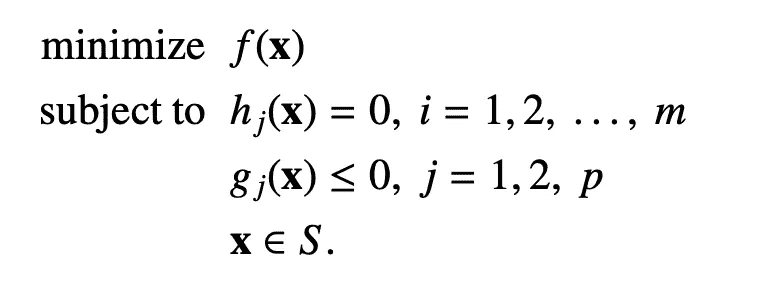
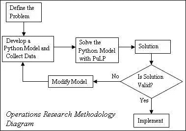
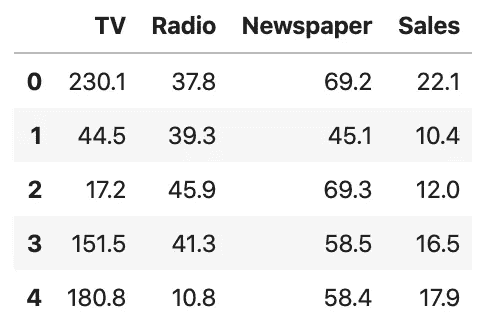
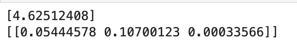
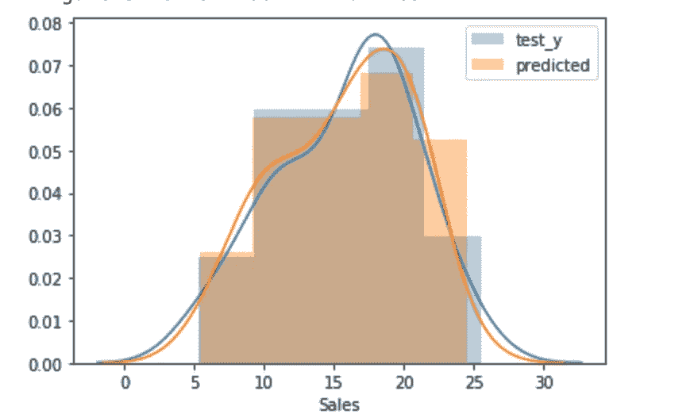
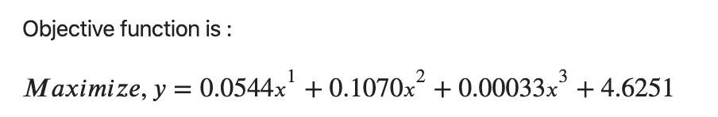
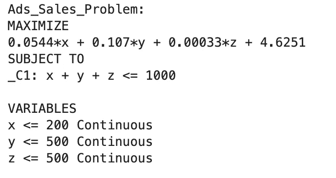
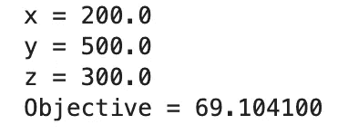

# 在 Python 中优化“某物”的简单方法

> 原文：<https://towardsdatascience.com/a-simple-way-to-optimize-something-in-python-740cda7fd3e0?source=collection_archive---------15----------------------->

## 使用 Python 中的线性规划解决预算优化问题


在 [Unsplash](https://unsplash.com/s/photos/money?utm_source=unsplash&utm_medium=referral&utm_content=creditCopyText) 上 [NeONBRAND](https://unsplash.com/@neonbrand?utm_source=unsplash&utm_medium=referral&utm_content=creditCopyText) 拍摄的照片

为什么优化预算很重要？它让我们能够控制广告支出，决定花费多少，并最大化预期结果(访问，点击等)。例如，给定 10，000 美元的预算及其约束条件，我们能够确定每个营销渠道的**最优预算分配**，从而使**结果最大化。**这将使我们能够避免在单一渠道上的拥挤，即我们把所有东西都放在一个篮子里，而是分散到表现最好的渠道。

优质的预算优化策略可以显著提高搜索广告活动的效果，从而帮助广告主在激烈的在线营销竞争中取得成功。

# 什么是线性规划？



线性规划优化中的一个线性规划问题的图解

线性规划(LP)是获得最佳结果的最广泛使用的优化技术之一。David G. Luenberger 所著《线性和非线性编程》一书摘录:

> 顾名思义，线性规划问题的特征在于未知数的线性函数；目标在未知数中是线性的，约束是未知数中的线性等式或线性不等式。

似乎线性规划的流行主要在于分析的公式化阶段，而不是求解阶段——这是有道理的。因此，对于我们今天所关心的问题，它可以表述为:

> 预算约束限制在三个不同渠道(电视、广播、报纸)之间分配的资金总量，预算约束采用 x1 + x2 + x3 ≤ B 的形式，其中 B 是预算。电视的总花费应该少于 200 美元，广播应该少于 500 美元，报纸应该少于 500 美元。而总预算上限为 1000 美元。

除此之外，我们还应该找出一个问题的**目标函数**，在这个问题中，我们计划最大化或最小化我们喜欢的结果(点击、销售等)。



从 David G. Luenberger 于 1973 年出版的《线性和非线性规划》一书中获得的线性规划问题公式示例

我将使用来自 [Kaggle](https://www.kaggle.com/ashydv/advertising-dataset) 的开源广告数据集来展示它是如何工作的！

# 履行

理想情况下，当使用 LP 时，目标函数应该是线性的。

> 如果一个目标函数由于其固有的定义而不是纯线性的，那么将其定义为线性的往往比决定某种其他函数形式并使其他人相信更复杂的形式是最好的选择要容易得多。因此，线性由于其简单性，经常被选择作为简单的解决方法，或者当寻求一般性时，被选择作为在一类类似问题中同样适用(或不适用)的唯一函数形式



[纸浆优化工艺](http://coin-or.github.io/pulp/)2009

## 建立预测模型



数据帧

我们首先使用 SK-Learn 的线性回归建立一个多元线性回归模型。这个[内核](https://www.kaggle.com/vipulgandhi/linear-regression)提供了一个很好的方法来验证线性回归是否可以被使用，因为线性回归受到几个假设的限制。

```
### SCIKIT-LEARN ###feature_cols = ['TV', 'Radio', 'Newspaper']
X = df_advertising[feature_cols]
y = df_advertising[["Sales"]]# instantiate and fit
lr = LinearRegression()
model = lr.fit(X, y)# print the coefficients
print(SkLearn_result.intercept_)
print(SkLearn_result.coef_)
```



y 轴截距和系数

我们能够从给定的模型中获得 y 截距和系数。



我们模型的准确性

RMSE 为 1.509，我们的模型非常准确，根据上图，我们可以看到，与实际值相比，它的预测相对较好。有了预测模型，我们现在可以开始构建线性规划的目标函数。

## 使用 LP 优化

我们将使用一个名为 [PuLP](http://coin-or.github.io/pulp/) 的 python 包。这是一个针对 Python 的优化包。纸浆是直截了当的，非常容易使用！

```
prob = LpProblem("Ads Sales Problem", LpMaximize)
```

我们从使用 LpProblem 函数定义问题开始，我们希望最大化输出，因此“LpMaximize”将是参数。然后，我们将指定我们的约束条件，例如我们应该为给定的渠道花费多少预算。

```
#TV <= 200
x = LpVariable("x", 0, 200)#Radio <= 500
y = LpVariable("y", 0, 500)#Newspaper <= 500
z = LpVariable("z", 0, 500)#Should be less than $1000
prob += x + y + z <= 1000
```

有了约束条件，我们现在可以使用模型给出的系数构建我们的目标函数:



```
coef = model.coef_prob += coef.item(0) * x + coef.item(1) * y + coef.item(2) * z + model.intercept_[0]
```

然后通过调用 solve()函数，它将为我们解决这个问题，我们还可以检查优化的状态。通过打印它，我们可以得到下面的结果。

```
prob.solve()
LpStatus[status]
```



## 我们如何知道每个变量的最优值？

只需使用一个简单的 for 循环来访问概率变量，我们就能够获得每个变量的最优值以及下面的最大目标值。

```
for v in prob.variables():
    print(v.name, "=", v.varValue)

print("Objective = %f" % (prob.objective.value()))
```



# 分析

现在我们知道了每个营销渠道应该花多少钱，我们肯定应该使用它作为基线模型来分配我们下一次营销活动的预算。实际上，我们可以实现整个流程的自动化，在这一过程中，每天都可以为一次活动分配或优化预算。

# 结论

当可以应用于正确的用例时，优化的线性规划是强大的，因为它提供了关键的管理洞察力。广告商通常将预算视为简单的约束，并投入大量精力来寻找更有效的方式，以实现各种市场所定义的可能运营。一个简单的预算分配和调整策略可以在活动管理中显著减少有效点击/收入/销售方面的损失。

## 参考

1.  线性和非线性规划[https://www.springer.com/gp/book/9780387745022](https://www.springer.com/gp/book/9780387745022)
2.  纸浆—【http://coin-or.github.io/pulp/ 
3.  本教程的资源库—[https://github . com/georgeblu 1/Data-Projects/blob/master/Budget % 20 optimization . ipynb](https://github.com/georgeblu1/Data-Projects/blob/master/Budget%20Optimization.ipynb)
4.  [https://towards data science . com/linear-programming-and-discrete-optimization-with-python-using-pulp-449 F3 C5 F6 e 99](/linear-programming-and-discrete-optimization-with-python-using-pulp-449f3c5f6e99)

## 图像引用

1.  [https://www . researchgate . net/figure/Graphical-solution-of-a-linear-programming-problem _ fig 1 _ 2420905](https://www.researchgate.net/figure/Graphical-solution-of-a-linear-programming-problem_fig1_2420905)
2.  [https://link.springer.com/book/10.1007/978-0-387-74503-9](https://link.springer.com/book/10.1007/978-0-387-74503-9)
3.  [http://coin-or.github.io/pulp/](http://coin-or.github.io/pulp/)

如果您有任何问题或反馈，请随时通过我的 [LinkedIn](https://www.linkedin.com/in/georgewongsinhong/) 联系我。简单介绍一下，我是 Airasia.com 的一名数据科学家，专注于打造优秀的产品和推动增长，因为我热爱我所做的事情。