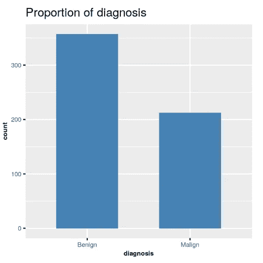
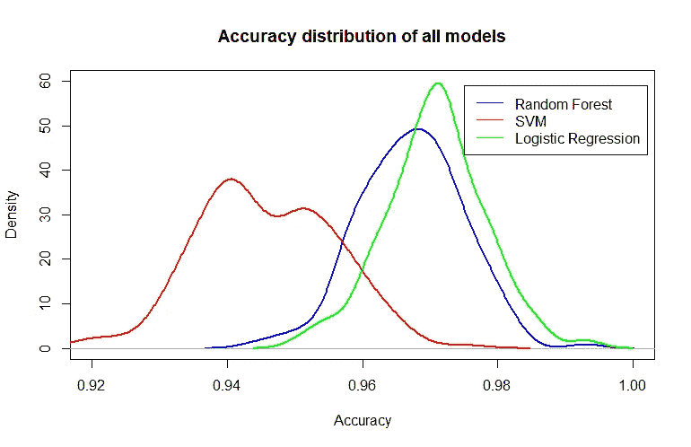
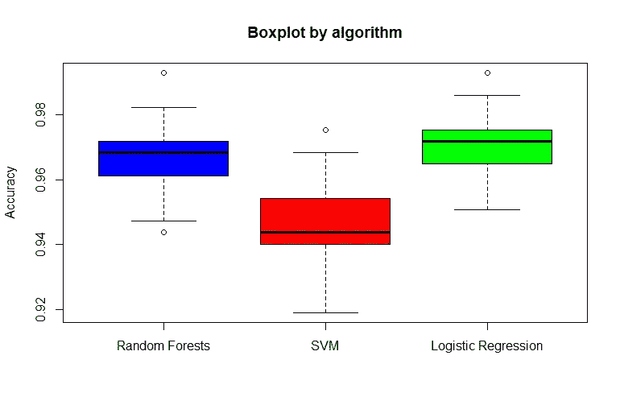

# 如何挑选合适的型号

> 原文：<https://towardsdatascience.com/a-simple-way-to-pick-the-right-model-d362272b453d?source=collection_archive---------32----------------------->

## 从精确度分布来看，IQR 和箱线图是选择最佳模型的一种方法


[来源](https://unsplash.com/photos/466ENaLuhLY)

在数据科学中，发现自己有几个表现几乎相同的模型/方法并不少见。当这种情况发生时，您如何知道选择哪个模型呢？在本文中，我将介绍一种选择最佳模型的方法，即真实模型。

我将使用乳腺癌威斯康星州数据集，可在这里:【https://www.kaggle.com/uciml/breast-cancer-wisconsin-data】T2。它包含 569 个观察值和 32 个描述性变量。因变量诊断是二元的。如果癌症是恶性的，它等于 1，如果癌症是良性的，它等于 0。让我们从导入所需的包和数据开始。

```
library(ggplot2)
library(randomForest)
library (e1071)
library(devtools)
library(ggbiplot)**#Import data** df = read.csv("data.csv")
```

然后，快速地，让我们清理数据(有些列是空的或无用的)，将诊断变量转换为[0，1]变量，而不是字符串。

```
**#Y as factor** df$diagnosis =  ifelse(df$diagnosis=="M", gsub("M", 1,                                                            df$diagnosis), gsub("B", 0, df$diagnosis))df$diagnosis = as.factor(df$diagnosis)**#Remove useless columns** df = df[,c(-33,-1)]
```

这是因变量的分布:



诊断分布

这些课程看起来并不不平衡。我们现在可以进入下一步了。下面，我将创建一个“for 循环”。在循环的每次迭代中，我会将数据分成两组，训练和验证。之后，我将使用随机森林、SVM 和逻辑回归来训练和预测三个独立的模型。通过将所有这些放入一个“for 循环”并每次改变种子，它将允许我每次收集三个模型在每次迭代中的精度性能。更改 set.seed()会更改训练和验证之间数据的随机重新分配。

这实质上是同时在三个模型上进行交叉验证。这也是有益的，因为它允许我每次都在相同的数据集上比较模型。对于每次迭代，每个模型都在相同的数据上进行训练和验证。这意味着我们可以在每个拟合模型之间进行公平和一致的比较。代码如下:

这是三个模型在 200 次迭代中的平均精确度:

1.  随机森林:96.7%
2.  SVM: 95.1%
3.  逻辑回归分析:97.1%

逻辑回归似乎是该数据集的最佳算法。然而，要选择正确的模式，我们不能止步于此。

## 选择正确的模型

查看上面的结果，我们看到逻辑回归胜出，但其准确性与其他模型准确性的差异并不显著。为了知道我们是否真的有最好的模型，我们需要查看准确性度量的分布。这类似于**边际解释 vs 条件解释**的思想:无论数据如何，模型平均来说是好的还是总是表现良好。

这很有用，因为它让我们知道模型是否总是精确的，或者它们的性能是否是可变的。根据具体情况，我们可能需要最佳平均模型或最小变量模型。拥有准确的分布信息只会有助于做出一致的选择！

以下是如何使用密度函数获得存储在 result_matrix 中的分布图:

```
a=density(result_matrix[,1])**#Getting the plot** plot(a, xlim=c(0.92, 1), ylim=c(0, 60), col='blue', lwd=2, main='Accuracy distribution of all models',
     xlab='Accuracy')
lines(density(result_matrix[,2]), col='red', lwd=2)
lines(density(result_matrix[,3]), col='green', lwd=2)
legend(x=0.975, y=59,legend = c("Random Forest", "SVM", "Logistic Regression"), col = c("blue","red", 'green'), lty = c(1,1))
```



三种模型的精度分布

我们看到，逻辑回归似乎确实比随机森林好得多，即使两种精度分布都非常对称地分布在它们的平均值附近(逻辑回归似乎稍微瘦一些)。事实上，这两种分布看起来都很正常。然而，SVM 分布似乎更易变，传播范围更大，几乎第二次达到约 95%的准确性。

我们还可以获得箱线图和分位数间范围，这将让我们看到我们是否有异常值(使用箱线图)，以及在我们的准确度值中第一和第三分位数之间的范围有多窄(使用 IQR)。下面是如何做到这一点:

```
**#Boxplots** boxplot(result_matrix, use.cols = TRUE, 
       main='Boxplot by algorithm', 
       ylab='Accuracy', xaxt = "n", col=c('blue', 'red', 'green'))
axis(1, at=1:3, labels=c('Random Forests', 'SVM', 'Logistic           Regression'))**#IQR** IQR(result_matrix[,1])
IQR(result_matrix[,2])
IQR(result_matrix[,3])
```



三种模型的箱线图

以下是三种算法的 iqr:

1.  随机森林:1.05
2.  SVM: 1.4
3.  逻辑回归:1.05

这意味着对于随机森林和逻辑回归，50%的值(在第一个和第三个分位数之间)在 1.05%的精确度范围内。对于 SVM 来说，IQR 更宽一些，为 1.4%。

查看箱线图，我们看到的是，对于所有三种方法，我们只有很少的异常值(1 或 2)。逻辑回归只有 1，而随机森林有 2。

现在，我相信我们可以客观地说，逻辑回归算法是在我们的情况下使用的最佳算法，我们有数据来证明这一点。

感谢阅读！