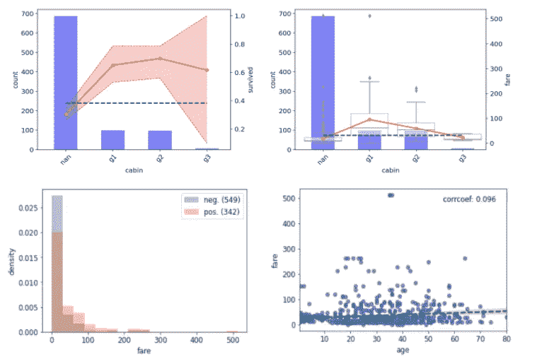
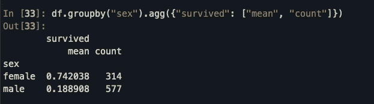
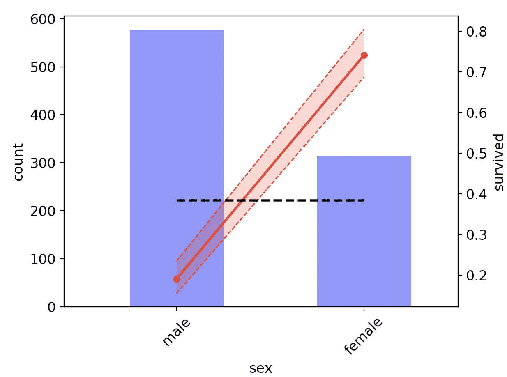
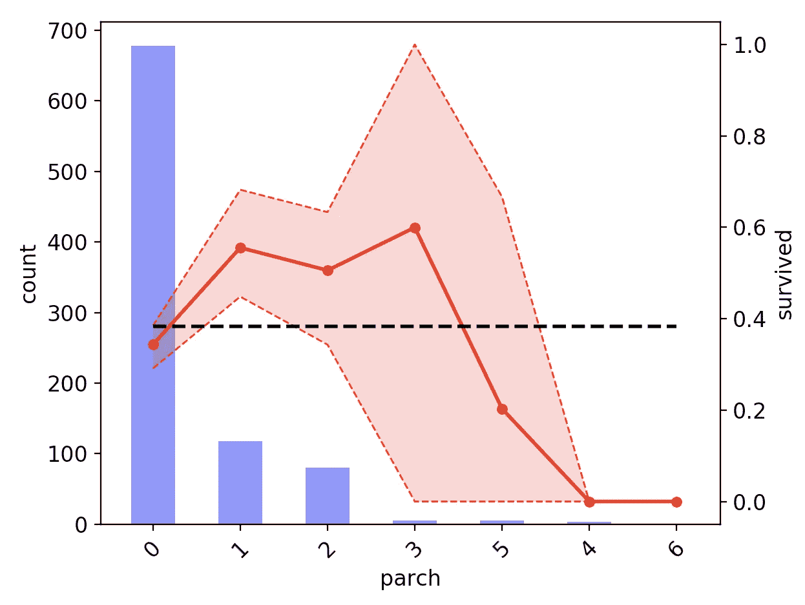
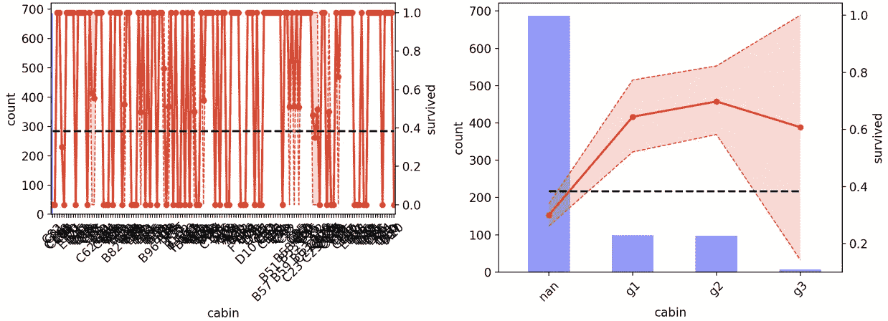
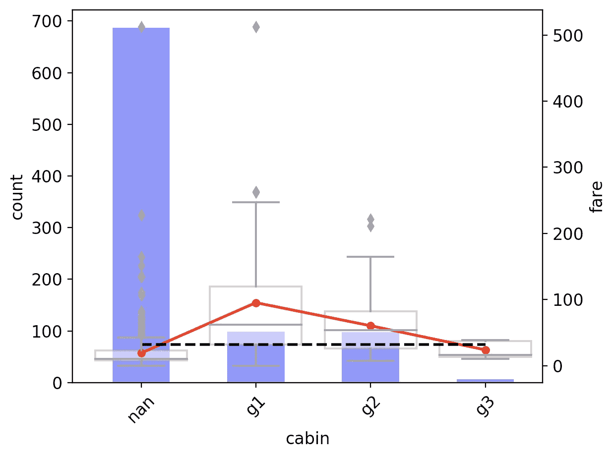
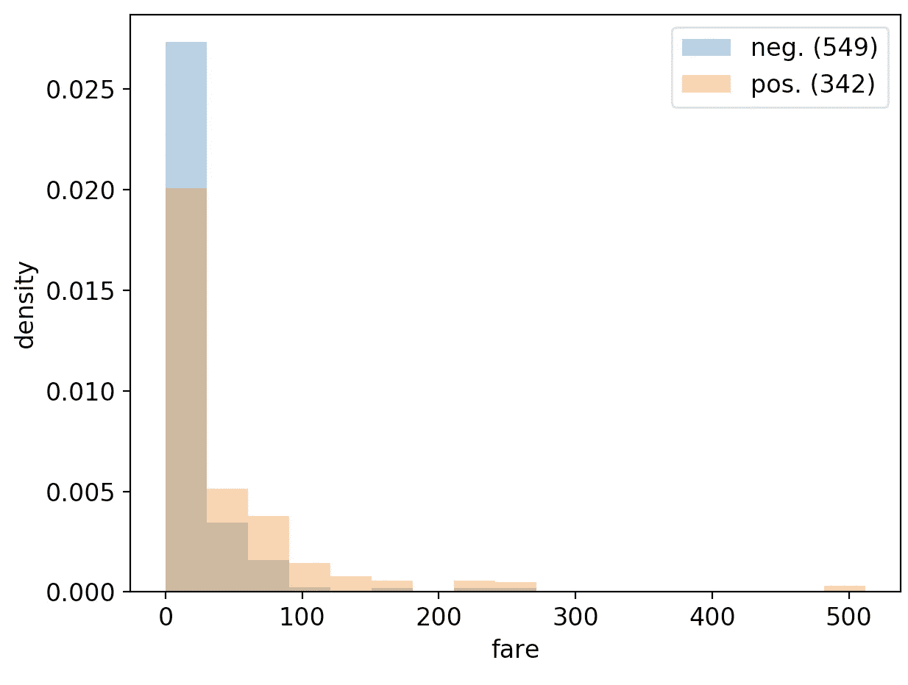

# 一个简单而有用的 EDA 数据可视化库

> 原文：<https://towardsdatascience.com/a-simple-yet-useful-data-visualization-library-for-your-eda-76c41a46d63b?source=collection_archive---------76----------------------->

## 探索性数据分析/双变量分析/数据科学

## 以有意义的方式可视化因变量和任何特征之间的关系



探索性数据分析(EDA)尤其适用于包含表格数据的项目。在 EDA 过程中，谨慎的数据科学家通常会通过寻找异常值或检查某些列是否有异常数量的缺失值来评估数据集的质量。EDA 也是初步了解预测变量和因变量之间的二元关系的理想平台。

对于连续数据，传统的线性相关系数通常表现不错，可以快速显示最具预测性的特征。然而，对于分类数据，事情变得有点复杂。

令我惊讶的是，我找不到一个 python 库*可以让你快速理解目标和任何预测器之间的关系，不管它们是什么类型(连续的还是分类的)。因此，我决定按照以下要求编写自己的工具:

*   提供与数据类型无关的统一接口
*   生成易于传达给非技术受众(如业务利益相关者)的视觉输出

这篇文章的目的是提供一个图书馆主要功能的游览。这个库被命名为 tprojection，它可以在 [GitHub](https://github.com/greghor/tprojection) 上获得，并且可以很容易地用 pip 安装

```
pip install tprojection
```

我将使用流行的 Titanic 数据集来说明该库的主要功能。

# 案例 1:目标和预测都是分类的

构建预测模型时，您通常会寻找允许您定义与目标值有很大差异的部分的特征。这些都是很好的预测。

当目标和预测器都是分类的时，您可以通过将目标投影到每个设备上来评估预测器的质量。这可以通过一个熊猫声明来实现:

```
df.groupby(predictor).agg({target: [“mean”, “count”]})
```

如果我们对预测值“性别”应用此命令，并且目标从 Titanic 数据集中“幸存”,我们将获得类似的结果:



从这个结果来看，很明显男性比女性更不容易存活。在其最基本的用途中，库投影将简单地提供一种可视的方式来携带上述信息。



此图表显示了目标“存活”和预测值“性别”之间的关系。蓝色条表示每种设备的观察次数(左侧 y 轴)。红线代表每个设备的目标平均值(右侧 y 轴)。黑色虚线表示目标在整个数据集上的平均值(右侧 y 轴)。红色阴影区域是通过引导数据估计的置信区间。

上面的图表可以用几行代码生成:

```
from tprojection import Tprojection
from tprojection.datasets import load_datadf = load_data("titanic")
target = "survived"
predictor = "sex"tproj = Tprojection(df, target, predictor, target_type=”categorical”, feature_type=”categorical”, n_estimators=100)
tproj.plot()
```

首先，用所需的参数和选项创建一个 Tprojection 实例。然后，调用方法`plot`并绘制图表。标题中提供了情节的完整描述。请注意，图表坐标轴存储为属性(`tproj.ax1`和`tproj.ax2`)，因此您可以轻松地更改图表的属性。

当观察数量变小时，置信区间(红色阴影区域)特别有用。在这种情况下，我们可能会观察到条件平均值与基线概率的较大偏差，这表明该模态适用于分割目标。然而，当置信区间很大时，这种解释必须小心。事实上，这意味着预测值和目标值之间的关系可能在不同的引导样本中有很大差异，这表明存在过度拟合的风险。

这种影响在下图中可以清楚地看到，该图分析了该目标对父母/子女人数的依赖性。对于模式`parch = 3`和`parch = 5`，我们观察到存活率相对较高，而相关的置信区间跨越基线概率的两侧。



目标“存活”和预测值“烤焦”之间的关系。

有趣的是，与`parch = 4` 和`parch = 6`相关联的置信区间的宽度等于零，即使相应的观察数量很小。当目标和模态之间存在一对一的关系时，就会发生这种情况。换句话说，在载有 4 或 6 名父母/儿童的乘客群体中没有幸存者。

该库还可以处理具有高基数的预测器。在这种情况下，显示设备的完整列表会使图表变得非常模糊。为了解决这一点，您可以向 tprojection 传递一个可选参数，该参数允许您根据最大值`nb_buckets`对设备进行分组。

```
tproj = Tprojection(df, target, “parch”, target_type=”categorical”, feature_type=”categorical”, n_estimators=100, nb_modalities=10)
tproj.plot()
```



预测者“小屋”和目标“幸存”之间的关系。左图显示原始设备，右图显示分时段设备。

上面的图表清楚地显示了这种方法的好处。左图显示了原始模态的预测值“舱室”和目标值之间的关系，无法阅读。右边的图更清晰，因为它只显示了一些编码的模态。可以通过一个属性来访问原始设备和编码设备之间的映射:

```
print(tproj.encoding)
```

当其他模态被分组时，投影将试图“按原样”保存具有足够数量观察值的模态。t 投影旨在构建包含大约相同数量观察值的`nb_buckets`组。然而，这并不总是可能的，特别是如果模式的分布严重倾斜。而实际情况往往如此。在上面的例子中，我们最初需要 10 个桶，但最终只需要 3 个桶。这是因为模态`cabin = nan`构成了几乎 80%的观察结果。因此，剩余的观察值仅分布在 3 个桶上。桶`g1`和`g2`各包含大约 10%的观测值，其余的分配给`g3`。

# 情况 2:目标是连续的，而预测值是分类的。

这在某种程度上是第一种情况的变体。除了目标平均值之外，我还添加了一个箱线图，描述目标在每种设备上的分布。置信区间的计算和显示已被禁用，以保持 viz 可读。

```
tproj = Tprojection(df, "fare", “cabin”, nb_modalities=10)
tproj.plot()
```



预测“舱位”(分桶)和目标“票价”之间的关系。

在上面的代码片段中，没有指定选项`target_type`和`predictor_type`。在这种情况下，库使用经验法则来评估变量是连续的还是分类的。

# 情况 3:目标是分类的，而预测值是连续的

在这种情况下，我们简单地比较由目标值决定的预测值的分布。为了便于比较，直方图被归一化。图例中提供了每个目标值的计数。

```
tproj = Tprojection(df, "survived", “fare")
tproj.plot()
```



预测值“票价”和目标值“存活”之间的关系。

默认情况下，正类对应于二进制目标的少数类。您可以通过用可选参数`target_modality`指定所需的值来改变这种行为。在这个阶段，tprojection 还不能真正处理多类问题，但是请注意，您可以通过使用`target_modality` kwarg 来模拟一种以一敌众的方法。

# 情况 4:预测值和特征都是连续的

包含这个案例是为了详尽，但它肯定不是项目带来最大价值的地方。该库只显示两个变量的散点图以及线性相关系数。还显示了从 seaborn `regplot`方法得出的最佳回归线。没有额外的特殊功能，因为有许多好的工具提供高级功能来分析两个连续变量之间的相关性。

```
tproj = Tprojection(df, "fare", “age")
tproj.plot()
```


预测值“年龄”和目标值“票价”之间的关系。

那都是乡亲们！我希望你会发现这个简单的库很有用。随意派生出 [repo](https://github.com/greghor/tprojection) ，破解代码，并使其适应您的需求。

**免责声明:我在发布这个帖子之前发现了伟大的* [*sweetviz*](/powerful-eda-exploratory-data-analysis-in-just-two-lines-of-code-using-sweetviz-6c943d32f34) *库。尽管 sweetviz 包括类似的功能和更多功能，我仍然认为 tprojection 带来了有趣的特性。尤其是关于置信区间的内置估计或它处理高基数预测值的方式。*