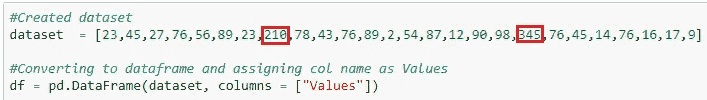
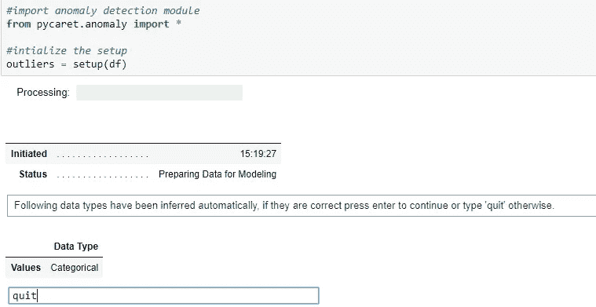
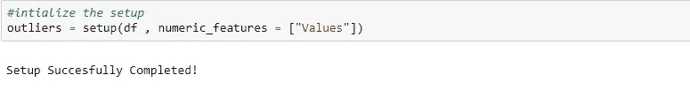
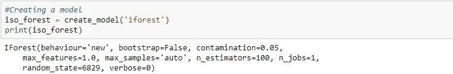
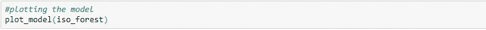
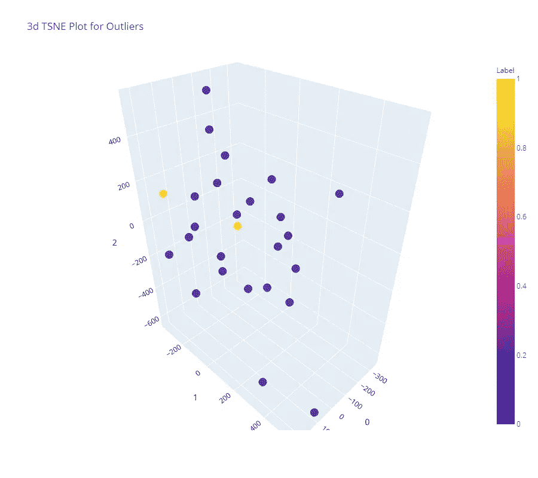
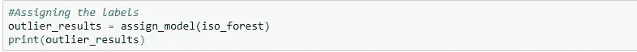
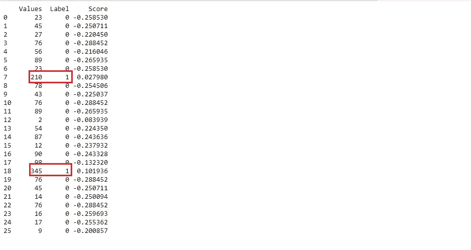

# 一种使用 PyCaret 进行异常检测的简化方法

> 原文：<https://towardsdatascience.com/a-simplified-approach-using-pycaret-for-anomaly-detection-7d33aca3f066?source=collection_archive---------44----------------------->

## 用 python 中的 PyCaret 包解释离群点检测。

鲁珀特·布里顿在 Unsplash 上拍摄的照片

什么是异常？

按照谷歌的定义“ ***”偏离标准、正常或预期的*** ”的东西。同样的引用适用于数据科学领域，我们遇到了这样的异常，需要检测、处理或消除这些异常，以提供更好的业务解决方案或建立最佳的预测机器学习模型。就数据集而言，这些异常也被称为“异常值”，也指新奇、噪声、偏差和异常。

**异常检测用例**

有各种各样的领域实施这种技术，例如故障检测、入侵、欺诈检测、医疗保健监控、检测生态系统干扰等等。

在本文中，我们将学习如何使用 python 中的 PyCaret 库，通过几个步骤来检测给定数据集的异常值。

👉**安装 PyCaret 库**

建议在安装 PyCaret 库之前创建一个单独的 Conda 环境。如果您尝试在基本环境中安装它，可能会出现一些与依赖项相关的错误。当我尝试在一个新的单独的 Conda 环境中安装时，它很容易安装。要通过创建新的 Conda env 来了解安装的完整细节，请单击[ [此处](https://pycaret.org/install/)

为了演示 PyCaret 库的异常值检测，我创建了一个数据集，并有意引入了一些极值。

*在继续之前，请查看异常检测模块文档及其工作原理，以便更好地理解[* [*此处为*](https://pycaret.org/anomaly-detection/) *]*

👉**创建数据集**

数据集中突出显示的异常值

👉**导入模块并初始化设置()**

setup()函数将采用强制数据帧参数，并在执行后开始处理。它自动推断变量的所有数据类型，要求我们确认或退出。从下面可以看出，数据类型被推断为分类的而不是数值的。我们需要包含另一个参数来更改数据类型。

输入退出，因为数据类型不是分类的

添加 numeric_features 参数后安装完成

👉**创建模型**

create_model()函数用于创建模型，有许多预定义的算法可用。我选择了“隔离森林”估计量，缩写为“iforest”。它返回训练好的模型对象。它们是“knn”，“PCA”，“SVM”，以及更多可供探索的模型。

使用 iforest 训练模型

👉**可视化离群值**

感谢 PyCaret 如此精彩的 3d 剧情。从下面的图中，我们可以看到黄点代表异常值，这些标记为 1。

表示标签的 3D 可视化绘图

👉**分配标签**

assign_model()函数返回带有异常值标志(1 =异常值，0 =内部值)和决策得分的数据帧。

离群值用标签值 1 表示

现在我们可以看到 PyCaret 如何轻松地检测异常值。还有其他函数也可用于预测，以便在该模块中保存和部署模型。请在此浏览 py caret[中异常检测模块的文档](https://pycaret.org/anomaly-detection/)

**总结**

在数据科学领域，有许多统计技术和传统方法可用于检测异常值。人们应该了解这些技术，以获得这一概念背后的基本原理，并在处理异常值时理解业务的细微差别。

本文通过一个示例数据集来展示 PyCaret 库在异常检测方面的强大功能，以便更好地理解。您可以使用真实数据集在项目中实现这种方法，以节省时间并捕捉美丽的图形。

*我成为了 PyCaret 库的粉丝，我希望你也能经历同样的事情*😊

你可以从我的 GitHub [ [链接](https://github.com/SushmithaPulagam/Anomaly-Detection_PyCaret) ]中找到代码

**参考文献**

1.  [https://pycaret.org/anomaly-detection/](https://pycaret.org/anomaly-detection/)
2.  [https://pycaret.org/](https://pycaret.org/)
3.  [https://www.youtube.com/watch?v=q0dxYDq1A40](https://www.youtube.com/watch?v=q0dxYDq1A40)

感谢阅读，快乐学习！🙂