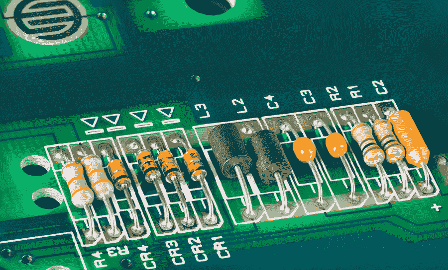
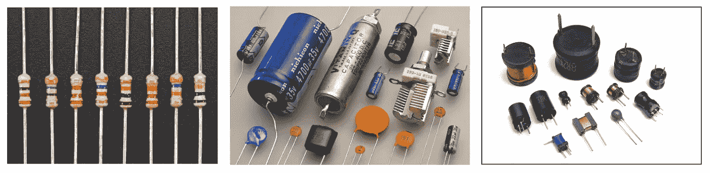
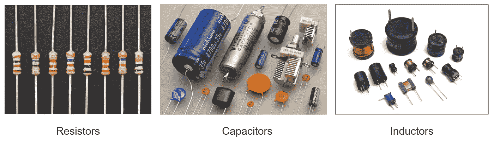
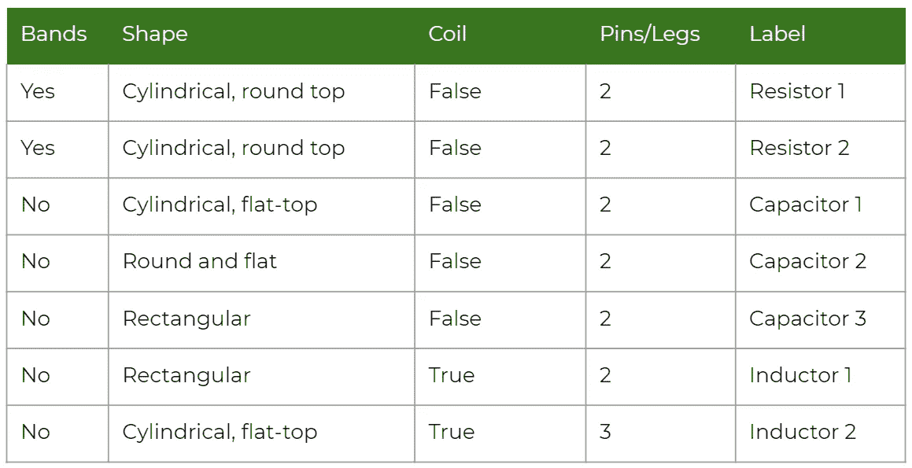
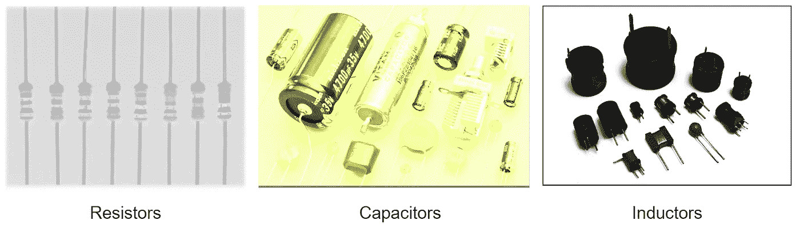
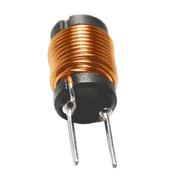

# ML 术语被终结:电气和电子工程师的监督机器学习

> 原文：<https://towardsdatascience.com/a-simplified-explanation-of-supervised-machine-learning-for-electrical-and-electronics-engineers-6d533cdedc6d?source=collection_archive---------63----------------------->

## 电气和电子工程师监督机器学习术语的简单解释

如果你进入了电气或电子工程领域(就像我曾经自己一样)，你可能一直在和电阻、电容和电感打交道。

假设您以前没有去过实验室，但您还是仔细阅读了实验室分发的材料，并且能够识别出在实验过程中提供给您的不同电阻、电容和电感。

恭喜你！你的大脑刚刚执行了一个监督机器学习算法。

[图像来源](https://www.google.com/url?sa=i&url=https%3A%2F%2Fresources.altium.com%2Fp%2Frole-decoupling-inductor-and-resistor-pdn&psig=AOvVaw14tPlqH3eI_SGIBWJKxFD2&ust=1594200515868000&source=images&cd=vfe&ved=0CAMQjB1qFwoTCMiMwKT1uuoCFQAAAAAdAAAAABAD)

## 为什么我称之为监督？

因为你已经知道它们是什么，它们看起来是什么样子，可能是它们如何工作的一些细节。这是训练机器的经典方法之一，向它们提供每个小数据单元的含义。

# 因此，让我们按顺序将其分解为机器学习术语:

# 1.实例或数据点

知识的来源是以文本、数字或图像的形式呈现的信息单元，就像你在去实验室之前已经在你的讲义中学习过的那样。对你来说，成功识别的食物是你手中的照片，可能类似于下面的照片。

图像来源:[图像一](https://cdn-shop.adafruit.com/970x728/2892-00.jpg)、[图像二](https://en.wikipedia.org/wiki/File:Capacitors_(7189597135).jpg)、[图像三](https://www.norwegiancreations.com/wp-content/uploads/2016/04/spoler-1140x641.jpg)

# 2.数据标志

你认为之前的图像有足够的信息吗？你怎么知道哪张图是电阻还是电容？你的传单上一定有图片说明。所以你知道了每张图片对应的是什么。

考虑一下这个:

图像来源:[图像 1](https://cdn-shop.adafruit.com/970x728/2892-00.jpg) 、[图像 2](https://en.wikipedia.org/wiki/File:Capacitors_(7189597135).jpg) 、[图像 3](https://www.norwegiancreations.com/wp-content/uploads/2016/04/spoler-1140x641.jpg)

因此，每当你指出一个实例并告诉你的计算机它是什么时，它就被称为**数据标签**，无论你告诉你的计算机关于你的实例的什么都是你的**数据标签**。

# 3.特征

你有没有注意到电阻的黄色调和红蓝带？或者可能是他们的沙漏图。你一定注意到了电容器的圆柱形状。陶瓷电容器是圆形和扁平的。至于电感，你一定注意到了它们周围的线圈。

这些都是电阻、电容和电感的特性或特征，有助于你正确识别它们。你基本上有一个如何识别它们的思维导图，但是在把它们输入 Excel 表格后，看起来会像这样。

你看到“标签”一栏了吗？这个标签列就是我们在电子白板上预测的那个。

# 4.培训用数据

你在传单上读到的一切都是你的训练数据。对于一个机器学习算法来说，表中的观察值汇总就是训练数据。

# 5.监督机器学习算法

一旦你在脑海中有了自己的特征，你就已经试着在黑板上寻找模式并匹配它们。人类的思维很敏捷，不是吗？

机器学习模型的基础是良好的数据。

图像来源:[图像一](https://cdn-shop.adafruit.com/970x728/2892-00.jpg)、[图像二](https://en.wikipedia.org/wiki/File:Capacitors_(7189597135).jpg)、[图像三](https://www.norwegiancreations.com/wp-content/uploads/2016/04/spoler-1140x641.jpg)

如果你有这样的图像，就很难画出图案。机器学习算法本质上是从训练数据中的大量实例中学习，并试图找到类似人脑的模式。

## 但是我们为什么需要机器学习算法呢？

这里看起来很简单，有三个不同的标签。嗯，在大多数真实世界的场景中，情况并非如此。将会有成千上万的标签和天文训练实例。这能用人脑测量吗？不是吧？我们有自己的局限性，这就是为什么我们需要计算机辅助预测。我们利用机器的巨大计算能力，这就是为什么使用机器来学习模式是重要的。

# 6.测试数据和性能

当你试图从一个电容中识别出一个电阻时，你已经在处理测试数据了。测试数据是机器应用识别的模式并试图预测标签的看不见的实例。

现在，想象一下，如果您的实验室教师对每个正确的电阻给一分，对每个识别错误的电阻扣一分。然后将你的总分加起来，你发现你在我们班排名第五。

类似地，机器学习算法根据其在测试数据上的性能进行评估。对于监督学习，最常见的指标是准确度、精确度和召回率。重要的是要评估性能指标，以了解哪个是性能最好的模型。

# 7.因此，让我们尝试一个测试实例

你认为这是什么？

[图像来源](https://p.globalsources.com/IMAGES/PDT/B1167277720/Ferrite-Power-Inductor-Radial-Lead-Inductors-Operating-Temperature-and-Wide-Frequency-Range.jpg)

两个固定的圆柱形平顶物体，有一个线圈——它是一个感应器。

***盛大，你猜对了！您刚刚使用训练数据集中的特征通过监督方法正确标记了一个看不见的感应器，这就是监督 ML 算法所做的事情！***

*图片来源:图片用于演示，来源于图片标题中提到的链接。没有侵犯版权的意图。*

**我的链接:** [中](https://medium.com/@nroy0110)|[LinkedIn](https://www.linkedin.com/in/nabanita-roy/)|[GitHub](https://github.com/royn5618)

***感谢光临。我希望你喜欢阅读这篇博客。***