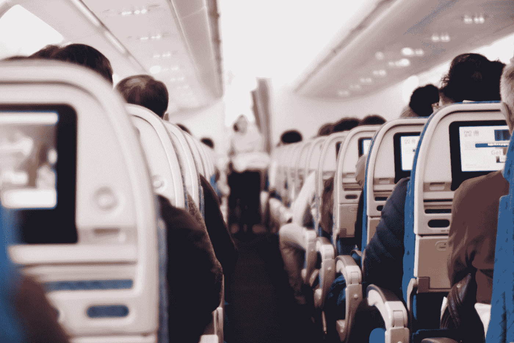
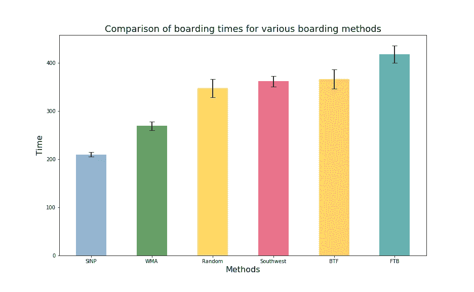

# 分析飞机登机方法的模拟框架

> 原文：<https://towardsdatascience.com/a-simulation-framework-to-analyze-airplane-boarding-methods-410def726350?source=collection_archive---------14----------------------->

## 开发 Python 程序来计算各种配置的登机时间并可视化登机程序



照片由 [Suhyeon Choi](https://unsplash.com/@by_syeoni?utm_source=medium&utm_medium=referral) 在 [Unsplash](https://unsplash.com?utm_source=medium&utm_medium=referral) 上拍摄

# 1.介绍

人们害怕字母 C 有各种各样的原因。较低的学术等级用 C 表示，复杂的、较低级的编程语言被命名为 C，然而，在一个晴朗的冬天早晨，最让我害怕的 C 出现在我的登机牌上——西南寄宿组 C。

对于那些不熟悉西南航空公司登机流程的人，在办理登机手续时，您会被分配到三个组别(A、B 或 C)中的一个。A 组先登机，然后是 B 组，最后是 c 组。每个人在队列中都有一个号码(例如 A-10 或 B-25)，并根据各自组的号码登机。当我的航班被指定 C-10 号时，你可以理解我的沮丧。

因此，我是最后几个登机的人之一。当 A 组和 B 组登机的时候，我在悲伤和安静的沉思中度过。我从来没有真正考虑过航空公司如何选择登机，但那天我考虑了。我想知道分析登机程序和比较各种方法的性能的可能性。

# 2.这个想法

如果给你一架飞机和几百名志愿者，让你测试一种登机方法的性能，你会怎么做？简单！给他们分配座位，排好队，装满飞机，测量完成这个过程需要的时间。

但是我没有飞机，我也不认为我能说服几百个人浪费他们宝贵的时间来满足我狂热的好奇心。所以我考虑在电脑上做同样的事情(这没什么可抱怨的)。

主要思想可以分为以下五点:

*   将飞机座位图表示为一个矩阵，每个元素都有一个唯一的索引(座位号)。
*   将外面的乘客队列和过道表示为一维数组。
*   给每位乘客一个预定义的座位号和他们在过道上移动的速度。
*   根据启发法，定义将乘客从过道转移到各自指定座位的规则。例如，移动到空行比移动到有人坐的行的座位更快。
*   将乘客从最初的队列转移到过道，然后转移到他们的座位，直到所有座位都被占用。然后测量整个过程所用的时间。

现在我们已经定义了原始的想法，让我们试着把它转化成一个算法，并用代码实现它。

# 3.定义移动规则

在我们开始编写代码之前，我们需要基于行为学定义一些东西，比如乘客速度和移动规则。

## 3.1 乘客通道移动

让我们假设一般人在过道里从一个座位移动到另一个座位所需的时间是 1 。请注意，我们在这里没有定义任何单位(如 s 或 min)。你可以认为这是无量纲的时间。

如果我们将时间 1 分配给所有乘客，由于每个人都有自己不同的速度，该模型将不太适用于现实生活。为了让它更真实，**我们可以从平均值为 1、标准偏差为 0.2** (这是任意的，可以改变)的高斯分布(或钟形曲线)中采样通道移动的时间。因此，我们可以考虑乘客速度的可变性。

## 3.2 存放行李和座椅移动

当乘客到达他们指定的座位时，他们会先把行李放在头顶的行李架上，然后移到他们的座位上。这会占用一些时间，并导致后面的乘客停下来。让我们假设这个时间等于 2(移动时间的两倍)。

关于从过道到座位的移动规则，有 6 种可能的情况:

*   靠窗的座位，相邻的两个座位空着。
*   靠窗的座位，中间的座位有人，靠走廊的座位空着。
*   中间和过道都有人的靠窗座位。
*   中间靠过道的座位空着。
*   中间靠过道的座位有人。
*   靠过道的座位。

从过道移动到相应座位所需的时间取决于以下哪种情况适用。对于靠窗的座位，如果相邻的座位是空的，搬进去会更快。否则，相邻座位上的人必须首先走到过道，让乘客进来，然后回到自己的位置上。所有这些都会占用登机过程中的大量时间。

因此，计算每个乘客在每个场景中需要走多少步，**我们可以定义一组乘数，当乘以乘客的移动时间，给出移动到特定座位所需的时间。**

我们将乘数定义如下(每个乘数加 2 以说明行李的存放):

*   空行:1+2=3
*   过道占用:4+2=6
*   中间被占用:5+2=7
*   过道和中间有人:7+2=9

我们现在准备开始算法和代码。

# 4.用 Python 实现

我们将在 Jupyter 笔记本中详细介绍上述想法的实现。代码片段贴在下面，整个 Jupyter 笔记本的链接在最后给出。

## 步骤 1:初始化

我们将只需要 *scipy* 模块进行模拟，所以我们从导入它开始。

**注意:**像可视化这样的附加特性将需要像 *matplotlib* 这样的绘图工具，但这不包括在本演示中。关于可视化，请参考文章末尾的“可视化说明”。

```
import scipy as sci
```

首先，我们需要初始化许多参数和数组/矩阵来存储所有的乘客数据。由于西南航空公司通常使用一架**波音 737** ，我们将把它的规格包括在我们的模型中。它有 **23 行**和 **6 列。**

我们将使用大量的字典来记录事物。所有乘客都将被分配一个从 0 到 137 的独一无二的识别号码(比如说 UIN 的号码),这个号码将作为我们字典的密钥。下面定义的变量执行以下功能:

*   *座位*:存储飞机座位图(-1 表示无人，乘客 UIN 表示有人)
*   *过道 _q* :存储飞机的过道车道(-1 表示无人，乘客 UIN 表示有人)
*   *pass_q* :存储机外乘客队列(乘客 uin 列表，从 0 到 137)
*   *row_q_init* 和 *col_q_init* :存储分配给每位乘客的座位行号和列号。

*moveto* 数组和字典将在后面的章节中解释。

```
#Initialize
#Define number of rows and columns
n_rows=23
n_cols=6#Calculate number of passengers
n_pass=n_rows*n_cols#Create seat matrix
seats=sci.zeros((n_rows,n_cols))
seats[:,:]=-1#Create aisle array
aisle_q=sci.zeros(n_rows)
aisle_q[:]=-1#Create initial passenger number queue
pass_q=[int(i) for i in range(n_pass)]
pass_q=sci.array(pass_q)#Create array for seat nos
row_q_init=sci.zeros(n_pass)
col_q_init=sci.zeros(n_pass)#Let's create moveto arrays
moveto_loc=sci.zeros(n_pass)
moveto_time=sci.zeros(n_pass)moveto_loc_dict={i:j for i in pass_q for j in moveto_loc}
moveto_time_dict={i:j for i in pass_q for j in moveto_time}
```

## 第二步:分配座位

在乘客进入过道之前，他们需要分配座位。座位分配的顺序取决于登机方式。例如，与随机订单相比，从后到前的董事会订单将有不同的座位分配。

我们将在这里看一下两种不同的座位分配(更多信息，请参考文章末尾的 Jupyter 笔记本)。我们将在这里定义一个函数，它接受行和列数组(空)，一个指定分配类型、乘客数量和行数的字符串(最后两个是预定义的)。这里定义的第一个顺序是**超理想不实际(SINP)** ，第二个是**随机**顺序。

我们将在最后看一下各种不同的登机方法及其结果，但现在，SINP 包括首先填满所有的窗口，然后是所有的中间，然后是所有的过道，这样就绝对不会浪费时间在换座位上。这是(几乎)最理想的寄宿方式。随机是不言自明的——座位分配是随机的。

代码中需要理解的内容:

*   0 和 5 列指的是窗口
*   1 和 4 列指的是中间
*   第 2 栏和第 3 栏指的是过道

很难定义座位顺序，因为它本质上涉及到 2D 座位图到 1D 乘客队列的编码。有多种方法可以做到这一点，下面的代码代表了其中一种可能的方法。你可以自由地尝试你自己的顺序和方法来定义它们。

```
def AssignSeats(rq,cq,assign_type,n_pass=n_pass,n_rows=n_rows):
    if(assign_type=="SINP"):
        #Initialize initial and final positions
        i=0
        f=n_rows

        #Define column seating positions 
        c=[0,5,1,4,2,3]

        #Define iteratiion counter
        count=0

        #Assign queue
        while(f<=n_pass):
            rq[i:f]=list(reversed(range(0,n_rows)))
            cq[i:f]=[c[count]]*n_rows
            i+=n_rows
            f+=n_rows
            count+=1

    if(assign_type=="Random"):
        #Initialize possible row positions
        av_rows=sci.arange(0,n_rows,1)
        #Make as many copies of these positions as the number of columns
        av_rows=sci.tile(av_rows,(n_cols,1))
        av_rows=av_rows.T.flatten()

        #Initialize possible column positions
        av_cols=sci.arange(0,n_cols,1)
        #Make as many copies of these positions as the number of rows
        av_cols=sci.tile(av_cols,(n_rows,1)).flatten()

        #Create list of all possbile seat positions
        av_seats=sci.zeros((n_pass,2))
        for i in range(n_pass):
            av_seats[i]=[av_rows[i],av_cols[i]]

        #Randomize seat positions
        sci.random.shuffle(av_seats)
        rq=av_seats[:,0]
        cq=av_seats[:,1]return rq,cq
```

## 第三步:定义时间，运动规则和字典

现在我们已经定义了分配座位的函数，是时候使用它来创建我们的乘客队列了。出于演示的目的，我们将使用 **random** 。

此外，我们需要为每个乘客分配移动时间(基于高斯分布)并定义我们的乘数。

我们还需要将所有这些信息编码到字典中，以便根据每个乘客的 UIN 轻松获得他们的时间和座位分配。

最后，我们需要定义这里所谓的 *sum_time* 。当时间到的时候，每个乘客都必须从外面的乘客队列移到过道。这基本上是在他们前面的乘客的时间总和已经过去的时候。然后你会看到**我们需要定义一个数组，数组中的每个元素都等于当前乘客的时间和前面乘客的时间之和。**

```
#Assign seating order
row_q,col_q=AssignSeats(row_q_init,col_q_init,"Southwest")#Create array for times
mean_time=1.
stddev_time=0.2
time_q=sci.random.normal(loc=mean_time,scale=stddev_time,size=n_pass)#Define multipliers (+2 for stowing luggage)
empty_mult=1+2
aisle_mult=4+2
middle_mult=5+2
aisle_middle_mult=7+2#Create seat and speed dictionary
pass_dict={}
time_dict={}seat_nos=sci.column_stack((row_q,col_q))
for i in range(n_pass):
    pass_dict[i]=seat_nos[i]for i in range(n_pass):
    time_dict[i]=time_q[i]#Create sum time array
sum_time=sci.zeros(n_pass)
for i in range(n_pass):
    sum_time[i]=sum(time_q[:i+1])
```

## 步骤 4:定义从乘客队列到过道的移动

我们的乘客队伍已经在飞机外面准备好了。在我们开始登机之前，我们需要定义他们从外面的队列到里面的通道的移动。这可以通过定义一个简单的函数来完成。该功能检查乘客的 *sum_time* 是否已过。如果有(并且通道中的第一个位置是空的)，那么它将乘客的 UIN 复制到通道中，并从乘客队列中删除它。因此，随着时间的推移，乘客队伍将变得越来越短，最终会空出来。

```
#Create function to move passengers into aircraft
def MoveToAisle(t,aisle_q,pass_q,sum_time):
    if(t>sum_time[0]):
        if(aisle_q[0]==-1):
            aisle_q[0]=pass_q[0].copy()
            pass_q=sci.delete(pass_q,0)
            sum_time=sci.delete(sum_time,0)
    return aisle_q,pass_q,sum_time
```

## 第五步:让乘客登机

这是代码中最复杂的部分，因为它涉及到嵌套许多 if 条件和玩弄字典。

**基本理念是为乘客分配行动，要么分配到他们过道前面的位置，要么分配到他们的座位(如果他们已经到达那一排)，当时间到了，通过像移动棋子一样移动乘客来“行动”。**每位乘客将在通道中向前移动一段等于其移动时间的时间，并在一段等于其移动时间乘以适当乘数的时间后进入座位。

算法如下:

1.  浏览所有过道元素。对于过道中的每个乘客，执行以下操作。
2.  检查是否有任何移动被分配给乘客。
3.  如果已经分配了移动，检查时间是否已经过去。如果有，将乘客移到他们的座位(如果他们已经到达指定的排)或过道的下一个位置(如果是空的)。如果时间还没有过去，什么也不要做。
4.  如果没有分配移动，请参考乘客座椅分配。如果他们已经到达分配给他们的排，给他们各自的座位分配一个移动，并分配一个适当的移动时间。如果他们还没有到达分配给他们的排，分配一个移动到通道中的下一个位置，并分配一个合适的移动时间。
5.  更新时间并返回步骤 1。

算法退出条件如下:座位图中所有乘客的 uin 之和必须与飞机外初始乘客队列中所有乘客的 uin 之和相匹配。

下面的代码墙可能看起来很长，令人望而生畏，但几乎每一步之后都有注释来解释。

# 5.结果

文章中给出的代码只能为一种登机方法运行一次登机程序。如果该过程重复多次，则可以为每种登机方法计算平均时间(以及等于标准偏差的误差)。这是针对六种不同的方法进行的，并且比较了它们的时间。每个登机方法模拟运行 20 次。

## 5.1 超理想不实际(SINP)

方法:首先登上所有窗户，然后是中间，最后是过道。然而，必须这样做，使得第一个乘客到最后一排，第二个到倒数第二排，等等，以确保没有时间浪费在站在过道上。

**时间:**210**5**

## 5.2 窗口-中间-过道(WMA):

**方法:**这类似于 SINP，但是窗户、中间和过道是随机登上的，这样一些时间就浪费在过道上了。这种方法被一些航空公司使用，比如联合航空。

**时间:**269**9**

## 5.3 随机

**方法:**随机登板，无特定方案或顺序。

时间: 347 19

## 5.4 西南

方法:没有“西南方法”，因为开放式座位意味着你可以坐任何你想坐的座位。然而，我在西南航空公司的航班上观察到了一种特殊的模式，这种模式是由于乘客的偏好而产生的。通常情况下，飞机前部的靠窗和靠过道的座位会被占满，然后是后面的座位。接下来，所有的中间座位都是从前到后填满的(对飞机中间座位的厌恶似乎是普遍的，因此给西南航空公司的登机过程提供了某种模式)。

**时间:** 362 11

## 5.5 从后到前(BTF)

**方法:**分三组登机，第一组占飞机后三分之一，最后一组占前三分之一。这是大多数航空公司登上经济舱的方法。

时间: 366 20

## 5.6 从前到后(FTB)

方法:你了解 BTF 吗？把它反过来。这听起来是个糟糕的主意，对吗？头等舱、商务舱和非常特别的超级高级行政舱的座位就是这样做的。

**时间:** 418 18

# 6.讨论



一些意见和相关结论:

*   模型给出的时间数字只有在比较这些方法时才有意义。如果我们需要以秒或分钟为单位的精确登机时间，我们需要根据实验数据定义移动时间和乘数。
*   **SINP** 和 **WMA** 方法提供了比其他方法更高的性能，因为在过道上的等待时间明显更少，座位移动也更少。它们的标准差也很低，因为其中有相当小的随机因素。
*   令人惊讶的是(也可能不是，根据实验和其他计算机模拟)，随机方法比常用方法更好。这是因为如果人们真的是随机分布的，过道里的等待时间会更少。
*   西南和 BTF 的方法同样有效。虽然《流言终结者》的研究显示，西南方的方法比普通的 BTF method⁴方法要好得多，但由于我们在模型中所做的假设，这种方法在这里可能没有得到很好的体现。一个更详细的模型，允许乘客动态地占据空的位置和那些导致更少等待时间的位置，可能会导致西南方法的更好性能。
*   毫不奇怪，FTB 的方法效果最差。即使从视觉上也很清楚，这种方法具有最长的过道等待时间，当乘客从前到后占据座位时，会导致非常频繁的停车。

SINP 方法似乎是完美的缩影(尽管一点也不实用)。然而，在 Jason Steffen 的一篇研究文章中，实际上定义了一种更快的理论方法，称为 Steffen 方法。你可以从文章末尾的链接中了解更多信息。

# 7.关于可视化的注释

本文中的视觉效果是通过在每几次迭代后捕捉座位图矩阵，并使用 *matplotlib* 制作 *imshow* 图来生成的。然而，我没有在文章中包含代码，因为它不涉及任何算法复杂性，而只是一些绘图技巧。

我已经编写了一个通用程序，可以解决任何方法(如果需要的话，可以多次)并绘制一个可以保存的动画。可以[在 GitHub](https://github.com/gauravsdeshmukh/AirplaneBoardingSim) 上查看并下载。

如果您想查看模拟的 Jupyter 笔记本，请点击此处。

# 参考资料和阅读

1.  “不同的航空公司如何搭载他们的乘客”(Lifehacker)，[https://life hacker . com/How-Different-Airlines-Board-Their-Passengers-1794474413](https://lifehacker.com/how-different-airlines-board-their-passengers-1794474413)
2.  “飞机登机方法实验测试”(杰森·h·斯特芬，乔恩·霍奇基斯)，【https://arxiv.org/pdf/1108.5211v1.pdf 
3.  “航空公司乘客的最佳登机方法”(杰森·h·斯特芬)，[https://arxiv.org/pdf/0802.0733.pdf](https://arxiv.org/pdf/0802.0733.pdf)
4.  《流言终结者》第 222 集:飞机登机(流言终结者)[https://mythresults.com//airplane-boarding](https://mythresults.com//airplane-boarding)

关于这个话题的一个有趣的视频:“航空公司不会使用的更好的登机方法”(CGP Grey 在 YouTube 上)，[https://www.youtube.com/watch?v=oAHbLRjF0vo&VL = en](https://www.youtube.com/watch?v=oAHbLRjF0vo&vl=en)

**免责声明:**这篇文章和分析背后的动机纯粹是好奇，而不是试图证明任何一种方法优于另一种方法。

如果您有任何问题、意见或建议，您可以[给我发电子邮件](mailto: gauravsdeshmukh@outlook.com)或[在 Twitter 上联系我](https://twitter.com/intent/follow?screen_name=ChemAndCode)。