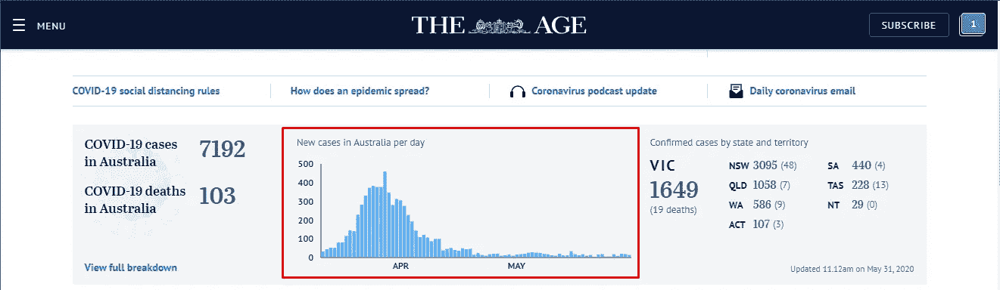
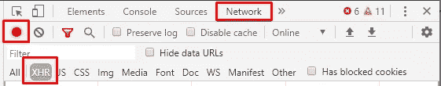
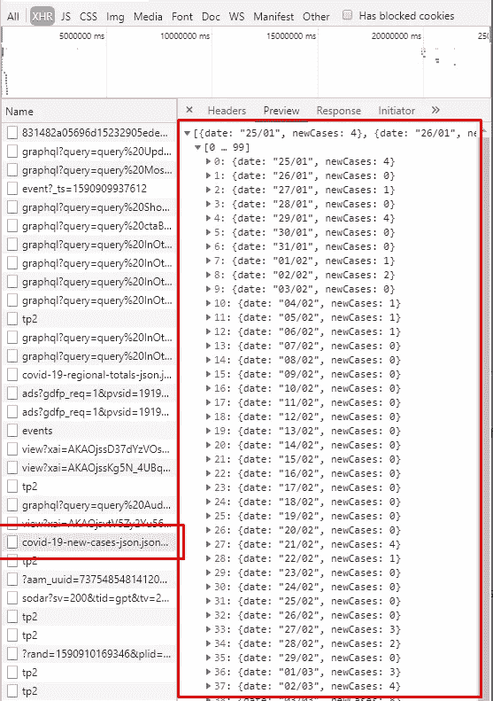
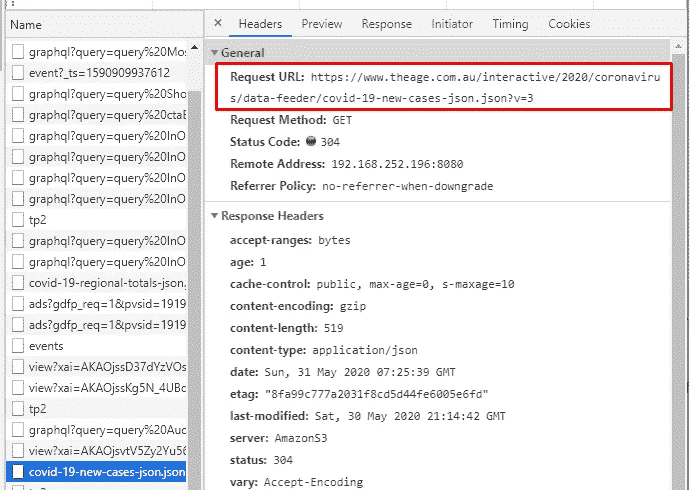
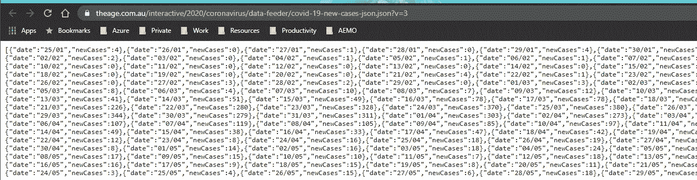
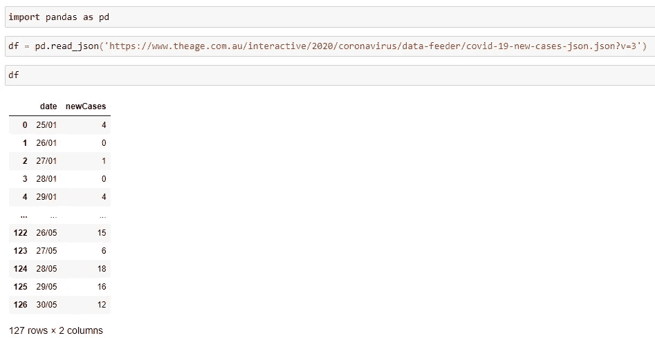
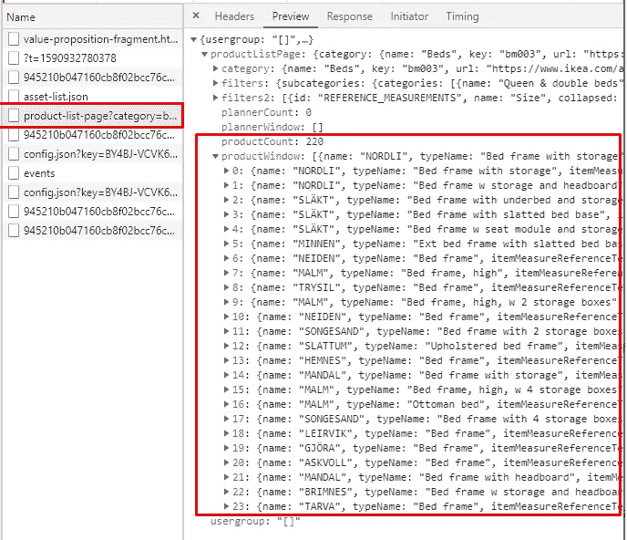
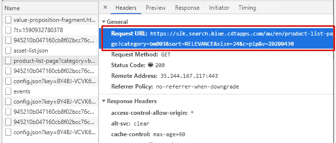
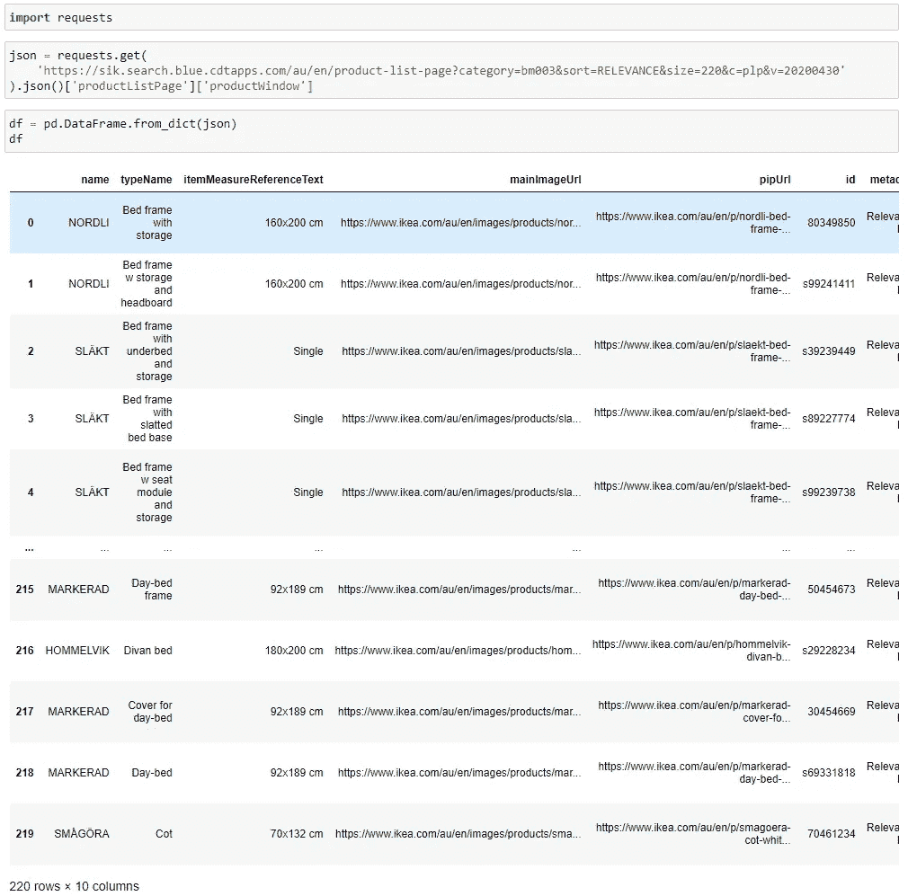

# 从网页中抓取数据集的一行 Python 代码

> 原文：<https://towardsdatascience.com/a-single-line-of-python-code-scraping-dataset-from-webpages-c9d2a8805d61?source=collection_archive---------10----------------------->


马库斯·斯皮斯克在 [Unsplash](https://unsplash.com?utm_source=medium&utm_medium=referral) 上的照片

## 使用 Python 从网页和下载中搜寻 API 端点

无论我们拥有什么水平的数据科学/分析技能，没有数据集你什么都做不了。

的确，有许多开源数据集，如 Kaggle 和 Data.world。然而，它们更适合用于练习和学习目的，但可能无法满足我们的一般需求。

通常，数据科学家/分析师可能有或多或少的网络搜集技能，所以无论何时你在网站上看到数据集，都更容易获得。从网站上抓取内容后，一系列的转换、提取和清洗操作将帮助我们为下一步获取干净的数据集。这是 Python 的典型用法之一，因为 Python 中有很多优秀的 web 抓取库可用，比如 Scrapy 和 Beautiful Soup。

然而，学习这些网络抓取库并不容易。此外，对于那些没有 web 开发背景的人来说，这可能不是数据科学家/分析师的常见技能，理解和确定 HTML DOM 和 XPath 等概念可能会更加困难。

然而，在本文中，我将介绍一种更简单的从网站下载数据集的方法。你会发现你甚至可以用熊猫来做所有的工作！

# 新冠肺炎新病例数据集


照片由[马丁·桑切斯](https://unsplash.com/@martinsanchez?utm_source=medium&utm_medium=referral)在 [Unsplash](https://unsplash.com?utm_source=medium&utm_medium=referral) 拍摄

第一个例子是新冠肺炎新案例数据集。原来有许多公开的数据来源，如政府网站将公布这一点。然而，我只是想以此为例，因为我发现这是一个非常好的典型例子。

今天，当我从“时代”(澳大利亚的一个受欢迎的媒体)网站扫描新闻时，我发现有一个条形图显示澳大利亚每天新增的确诊病例(见下面的截图)。



截图来自网站:[https://www.theage.com.au/](https://www.theage.com.au/)

如果我想得到他们的数据呢？让我们找到它的 API 端点！

## 搜寻 API 端点

现在大多数流行的 web 浏览器都提供了它们的开发人员控制台。我们将使用控制台来完成这项工作。以下是从浏览器调用控制台的一些快捷方式:

*   谷歌浏览器:Ctrl + Shift + I
*   火狐:Ctrl + Shift + K
*   微软 Edge: F12

在这里我将使用谷歌浏览器进行演示。但是不用担心，大多数浏览器都有非常相似的开发者控制台。相信你一定能搞清楚特色在哪里。



谷歌 Chrome 开发者控制台截图

控制台出现后，转到“网络”选项卡。我们正在寻找一个 API 端点，所以如果它可用的话，它将被捕获为一个“XHR”请求。因此，让我们选择 XHR 滤波器。

> XMLHttpRequest ( **XHR** )是一个对象形式的 API，其方法在网络浏览器和网络服务器之间传输数据。该对象由浏览器的 JavaScript 环境提供。特别是，从 XHR 检索数据以不断修改加载的网页是 Ajax 设计的基本概念。不管名字如何，XHR 可以用于除 HTTP 之外的协议，数据不仅可以是 XML 的形式，也可以是 JSON、HTML 或纯文本的形式。[1]

有时，网页可能会有一些 JavaScripts 在后台运行，以完成一些预定的任务，浏览器会捕捉到它们。如果您想要一个更清晰的捕获请求列表，最好的方法是

*   确保“录制”按钮已启用
*   刷新网页
*   当您看到与数据相关的内容已经完全呈现在网页上时，请停止“记录”

现在，您将在开发人员控制台中看到一个请求列表。



谷歌 Chrome 开发者控制台截图

好的。这个很明显。我们可以看到，有人请求将其名称命名为“新冠肺炎-新-案例-JSON . JSON……”。一定是这样！

转到“Headers”选项卡，您将看到该请求的详细信息。最重要的是网址。



谷歌 Chrome 开发者控制台截图

现在，让我们将 URL 作为另一个浏览器选项卡打开，看看会发生什么。



截图来自谷歌 Chrome

酷！这是我们正在寻找的 API 端点。

## 使用 Pandas 读取 API 端点

怎么消费？极其容易！

我相信如果你是数据科学家或数据分析师，你一定会使用 Pandas Dataframe。只需一行 Python 代码，您就可以将所有内容直接放入 Pandas Dataframe。

```
df = pd.read_json('[https://www.theage.com.au/interactive/2020/coronavirus/data-feeder/covid-19-new-cases-json.json?v=3'](https://www.theage.com.au/interactive/2020/coronavirus/data-feeder/covid-19-new-cases-json.json?v=3'))
```



# 宜家家具清单


照片由[奥列格·拉普捷夫](https://unsplash.com/@snowshade?utm_source=medium&utm_medium=referral)在 [Unsplash](https://unsplash.com?utm_source=medium&utm_medium=referral) 上拍摄

并不是所有的网站都在使用 REST API 端点，所以我不会说这是一种通用的方法。然而，你会发现有相当多的网站在使用它。让我们再举一个例子，宜家网站。

假设你想从宜家获得所有的床和产品细节，以便进行分析。下面是我的浏览器从 URL([https://www.ikea.com/au/en/cat/beds-bm003/](https://www.ikea.com/au/en/cat/beds-bm003/))捕捉到的请求。



这个更有趣。请注意，它说“产品计数”是 220，但“产品窗口”只给出其中的 24 个。如果你注意一下这个页面，就会发现只有 24 种产品会列在这个页面上，如果你想继续浏览更多，还会提供一个“加载更多”按钮。嗯，这在 Web 开发中很常见，以节省带宽和服务器资源。

但这意味着我们必须放弃吗？绝对不是。让我们来看看请求 URL:



你见过有一种属性叫“大小”吗？它正好等于 24，这是页面大小。让我们尝试将它改为`size=220`，并使用 Python 内置库`requests`发送请求。

```
import requestsjson = requests.get(
    '[https://sik.search.blue.cdtapps.com/au/en/product-list-page?category=bm003&sort=RELEVANCE&size=220&c=plp&v=20200430'](https://sik.search.blue.cdtapps.com/au/en/product-list-page?category=bm003&sort=RELEVANCE&size=220&c=plp&v=20200430')
).json()['productListPage']['productWindow']
```

这次我们不能直接使用 Pandas 的原因是产品列表不在 JSON 对象的根级别。相反，它在`root.productListPage.productWindow`。

之后，请求会将 JSON 对象转换为 Python 字典，因此我们现在可以使用 Pandas 来读取它。

```
df = pd.DataFrame.from_dict(json)
```



# 摘要


照片由 [Aaron Burden](https://unsplash.com/@aaronburden?utm_source=medium&utm_medium=referral) 在 [Unsplash](https://unsplash.com?utm_source=medium&utm_medium=referral) 上拍摄

那不是又快又容易吗？不用学那些网页抓取库。但是，当然，这种方法不会对所有的网站都有效，这就是为什么网络抓取库仍然是必要的。然而，当网站上有可用的 API 端点时，为什么不直接找到它并直接使用它呢？

[](https://medium.com/@qiuyujx/membership) [## 通过我的推荐链接加入 Medium 克里斯托弗·陶

### 作为一个媒体会员，你的会员费的一部分会给你阅读的作家，你可以完全接触到每一个故事…

medium.com](https://medium.com/@qiuyujx/membership) 

如果你觉得我的文章有帮助，请考虑加入 Medium 会员来支持我和成千上万的其他作者！(点击上面的链接)

# 参考

[1]维基百科。XMLHttpRequest。[https://en.wikipedia.org/wiki/XMLHttpRequest](https://en.wikipedia.org/wiki/XMLHttpRequest)