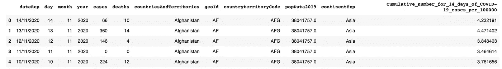
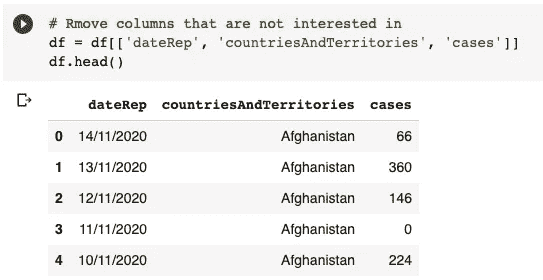
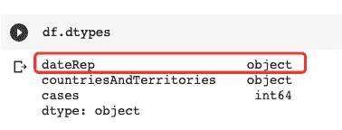
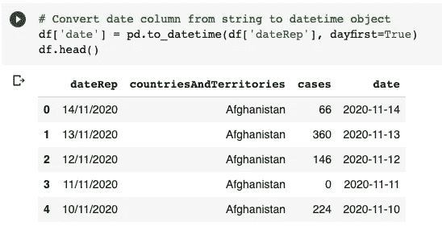
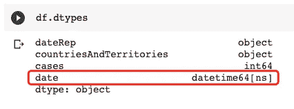
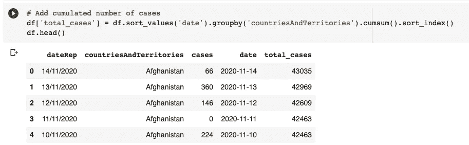
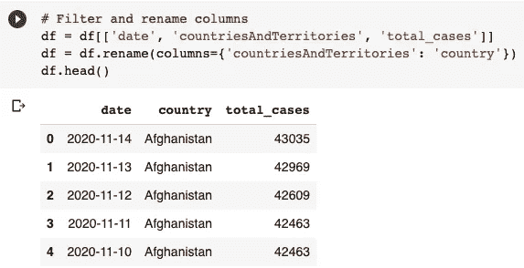
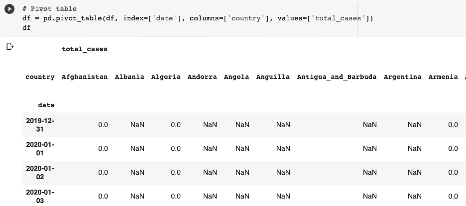
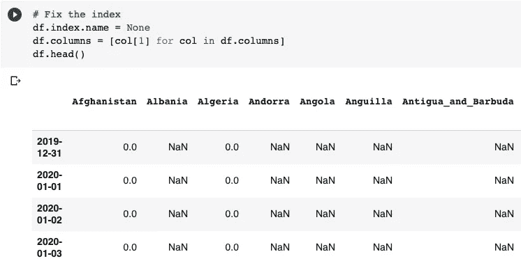

# 一个 Python 函数生成了一个精彩的条形图比赛视频

> 原文：<https://towardsdatascience.com/a-single-python-function-generating-a-gorgeous-bar-chart-race-video-dd6410b8aed?source=collection_archive---------32----------------------->


由 [Shutterbug75](https://pixabay.com/users/shutterbug75-2077322/) 在 [Pixabay](https://pixabay.com/photos/art-artistic-blue-brown-business-1238602/) 上拍摄的照片

## 从原始数据集到条形图比赛视频的逐步教程

最近，一种非常奇特的数据可视化方式在 YouTube 等各种平台上流行起来。只要有一些“实体”具有随时间变化的单一度量，这种类型的可视化就可以完美地说明这些实体之间的动态排序。

这就是条形图竞赛。它通常可以被看作是一个视频。下面的视频是我自己用一个 Python 函数生成的。看一看，你就知道我在说什么了。

你相信上面的视频是用一个只有几行代码的 Python 函数生成的吗？我会告诉你怎么做。

## TD；分升

文章不算太短，因为我想提供一些可以循序渐进的东西。我认为 95%的时间我们都在做数据预处理。如果你真的想跳过直接进入正题，请到“**生成条形图比赛视频”**部分获取生成视频的代码:)

# 数据准备


图片由 [Pixabay](https://pixabay.com/photos/forge-blacksmith-hammer-iron-fire-411923/) 上的 [TiBine](https://pixabay.com/users/tibine-238708/) 拍摄

为了确保本教程是可实现的，我不仅会提供生成条形图比赛视频的代码，还会提供如何获取数据集并对其进行预处理。因此，准备好的数据集是可操作的，然后可以放入 Python 中的条形图 race 库中。

## 获取原始数据集

我使用的数据集是由欧洲疾病预防和控制中心提供的，可以公开获得。每个人都可以免费下载新冠肺炎数据集。我在以前的一篇文章中也使用了这个数据集。

[3 行 Python 代码创建一个交互式可玩的新冠肺炎泡泡地图](/3-lines-of-python-code-to-create-an-interactive-playable-covid-19-bubble-map-74807939e887)

官网在这里:

[https://www . ecdc . Europa . eu/en/publications-data/download-todays-data-geographic-distribution-新冠肺炎-cases-worldwide](https://www.ecdc.europa.eu/en/publications-data/download-todays-data-geographic-distribution-covid-19-cases-worldwide)

在上面的网页上有一个链接，我们可以下载 CSV 格式的数据集。事实上，我们不必将数据集下载到本地机器，因为 Pandas Dataframe 可以直接读取远程 CSV 文件，如下所示。

```
df = pd.read_csv('[https://opendata.ecdc.europa.eu/covid19/casedistribution/csv/data.csv'](https://opendata.ecdc.europa.eu/covid19/casedistribution/csv/data.csv'))
```

然后，我们可以看看数据集中有哪些列，以及通过`df.head()`得到的值是什么样子。



如果你看过前面的视频，你可能会意识到我用确诊病例数作为衡量标准。那么，让我们开始数据清理和转换。

## 数据转换

在数据转换中，我们需要将数据改造成我们可以使用的东西。为了生成条形图比赛视频，我们将使用名为“bar-chart-race”的 Python 库(将在下一节介绍)。它期望数据帧使用日期时间对象作为索引，实体名称作为列名。所以，我们一起来转换数据。

**1。移除无用的列**

因为我们只对日期、国家和病例数感兴趣，所以我们可以只使用这三列来过滤数据帧，如下所示。

```
df = df[['dateRep', 'countriesAndTerritories', 'cases']]
```



**2。将日期字符串转换为** `**datetime**` **对象**

如果我们检查列的数据类型，我们会发现`dateRep`实际上是 objects，它将被视为 strings 而不是`datetime` object。这将导致一些麻烦，因为我们不能期望基于日期字符串列的排序结果。



因此，我们需要将其转换成`datetime`型。

```
df['date'] = pd.to_datetime(df['dateRep'], dayfirst=True)
```



在这之后，让我们再次检查`dtypes`。



**3。添加累积病例**

您可能已经注意到，案例数量是针对相应日期的。但是，我们需要每天的累计总病例数，以便每天的数据条目可以作为视频中的一帧生成。

因此，我们生成一个名为`total_case`的列，它表示当天到目前为止的案例总数。

```
df['total_cases'] = df.sort_values('date').groupby('countriesAndTerritories').cumsum().sort_index()
```



**4。再次删除无用的列，并重命名这些列**

因为我们已经生成了新的`date`和`total_cases`列，所以我们不需要`dateRep`和`cases`列。此外，让我们重命名国家名称列，以保持简单。

```
df = df[['date', 'countriesAndTerritories', 'total_cases']]
df = df.rename(columns={'countriesAndTerritories': 'country'})
```



**5。旋转工作台**

还记得我们需要使用国家名作为列名吗？所以，我们需要旋转桌子。这在熊猫数据框中很容易做到。

```
df = pd.pivot_table(df, index=['date'], columns=['country'], values=['total_cases'])
```

我们使用`date`作为索引，`country`应该是列，值是`total_cases`。然后，我们将得到如下的数据透视表。



由`pivot_table`函数生成的多级索引很难看，可能会导致问题。所以，让我们来解决它。

```
df.index.name = None
df.columns = [col[1] for col in df.columns]
```



我们完成了原始数据集的转换。然而，我们仍然需要清理数据。

## 数据清理


照片由 [webandi](https://pixabay.com/users/webandi-1460261/) 在 [Pixabay](https://pixabay.com/photos/sweeper-periodic-brush-return-clean-1687445/) 上拍摄

你看到我们在数据框里还有很多`NaN`值吗？这是因为该国从来没有病例记录，这是有道理的。然而，它们可能会在以后引起问题。

**1。用零填充 NaN 值**

由于`NaN`值意味着该国没有确诊病例，所以用零填充所有`NaN`值是安全的。

```
df = df.fillna(0).astype(int)
```

请注意，这里我们还将数据类型更改为整数，因为用浮点数表示事例数是没有意义的。

**2。删除例外列**

在我们的数据框中已经是列的所有国家中，有一个列叫做`Cases_on_an_international_conveyance_Japan`，它不是一个国家。指的是钻石公主号邮轮。因为它实际上不是一个国家，乘客实际上来自不同的国家，所以我想在这种情况下将其从我们的统计数据中删除。

```
df = df.drop(columns=['Cases_on_an_international_conveyance_Japan'])
```

**3。删除国家名称中的下划线**

国家名称(我们的列名)在单词之间有下划线。我想用空格替换这些下划线，这样当我们看到它们作为条形图标签时会更漂亮。

```
df.columns = [col.replace('_', ' ') for col in df.columns]
```

**4。删除从未进入前 10 名的国家**

这一步是可选的。然而，当我们生成视频时，它将提高性能。我们的数据集中总共有 200 多个国家，但并不是每个国家都排在前 10 名。由于我们将创建一个前 10 名条形图比赛数据可视化，这些国家将永远不会显示。

我们可以如下删除这些国家。

```
country_reserved = set()for index, row in df.iterrows():
    country_reserved |= set(row[row > 0].sort_values(ascending=False).head(10).index)df = df[list(country_reserved)]
```

这里，我们首先生成一个名为`country_reserved`的集合。使用集合是因为它会忽略重复的值。然后，迭代数据框的每一行，如果当天国家/地区的案例总数排在前 10 名，则将国家/地区名称追加到集合中。

最后，我们将有一组曾经排在前 10 名的国家。将集合转换为列表并过滤列将产生一个更小的数据框，我们将在后面使用。


现在我们只剩下 30 个国家了。

# 生成条形图比赛视频


由 [Pixabay](https://pixabay.com/photos/children-win-success-video-game-593313/) 上的 [StartupStockPhotos](https://pixabay.com/users/startupstockphotos-690514/) 拍摄的照片

好的。我们花了很多时间来争论数据集。事实上，正如我在这篇文章中提到的，生成视频非常简单。

我们只需要下载名为`bar-chart-race`的库，`pip`马上就会完成。

```
pip install bar-chart-race
```

导入库。

```
import bar_chart_race as bcr
```

简单地如下调用`bar_chart_race`函数。

```
bcr.bar_chart_race(
    df=df,
    filename='/content/drive/My Drive/covid-19.mp4',
    n_bars=10,
    period_fmt='%B %d, %Y',
    title='COVID-19 Confirmed Cases by Country'
)
```

*   `df`是我们准备的数据帧
*   `filename`是视频的输出文件名
*   `n_bars`是我们要在条形图中显示的条形数，也可以认为是我们要显示的“前 n 个”。
*   `period_fmt`是我们要在条形图上显示的日期格式。
*   `title`只是条形图的标题。

过一会儿，视频将在我们指定的路径和名称下生成。

# 摘要


由[博克斯卡皮特](https://pixabay.com/users/bokskapet-7322944/)在[皮克斯贝](https://pixabay.com/photos/video-production-video-movie-film-4223885/)上拍摄的照片

万岁！另一个令人惊叹的 Python 库！

在本文中，我介绍了另一个令人惊叹的 Python 库“条形图竞赛”。只需一个函数和几行代码，我们就可以生成一个 MP4 格式的华丽的条形图比赛视频。

事实证明，条形图比赛库中有更多可配置的项目。强烈建议你自己尝试一下。参考资料中给出了官方文档的链接！

[](https://medium.com/@qiuyujx/membership) [## 通过我的推荐链接加入 Medium 克里斯托弗·陶

### 作为一个媒体会员，你的会员费的一部分会给你阅读的作家，你可以完全接触到每一个故事…

medium.com](https://medium.com/@qiuyujx/membership) 

如果你觉得我的文章有帮助，请考虑加入 Medium 会员来支持我和成千上万的其他作者！(点击上面的链接)

# 参考

**欧洲疾病预防和控制中心**

[](https://www.ecdc.europa.eu/en/publications-data/download-todays-data-geographic-distribution-covid-19-cases-worldwide) [## 下载世界各国每日新报告的新冠肺炎病例数

### 该可下载的数据文件每天更新，包含关于新冠肺炎的最新公共数据。你可以使用…

www.ecdc.europa.eu](https://www.ecdc.europa.eu/en/publications-data/download-todays-data-geographic-distribution-covid-19-cases-worldwide) 

**条形图比赛文档**

 [## 条形图竞赛

### 使用 bar_chart_race 包在 Python 中制作动画条形图比赛

www.dexplo.org](https://www.dexplo.org/bar_chart_race/) 

***编者按:*** [*走向数据科学*](http://towardsdatascience.com/) *是一份以数据科学和机器学习研究为主的中型刊物。我们不是健康专家或流行病学家，本文的观点不应被解释为专业建议。想了解更多关于疫情冠状病毒的信息，可以点击* [*这里*](https://www.who.int/emergencies/diseases/novel-coronavirus-2019/situation-reports) *。*