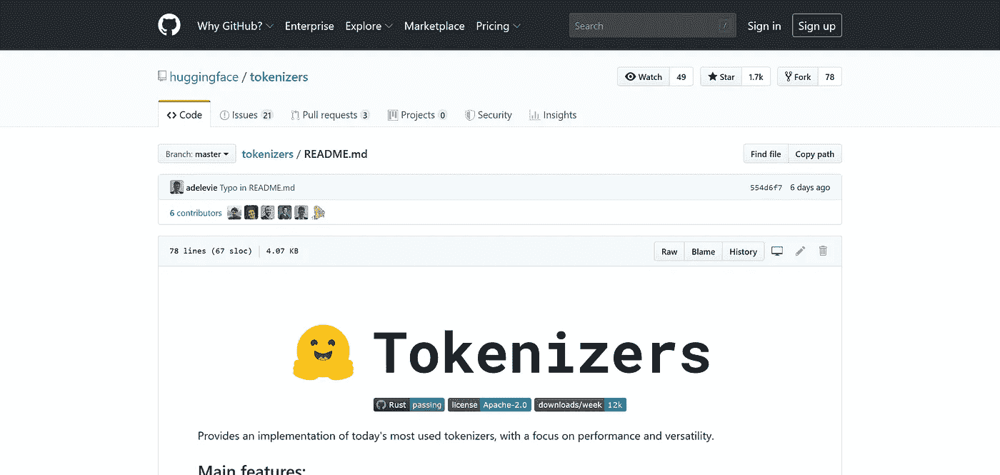

# 关于新的 Tokenizers 库的一个小计时实验——一篇文章

> 原文：<https://towardsdatascience.com/a-small-timing-experiment-on-the-new-tokenizers-library-a-write-up-7caab6f80ea6?source=collection_archive---------26----------------------->

## 剧透:速度惊人🔥

GitHub 上的 [Tokenizers 库的自述文件](https://github.com/huggingface/tokenizers)

一周前，可爱的人在 [**抱脸**](https://huggingface.co/) 向公众发布了他们的新 [**Tokenizers 库**](https://github.com/huggingface/tokenizers) 。tokenizers 用 [Rust](https://www.rust-lang.org/) 编程语言编写(与 Python 相比，它以性能著称)，提供了“当今最常用的 Tokenizers 的实现，重点关注性能和通用性”。

因此，这篇文章介绍了一些小型计时实验的结果，这些实验对比和比较了吴等人(2016 年)介绍的**分词器**的不同实现，并随着 Devlin 等人(2018 年)发布和出版的[**BERT**](https://github.com/google-research/bert)**而得到推广。与这些计时实验相关的所有代码都可以在下面的 Jupyter 笔记本中找到:**

# **🤗变形金刚 vs💥标记化者**

**在第一个计时实验中，我比较了在流行的 [**变形金刚库**](https://github.com/huggingface/transformers) (也是通过拥抱脸)中实现的 Bert 单词块标记器的性能(在执行时间方面)和新的标记器库的性能。对于这两者，我在 5 次独立运行中标记(编码)了 100 万个英语句子，其结果可以在下面找到:**

**变压器与令牌化器定时实验**

**如您所见，平均执行时间仅为 45.6 秒，与 Transformers 库实现(平均执行时间为 6 分 42 秒)相比，Tokenizers 库实现的速度提高了近 9 倍。**

# **🧵多线程性能**

**Tokenizers 还提供了一种一次(批量)编码多个句子的方法，由于其多线程实现(在 Rust 中)，这可以显著提高性能。然而，Python 也支持多线程，例如使用`[concurrent.futures](https://docs.python.org/3.7/library/concurrent.futures.html)`。**

**因此，与第一次计时实验类似，这里我比较了使用`concurrent.futures.ThreadPoolExecutor`与`submit`和`map`的 Bert 单词块标记器的性能，以及标记器的本机`encode_batch`，结果如下:**

**多线程性能计时实验**

**正如你所看到的，令人惊讶的是，`submit`和`map`与非多线程令牌化相比，性能(相等)更差。然而，更有趣(也更令人印象深刻)的是，Tokenizers 库**自带的多线程`encode_batch`只需要 10.6 秒**就可以标记一百万个句子！**

# **结论**

**正如宣传的那样，拥抱脸的新 Tokenizers 库**提供了比 Transformers 库快得多(几乎 9 倍)的 BERT 单词块 tokenizer 实现**。然而，当批量对句子进行分词时，性能更加令人印象深刻，因为**只需 10.6 秒就可以对 100 万个句子进行分词**。因此，我想我可以有把握地断定**它快得惊人🔥**！**

**虽然新的 Tokenizers 库提供了更多的好处，而不仅仅是其令人印象深刻的性能(例如，在新词汇上训练标记器的能力)，但应该说，这种性能的显著提高不仅**允许对越来越大的数据集进行标记**(在运行中)，而且**允许这些方法和技术**更好的民主化(例如，在更便宜的硬件上部署，如移动电话和 SOC)，允许来自各种背景的有抱负的 NLP 爱好者开始使用最新和最棒的 NLP🤗**

# **参考**

**[1] Y. Wu 等， [Google 的神经机器翻译系统:弥合人与机器翻译的鸿沟](https://arxiv.org/abs/1609.08144) (2016)，【arXiv 预印本 arXiv:1609.08144 。**

**[2] J. Devlin 等， [Bert:用于语言理解的深度双向变换器的预训练](https://arxiv.org/abs/1810.04805) (2018)， *arXiv 预印本 arXiv:1810.04805* 。**