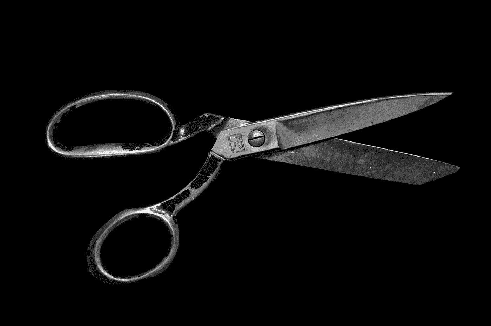
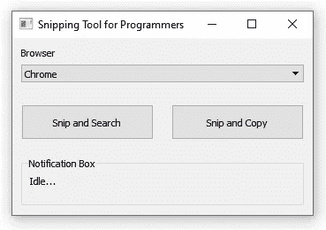
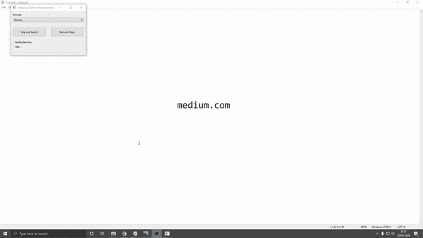
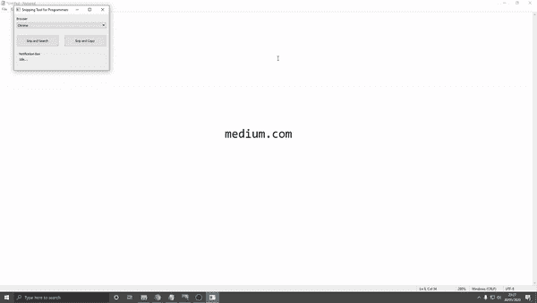

# 一个程序员用的剪切工具

> 原文：<https://towardsdatascience.com/a-snipping-tool-for-programmers-32dbccf75c33?source=collection_archive---------25----------------------->

## 一个用 Python 编写的截取工具，它可以自动识别截取图像中的文本，并执行 google 搜索。

像许多程序员一样，我发现自己经常复制和粘贴文本。大部分时间我都是从我的 IDE 或者终端上复制一些错误信息，然后在 Google 上搜索。其余时间，我将一个方法或函数复制到 google 中来阅读文档。随着时间的推移，高亮显示文本、复制、打开浏览器、粘贴然后搜索的过程会变得有点乏味(我知道的第一世界问题)。我决定用 Python 来自动化这个过程。

马特·阿特兹在 [Unsplash](https://unsplash.com?utm_source=medium&utm_medium=referral) 上拍摄的照片

## 解决方案是…

我想要一个桌面应用程序，将坐在后台，像 windows 剪贴工具的行为。它将有两个功能:剪切和搜索和剪切和复制。

程序员图形用户界面的剪切工具

这两个函数都允许我将一个文本区域剪成图像，对图像执行字符识别，然后返回一个字符串。然后，截取和搜索功能将自动打开一个浏览器标签，并在谷歌中搜索截取图像中的字符串。另一方面，剪切和复制函数会将字符串保存到我的剪贴板中。

下面是如何使用该程序的演示。当你从不能用通常的方法复制的地方复制文本时，比如终端，图片或者 youtube 教程，它实际上是非常有用的。

“剪切和搜索”功能的演示

“剪切和复制”功能的演示

您可以找到完整的代码或下载。exe 文件放在我的 [Github](https://github.com/EngineerSte/SnippingToolForProgrammers) 上。请注意，目前这款应用只在我运行 Windows 10 的电脑上进行了测试。需要进行修改，以确保该应用程序在其他操作系统上工作。我以后可能会讲到这个。

## 所以我是怎么做到的…

正如我之前提到的，该应用程序是用 Python 编写的，使用的主要库是 **PyQT5** ， **cv2** ， **Pillow** 和**pytesserac**。GUI 允许我设置我希望使用的浏览器，并等待按下功能按钮。一旦按下一个功能按钮，就会创建一个裁剪工具小部件的实例，并等待用户通过单击和拖动来裁剪屏幕上的一个区域。github 上的 [harupy](https://github.com/harupy/snipping-tool) 创造了一个用 Python 写的很棒的剪切工具应用程序，这必须要归功于他。他的代码构成了该项目的 snipping 工具部分的基础。

一旦剪切了一个区域，就使用 cv2 库将图像转换为灰度数组，然后使用 P **yTesseract** 库将图像传递给 Tesseract 光学字符识别(OCR)引擎。这是 Google 开源 Tesseract-OCR 引擎的包装器。

一旦被截取的图像被分析并且文本被识别，字符串或者使用 **pyperclip** 库被保存到剪贴板，或者在指定的浏览器中执行搜索。然后，GUI 重置并等待下一个 snip。

文本识别不是 100%准确，尤其是在较长的部分和文本是特定颜色时。我确信在进入 Tesseract OCR 引擎之前，我可以在 cv2 中用一些更高级的图像处理来改进这一点。如果我有时间，这些改变可能会在将来完成。如果我实现了任何改进，我将在将来更新这篇文章。欢迎任何改进的建议。祝你愉快！