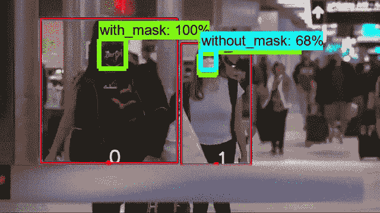
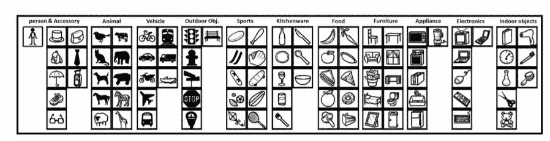
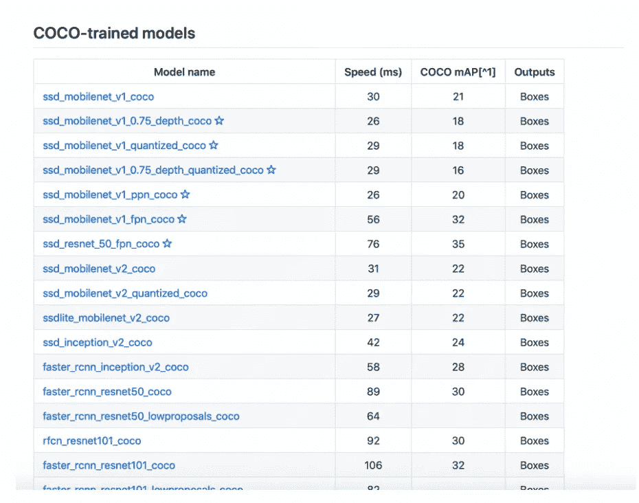

# 使用 Tensorflow 对象检测模型和 OpenCV 的社交距离和遮罩检测器

> 原文：<https://towardsdatascience.com/a-social-distancing-and-mask-detector-using-a-tensorflow-object-detection-model-python-and-opencv-dfe5f7a8bace?source=collection_archive---------20----------------------->

## 结合深度学习和计算机视觉的隔离项目。

## 介绍

社交距离这个词席卷了整个世界，并正在改变我们的生活方式。社交距离也被称为“物理距离”，意思是在你和其他不在你家的人之间保持一个安全的空间。随着该国开始在激增的新冠肺炎病例中解锁，保持社交距离已成为一个关键问题。围绕新冠肺炎疫情的最大担忧是，这种感染会以多快的速度通过接触甚至是接近感染者而从一个人传播到另一个人。社会距离在这里停留的时间比预期的要长，以对抗新冠肺炎。

因此，这让我想到开发一个人工智能模型，来检测人们是否在遵循社交距离，同时戴着面具。这是模型结果的一个例子。借助深度学习和 OpenCV，我们可以从视频片段中提取有趣的见解。**红色边框**表示这个人与另一个人很接近，**蓝色边框**表示这个人保持着社交距离。我们有单独的边界框来识别这个人是否戴着面具。

社交距离和面具检测

你可以找到我在我的 [Github](https://github.com/vijayarajans92/Social_distancing_and_Mask_detection) Repo 上使用的代码。

## 步骤概述

TensorFlow 对象检测 API 是用于创建解决对象检测问题的深度学习网络的框架。API 提供了预训练的对象检测模型，它们被称为模型动物园，已经在 COCO 数据集上进行了训练。**上下文** ( **COCO** )中的常见对象数据集有 200，000 幅图像，在 90 个常见对象中有超过 500，000 个对象注释。请参见下图中属于 COCO 数据集的对象。

Coco 对象类别。图片来自[https://arxiv.org/pdf/1405.0312.pdf](https://arxiv.org/pdf/1405.0312.pdf)

在这种情况下，我们关心属于 COCO 数据集的类“Person”。

该 API 还支持大量的模型。请参见下表以供参考。

API 支持的一小部分模型

这些模型在速度和准确性之间进行了权衡。这里我选择了 **ssd_mobilenet_v1_coco** 来检测‘人’。一旦我们使用对象检测 API 识别出“人”,为了预测这个人是否保持社交距离，我们可以使用 OpenCV，这是一个强大的图像处理库。一旦检测到社交距离，我就使用**faster _ rcnn _ inception _ v2 _ coco**API 来检测这个人是否戴着面具，我之前使用 GPU(**NVIDIA Quadro p 4000 Linux**)**对 top 2000 图像进行了训练。**

# **深入探究主要步骤**

**现在让我们详细研究一下代码。**

**如果您是第一次使用 Tensorflow 对象检测 API，请从这个[链接](https://github.com/tensorflow/models/blob/master/research/object_detection/g3doc/tf1_detection_zoo.md)下载 GitHub。**

**我遵循的主要步骤是(请跟随我的 [Github](https://github.com/vijayarajans92/Social_distancing_and_Mask_detection) 上的 jupyter 笔记本)**

*   **将 **ssd_mobilenet_v1_coco** 模型加载到图中，并加载属于 coco 数据集的类列表**
*   **使用 cv2 打开视频。VideoCapture(文件名)并逐个读取每一帧并将其写入一个路径**
*   **对于每一帧，使用加载的图形执行对象检测**
*   **从 **ssd_mobilenet_v1_coco** 返回的结果是每个已识别的类及其置信度得分和边界框预测。**
*   **基于类别和置信度得分> 0.60，检测一帧中的人数，如下所示。**

*   **根据我们之前得到的包围盒预测画出**蓝色**彩色包围盒，并找到宽度的中点。用 id 标记每个边界框。**

*   **找出一帧中点之间的欧几里德距离。**

*   **有了欧几里德距离，找到距离小于 200 的包围盒，将包围盒的颜色改为**红色**。**
*   **将所有的代码片段放在一起，传递所有的帧，并将它们保存在一个路径中。因此，我们将有一组社会距离检测帧**
*   **将我在上面训练的带遮罩和不带遮罩图片的 frozen _ inference _ graph . Pb(**faster _ rcnn _ inception _ v2 _ coco**)加载到一个图形中，并加载类列表**
*   **对于每个检测到的社交距离帧，使用 faster _ rcnn 模型的加载图来执行戴着面具的人的对象检测**
*   **最后，使用之前获得的帧，使用 python 中可用的 **moviepy** 包创建一个视频**

# **结论和改进**

**这就把我们带到了我文章的结尾。社交距离以及其他基本的卫生措施对于尽可能减缓新冠肺炎的传播非常重要。这个项目只是一个概念验证。**

**我很清楚这个项目并不完美。因此，有一些关于如何改进该应用程序的想法:**

*   **我遇到过一些方法，人们将视频转换成俯视图或鸟瞰图，然后计算图像中两个物体之间的距离**
*   **考虑**摄像机校准****

> ***“家是躲避风暴的避难所——各种各样的风暴。在家注意安全。”***