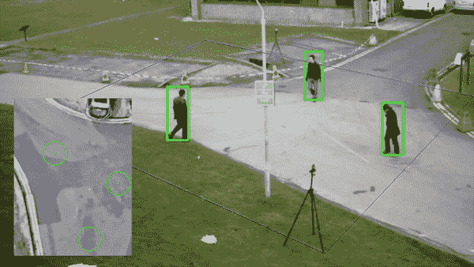
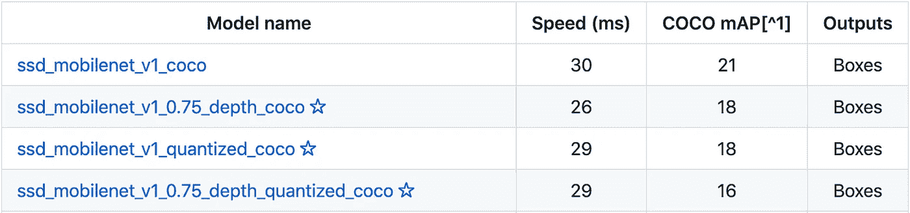

# 使用 Tensorflow 对象检测模型、Python 和 OpenCV 的社交距离检测器。

> 原文：<https://towardsdatascience.com/a-social-distancing-detector-using-a-tensorflow-object-detection-model-python-and-opencv-4450a431238?source=collection_archive---------7----------------------->

## 结合深度学习和计算机视觉的隔离项目。



# 介绍

在隔离期间，我花时间在 github 上探索 Tensorflow 的大量预训练模型。在做这件事的时候，我偶然发现了一个[仓库](https://github.com/tensorflow/models/blob/master/research/object_detection/g3doc/detection_model_zoo.md)，里面有 25 个**预先训练好的目标检测**模型，带有性能和速度指标。有了一些计算机视觉方面的知识，考虑到实际的环境，我认为使用其中的一个来构建一个社交距离应用程序会很有趣。

更有甚者，上学期在我的**计算机视觉**课上，我被介绍给了 **OpenCV** ，并在做一些小项目时意识到它的强大。其中之一包括对图片进行鸟瞰转换。一个**鸟瞰图**基本上是一个场景的自上而下的表示。这是在构建自动汽车驾驶应用程序时经常执行的任务。


[车载摄像头鸟瞰系统的实现](https://www.researchgate.net/publication/224117777_Low-cost_implementation_of_bird%27s-eye_view_system_for_camera-on-vehicle)

这让我意识到，在我们想要监控社交距离的场景中应用这种技术可以提高质量。这篇文章介绍了我如何使用**深度学习**模型以及**计算机视觉**中的一些知识来构建一个健壮的社交距离检测器。

这篇文章的结构如下:

*   型号选择
*   人物检测
*   鸟瞰图变换
*   社会距离测量
*   结果和改进

以下所有代码以及安装说明都可以在我的 [github 库](https://github.com/basileroth75/covid-social-distancing-detection)中找到。

# 1.型号选择

Tensorflow 对象检测模型 zoo 上可用的所有模型都已经在 **COCO 数据集**(上下文中的常见对象)上进行了训练。这个[数据集](http://cocodataset.org/#explore)包含 120，000 幅图像，在这些图像中总共有 880，000 个被标记的对象。这些模型被训练来检测这个数据集中标记的 **90 种不同类型的对象**。所有这些不同对象的完整列表可以在 github [repo](https://github.com/tensorflow/models/blob/master/research/object_detection/data/mscoco_complete_label_map.pbtxt) 的数据部分获得。这份物品清单包括一辆汽车、一把牙刷、一根香蕉，当然还有一个人。



可用模型的非详尽列表

根据模型的速度不同，它们有不同的性能。我做了一些测试，以确定如何根据预测的速度来平衡模型的质量。由于这个应用程序的目标不是能够执行实时分析，所以我最终选择了[**【faster _ rcnn _ inception _ v2 _ coco**](http://download.tensorflow.org/models/object_detection/faster_rcnn_inception_v2_coco_2018_01_28.tar.gz)**，它的 mAP(验证集上的检测器性能)为 28，相当强大，执行速度为 58 毫秒。**

# **2.人物检测**

**使用这种模型，为了检测人，有几个步骤必须完成:**

*   **将包含模型的文件加载到张量流图中。并定义您希望从模型中获得的输出。**
*   **对于每一帧，通过图形传递图像，以获得所需的输出。**
*   **过滤掉弱预测和不需要检测的对象。**

## **加载并启动模型**

**张量流模型的设计工作方式是使用**图**。第一步意味着将模型加载到张量流图中。该图将包含为获得所需检测而将完成的不同操作。下一步是创建一个**会话**，它是一个负责执行上图中定义的操作的实体。更多关于图表和会话的解释可在[这里](https://danijar.com/what-is-a-tensorflow-session/)获得。我决定实现一个类来保存所有与 tensorflow 图相关的数据。**

## **通过模型传递每一帧**

**为每个需要处理的帧启动一个新的会话。这是通过调用 **run()** 函数来完成的。这样做时，必须指定一些参数。这些包括模型需要的输入类型，以及我们希望从中获得的输出。在我们的例子中，需要的输出如下:**

*   ****包围盒中每个物体的坐标****
*   **每个预测的**置信度** (0 到 1)**
*   ****预测的类别** (0 到 90)**

## **过滤掉弱预测和不相关的对象**

****

**人员检测的结果**

**模型检测到的许多类别之一是人。与人员相关联的类别是 1。**

**为了排除弱预测(**阈值:0.75** )和除了人以外的所有其他对象类别，我使用了一个 if 语句来组合这两个条件，以从进一步的计算中排除任何其他对象。**

```
**if int(classes[i]) == 1 and scores[i] > 0.75**
```

**但是由于这些模型已经被预先训练，所以它们不可能只检测这个类。因此**这些模型需要相当长的时间来运行**，因为它们试图识别场景中所有 90 种不同类型的对象。**

# **3.鸟瞰图变换**

**正如介绍中所解释的，执行鸟瞰视图变换给我们一个场景的**顶视图。幸运的是，OpenCV 有很好的内置函数将这种方法应用于图像，以便将从透视角度拍摄的图像转换为该图像的俯视图。我用了伟大的阿德里安·罗斯布鲁克的教程[来理解如何做到这一点。](https://www.pyimagesearch.com/2014/08/25/4-point-opencv-getperspective-transform-example/)****

**第一步包括在原始图像上选择 4 个点，这 4 个点将成为将要变换的平面的角点。这些点必须形成一个至少有两条对边平行的矩形。如果不这样做，当转换发生时，比例将不会相同。我已经在我的[资源库](https://github.com/basileroth75/covid-social-distancing-detection)中实现了一个脚本，它使用 OpenCV 的 **setMouseCallback()** 函数来获取这些坐标。计算变换矩阵的函数也需要使用**图像计算的图像尺寸。图像的形状**属性。**

```
**width, height, _ = image.shape**
```

**这将返回宽度、高度和其他不相关的颜色像素值。让我们看看如何使用它们来计算转换矩阵:**

**请注意，我选择也返回矩阵，因为它将在下一步中用于计算每个检测到的人的新坐标。这样做的结果是帧中每个人的**“GPS”坐标**。使用这些**比使用原始地面点**要精确得多，因为在透视图中，当人们在不同的平面图中时，距离是不一样的，而不是在离摄像机相同的距离。与使用原始帧中的点相比，这可以大大改善社交距离测量。**

**对于检测到的每个人，返回构建边界框 a 所需的 2 个点。点是盒子的左上角和右下角。从这些，我通过得到它们之间的中点来计算盒子的**质心。利用这个结果，我计算了位于盒子底部中心点的坐标。在我看来，这个点，我称之为**地面点**，是图像中一个人的坐标的最佳表示。****

**然后，我使用转换矩阵来计算每个检测到的地面点的转换坐标。在检测到帧中的人之后，使用**cv2 . perspective transform()**对每一帧进行这一操作。我是这样实现这个任务的:**

# **4.测量社交距离**

**在每一帧上调用这个函数后，返回一个包含所有新变换点的列表。根据这个列表，我必须计算每一对点之间的距离。我使用了来自 **itertools** 库中的函数 **combinations()** ，它允许在一个列表中获得所有可能的组合，而无需保留双精度。这在[这个](https://stackoverflow.com/questions/104420/how-to-generate-all-permutations-of-a-list)堆栈溢出问题上解释得很好。剩下的就是简单的数学:在 python 中使用 **math.sqrt()** 函数可以很容易地计算两点之间的距离。选择的阈值是 120 像素，因为它在我们的场景中大约等于 2 英尺。**

**一旦识别出两个点彼此过于接近，标记该点的圆的颜色将从绿色变为红色，并且对于原始帧上的边界框也是如此。**

# **5.结果**

**让我来介绍一下这个项目是如何运作的:**

*   **首先获得平面图的 4 个角点，并应用透视变换以获得该平面图的鸟瞰图，并保存变换矩阵。**
*   **获取在原始帧中检测到的每个人的边界框。**
*   **计算这个盒子的最低点。它是位于两脚之间的点。**
*   **使用这些点的变换矩阵来获得每个人的真实“GPS”坐标。**
*   **使用 **itertools.combinations()** 测量帧中每个点到所有其他点的距离。**
*   **如果检测到社交距离违规，将边界框的颜色更改为红色。**

**我使用了来自 [PETS2009](http://www.cvg.reading.ac.uk/PETS2009/a.html#s0) 数据集的视频，该数据集由包含不同人群活动的多传感器序列组成。它最初是为人群中的人数统计和密度估计等任务而构建的。我决定使用第一个角度的视频，因为这是最宽的角度，具有最佳的场景视图。该视频展示了获得的结果:**

# **6.结论和改进**

**如今，社交距离和其他基本的卫生措施对于尽可能减缓新冠肺炎病毒的传播非常重要。但是这个项目只是一个概念验证，并不是为了监控公共或私人领域的社交距离，因为道德和隐私问题。**

**我很清楚这个项目并不完美，所以这是如何改善这个应用程序的一些想法:**

*   **使用更快的模型来执行实时社交距离分析。**
*   **使用对遮挡更鲁棒的模型。**
*   **自动标定是计算机视觉中的一个众所周知的问题，它可以大大改善不同场景下的鸟瞰图变换。**

**这篇文章是我对《走向数据科学和媒体》的第一篇贡献。我已经把代码放在我的 Github 上了。如果您对代码本身或本文有任何疑问，请随时提问。如果您有可能改进的想法或任何类型的反馈，请随时联系我，我将不胜感激。我希望你觉得这很有帮助，如果你喜欢，可以随意分享。**

# **来源**

**在实施这个项目的过程中，我发现了许多在线文章，它们帮助我度过了困难:**

**[](/analyse-a-soccer-game-using-tensorflow-object-detection-and-opencv-e321c230e8f2) [## 使用 Tensorflow 对象检测和 OpenCV 分析一场足球比赛

### 用数据做很酷的事情！

towardsdatascience.com](/analyse-a-soccer-game-using-tensorflow-object-detection-and-opencv-e321c230e8f2) [](https://www.pyimagesearch.com/2014/08/25/4-point-opencv-getperspective-transform-example/) [## 4 点 OpenCV getPerspective 转换示例— PyImageSearch

### 凌晨 4 点 18 分。警报响了。外面还是漆黑一片。床很暖和。我光着脚会觉得地板很冷。但是我得到了…

www.pyimagesearch.com](https://www.pyimagesearch.com/2014/08/25/4-point-opencv-getperspective-transform-example/)  [## 里奇伦的鸟瞰项目研究

### 一般来说，车载摄像机具有严重的透视效果，如图 1(a)所示。因为透视效应，所以…

developer.ridgerun.com](https://developer.ridgerun.com/wiki/index.php?title=Birds_Eye_View/Introduction/Research) [](http://www.cvg.reading.ac.uk/PETS2009/a.html#s0) [## 宠物 2009

### 数据集是包含不同群体活动的多传感器序列。如果…请发电子邮件给 datasets@pets2009.net

www.cvg.reading.ac.uk](http://www.cvg.reading.ac.uk/PETS2009/a.html#s0)**