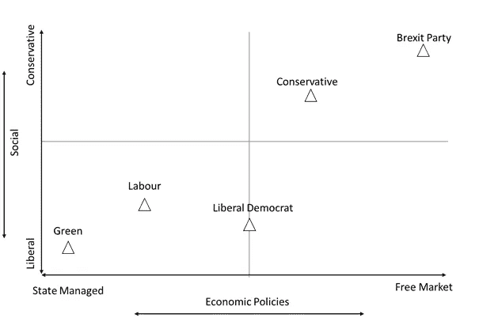
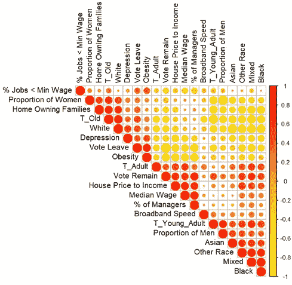
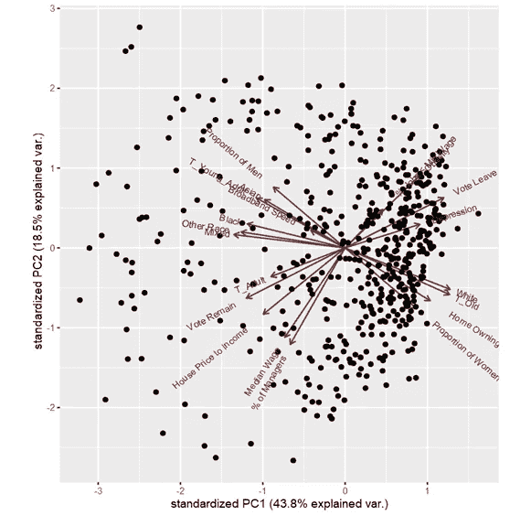
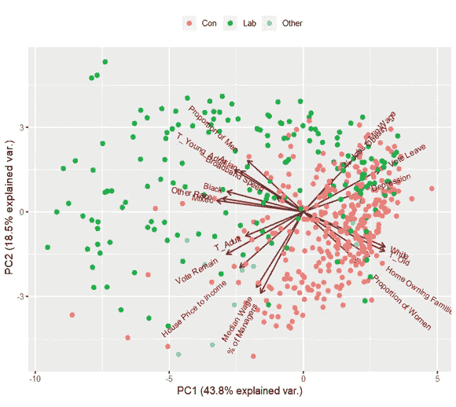
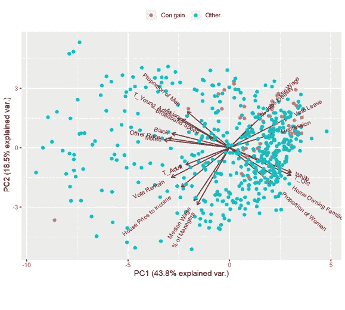

# 英国政治景观的空间表现

> 原文：<https://towardsdatascience.com/a-spatial-representation-of-the-uks-political-landscape-7f460c4d7ea4?source=collection_archive---------32----------------------->

## 政治学中的主成分分析

空间术语对于任何政治领域的描述都是必不可少的。政治行动者在问题上采取“立场”，他们执行“U 型转弯”，当然他们要么位于“左翼”，要么位于“右翼”，要么位于“中间地带”。这种语言也不是纯粹的学术语言，而是延伸到所有参与政治的个人的词汇中；无论是政治家、记者还是普通大众。然而，空间语言在政治背景下的使用主要是假设性的，“纯粹是概念性的，不可能实际观察到”(Laver 和 Benoit，2012，195)。因此，个人必须投入相当多的精力去理解从中得出相对政治立场的许多变量。本研究的目的是提出一个物理框架，在此基础上，这些变量可用于绘制聚合群体(如投票选区)的偏好。为此，我将研究的其余部分分为三个部分，同时利用英国 2019 年大选作为背景。1)首先，我开始讨论政治空间的概念，从而为这项工作提供必要的色彩和背景。2)然后，我检查和批判现有的投射政治空间的方法论和学术方法。3)最后，我解释了如何使用主成分分析(“PCA”)将政治空间的许多维度简化为直观的呈现。在本节中，我还将通过利用英国选区层面的数据来展示 PCA 的优点，以说明如何定量捆绑相关变量(政治或其他)来了解每个选区在大选中最有可能支持哪个政党及其原因。

政治空间的概念

在政治学中，空间的概念是通过根据特定变量将政策偏好/政治代理人排列成一条直线来赋予实体性的(见图 1)。在这样做的过程中，一个相似性的光谱被创造出来——点与点之间的欧几里得距离代表了不同的程度(亚当等人，2005 年，施菲尔德，2008 年)。线性政策谱后来成为许多普遍思想的基石，这些思想不仅主导了政治学术领域，也主导了现实世界的实践:例子是 Downsian 的“中间选民定理”概念，以及“左”和“右”翼对政治偏好的理解。

图 1:英国 2019 年大选中假设的一维政策轴

这个将单个变量映射到一维框架的简单框架可以扩展为创建多个变量的多维框架。这种框架理论上可以包含几乎无限数量的维度，因此即使在概念层面也存在挑战。随后，通常避免字面意义上的尝试，而倾向于将相关变量(可以是明确的政策偏好，也可以基于人口统计数据)分组为广泛的主题，如社会主题(自由到保守)或经济主题(自由市场到国家管理)(见图 2)。简单的分类当然会有问题，例如，在 2019 年的大选中，反对在希思罗机场增加一条跑道的人可能会被描绘成自由主义者/国家管理的人，即使这是由首相倡导的:一个保守主义者/自由市场主义者。然而，通过使用这种方法，政治科学家可以创建地理空间的简约点来放置政治偏好。这些地图随后能够包含比简单的一维比例尺更多的信息。

图 2:英国 2019 年大选中假想的二维政策轴

**2)对现有方法的批评**

在物理空间上呈现政治偏好的实际任务由两部分组成。第一阶段是估计潜在的维度，在这些维度上可以绘制偏好，第二阶段是将偏好映射到这些维度上。在现有的文献中，对过程的第一阶段采取的对比方法定义和区分方法风格。随后，我将第一阶段的方法分为两大类，并对其进行研究。这些组被定义为在先验定义的尺度上估计位置的组，以及在根据数据归纳定义的尺度上估计位置的组。

估算量表维度的两种方法都依赖于上一节讨论的概念框架(维度是通过将相关变量分组到广泛的主题中来确定的)。对于维度的先验估计，这意味着利用专家分析师的先验知识来创建和缩放维度的定性方法。这通常被认为是一种优越的方法，因为使用先验知识大大降低了任务的复杂性，并建立在数百年的政治话语之上(Laver 和 Benoit，2012，198)。然而，这种方法当然会受到许多针对任何定性研究的普遍批评。这主要包括关于可复制性、可比性和为大型数据集提供充分分析的问题。

在 Mcelroy 和 Benoit (2007 年)关于这一主题的工作中可以找到一个明显的例子。他们的工作整理了专家对欧洲政治的意见，并试图从中推断出对欧洲政党政策的空间理解。物理表示最初是建立在一个二维框架上，与图 2 中的轴相同。然而，在后续工作中，y 轴上的社会维度取代了对欧盟一体化的看法。结果，政党的空间位置完全改变了，这意味着新的位置无法与以前的重复进行比较，更不用说其他调查了。同样，他们对专家分析的使用也存在与基于访谈的研究类似的问题——无法保证不同的专家会使用彼此相同的维度，甚至无法保证相同的专家会两次得出相同的分析。此外，虽然他们的方法可用于绘制欧盟的政党地图，但试图绘制欧盟所有政治选区的地图会耗费大量劳动力，这与我在最后一节中承担的任务类似。

同时，对于试图归纳得出空间位置的研究来说，这种方法是完全不同的，本质上是更加定量的。这些定量方法通常基于通过因子分析等技术识别潜在维度(事实上，我在下一节中使用了这种方法的变体)。这种方法再次以概念框架所描述的方式来缩放维度，然而在这种情况下，显式地计算相关性束以导出变量的宽泛分组。这种方法的一个极端例子是 Gabel 和 Huber (2000)，他们将整个比较宣言项目映射到一个单一的维度上——左右翼经济规模。

这种方法的问题是，通过让基本向量完全开放，我们留下了“基本上无法验证”的位置(Benoit 和 Laver，2012，198)。其结果是，行动者的定位反而通过现有的政策维度概念得到认可，并需要专家分析才能从地图中获得任何洞察力——前面提到的 Gabel 和 Huber 的工作就是一个明显的例子，因为它依赖于左/右翼经济规模。因为地图应该努力实现普遍可访问性，所以这种技术仍然是欠缺的。因此，在下一节中，我建议通过归纳计算政治空间，然后有意识地将现有知识分层，我们可以提供关于政治代理人的政策和政党偏好的变量意味着什么的宝贵见解，而不需要任何重要的先验知识。

**3)使用 PCA 创建英国 2019 年大选英格兰和威尔士选区政治偏好的空间表示**

到目前为止所描述的任务可以理解为多变量分析，其最终目标是降低维度。PCA 是我们可以用来完成这项任务的归纳工具之一。它是一个合适的工具，因为它的明确目的是以一种允许它们被映射到二维图上的方式压缩多个变量。该方法通过分析原始数据集中变量之间的共线性(或缺乏共线性)(图 3 ),并将这些变量转换为新变量(主成分)来实现这一点。然后，新创建的变量可以用相似的组聚集在一起来绘制，差异通过距离来显示——因此，这种方法仍然可以在政治空间的传统概念框架内识别。

我用来进行分析的数据集由从英国选区级数据库收集的潜在相关和潜在不相关指标组成。混合相关和不相关变量的目的是，在政治学中，我们无法总是预先知道哪些变量是重要的。随后，我加入了潜在的非相关变量来削弱模型，从而提供了一个关键案例和更强大的例子来证明这种方法的未来使用(Hancke，2009)。

使用的变量如下(下议院图书馆，2020 年):

低于最低工资的工作比例

女性人口比例

男性人口比例

拥有住房的家庭比例

65 岁以上人口比例

35-65 岁人口比例

16-35 岁人口比例

白人人口比例

黑人人口比例

亚裔人口比例

混血人口的比例

其他种族的人口比例

留下投票的人口比例

投票支持脱欧的人口比例

肥胖人口比例

抑郁人口比例

管理人员占人口的比例

中位房价与中位收入水平

工资中位数

宽带速度

数据是公开的，并在参考书目中有链接。这项研究只包括英格兰和威尔士的选区。二元变量，如男性/女性或离开/留在不需要都包括在 PCA 中。然而，自从观想结束后，它们就更容易被理解了。

图 3:英国选区层面数据的相关矩阵

通过使用主成分分析，我们可以创建一个系统的框架，它很容易重现，并可以缩放维度和定位变量。图 4 显示了五氯苯甲醚的初始产品。从这一点出发，我们可以利用先验知识来推断右下角的选区可能类似于图 2 中所示的右上角的选区(社会保守和经济自由)。类似地，我们可以将对面的角落(根据种族多样性和宽带速度判断，可能是市中心的选民)视为社会自由派和经济左翼。此外，轴标题告诉我们，x 轴上的欧几里得距离比 y 轴上的欧几里得距离占更多的方差(即，水平距离比垂直距离代表更多的差异)。因此，这两个集群之间的差异最大。不幸的是，正如这一分析所证明的那样，这样一幅地图最好通过现有政治维度的棱镜来理解，并且具有我所批评的 Gabel 和 Huber 的工作的缺陷。

图 4:英国选区层面数据的 PCA

为了提高从数据中推断维度的方法的解释能力，以及减少对专家见解的依赖，我用他们投票支持的政党来标记选区(图 5)。这种做法并不新奇，但在政治科学中却鲜有应用。然而，这样做的结果是，我们可以很容易地确定与特定政党最相关的变量，以及每个选区相对于彼此的位置。因此，我们已经表明，当我们分层附加信息时，定量方法可以合并大量变量并创建直观的地图。

图 5:英国选区级别数据的 PCA，带有政党投票颜色编码

更进一步，我们还可以确定工党在 2019 年大选中输给保守党的席位(图 6)。这让我们看到，工党失去的席位与 1)人口老龄化，2)公投脱欧和 3)低于最低工资的工作比例高有关。此外，高比例的肥胖和抑郁似乎也与这一位置有关——尽管直觉上我们可以假设这与财富水平有关。这种趋势有一个值得注意的例外——在地图的左下方，我们可以看到肯辛顿(可以选择识别单个点，但没有在下面显示，因为它会挤满可视化)——这是一个在上次选举中获胜但后来在大选中失败的剩余席位工党。

有趣的是，该地图表明工党应该争取更贫穷的脱欧选民，因为这些席位比大都会留欧派席位更接近保守党席位群——尽管这种说法当然忽略了工党可能会失去席位给第三方的可能性。无论如何，我们可以清楚地看到，颜色编码的 PCA 提供了一种有效的方式来理解演员的政治定位。

图 6:英国选区级别数据的 PCA，投票从工党切换到保守党，颜色编码

结论

在上面的报告中，我已经展示了 PCA 分析是一种如何很好地与创建政治的空间表示的过程相一致的工具，如政治学中存在的一般概念理解所定义的。此外，我还证明了它在分析选民群体时识别政策偏好的适用性，以及颜色编码创建了一个易于解释的地图。在做上述工作时，我还提出了对英国 2019 年大选的新颖见解，以及一种应用于现实世界的政治策略。对这一领域的进一步研究可能希望尝试类似的方法，如 t-SNE 图和多维标度，并比较结果。考虑到数据的空间异质性，地理加权的主成分分析也值得进一步研究。

文献学

亚当斯 JF，梅里尔 S 和格罗夫曼 B (2005)政党竞争的统一理论:整合空间和行为因素的跨国分析。剑桥:剑桥大学出版社。

Benoit K 和 Laver M (2012)政治空间的维度。伦敦:劳特利奇。

唐斯 A (1957)的《民主的经济理论》。伦敦:普伦蒂斯霍尔

Gabel M 和 Huber J (2000)把政党放在他们的位置:从政党宣言推断政党的左右意识形态立场。美国政治科学杂志 44(1):94–113。

Hancké，B ,( 2009)智能研究设计:社会科学新手研究指南。牛津:牛津大学出版社

下议院图书馆 2019，本地数据仪表板，2020。查看日期:【2020 年 3 月 11 日，https://commonslibrary.parliament.uk/local-data/

McElroy G 和 Benoit K (2007)欧洲议会中的政党团体和政策立场。政党政治 13(1):5–28。

施菲尔德·N(2008)政治的空间模型。伦敦:劳特利奇。