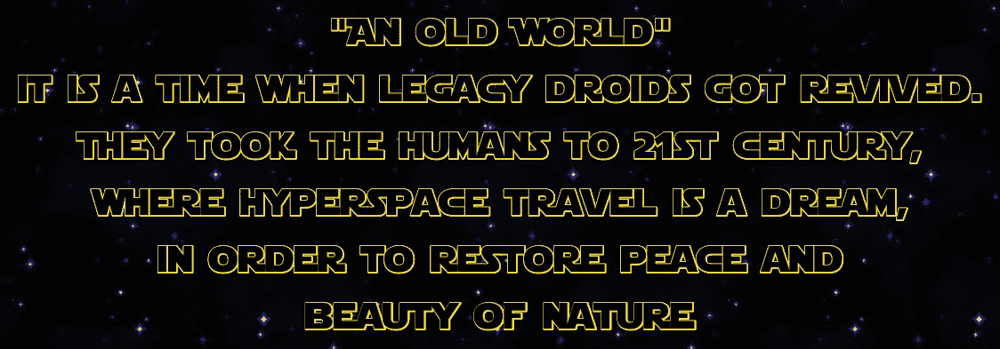

# 感知机器人的星球大战故事

> 原文：<https://towardsdatascience.com/a-star-wars-story-by-sentient-droid-10aec13e4e11?source=collection_archive---------70----------------------->

## 如果星球大战的故事是由机器写的会怎么样？



作者图片

# **简介**

想象一下，机器人带着未来的知识来到 21 世纪，却只有当前的技术来改写他们的星球大战故事。

在这篇文章中，我们将看到一个机器人(机器学习模型)如何利用未来的知识(星球大战书籍)生成它的星球大战故事。


来源: [neonbrand](https://unsplash.com/@neonbrand)

# **模型**的架构

该模型采用单词的输入序列。我们用 LSTM 来理解句子的上下文。因为简单的 RNN 会有[消失渐变问题](https://en.wikipedia.org/wiki/Vanishing_gradient_problem)，所以对于文本生成，我使用 LSTM。

该模型的输出是最可能的下一个单词的单词分数。下面的代码显示了使用 PyTorch 的模型架构。

# 故事生成

故事生成是通过将单个单词和文本长度作为输入来完成的。该单词被传递给模型以获得下一个最可能的单词，我们继续这个过程，直到达到文本长度。[前 K 个采样](https://pytorch.org/docs/master/generated/torch.topk.html)用于在选择下一个最可能的单词时引入一些随机性。

# 生成的样本

以下是用各种输入单词和文本长度生成的文本的 12 个例子。

**样品 1:**

我觉得提到韩是个白痴很有趣。我们可以看到这个顺序，虽然不是很好，但很有意义。

输入单词:绝地

文本长度:12

**生成的输出**

```
jedi.
han was a idiot, not looking in his datapad
```

**样品 2:**

以下是为绝地武士生成的不同序列。到目前为止，较小的文本长度似乎更有意义。我不得不在《星球大战》故事中寻找与绝地、贸易联盟和十一人的联系🤔

输入单词:绝地

文本长度:12

**生成的输出**

```
jedi. and the trade federation, servers of the eleven, commissioned
```

**样品 3:**

这让我觉得它在说尤达无所不知！我喜欢尤达，所以我同意它😄

输入单词:尤达

文本长度:12

**生成输出**

```
yoda. the jedi had expanded on the galaxy, but he knew
```

**样品 4:**

这个文本长度更长。

> "猎鹰的脸似乎，然后弹射出窗外"

对于这篇文字，我想象一个星际战斗机飞行员正透过他/她的窗户看着千年隼的前方。当千年隼移动时，飞船似乎从这个维度弹射到另一个维度😜

输入单词:尤达

文本长度:100

**生成的输出**

```
yoda. ”
“i don’t know—fly the fancy, ” yoda replied quietly.
“no, ” luke called, uncharacteristically the robot of happiness and disappointment.
“we know. ”
“and luke’s anger. ” lando yelled.
the falcon ’s face seemed, then catapulted out the window.
the phantom- cloaked girl swiveled at the princess of the death.
" i know you were dead."
" no, not...."
" i don't know about him," ferus said
```

**样品 5:**

这个很有趣，说维德在操纵他的方式！还提到了冲锋队的男子气概(我认为它是在说“匹配”，但男子气概更有趣)

输入单词:维达

文本长度:35

**生成的输出**

```
vader could react in the main navy, manipulating his way to the limit, then turned back to the main scout. the stormtrooper of the two- east jawas were just only a matchto
```

**样品 6:**

该序列正确地链接了 r2-d2，可能输入中提到了足够多的 r2-d2 名称实例。

> "但是帝国将由帝国掌管！"

嗯，不知道 r2-d2 在想什么，但我们不能让这种事情发生😂

> “我不认为我们能找到它”

看起来 r2-d2 正在和 c-3po 通话

输入字:r2

文本长度:75

**生成输出**

```
r2- d2. " i don't think we can find it," he said." but the imperials will be in charge of the empire!" he looked over to his chair." i can't have to be a long idea," ferus answered." we can get out of the temple." " we know, i have to tell you
```

**样品 7:**

同样，这里欧比和欧比旺的联系是正确的。

嗯，这似乎是一个很好的想象练习，如果奥比万的飞船是一架巴托克星际战斗机呢！哈哈，我可想不出这个🤣或者是巴托克偷了贸易联盟的星际战斗机，然后给了欧比万？我会让你弄明白的

输入单词:obi

文本长度:100

**生成的输出**

```
obi- wan's ship. the bartokk starfighter fired in a heap overlooking the arena with a violent, hanging out of the roof.
he had heard the emperor, and he wouldn't be happy for the time of his life.
" the queen has been destroyed to me."
" the senate is not a trap," obi- wan said.
" i can tell him. you can tell him that you have a chance to collect."
" i don't know."
" you don't
```

**样品 8:**

有原则的丘巴卡，是的，我喜欢！

输入单词:丘巴卡

文本长度:10

**生成的输出**

```
chewbacca, with the connectors and the principles.
```

**样品 9:**

> “你根本不了解绝地，”费罗斯说。但绝地将是唯一的一个——原力”

看起来费罗斯·奥林正在教阿纳金·天行者关于绝地的知识。也许它会结束，因为绝地将是阻止邪恶的唯一力量。

输入单词:阿纳金

文本长度:50

```
anakin, and the naboo star destroyers and services."
" yes, master."
" what do we commit?"
" you have no idea of a jedi," ferus said." but the jedi will be the only one— the force
```

**样品 10:**

所以我们从下面的文本中了解到了索拉·纳贝里和绝地将在纳布之战中一起对抗抵抗组织的故事？

输入单词:sola

文本长度:100

**生成的输出**

```
sola. and the jedi had begun to overthrow the resistance."

" you don't know," ferus said.

" i don't know," he said." it is no of the founding reasons."
" you know you were a good one!" the boy asked irritably." but the chancellor are not happy to unravel the emperor's advisor in the galaxy," ferus said." i can see it." the boy nodded." i have a feeling,"
```

**样品 11:**

卢克·天行者似乎想通知某人关于联邦飞船的事。

输入单词:联邦

文本长度:22

**生成的输出**

```
federation droids of the rebel star cruisers, indomitable.
" i have to tell the first naval," the boy
```

**样品 12:**

我会把样品交给莱娅公主👸

下面的文字似乎把莱娅公主、纳尔·沙达和汉·索洛联系了起来。它似乎是从《走私者的月球之书》中获取上下文的。

输入单词:公主

文本长度:30

**生成的输出**

```
princess the freighters of his shaddaa, alerting the empire, and the jedicouncil of the sith lords of the force.
han was not nervous to triggerits his own
```

# 结论

生成的文本不是很好，因为模型需要更多的微调。虽然我们对最准确的模型来完美地预测训练数据中的每个单词不感兴趣，但我们希望推广该模型。在过度拟合和泛化之间保持平衡。模型的当前损失为 4.1。我想测试增加纪元，增加批量大小，降低学习率，增加层数和隐藏维度，以获得更低的损失和更好的预测。我的 1080Ti 需要很长时间来训练。我正在等待 AWS 团队给我 Sagemaker [ml.p2 实例](https://aws.amazon.com/sagemaker/pricing/instance-types/)来对此进行微调！