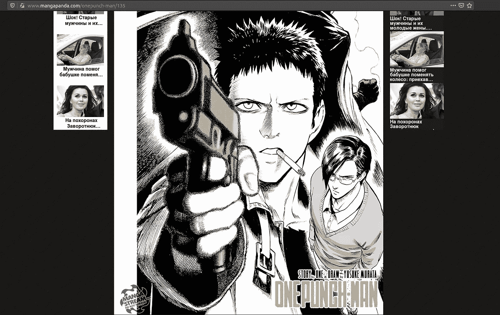
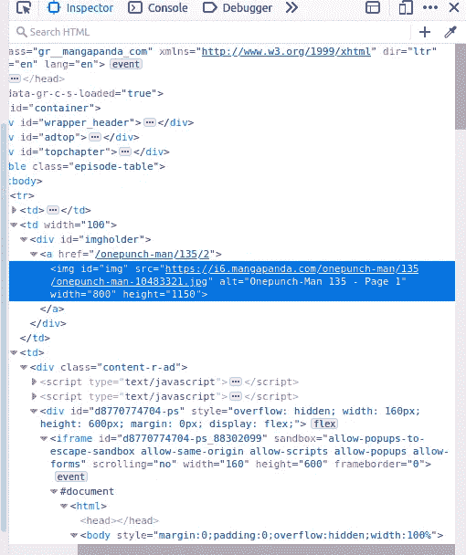
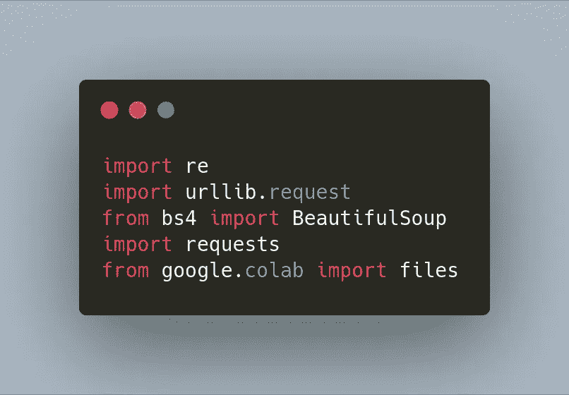
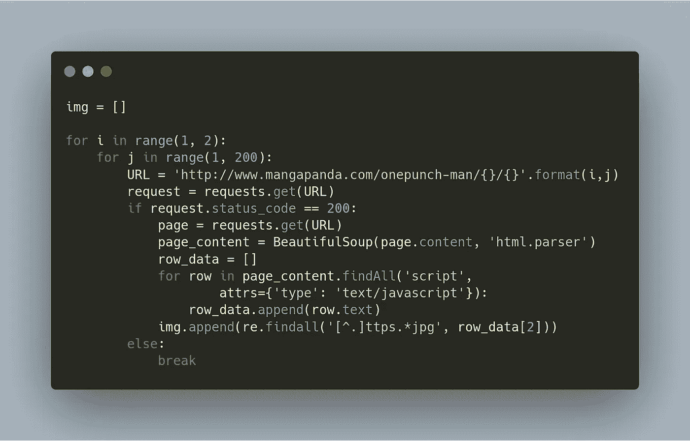
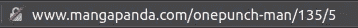
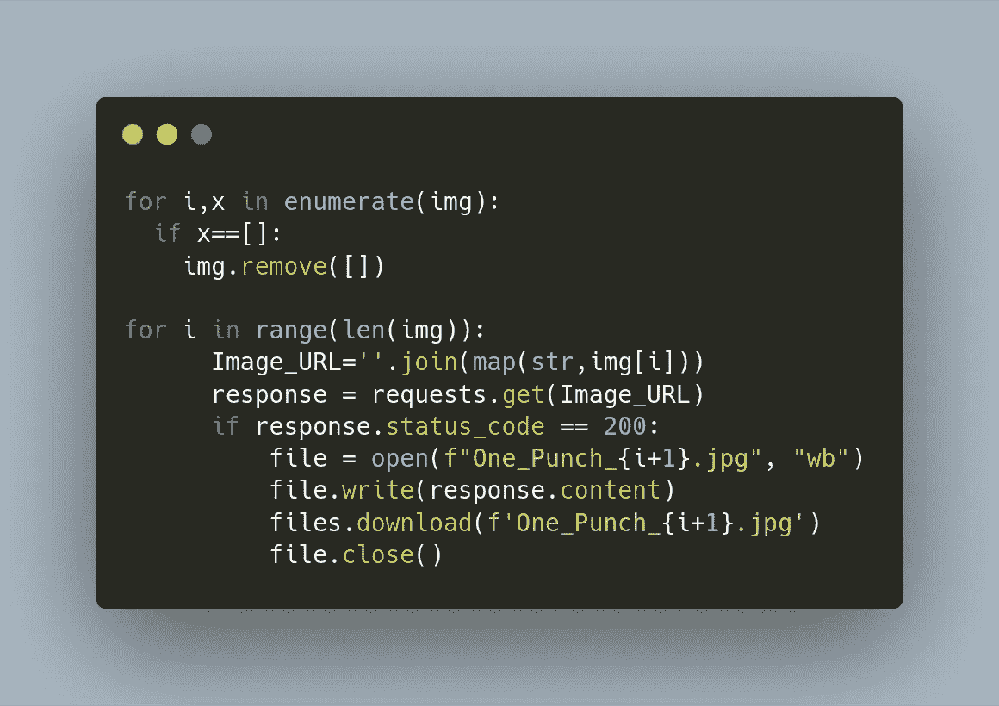
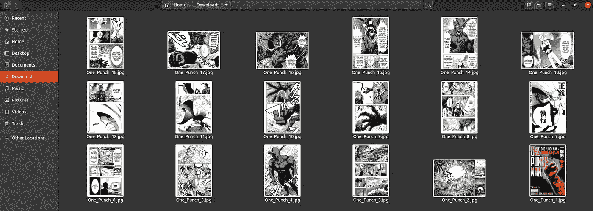

# 使用 Python 下载漫画的分步指南

> 原文：<https://towardsdatascience.com/a-step-by-step-guide-to-download-manga-comic-using-python-581c10d732b9?source=collection_archive---------24----------------------->

## 网页抓取/ **采集**

## 技术可以用来解决我们的日常问题。

由[奥拉夫·阿伦斯·罗特内](https://unsplash.com/@olav_ahrens?utm_source=medium&utm_medium=referral)在 [Unsplash](https://unsplash.com?utm_source=medium&utm_medium=referral) 上拍摄的照片

那些不熟悉漫画和动漫的人，让我为他们澄清一些事情。在日本文化中，漫画是包含故事的漫画，其中有卡通人物的精髓。动漫是在漫画出版并流行到足以制作动画并从中获利后由漫画改编而成的。在日本，所有年龄的人都阅读漫画。

有一天，我开始看《一拳》动漫，因为我的一个动漫爱好者朋友推荐我在这个疫情尽情观看。我不经常看动漫。但是，我只看推荐的和在 IMDB 上有很高人气的。所以，它总共有两季，而且都完成了。但是，它有更多的季节来晚了，由于这个疫情，整个日本的动画制作已经停止。所以，我告诉我的朋友，我已经完成了两季，在等待第三季的时候，我不能保持我的渴望，他告诉我有一个网站，你可以在那里阅读漫画。它叫做[mangapanda.com](http://www.mangapanda.com)

我看到有太多的广告弹出来创收，这太分散注意力了。开始在漫画网站搜索《一拳》，开始看了一段时间。我厌倦了阅读，因为每次你看到主屏幕和广告都会让你心烦。

[来源](http://www.mangapanda.com/onepunch-man/135)

作为一名电脑极客，我开始使用 web developer 工具分析该网站，默认情况下，任何 web 浏览器都可以通过按 CTRL+SHIFT+I 来使用该工具。我发现该网站的主项目容器(包含漫画图像)有一个 HTTPS 链接。jpg 格式。

[来源](http://www.mangapanda.com/onepunch-man/135):(在网站上按 CTRL+SHIFT+I，选择图片查看此菜单)

点击该链接在浏览器中打开图像，没有广告。但是每次打开切换工具然后点击链接听起来很乏味，对吗？。于是，一个念头涌上心头，有没有办法把这些图像和其他图像在延续中提取出来？事实证明，在这种情况下，网络搜集会有所帮助。啊，我听说过它，但是从来没有时间使用它。

使用我们的大脑和编码技巧来解决问题的时候到了。

为此，我使用了 google-colab。如果你对它不熟悉的话 [*查一下*](https://medium.com/@dinaelhanan/an-absolute-beginners-guide-to-google-colaboratory-d55c0eb375de) *这个就出来了！*

***第一步:***

引进必要的图书馆来建立我们自己。

来源:[碳](https://carbon.now.sh/)(美容)+ [Colab(](https://colab.research.google.com/drive/1jjuPwk2TNDURvoFHgvPgYpiH-9W_1FIN) 代码)

***第二步:***

我们会将所有的 *HTTPS* 图片链接保存在 **img[]** 中。

来源:[碳](https://carbon.now.sh/)(美容)+ [Colab(](https://colab.research.google.com/drive/1jjuPwk2TNDURvoFHgvPgYpiH-9W_1FIN) 代号)

漫画的每一部分总共有两个 for 循环。

来源:来自我笔记本电脑的截图

回路的第一个*是零件号，回路*的第二个*是段号。在上面的例子中，它是第 135 部分和一拳漫画的第 5 部分。*

在上面的代码中，我使用了 *range (1，2)* 来提取漫画的第一部分，在第二个循环中使用了 *range (1，200)* ，因为这部漫画的任何部分都没有超过 200 页。

使用*请求*库获取页面的链接，如果 URL 存在，使用*漂亮的汤*库解析它，并将这个解析包含在 *page_content* 中。这个*页面 _ 内容*页面的所有信息都以 *HTML 标签的形式出现。*

我们的图像链接在 *page_content 的一个脚本标签中。*因此，我们提取所有的脚本标签并添加到一个名为 *row_data 的列表中。*我们发现索引号 2 有我们的图像，所以我们使用正则表达式提取图像并添加到 **img[]** 。对我来说这是一个困难的部分，因为我对它不熟悉。

来源:[碳](https://carbon.now.sh/)(美容)+ [Colab(](https://colab.research.google.com/drive/1jjuPwk2TNDURvoFHgvPgYpiH-9W_1FIN) 代号)

现在我们有了 img[]中的所有图像，所以我们剩下的就是使用我们在 starting 中导入的*文件库*来下载它(从 google.colab 导入文件)

来源:来自我笔记本电脑的截图

*(注意:如果您使用另一种环境来下载图像，方法会有所不同。可以用 wget 下载)。*

现在，你可以把所有这些图片做成 PDF 格式，开始阅读没有任何广告的漫画。万岁！！

如果你想下载你最喜欢的漫画，那么去漫画熊猫网站，获取网址并粘贴到网址变量中。

链接到 [colab 笔记本](https://colab.research.google.com/drive/1jjuPwk2TNDURvoFHgvPgYpiH-9W_1FIN)

我相信它会对你有用，你会从这篇文章中有所收获。直到那时快乐编码！！