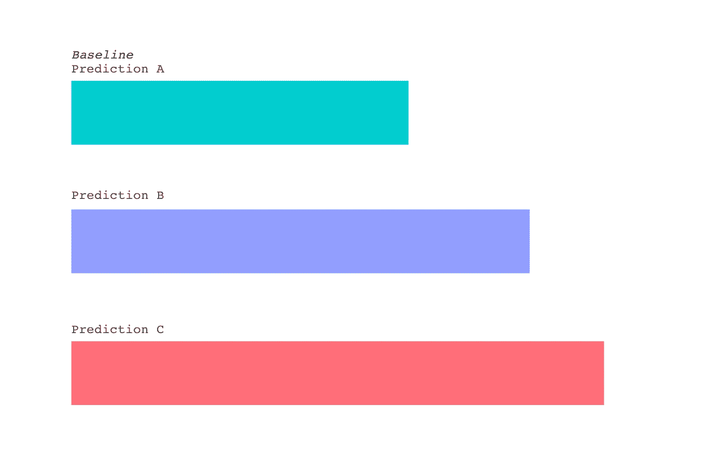
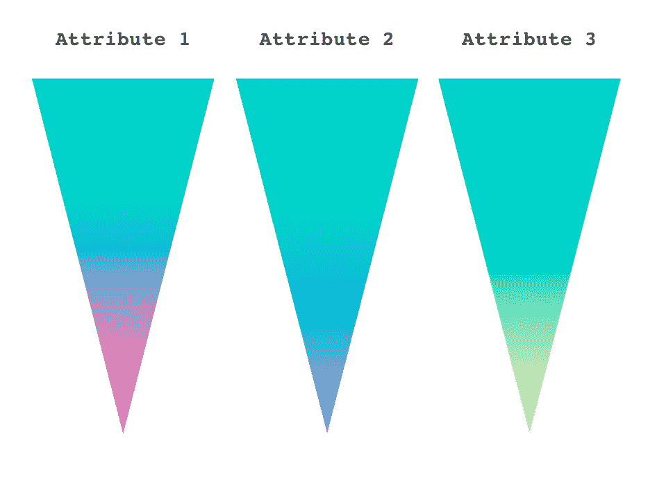
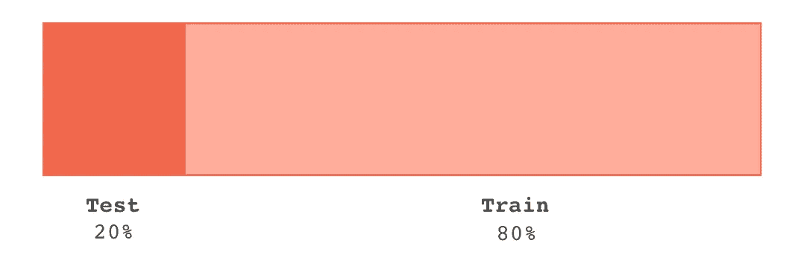
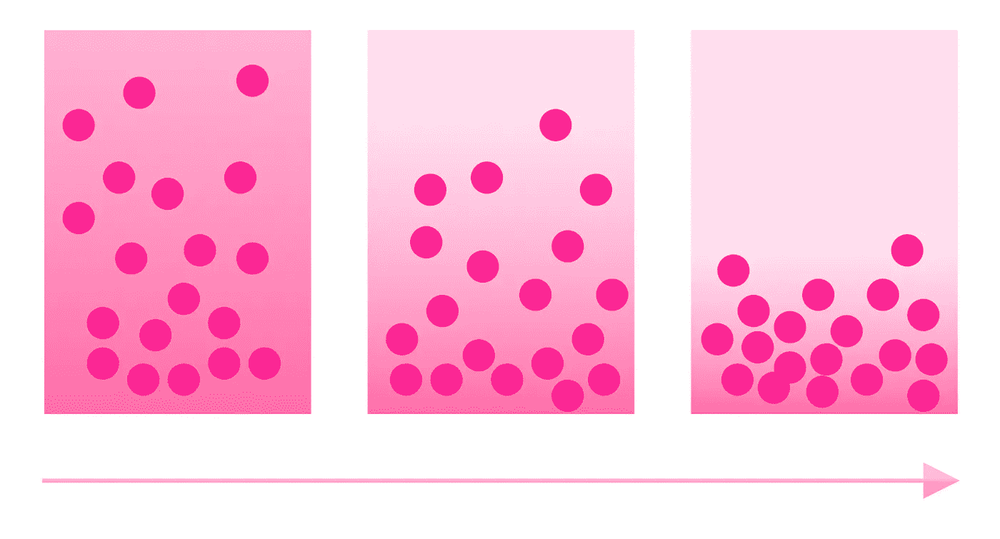
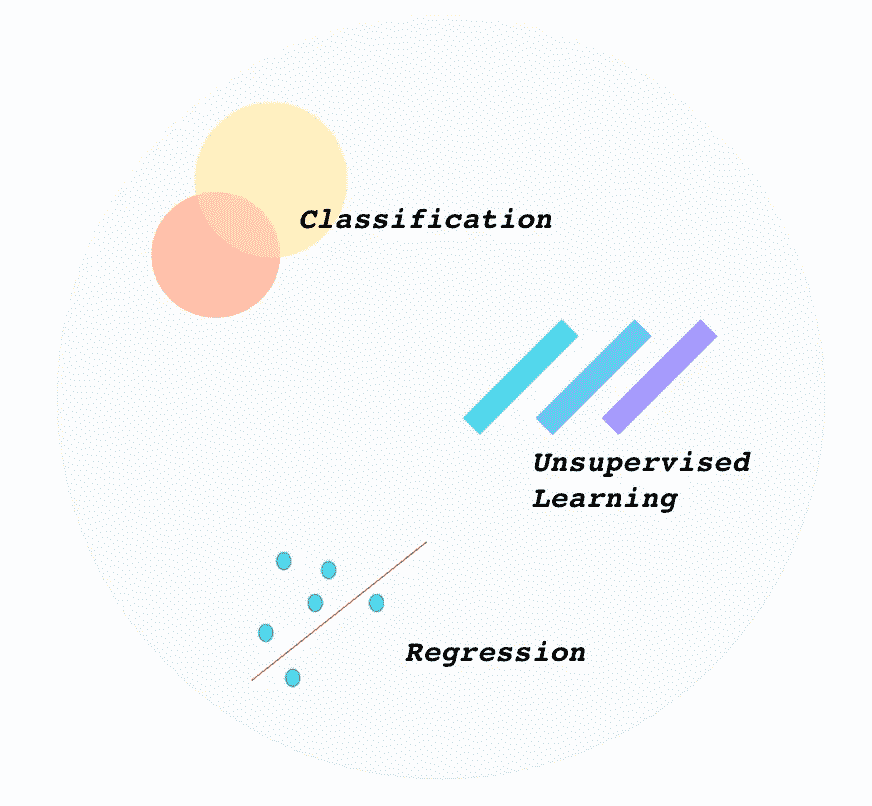
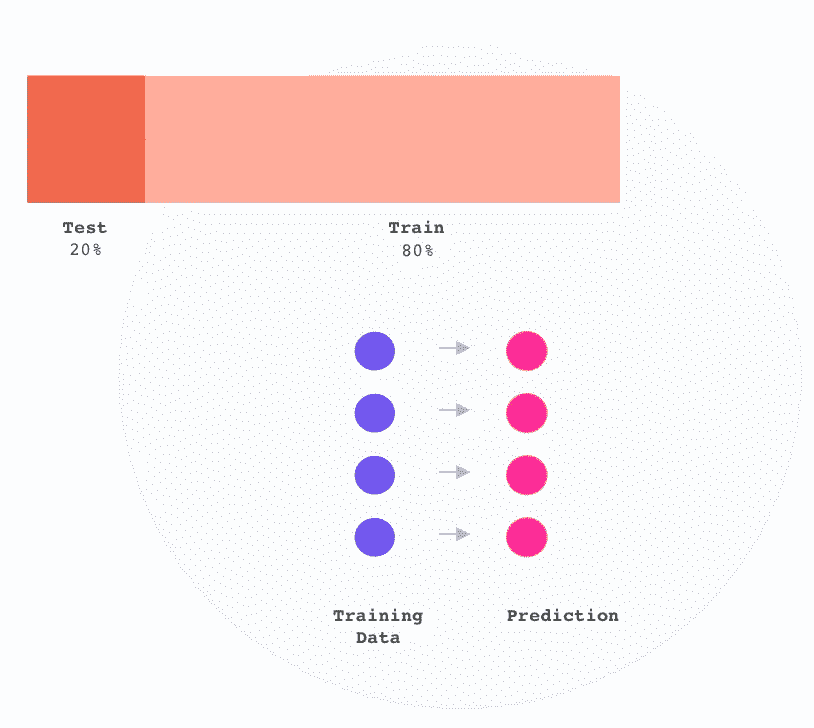
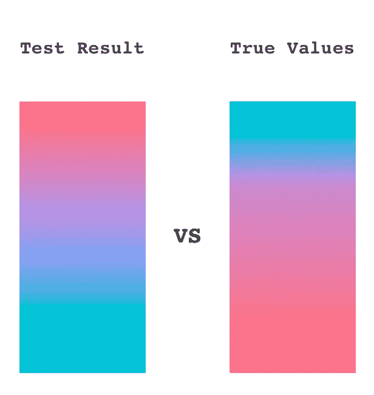
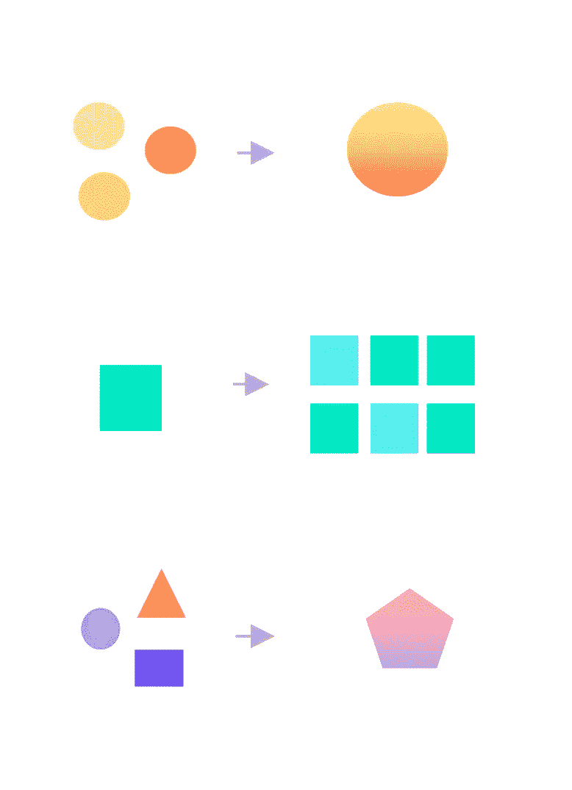
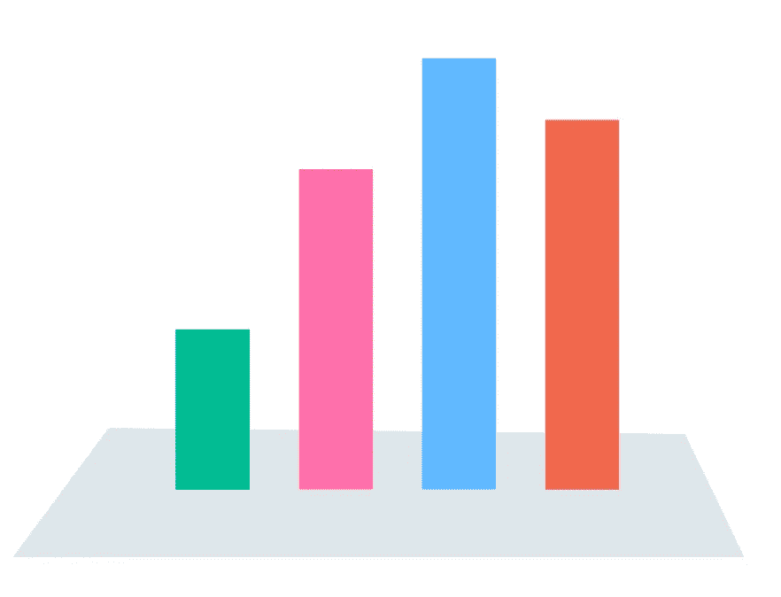

# 获得基线算法的逐步指南

> 原文：<https://towardsdatascience.com/a-step-by-step-guide-to-getting-your-baseline-algorithm-5bba1b7ce047?source=collection_archive---------15----------------------->

## 在任何给定的数据科学解决方案中获得基准算法的逐步过程。

# 第一步

**确定你的商业目标**。我们最成功的目标(推动最大价值)是可衡量的、可操作的、可行的，并直接影响业务。例如，一个好的初始目标是“让我们建立一个算法模型，在评估我们业务的未来客户时，帮助我们识别坏客户和好客户”。假设我们有一个数据字典，它定义了潜在好客户和潜在坏客户的标准。

## 步骤 1a:

**建立你的评价标准。**什么指标将为我们提供实现业务目标所需的洞察力？例如，“我们想衡量我们的算法有多精确？”

# 第二步

**采集数据&开始分析**。

从任何来源提取数据(这本身就是一个过程，并不是本文的基础)。成功导入文件后，观察列数、行数、列名等。仔细看看，检查各个列的名称，是否清楚您正在查看哪种数据？为什么或为什么不？在开始挖掘细节之前，先从高层次的概念上审视您的数据。即使您发现您的数据特别“脏”或不清楚，了解所有事物是如何联系在一起的也是很重要的。

## 步骤 2a:

确定它是数值型还是分类型。你的变量类型是什么？是正态分布吗？如果数据是分类的，那么你的数据**是有序的还是名义的**？如果你的数据是数值，你的数值**是离散的还是连续的**？我建议在你的 Jupyter 笔记本上记下这些信息，例如，通过注释(这里用#comment)。

## 步骤 2b:

**确定您的数据是否有异常值**。为了对您的数据进行适当的计算，您需要尽可能地将其标准化。去掉无关的数据点将有助于你的数据结构不会过于倾斜。

## 步骤 2c:

**识别缺失值**(如有)。通常，我们使用平均值，有时是中值或众数来给出最佳值，以填充数据集中的任何空白。

# 第三步

**分割数据**80/20 或 75/25，其中 80%或 75%是您的训练集，20%或 25%是您的测试集。你不需要在你所有的东西上训练你的算法——你的算法需要新的原始数据来测试。我们使用样本在新的东西上测试模型(模型以前没有见过这个数据)。我们基于训练数据集建立我们的预测结果。通过将我们的预测结果与测试数据集进行比较，我们可以衡量该算法的真正实力。

为了获得我们可以进行计算和预测的标准化数据，我们必须以各种方式清理数据。

# 第四步

**对训练数据进行规范化和‘清洗’**。填充缺失值、剩余的异常值以帮助规范化数据，以便您可以正确地使用它。

## 步骤 4a:

**对测试数据进行规范化和‘清洗’。**虽然这种方法可能被视为更加繁琐，但它被认为是将测试数据集与训练数据集分开进行清理的最佳实践——它有助于避免过度拟合。过度拟合是指当预测数据与历史数据过于接近时，模型中出现的错误。

# 第五步

**建模阶段**。确定哪些类型的模型，这取决于我们寻求应用哪种机器学习类型。我们自问，是*分类*问题，*回归*问题，还是*无监督*学习问题？

一旦确定，实现模型。在这里，您可以选择属于您的“问题类型”的 3-4 种不同的算法。

## 基本算法分解

**分类**:随机森林、朴素贝叶斯、逻辑回归、梯度推进、K 近邻。

**回归:**山脊、套索、弹性、网状、线性、非线性(这些算法不要与分类算法混淆，因为它们是回归算法——随机森林回归器、梯度推进回归器、K-最近邻回归器)。

**无监督学习:**降维((SVD:奇异值分解，PCA:主成分分析，LDA:潜在狄利克雷分配))、K-Means((分层的，基于密度的，基于距离的))。

# 第六步

**训练你的算法。**从上面的列表中选择，根据训练数据集训练你的算法。

# 第七步

**做个预测。**采用经过训练的算法，通过将您的预测结果应用到测试数据集来进行预测。接下来，我们将获取预测结果或输出，并对其进行分析。

# 第八步

**评估。**获取测试结果，并将其与真实值进行比较。将预测值与真实值进行比较的行为被归类为评估模型。一旦进行了比较，我们就会看到我们之间的差距(即准确度得分度量告诉我们有多远)。如果你的评价低于你的门槛，你应该高兴！如果您的预测结果非常不准确，也许您在第一次运行时看到了极高的准确度，您将不得不返回并检查您的数据和所做的任何调整。当您没有看到您希望的指标时，首先在内部解决您的问题，检查您是如何清理数据的，以确保您没有遗漏任何东西。尝试一种不同的算法，使用您可能创建的任何函数或新列或数据集。一旦你可以自信地确认你的过程和算法是合理的，然后从外部寻找不同的数据来源——也许有一些开源数据可以支持你的预测模型？

# 第九步

**特色工程。**如果你穷尽了所有不同类型的数据，穷尽了所有不同类型的算法，那么就开始特征工程。最好的做法是，一旦你开始第二轮，就开始特征工程。制作笔记本的副本，并开始在副本上重新制作模型，这样您就可以比较和对比过程差异和输出差异。创建新功能不是一件轻而易举的事情，所以要坚持做下去，并花时间进行评估。

# 第十步

把你的发现和分析放在一起。用一种最能引起受众共鸣的方式传达你的发现。考虑一个 Keynote、PowerPoint、Google Slides 演示文稿，它以一种有意义但易于理解的方式概括了你的发现，让你的业务伙伴能够最好地综合所有已经完成的工作。