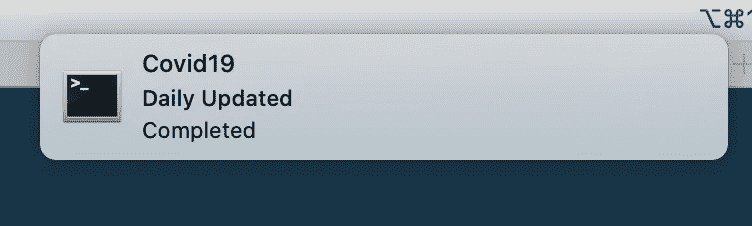
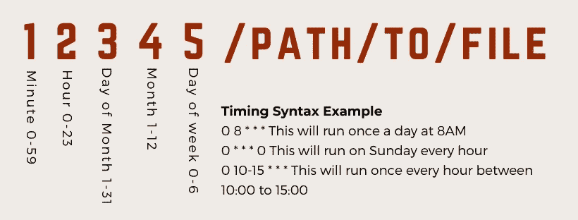
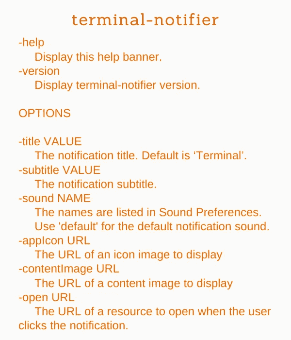
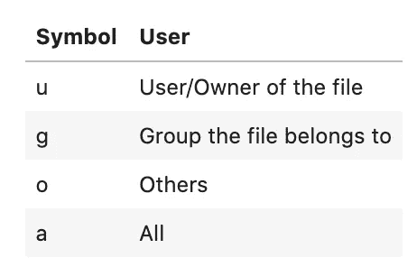
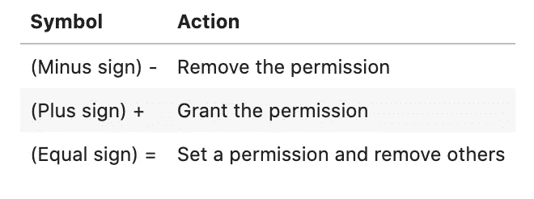
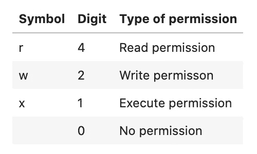
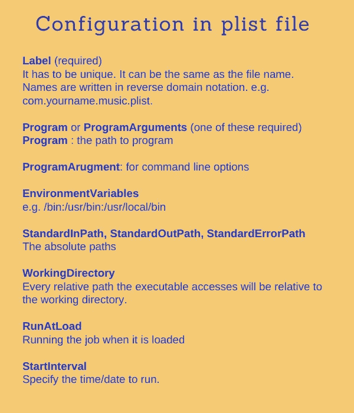
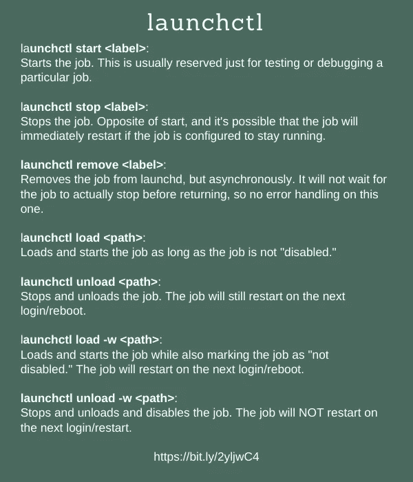

# 在 macOS/Linux 上运行 Cron 和 Launchd 的完整指南

> 原文：<https://towardsdatascience.com/a-step-by-step-guide-to-scheduling-tasks-for-your-data-science-project-d7df4531fc41?source=collection_archive---------2----------------------->

## 编程；编排

## 计划任务的逐步指南


左图由 Unsplash 上的 [Mindspace 工作室拍摄。作者的正确图像](https://unsplash.com/@mindspacestudio)

```
**Table of contents**[**Introduction**](#7f32)1\. [Papermill and terminal-notifier](#b73c)
2\. [cron for Linux/macOS](#919e)
3\. [launchd for macOS](#bfcb)

[**Conclusion**](#c03d)
```

[更新:2021 年 5 月 28 日]

# 介绍

你有一个需要你每天花费时间的数据科学项目吗？您是否使用每天更新的数据馈送？例如，约翰霍普金斯大学 CSSE 分校的 [2019 新型冠状病毒新冠肺炎(2019-nCoV)数据仓库](https://github.com/CSSEGISandData/COVID-19)每天更新，我在[我的个人项目](https://github.com/shinokada/covid-19-stats)中使用它。

我手动启动 Jupyter，打开一个项目，重启内核并运行所有单元，然后 git add/commit/push。这是一点工作。在本文中，我将分享为您的数据科学项目设置`launchd`和`cron`作业的一步一步的过程，这样它将在后台自动更新您的项目，甚至通知您。

用于 Linux/macOS 的`**cron**` **和用于 macOS 的** `**launched**`

> **虽然 launchd 是 macOS 中的首选方法，但是`cron`方法在 macOS 中也同样适用。**

**`cron`是一个 Linux 实用程序，它可以安排服务器/计算机上的命令或脚本在指定的时间和日期自动运行。cron 作业是计划任务，它对于自动化重复任务非常有用。**

**launchd 是苹果公司创造的，是许多 Unix 工具的替代品，如`cron`、`inetd`、`init`、[等](https://en.wikipedia.org/wiki/Launchd#History)。**

**看完这篇文章，你就可以开始安排任务了，节省了你很多宝贵的时间。**

**[](/7-essential-tips-for-writing-with-jupyter-notebook-60972a1a8901) [## 用 Jupyter 笔记本写作的 7 个基本技巧

### 第一篇数据科学文章指南

towardsdatascience.com](/7-essential-tips-for-writing-with-jupyter-notebook-60972a1a8901) [](/hands-on-jupyter-notebook-hacks-f59f313df12b) [## 手把手的 Jupyter 笔记本黑客

### 您应该使用的技巧、提示和快捷方式

towardsdatascience.com](/hands-on-jupyter-notebook-hacks-f59f313df12b) 

# 步骤 0:造纸厂和终端通知程序

## 造纸厂


[造纸厂标志](https://papermill.readthedocs.io/en/latest/)

Papermill 是一个参数化和执行 Jupyter 笔记本的工具。我可以用它在 cron 和 launchd 作业文件中运行 Jupyter 笔记本文件。

```
$ pip install papermill
```

或者

```
$ pip3 install papermill$ papermill --help
```

你可以在这里找到命令行界面帮助。

造纸厂的用途:

```
papermill [OPTIONS] NOTEBOOK_PATH OUTPUT_PATH
```

我很快会给你看一个例子。

## 终端通知程序



运行中的终端通知程序。作者图片

[终端通知器](https://github.com/julienXX/terminal-notifier)是一个发送 macOS 用户通知的命令行工具。当计划的作业完成时，我将用它来通知我。

安装终端通知程序。

```
$ brew install terminal-notifier
$ terminal-notifier -help
```

[](/the-ultimate-guide-to-your-terminal-makeover-e11f9b87ac99) [## 终端改造的终极指南

### 今天你将度过的最好的 11 分钟:程序员的终端提示

towardsdatascience.com](/the-ultimate-guide-to-your-terminal-makeover-e11f9b87ac99) 

# 用于 Linux/macOS 的 cron

在 macOS 中，您可以通过两种方式定时运行后台作业:启动作业和 cron 作业。请注意，macOS v10.15 仍然支持它，尽管`cron`不是推荐的解决方案，并且`launchd`已经被取代。

## 步骤 1:设置 cron 作业

您可以使用您的用户名设置 cron 作业:

```
$ whoami
your-name$ sudo crontab -u your-name -e
Password:
sh-3.2#
```

您可以在 macOS 中使用`sudo su`来启用 root 用户，这样您就不需要输入密码了。

```
$ sudo su
$ crontab -u your-name -e
```

`-u`指定用户的名称。`-e`编辑当前的 crontab。

## 句法



cron 语法指南。作者图片

如上所述，添加五个数字和一个要执行的文件的路径。

示例:

```
0 10 * * * ~/DataScience/covid-19-stats/covid19-cron
```

上面会在每天 10:00 运行文件`~/DataScience/covid-19-stats/covid19-cron`。

> 如果系统关闭或休眠，cron 作业不会执行。如果您错过了指定的时间，它将在您的系统打开时的下一个指定时间执行。

可以输出`stdout`和`stderr`:

```
# log stdout and stderr
42 6 * * * ~/DataScience/covid-19-stats/covid19-cron > /tmp/stdout.log 2> /tmp/stderr.log
```

`>`将标准输出重定向至`/tmp/stdout.log`，而`>2`将标准误差重定向至`/tmp/stderr.log`。

一旦设置了 cron 作业，您可以列出它:

```
$ crontab -l
0 20 * * * ~/DataScience/covid-19-stats/covid19-cron
```

如果要删除所有 cron 作业:

```
$ crontab -r
```

您可以在 crontab 中添加多个 cron 作业。

```
0 20 * * * ~/DataScience/covid-19-stats/covid19-cron
0 7 * * * Path/to/file/to/execute
0 7 * * 0 Path/to/another/file/to/execute
```

crontab guru 是一个快速简单的 cron 计划工具。

## 步骤 2:编写 cron 作业

您可以将所有 cron 作业文件放在一个目录中，但是我将它放在项目根目录中。将当前工作目录更改为您的项目，创建一个 cron 作业文件，并在编辑器中打开它。根据[谷歌风格指南](https://google.github.io/styleguide/shellguide.html#s2-shell-files-and-interpreter-invocation)，可执行文件不应该有`.sh`扩展名。

```
$ cd path/to/project
$ touch covid19-cron
$ vim covid19-cron
```

## 步骤 3:定义 shebang

脚本第一行中使用的 shebang 表示要执行的 UNIX/Linux 操作系统。

尽管 Papermill 和 terminal-notifier 在终端中工作，但我们需要添加它们的路径。

让我们找到他们。

```
$ which papermill
/usr/local/bin/papermill$ which terminal-notifier
/usr/local/bin/terminal-notifier
```

在我的 covid19-cron 文件中:

```
#!/usr/bin/env bash
# run covid-19 files 
# git add, comit and push

dir=/Users/shinokada/DataScience/covid-19-stats
papermill=/usr/local/bin/papermill
notifier=/usr/local/bin/terminal-notifier

cd $dir
$papermill covid-19-matplotlib.ipynb ./latest/covid-19-matplotlib.ipynb
# more files ...
$papermill covid-19-plotly.ipynb ./latest/covid-19-plotly.ipynb git add . 
git commit -m "update" 
git push
$notifier -title Covid19 -subtitle "Daily Updated" -message "Completed" -open "https://mybinder.org/v2/gh/shinokada/covid-19-stats/master"
now=$(date)
echo "Cron job update completed at $now"
```

我在根目录中创建“最新”目录。造纸厂将文件输出到这个“最新”目录。因为我们将使用 git，所以您需要确保在项目根目录中有`.git`。

如果您使用的是`%run somefile`，我建议您将它们添加到 cron-file 中。

我使用`title`、`substitle`、`message` 和`open`作为终端通知器[选项](https://github.com/julienXX/terminal-notifier#options)。

**终端通知程序快速指南**



终端通知程序快速指南。作者图片

## 步骤 4:添加执行权限

这个 bash 文件需要权限才能执行。

```
$ chmod u+x covid19-cron
```

`chmod`设置文件权限。



chmod 用户指南。作者图片



chmod 行动指南。作者图片



chmod 权限指南。作者图片

`chmod u+x covid19-cron`允许用户执行 covid19-cron。

上述命令与以下命令相同:

```
$ chmod 744 covid19-cron
```

## 邮寄

在运行 cron 作业后，您的终端通过邮件发送其输出和错误消息。让我们检查一下 cron 的工作是否有效。

```
$ mail
```

你需要按回车键来阅读信息，然后按 q 和回车键退出。使用`j`查看下一行。你需要检查邮件是否没有错误。如果出现错误，您需要关注问题。

## 测试 cron 作业

您需要重置 crontab 时间来测试您的 cron 作业。`launchd`允许我们测试工作，但对于`cron`这是唯一的测试方式。

```
$ sudo crontab -u your-name -e# change time 
5 20 * * * ~/DataScience/covid-19-stats/covid19-cron
$ crontab -l
5 20 * * * ~/DataScience/covid-19-stats/covid19-cron
```

测试完成后，它会显示通知。


终端通知。作者图片

# macOS 的启动

`[launchd](https://www.launchd.info/)`是一个统一的开源服务管理框架，用于启动、停止和管理守护程序、应用程序、进程和脚本。

> 如果您通过设置 StartCalendarInterval 键来计划一个启动的作业，并且计算机在该作业应该运行时处于睡眠状态，则您的作业将在计算机唤醒时运行。

**然而**，如果在作业本应运行时机器关闭，则作业不会执行，直到下一个指定时间出现。

## 步骤 1: plist 文件

一个 [PLIST](https://www.manpagez.com/man/5/launchd.plist/) 文件是一个系统范围的和每个用户的守护进程/代理配置文件。守护程序/代理是在后台运行的程序，无需用户输入。你定义程序的名字，什么时候运行，你想运行什么，等等。您将所有 plist 文件存储在`~/Library/LaunchAgents` 目录中。

[Update.1]如果您没有`~/Library/LaunchAgents`，您需要创建它。

```
# check ~/Library if it has LaunchAgents
$ ls ~/Library
# if not create the directory
$ mkdir ~/Library/LaunchAgents
```

创建一个`plist`文件:

```
$ cd ~/Library/LaunchAgents
$ touch com.shinokada.covid19.plist
```

在 com.shinokada.covid19.plist 中:

```
<?xml version="1.0" encoding="UTF-8"?>
<!DOCTYPE plist PUBLIC "-//Apple//DTD PLIST 1.0//EN" "http://www.apple.com/DTDs/PropertyList-1.0.dtd">
<plist version="1.0">
    <dict>
        <key>Label</key>
        <string>com.shinokada.covid19</string>
        <key>Program</key>
        <string>/Users/shinokada/DataScience/covid-19-stats/covid19-launchd</string>
        <key>EnvironmentVariables</key>
        <dict>
            <key>PATH</key>
            <string>/bin:/usr/bin:/usr/local/bin</string>
        </dict>
        <key>StandardInPath</key>
        <string>/tmp/covid.stdin</string>
        <key>StandardOutPath</key>
        <string>/tmp/covid.stdout</string>
        <key>StandardErrorPath</key>
        <string>/tmp/covid.stderr</string>
        <key>WorkingDirectory</key>
        <string>/Users/shinokada/DataScience/covid-19-stats</string>
        <key>StartCalendarInterval</key>
        <dict>
            <key>Hour</key>
            <integer>8</integer>
            <key>Minute</key>
            <integer>0</integer>
        </dict>
    </dict>
</plist>
```

在这里我每天早上八点跑`/Users/shinokada/DataScience/covid-19-stats/covid19-launchd`。

**plist 文件快速指南中的配置**



plist 文件快速指南中的配置。更多关于[发射配置](https://www.launchd.info/)。作者图片

## 步骤 2:创建 bash 文件

在项目根目录下创建一个名为 covid19-launchd 的文件。这与上面的`covid19-cron`非常相似。

```
#!/usr/bin/env bash
# run covid-19 files 
# git add, comit and pushpapermill covid-19-data.ipynb ./latest/covid-19-data.ipynb
papermill multiplot.ipynb ./latest/multiplot.ipynb 
# more files ...
papermill uk-japan.ipynb ./latest/uk-japan.ipynb 
papermill Dropdown-interactive.ipynb ./latest/Dropdown-interactive.ipynbgit add . 
git commit -m "update" 
git push
terminal-notifier -title Covid19 -subtitle "Daily Updated" -message "Completed" -open "[https://mybinder.org/v2/gh/shinokada/covid-19-stats/master](https://mybinder.org/v2/gh/shinokada/covid-19-stats/master)"
now=$(date)
echo "launchd update completed at $now"
```

因为我们在 plist 文件中设置了`PATH EnvironmentVariables`，所以我们不需要担心 Papermill 和终端通知程序的绝对路径。

你可以通过`bash covid19-launchd`测试一下是否有效。

## 步骤 3:添加执行权限

这个 bash 文件需要权限才能执行。

```
$ chmod u+x covid19-cron
```

## 步骤 4:测试 launchd

`lauchctl`控制 macOS 启动过程。它有`list`、`start`、`stop`、`load`、`unload`、[等](https://ss64.com/osx/launchctl.html)子命令。

为了我的案子；

```
$ launchctl list | grep covid
-  0  com.shinokada.covid19# test/debug 
$ launchctl start com.shinokada.covid19# if you need to stop
$ launchctl stop com.shinokada.covid19# load the job
$ launchctl load ~/Library/LaunchAgents/com.shinokada.covid19.plist# unload the job
$ launchctl unload ~/Library/LaunchAgents/com.shinokada.covid19.plist# get help
$ launchctl help
```


作者图片

## 再装

`launchctl`没有用于读取 config.plist 文件更改的 reload 命令。相反，您必须卸载然后重新加载 plist 文件，例如:

```
$ launchctl unload ~/Library/LaunchAgents/com.shinokada.covid19.plist$ launchctl load $_
```

`$_`和`!$`一样，指的是前一条命令的最后一个参数。

> 如果您对脚本或 plist 进行了任何更改，请确保卸载并加载 plist。

**启动快速指南**

`launchctl`有[多个子命令](https://ss64.com/osx/launchctl.html)，下图显示了重要的子命令。



启动快速指南。作者图片

# 结论

计划任务节省您的时间，并且易于设置。您不仅可以为您的数据科学项目设置它，还可以为您的日常工作设置它，例如更新节点包、自制公式等。如果你每天节省 3 分钟，一年就能节省 18 个小时以上！如果你有兴趣，可以在这里看到我的样本项目[。](https://github.com/shinokada/covid-19-stats)

**通过** [**成为**](https://blog.codewithshin.com/membership) **会员，可以完全访问媒体上的每一个故事。**


[请订阅。](https://blog.codewithshin.com/subscribe)

# 参考

*   [https://apple . stack exchange . com/questions/29056/launch CTL-difference-between-load-and-start-unload-and-stop](https://apple.stackexchange.com/questions/29056/launchctl-difference-between-load-and-start-unload-and-stop)
*   [https://www.launchd.info/](https://www.launchd.info/)

[](/version-control-with-jupyter-notebook-b9630bc5996e) [## 使用 Jupyter 笔记本进行版本控制

### Jupytext 分步指南

towardsdatascience.com](/version-control-with-jupyter-notebook-b9630bc5996e) [](/stepping-into-intermediate-with-jupyter-f6647aeb1184) [## Jupyter 用户的生产力提示

### 使用 Jupyter 笔记本和 JupyterLab 让您的工作流程更加高效

towardsdatascience.com](/stepping-into-intermediate-with-jupyter-f6647aeb1184) [](/exploring-normal-distribution-with-jupyter-notebook-3645ec2d83f8) [## 用 Jupyter 笔记本探索正态分布

### 使用 scipy 和 matplotlib 的正态分布初学者指南

towardsdatascience.com](/exploring-normal-distribution-with-jupyter-notebook-3645ec2d83f8)**