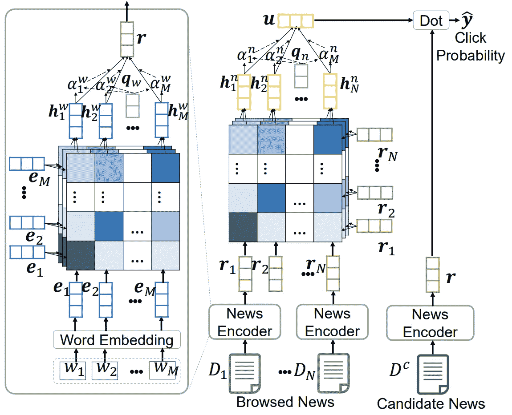
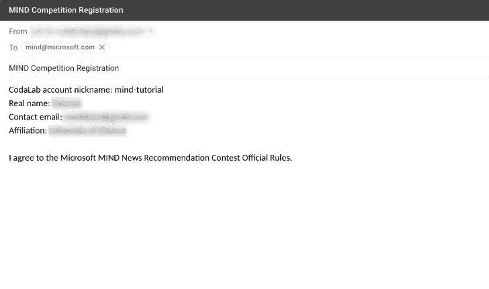
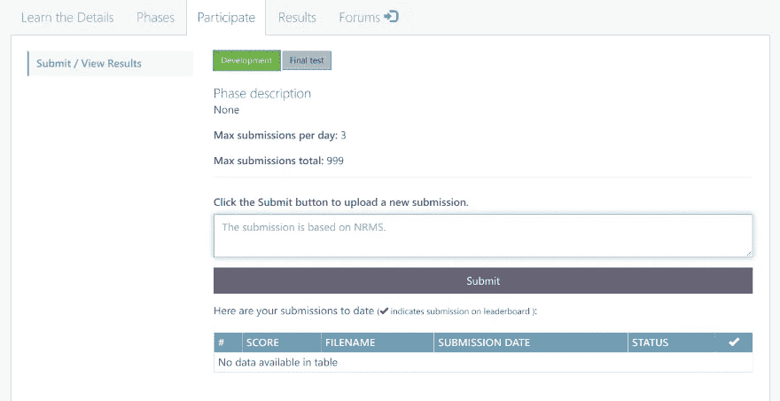

# 微软新闻推荐竞赛分步指南

> 原文：<https://towardsdatascience.com/a-step-by-step-guide-to-the-microsoft-news-recommendation-competition-700ab00831a?source=collection_archive---------28----------------------->

## 微软新闻推荐大赛如何入门

本文作者是吴、易经纬、、应乔、和米盖尔冈萨雷斯-菲耶罗，他们都在微软工作。

# 介绍

新闻推荐已经成为许多新闻服务的关键机器学习技术，也是数百万人消费新闻时的重要体验。为了促进新闻推荐的公开研究，微软的几个团队最近发布了[微软新闻数据集(MIND)](https://msnews.github.io/assets/doc/ACL2020_MIND.pdf) ，并发起了[微软新闻推荐竞赛](https://competitions.codalab.org/competitions/24122)。这篇博客文章提供了一个关于为竞赛中的新闻推荐问题开发一个算法，然后提交给竞赛进行评估的演练。这篇文章中描述的代码可以在[微软推荐者 Github 知识库](https://github.com/Microsoft/Recommenders)中找到。

# 竞争基准

为了帮助微软新闻推荐竞赛的参与者开始，我们提供了五个基线:深度知识感知网络(DKN)、长期和短期用户表示(LSTUR)、注意力多视图学习(NAML)、个人注意力(NPA)和多头自我注意力(NRMS)。这些模型在 MIND 上的性能在[这篇 ACL 论文](https://msnews.github.io/assets/doc/ACL2020_MIND.pdf)中进行了评估。在这篇博文中，我们以 NRMS 为例来说明提交过程，所有五个基线的代码都在[微软推荐库](https://github.com/Microsoft/Recommenders)上。

# NRMS

NRMS 是一种基于内容的神经新闻推荐算法。它使用多头自我关注来捕捉单词之间的相关性以学习新闻表示，并捕捉之前点击的新闻文章之间的交互以学习用户表示。它还通过选择重要的单词和新闻，使用附加注意力来学习信息性新闻和用户表示，如下图所示。

关于算法的细节可以在[本文](https://www.aclweb.org/anthology/D19-1671.pdf)中找到，核心的 NRMS 算法可以在[这里](https://github.com/microsoft/recommenders/blob/master/reco_utils/recommender/newsrec/models/nrms.py)找到。

NRMS 算法的体系结构

# 代码示例

我们提供了一本 Jupyter 笔记本来帮助参赛者开始学习 NRMS 算法。在笔记本中，首先下载思维数据集。为了训练 NRMS 模型，应该从竞争平台复制原始数据集。代码示例中的实用函数使这一步变得很方便。应该注意的是，用于比赛的数据集是“MINDlarge”集。建议先熟悉“MINDdemo”或“MINDsample”数据。

有关培训和评估流程的更多详细信息，请参见笔记本。为了确保结果符合提交要求，预测分数保存在压缩文件夹中以便上传。

# 服从思维竞赛

提交前应进行注册。关于注册的细节可以在[这里](https://competitions.codalab.org/competitions/24122#learn_the_details)找到。发送标题为**“头脑大赛报名”**的邮件至 **mind[at]microsoft.com** 并附上您的信息(CodaLab 账号昵称、真实姓名、联系邮箱和所属关系)以及您对[微软头脑新闻推荐大赛官方规则](https://github.com/msnews/MIND/blob/master/MICROSOFT%20MIND%20NEWS%20RECOMMENDATION%20CONTEST.pdf)的同意(请在邮件中写上“我同意微软头脑新闻推荐大赛官方规则”)。如果提供了完整的所需信息，注册将在一两天内获得批准，并将向参与者发送一封确认电子邮件。

确认电子邮件

一旦参与者的批准完成，就允许提交结果。竞赛分为两个阶段，即开发和测试阶段。在开发阶段，您可以将开发集上的结果提交到 Codalab 系统，以获得官方分数。在测试阶段，我们将发布测试集，您可以在截止日期前将您对它的预测结果提交给 Codalab。

在 CodaLab 上提交需要几个步骤:

*   导航至“参与”。
*   简要描述您的模型(可选)。

模型描述

*   点击“提交”按钮。
*   上传您提交的压缩文件。我们使用在前面步骤中获得的压缩文件夹([参见笔记本](https://github.com/microsoft/recommenders/blob/master/examples/00_quick_start/nrms_MIND.ipynb))，在那里训练 NRMS 模型。

压缩提交

*   等待评估状态变为“已完成”或“未通过”。下图显示了一个成功的提交。除了提交状态，系统还返回从模型评估中生成的分数。

提交结果

如果提交状态为“失败”，您可以单击“查看评分输出日志”，然后单击“查看评分错误日志”来查看调试日志。当评估完成后，您可以决定是否在排行榜上显示您的分数。

在开发阶段，参与者可以在验证集上上传他们的预测，并根据结果调整他们的模型。虽然这种提交不是强制性的，但我们强烈建议您提交，以防您在获得正常评估结果时遇到困难。对于那些不熟悉 CodaLab 的参与者来说，这也是一个有用的实践。

# 后续步骤

在我们的研究中，NRMS 在思想上超越了其他基线，但仍有可能改进:

*   目前，我们不考虑单词和新闻的位置信息，但它们可能对学习更准确的新闻和用户表示有用。
*   用户通常既有长期偏好，也有短期兴趣。然而，我们的方法只学习短期兴趣，即在当前印象之前从点击的新闻中学习用户表示。通过学习长期用户表征，我们可以将信息整合到多重印象中，从而潜在地获得更好的用户表征。
*   最近，图形神经网络(GNNs)已经被证明在图形数据的学习上是强大的。一个基于用户行为的精心构建的图表可能会达到这个目的。

请[注册](https://competitions.codalab.org/competitions/24122#learn_the_details)参加比赛，祝黑客快乐！

# 参考

1.微软推荐库:【https://github.com/microsoft/recommenders 

2.心里话:【https://msnews.github.io/assets/doc/ACL2020_MIND.pdf】T4

3.注意 Azure 开放数据集:[https://Azure . Microsoft . com/en-us/services/Open-Datasets/catalog/Microsoft-news-dataset/](https://azure.microsoft.com/en-us/services/open-datasets/catalog/microsoft-news-dataset/)