# Python 中 Web 抓取的分步指南

> 原文：<https://towardsdatascience.com/a-step-by-step-guide-to-web-scraping-in-python-5c4d9cef76e8?source=collection_archive---------3----------------------->

## 抓取任何有请求和美丽声音的网页


照片由[卡伊奥](https://www.pexels.com/@caio?utm_content=attributionCopyText&utm_medium=referral&utm_source=pexels)从[派克斯](https://www.pexels.com/photo/light-smartphone-macbook-mockup-67112/?utm_content=attributionCopyText&utm_medium=referral&utm_source=pexels)拍摄

作为数据科学家，我们总是在寻找新的数据和信息来分析和处理。现在查找数据的一个主要方法是在网上搜索特定的查询。

当我们浏览互联网时，我们会遇到大量的网站，这些网站在浏览器上显示各种数据。如果我们出于某种原因想要将这些数据用于某个项目或 ML 算法，我们可以——但不应该——手动收集这些数据。因此，我们将复制我们想要的部分，并将其粘贴到 doc 或 CSV 文件中。

[](/choose-the-best-python-web-scraping-library-for-your-application-91a68bc81c4f) [## 为您的应用选择最佳的 Python Web 抓取库

### 前 5 个库的概述以及何时使用它们。

towardsdatascience.com](/choose-the-best-python-web-scraping-library-for-your-application-91a68bc81c4f) 

不用说，那将是一项相当乏味的任务。这就是为什么大多数数据科学家和开发人员使用代码进行网络搜集。编写代码从一个 100 美元的网页中提取数据比手工操作更容易。

Web 抓取是程序员使用的一种技术，用于在相对较短的时间内自动完成从互联网上查找和提取数据的过程。

说到网络抓取，最重要的问题是，*它合法吗？*

## 网络抓取合法吗？

简答，*是*。

更详细的答案是，在 2020 年 1 月下旬，出于非商业目的收集公共可用数据被宣布为完全合法。

你可能想知道，*公开可用是什么意思？*

公开可用的信息是任何人都可以在互联网上看到/找到的信息，而不需要特殊访问。因此，维基百科、社交媒体或谷歌搜索结果上的信息都是公开可用数据的例子。

现在，社交媒体有些复杂，因为它有一部分是不公开的，比如当用户将他们的信息设为私有时。在这种情况下，该信息是*非法的*要被抓取。

最后一点，公开的和有版权的是有区别的。例如，你可以取消 YouTube 的视频标题，但你不能将这些视频用于商业用途，因为它们是受版权保护的。

# 如何报废 web？

有不同的编程语言可以用来抓取 web，在每种编程语言中，都有不同的库来实现相同的目标。

*那么，用什么呢？*

在本文中，我将使用 *Python* 、*请求*和 *BeautifulSoup* 从维基百科中删除一些页面。

要从互联网上截取和提取任何信息，你可能需要经历三个阶段:获取 HTML，获得 HTML 树，然后从树中提取信息。

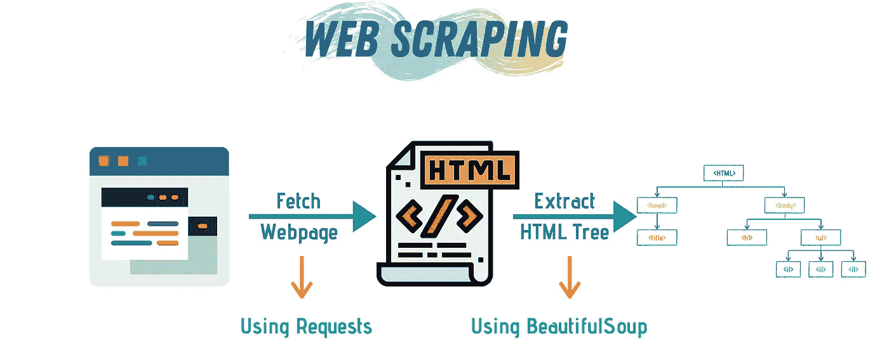

作者图片(使用 [Canva](https://www.canva.com/) 制作)

我们将使用请求库从特定的 URL 获取 HTML 代码。然后，我们将使用 BeautifulSoup 来解析和提取 HTML 树，最后，我们将使用纯 Python 来组织数据。

## 基本 HTML

在我们开始之前，让我们快速复习一下 HTML 基础知识。HTML 中的一切都是在标签中定义的。最重要的标签是，这意味着后面的文本是 HTML 代码。

在 HTML 中，每个打开的标签都必须关闭。所以，在 HTML 文件的末尾，我们需要一个结束标签

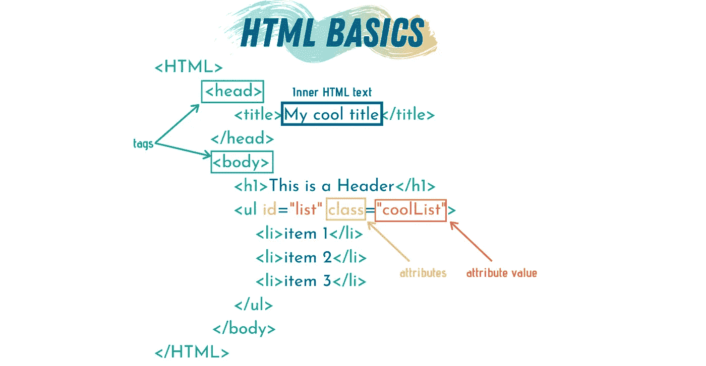

作者图片(使用 [Canva](https://www.canva.com/) 制作)

HTML 中不同的标签意味着不同的东西。使用标签的组合来表示网页。任何包含在开始和结束标签之间的文本被称为*内部 HTML 文本*。

如果我们有多个具有相同标签的元素，我们可能——实际上，总是——想要以某种方式区分它们。有两种方法可以做到这一点，要么使用类，要么使用 id。id 是唯一的，这意味着两个元素不能有相同的 id。另一方面，类不是。多个元素可以有相同的类。

这里有 10 个你在浏览网页时会经常看到的 HTML 标签。

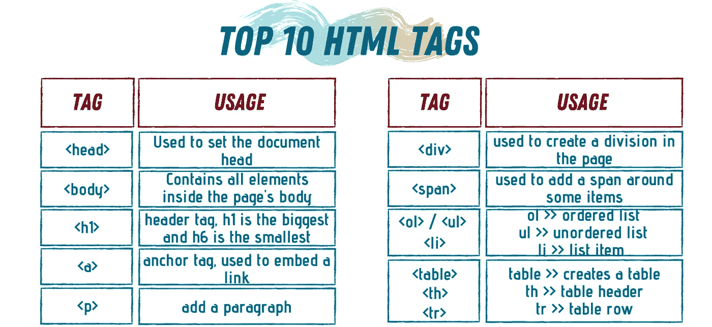

作者图片(使用 [Canva](https://www.canva.com/) 制作)

## 基本刮削

太棒了，现在我们知道了基础知识，让我们从小做起，然后逐步积累！

我们的第一步是通过在命令行中键入以下内容来安装 BeautifulSoup。

```
pip install bs4
```

为了熟悉抓取基础知识，我们将考虑一个示例 HTML 代码，并学习如何使用 BeautifulSoup 来探索它。

BeautifulSoup 不从网络上获取 HTML，但是它非常擅长从 HTML 字符串中提取信息。

为了在 Python 中使用上述 HTML，我们将它设置为一个字符串，然后使用不同的 BeautifulSoup 来探索它。

***注意:如果您正在使用 Jupyter Notebook 来跟踪这篇文章，您可以键入以下命令在笔记本中查看 HTML。***

```
from IPython.core.display import display, HTML
display(HTML(some_html_str))
```

例如，上面的 HTML 看起来会像这样:

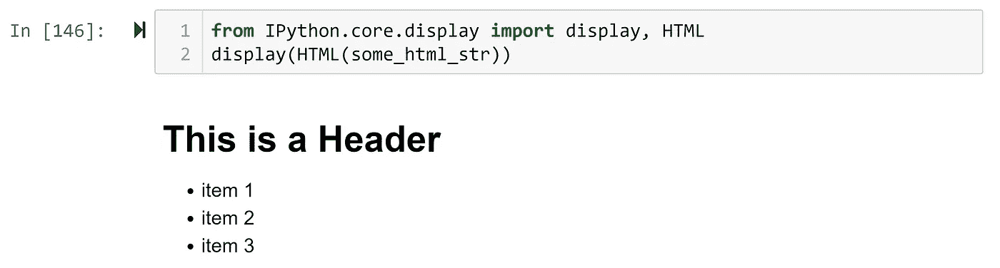

接下来，我们需要将这个 HTML 馈送给 BeautifulSoup，以便生成 HTML 树。HTML 树是 HTML 代码不同层次的表示，它显示了代码的层次结构。

上面代码的 HTML 树是:

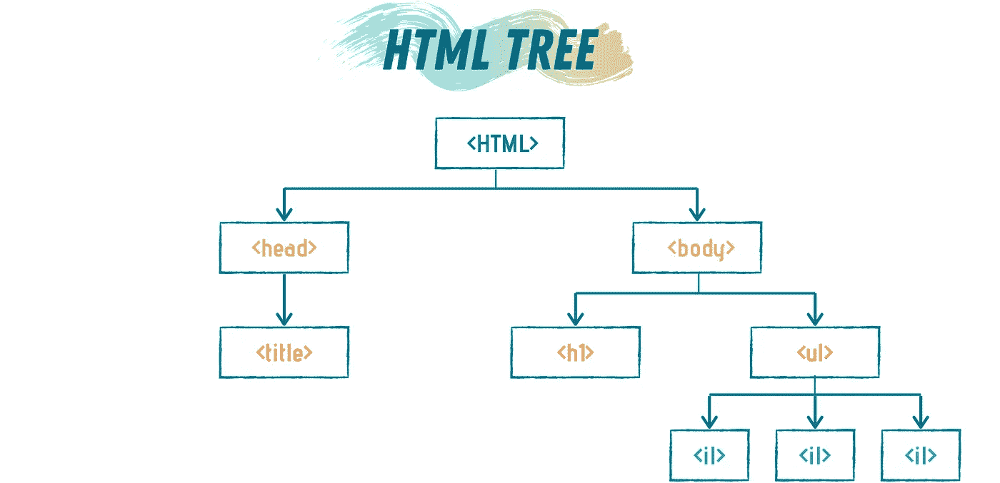

图片由作者提供(使用 [Canva](https://www.canva.com/) 制作)

为了生成树，我们编写

```
some_html_str = """
<HTML>
    <HEAD>
        <TITLE>My cool title</TITLE>
    </HEAD><BODY>
    <H1>This is a Header</H1>
    <ul id="list" class="coolList">
        <li>item 1</li>
        <li>item 2</li>
        <li>item 3</li>
    </ul>
</BODY>
</HTML>
"""
#Feed the HTML to BeautifulSoup
soup = bs(some_html_str)
```

变量`soup`现在有了从 HTML 字符串中提取的信息。我们可以使用这个变量从 HTML 树中获取信息。

BeautifulSoup 有许多函数可以用来提取 HTML 字符串的特定方面。不过，两个函数用得最多:`find`和`find_all.`

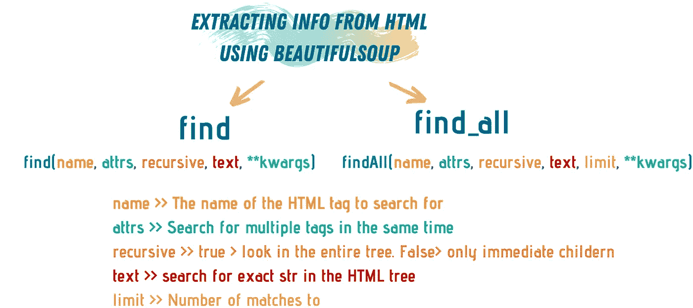

作者图片(使用 [Canva](https://www.canva.com/) 制作)

函数`find`只返回搜索查询的第一个匹配项，而`find_all`返回所有匹配项的列表。

比方说，我们正在搜索代码中的所有

# 头。

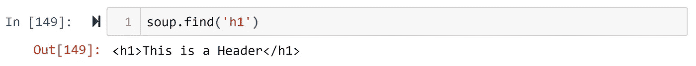

如你所见，`find`函数给了我< h1 >标签。标签什么的。通常，我们只想提取内部的 HTML 文本。为此，我们使用`.text`。

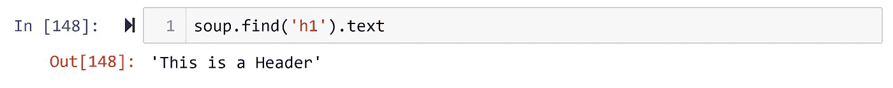

这仅仅是因为我们只有一个

# 标签。但是如果我们想寻找列表项呢——在我们的例子中，我们有一个包含三项的无序列表——我们不能使用`find`。如果我们这样做，我们只会得到第一项。

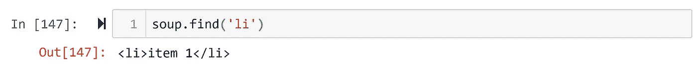

为了找到所有的列表项，我们需要使用`find_all`。

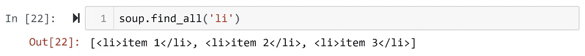

好了，现在我们有了一个项目列表，让我们回答两个问题:

***1-如何获取列表项的内部 HTML？***

为了只获得内部文本，我们不能使用。文本，因为现在我们有了一个元素列表，而不仅仅是一个。因此，我们需要遍历列表并获取每个列表项的内部 HTML。

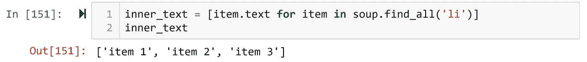

***2-如果我们在代码中有多个列表怎么办？***

如果我们在代码中有不止一个列表——这是通常的情况——我们可以精确地搜索元素。在我们的例子中，列表有 id='list '和 class='coolList '。我们可以通过`find_all` 或`find`函数使用这两个或一个函数来精确获取我们想要的信息。

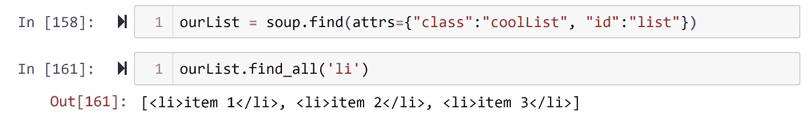

这里需要注意的一点是`find`或`find_all`函数的返回是漂亮的一组对象，它们可以被进一步遍历。因此，我们可以像直接从 HTML 字符串中获取对象一样对待它们。

本节的完整代码:

我们可以使用其他漂亮的组函数遍历 HTML 树，比如`children`、`parent`、`next`等。

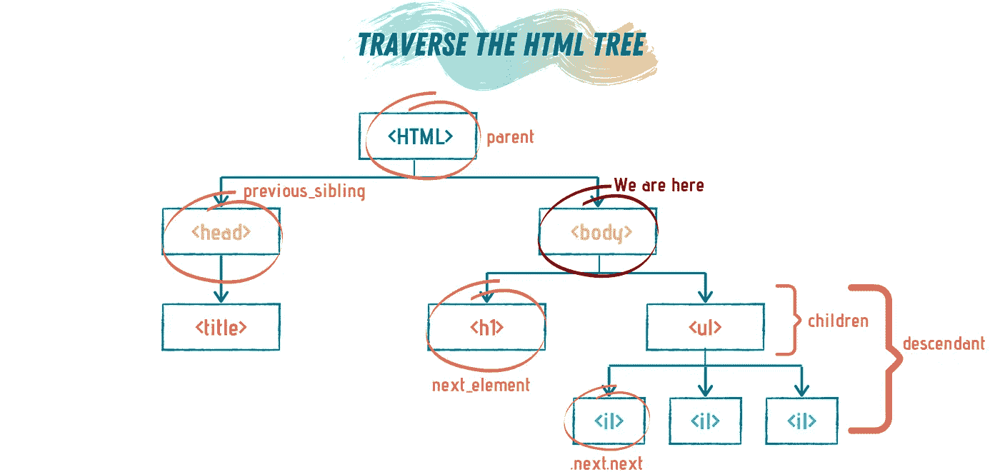

作者图片(使用 [Canva](https://www.canva.com/) 制作)

## 抓取一个网页

让我们考虑一个更现实的例子，我们从一个 URL 获取 HTML，然后使用 BeautifulSoup 提取模式和数据。

我们将从获取一个网页开始。我喜欢咖啡，所以让我们试着通过[咖啡生产](https://en.wikipedia.org/wiki/List_of_countries_by_coffee_production)获取列出国家的维基百科页面，然后使用 Pygal 绘制这些国家。

[](/interactive-data-visualization-in-python-with-pygal-4696fccc8c96) [## 用 Pygal 实现 Python 中的交互式数据可视化

### 一步一步的教程，创造惊人的可视化

towardsdatascience.com](/interactive-data-visualization-in-python-with-pygal-4696fccc8c96) 

为了获取 HTML，我们将使用请求库，然后将获取的 HTML 传递给 BeautifulSoup。

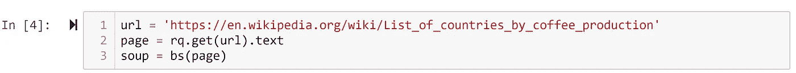

如果我们打开这个 wiki 页面，我们会发现一个大表格，上面有各个国家和不同的咖啡产量指标。我们只想提取国家名称和咖啡产量*吨*。

为了提取这些信息，我们需要研究页面的 HTML，以知道要查询什么。我们可以只突出显示一个国家名称，*右键单击*，然后选择*检查*。

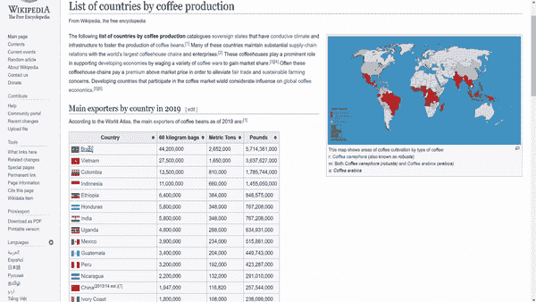

通过检查页面，我们可以看到国家名称和数量都包含在“table”标签中。由于它是页面上的第一个表，我们可以使用`find`函数来提取它。

然而，直接提取表格会给我们所有的表格内容，包括表头(表格的第一行)和不同度量的数量。

所以，我们需要微调我们的搜索。让我们与排名前 10 的国家一起尝试一下。

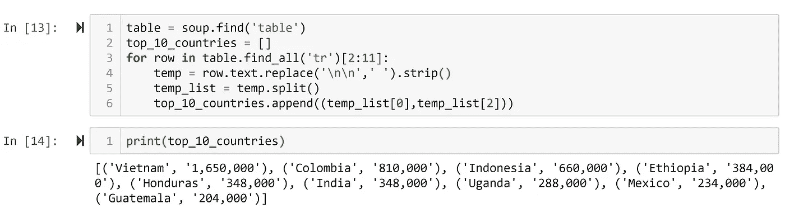

注意，为了清理结果，我使用了字符串操作来提取我想要的信息。

[](/a-guide-to-everything-string-formatting-in-python-e724f101eac5) [## Python 中所有字符串格式的指南

### 关于 Python 中格式化字符串的五种方法，您只需要知道

towardsdatascience.com](/a-guide-to-everything-string-formatting-in-python-e724f101eac5) 

我可以使用这个列表最终用 Pygal 绘制出前 10 个国家。

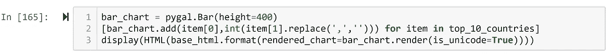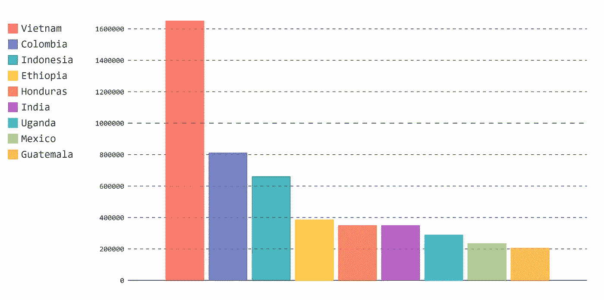

十大咖啡生产国

本节的完整代码:

## 抓取多个网页

哇，太多了！😃

但是，我们还没有写代码，碎片不同的网页。

在这一部分，我们将删除维基页面上的[有史以来最好的 100 本书](https://en.wikipedia.org/wiki/Time%27s_List_of_the_100_Best_Novels)，然后我们将根据它们的类型对这些书进行分类。试着看看我们是否能找到流派和列表之间的关系——哪种流派表现得最好。

维基页面包含了这 100 本书的链接以及它们的作者。我们希望我们的代码导航列表，进入图书 wiki 页面，提取诸如流派、名称、作者和出版年份等信息，然后将这些信息存储在 Python 字典中——您也可以将数据存储在 Pandas 框架中。

因此，要做到这一点，我们需要几个步骤:

1.  获取主 URL HTML 代码。
2.  将 HTML 输入 BeautifulSoup。
3.  从列表中提取每本书，并获得每本书的 wiki 链接。
4.  获取每本书的数据。
5.  获取所有书籍数据，整理并绘制最终结果。

让我们开始吧…

***步骤#1:获取主 URL HTML 代码***

```
url = '[https://en.wikipedia.org/wiki/Time%27s_List_of_the_100_Best_Novels'](https://en.wikipedia.org/wiki/Time%27s_List_of_the_100_Best_Novels')
page = rq.get(url).text
```

***第二步:将 HTML 输入到 BeautifulSoup***

```
soup = bs(page)
```

***步骤#3:从列表中提取每本书，并获得每本书的维基链接***

```
rows = soup.find('table').find_all('tr')[1:]
books_links = [row.find('a')['href'] for row in rows]
base_url = '[https://en.wikipedia.org'](https://en.wikipedia.org')
books_urls = [base_url + link for link in books_links]
```

***步骤#4:获取每本书的数据***

这是最漫长也是最重要的一步。我们首先只考虑一本书，假设它是列表中的第一本书。如果我们打开这本书的 wiki 页面，我们会在屏幕右侧的表格中看到这本书的不同信息。

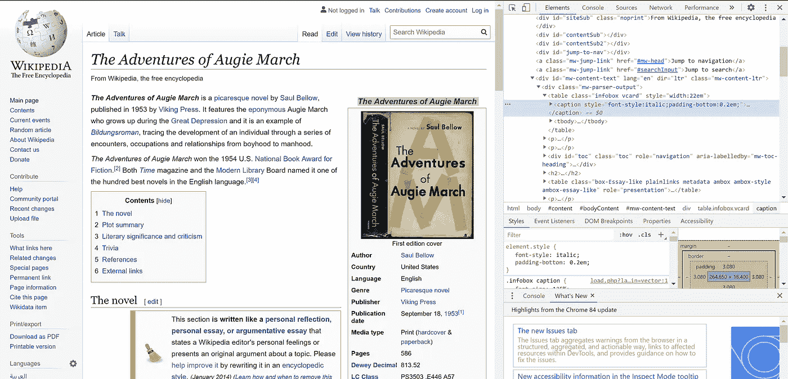

浏览 HTML，我们可以看到所有的东西都存储在哪里。

为了使事情变得更容易和更有效，我编写了自定义函数来从该书的 wiki 中提取不同的信息。

现在，我们有了这些很酷的函数，让我们写一个函数来使用这些函数，这将帮助我们实现自动化。

在这个函数中，我使用了 try..除了格式，以避免崩溃，如果书的一些信息丢失。

***步骤#5:获取所有书籍数据，清理并绘制最终结果***

我们已经拥有了自动化代码并运行它所需的一切。

最后要注意的一件事:废弃维基百科是合法的，然而，他们不喜欢你每秒废弃一页以上。因此，我们需要在每次获取之间添加暂停，以避免破坏服务器。

数据收集完毕！这需要 100 秒才能完成，所以在你等待的时候，请随意做些别的事情😉

最后，让我们清理数据，获得流派计数，并绘制结果。

我们完了。

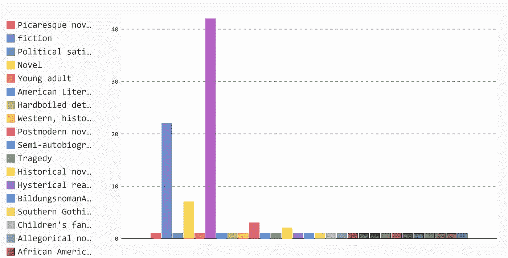

我不得不说，收集数据并不总是 100%准确，正如你在图中看到的，最长的柱属于“无”值。这意味着两件事之一

1.  要么是维基页面没有包括这本书的类型。
2.  或者，这本书的代码与其他书不同。

这就是为什么在自动化数据收集后，我们经常检查奇怪和不寻常的结果，并手动重新检查它们。

# 结论

网络搜集是数据科学家需要的基本技能之一。没有比使用 Python、Requests 和 BeautifulSoup 更简单的了。

我们永远不能相信完全自动化，有时我们需要手动检查最终结果，重新检查异常信息。

图书部分的完整代码: