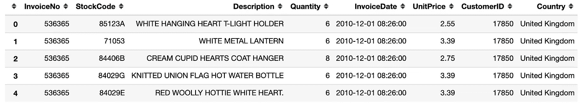
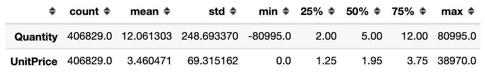
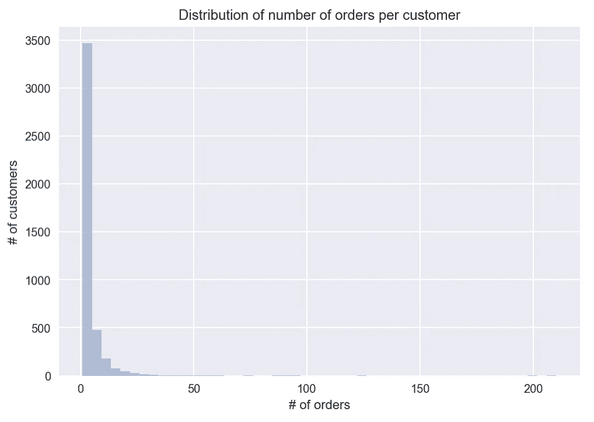
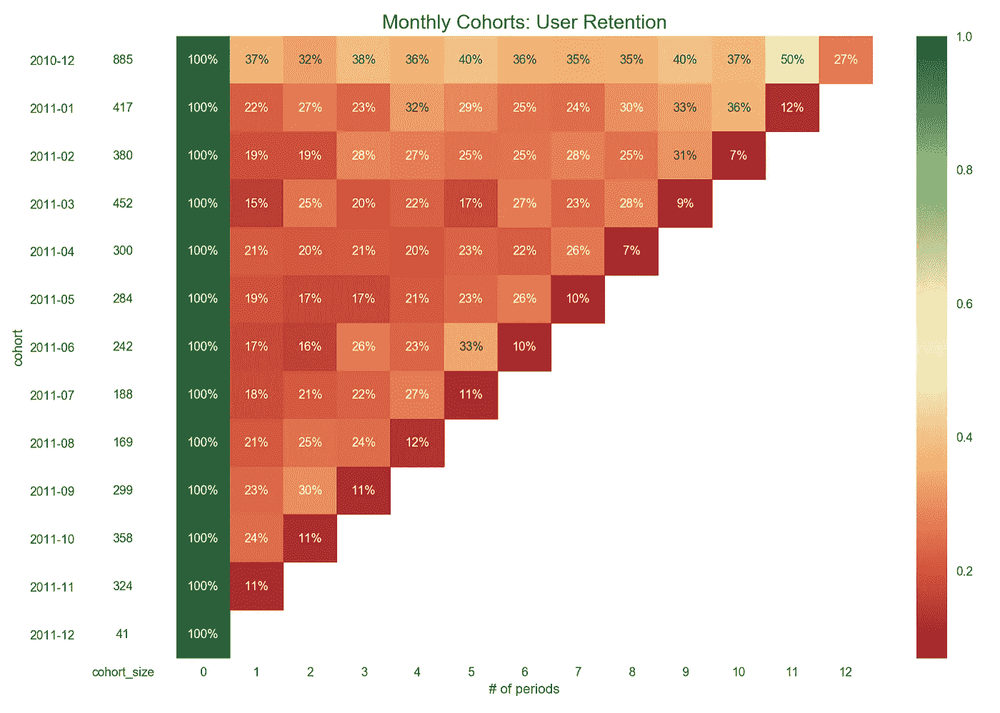

# Python 中群组分析的分步介绍

> 原文：<https://towardsdatascience.com/a-step-by-step-introduction-to-cohort-analysis-in-python-a2cbbd8460ea?source=collection_archive---------0----------------------->


来源: [Unsplash](https://unsplash.com/photos/mcSDtbWXUZU)

## 学习如何进行群组分析，以更好地了解顾客的行为

群组分析是一种非常有用且相对简单的技术，有助于获得关于任何企业客户/用户行为的有价值的见解。为了进行分析，我们可以关注不同的指标(取决于业务模式)——转化率、留存率、产生的收入等。

在本文中，我提供了群组分析的简要理论介绍，并展示了如何在 Python 中实现它。

# 队列分析导论

让我们从基础开始。一个**群组**是一群有共同之处的人，比如某个 app 的注册日期，第一次购买的月份，地理位置，获取渠道(有机用户，来自效果营销等。)等等。在**群组分析**中，我们随着时间的推移跟踪这些用户群，以识别一些共同的模式或行为。

在进行群组分析时，考虑我们正在跟踪的指标和业务模式之间的关系至关重要。根据公司的目标，我们可以关注用户保留率、转换率(注册付费版本的服务)、产生的收入等。

在本文中，我将讨论**用户保持**的情况。通过了解用户保持率，我们可以推断客户的粘性/忠诚度，并评估业务的健康状况。重要的是要记住，不同企业之间的预期保留值差异很大，一年购买 3 次对一个零售商来说可能很多，而对另一个零售商来说可能太少。

留住客户对任何企业都至关重要，因为留住现有客户(通过使用 CRM 工具、会员折扣等)要便宜得多。)而不是获得新的。

此外，群组分析还可以帮助观察产品变化对用户行为的影响，无论是设计变化还是全新的功能。通过观察这些群体在一段时间内的行为，我们可以或多或少地观察到我们的努力是否对用户产生了一些影响。

现在这应该是足够的理论了，让我们来看看现实生活中的例子。

# 设置

在本文中，我们将使用以下库:

# 数据集

我们将使用从 [UCI 机器学习库](https://archive.ics.uci.edu/ml/index.php)下载的数据集，该库是不同种类数据集的绝佳来源。它们已经根据可用于机器学习的领域进行了标记:

*   监督(回归/分类)，
*   无监督(聚类)。

你可以在这里找到数据集。或者，您可以使用以下代码行直接从 Jupyter 笔记本下载数据:

```
!wget [https://archive.ics.uci.edu/ml/machine-learning-databases/00352/Online%20Retail.xlsx](https://archive.ics.uci.edu/ml/machine-learning-databases/00352/Online%20Retail.xlsx)
```

该数据集可以简单描述为:“这是一个跨国数据集，包含了一家总部位于英国的注册无店铺在线零售商在 2010 年 1 月 12 日至 2011 年 9 月 12 日之间发生的所有交易。该公司主要销售独特的适合各种场合的礼品。公司的很多客户都是批发商。”

接下来，我们从 Excel 文件中加载数据。

加载的数据如下所示:



我们还使用`df.info()`检查了数据帧，看看是否有丢失的值。至于分析，由于我们需要客户 id，我们删除了所有没有客户 id 的行。

```
df.dropna(subset=['CustomerID'], inplace=True)
```

为了完整起见，我们还做了一个非常快速的 EDA，重点是用户。EDA 始终是任何分析的一个非常重要的步骤，因为我们会发现我们正在处理的数据集的细节。

我们首先检查数字变量的分布——数量和单价。

```
df.describe().transpose()
```



从上表中，我们可以看到存在数量为负的订单，这很可能是退货。总的来说，大约有 9000 个负数量的采购。我们将它们从数据集中移除。这就引入了一种偏差，因为我们包含了初始订单并删除了退货，这样初始订单就被考虑在内，即使理论上它没有实现也没有产生收入。但是，为了简单起见，我们保留初始订单，至于保留率(表示客户参与度)等指标，这仍然是一个有效的假设。

然后，我们计算一个聚合指标，表明每个客户下了多少订单。

使用上面的代码，我们可以得出 65.57%的客户订购了不止一次。这已经是一条有价值的信息，因为客户似乎下了多个订单。这意味着至少会有一些保留。鉴于数据集没有注册/加入日期，如果大多数用户只下了一个订单，这将是有问题的，但我们稍后将回到这个问题。

此外，我们查看每个客户订单数量的分布。为此，我们可以重用之前聚合的数据(`n_orders`)并将数据绘制在直方图上。

运行代码会生成以下图形:



有一些不常见的客户案例，他们订购了 50 次以上。

# 断代分析

我们在本例中使用的数据集不包含客户注册日期，即他们向零售商注册的日期。这就是为什么我们假设他们所属的群组是基于第一次购买日期的。这种方法的一个可能的缺点是，数据集不包含过去的数据，我们在这个快照(2010 年 1 月 12 日至 2011 年 9 月 12 日之间)中已经看到的数据包括重复出现的客户。换句话说，我们在这个数据集中看到的第一次购买可能不是给定客户的实际第一次购买。但是，如果不能访问零售商的整个历史数据集，就无法对此做出解释。

第一步，我们只保留相关的列并删除重复的值——一个订单(由`InvoiceNo`表示)可以包含多个项目(由`StockCode`表示)。

第二步，我们创建`cohort`和`order_month`变量。第一个指示基于第一次购买日期的每月群组(按客户计算)。后一个是购买日期的截断月份。

然后，我们根据`cohort`和`order_month`汇总数据，并计算每组中独立客户的数量。此外，我们添加了`period_number`，它指示群组月份和购买月份之间的周期数。

下一步是以这样一种方式透视`df_cohort`表，即每行包含关于给定群组的信息，每列包含某个时间段的值。

为了获得**保留矩阵**，我们需要将每行的值除以该行的第一个值，这实际上是群组大小——在给定月份中第一次购买的所有客户。

最后，我们将保留矩阵绘制成热图。此外，我们希望包括关于队列规模的额外信息。这就是为什么我们实际上创建了两个热图，其中一个指示群组大小的热图使用的是纯白色的色图——没有任何颜色。

最终结果是以下保留矩阵:



在图中，我们可以看到在第二个月(指数为 1)已经出现了大幅下降，平均约 80%的客户在第二个月没有进行任何购买。第一组(2010-12)似乎是个例外，与其他组相比，表现出人意料地好。第一次购买一年后，有 50%的保留。这可能是一群忠诚的顾客，他们最初加入平台是基于与零售商已经存在的一些联系。然而，仅从数据来看，这很难准确解释。

在整个矩阵中，我们可以看到保留时间的波动。这可能是由业务的特点造成的，客户会定期购买，随后会有一段时间不活动。

# 结论

在本文中，我展示了如何使用 Python 的`pandas`和`seaborn`进行群组分析。在路上，我做了一些简化的假设，但这主要是由于数据集的性质。当在一个公司的真实场景中工作时，我们会对业务有更多的了解，并能从分析中得出更好、更有意义的结论。

你可以在我的 [GitHub](https://github.com/erykml/medium_articles/blob/master/Business/cohort_analysis.ipynb) 上找到本文使用的代码。一如既往，我们欢迎任何建设性的反馈。你可以在[推特](https://twitter.com/erykml1?source=post_page---------------------------)或评论中联系我。

喜欢这篇文章吗？成为一个媒介成员，通过无限制的阅读继续学习。如果你使用[这个链接](https://eryk-lewinson.medium.com/membership)成为会员，你将支持我，不需要额外的费用。提前感谢，再见！

我最近出版了一本关于使用 Python 解决金融领域实际任务的书。如果你有兴趣，我贴了[一篇文章](/introducing-my-book-python-for-finance-cookbook-de219ca0d612)介绍这本书的内容。你可以在亚马逊或者 Packt 的网站上买到这本书。