# Giraffle 的逐步介绍

> 原文：<https://towardsdatascience.com/a-step-by-step-introduction-to-giraffle-b23fd19d4b53?source=collection_archive---------43----------------------->

## 如何以编程方式在 TigerGraph 上创建图形


照片来自 [Unsplash](https://unsplash.com/) 由 [Charl Durand](https://unsplash.com/@charl_durand) 拍摄

# 为什么要用长颈鹿？

Giraffle 由 Joshua Meekhof 创建，是一种在 TigerGraph 中以编程方式创建图形的方法。当与许多团队成员一起处理一个图表项目时，将我们的图表写在代码中会使协作更容易。此外，在协作空间中，如果有人不小心丢失了全部或部分数据，您的模式和查询都会被保存并可重用。总的来说，通过以编程方式创建图形，Giraffle 可以帮助简化与 TigerGraph 中的图形的协作。

# 开始的步骤

在这篇博客中，我们将讨论:

1.  在 TigerGraph 上创建解决方案
2.  设置 Giraffle
3.  创建模式
4.  加载数据
5.  创建查询

到这篇博客结束时，你将知道足够用 Giraffle 创建你自己的项目！如果你遇到困难或困惑，GitHub 链接在博客的最后，供你参考。

另外， [Jon Herke](https://medium.com/u/571f80cc8b69?source=post_page-----b23fd19d4b53--------------------------------) 创建了一个博客来帮助 Giraffle 入门，而 [Ramki Pitchala](https://medium.com/u/b162eedcaf8a?source=post_page-----b23fd19d4b53--------------------------------) 写了一个关于迁移到 Giraffle 的博客。我强烈建议你也去看看那些博客！

# 步骤 1:在 TigerGraph 上创建一个解决方案

首先，我们需要在 TigerGraph 上运行一个解决方案。你需要去 [TigerGraph Cloud](https://tgcloud.io/) 。如果您还没有帐户，请创建一个。另一方面，请访问解决方案。


点击我的解决方案(图片由作者提供)

接下来，点击右上角的`Create Solution`。


创建解决方案

点击第一部分的空白。

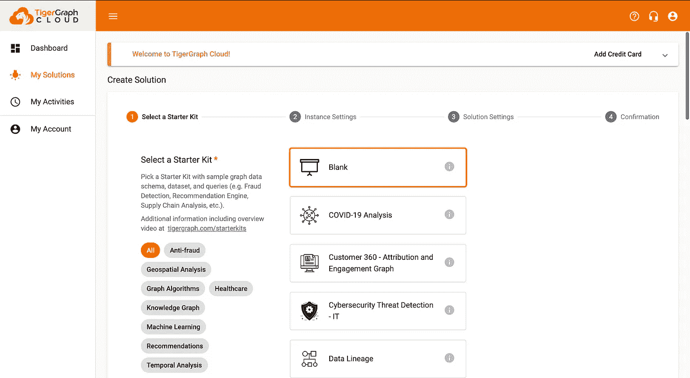

(图片由作者提供)

不要更改第二部分的任何内容，只需点击`Next`。

在第三部分中，您可以对其进行命名、标记、添加密码、创建子域以及添加描述。其中，确保你记得你的密码和子域。

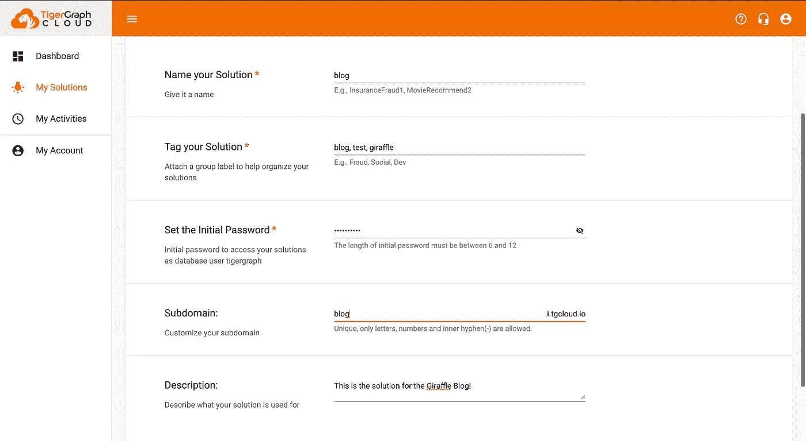

键入名称、解决方案、密码、子域和描述。(图片由作者提供)

请注意，每个子域必须是唯一的。因此，你可能会或可能不会得到子域`blog`。

单击下一步，然后提交。接下来你需要等待它，因为它可能需要几分钟来加载。加载后，通过按 Solution Operations(蓝框)和 start 来启动您的解决方案。加载可能需要一段时间

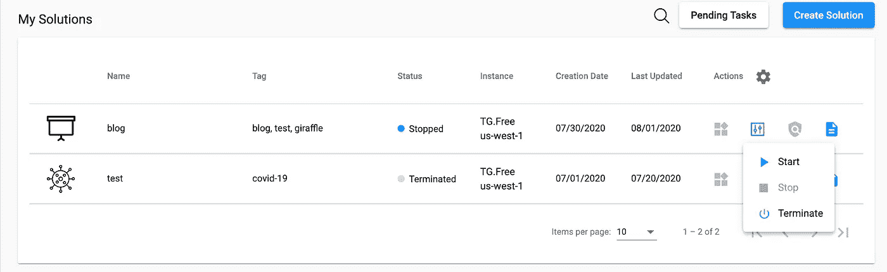

按下蓝框，开始。(图片由作者提供)

恭喜你。现在，您的解决方案已经开始运行了！

# 步骤 2:设置 Giraffle

首先，确保你已经在电脑上安装了 gradle。您可以使用命令`gradle`检查您是否已经升级。然后，键入以下命令:

```
gradle init
```

在接下来的两个选项中，键入 1 和 2。你可以给这个项目起任何你喜欢的名字。

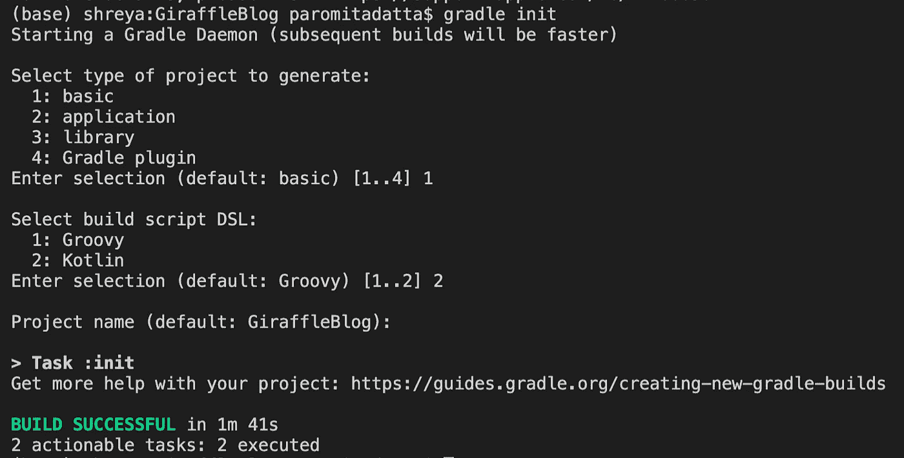

键入 1(基本)，然后键入 2 (Kotlin)(图片由作者提供)

您将看到您将在目录中获得几个文件夹。

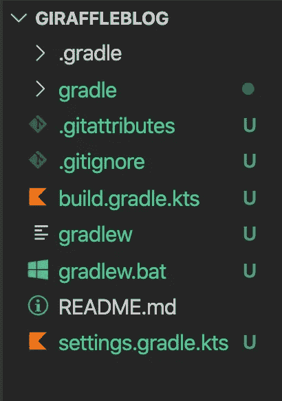

创建的文件夹(图片由作者提供)

从这里，去`build.gradle.kts`。将其更新为:

```
import com.optum.giraffle.tasks.*
import com.optum.giraffle.*
plugins {
    id("com.optum.giraffle") version **"1.3.4.1"**
    id("net.saliman.properties") version "1.5.1"
}
repositories {
    jcenter()
}
```

请注意 1.3.4.1，因为这是最新版本！没有正确的版本，您的代码可能会生成，也可能不会生成。

如果`gradle build`跑成功了，你就厉害了！接下来，在您的终端中，记住第一步中的子域，键入:

```
gradle gsqlNewProject --console=plain
```

按照步骤，填写子域等。

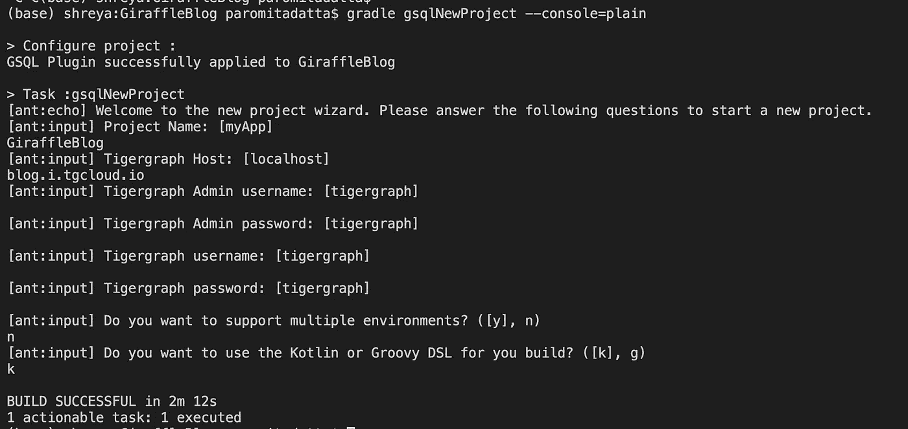

我的图是 GiraffleBlog，我的子域是 blog.i.tgcloud.io。我使用默认的用户名和密码。最后，我没有使用多种环境，而是使用 Kotlin。(图片由作者提供)

接下来，我们需要创建一个证书。要生成一个，请使用以下命令:

```
openssl s_client -connect SUBDOMAIN.i.tgcloud.io:14240 < /dev/null 2> /dev/null | openssl x509 -text > cert.txt
```

对我来说，应该是:

```
openssl s_client -connect blog.i.tgcloud.io:14240 < /dev/null 2> /dev/null | openssl x509 -text > cert.txt
```

如果所有运行都没有错误，那么您已经完成了存储库的设置。现在你应该可以开始开发了！

# 步骤 3:创建一个模式

您首先需要创建一个模式。一个模式就像一个地图，显示了图形将会有什么。在`db_scripts/schema`中，创建`schema.gsql`。

在该文件中，我将在这里创建一个非常基本的模式:

```
CREATE VERTEX Blog(primary_id title STRING) WITH primary_id_as_attribute="true"CREATE VERTEX Person(primary_id name STRING) WITH primary_id_as_attribute="true"CREATE UNDIRECTED EDGE BLOG_CREATOR(FROM Blog, TO Person) CREATE GRAPH @graphname@(Blog, Person, BLOG_CREATOR)
```

我们有两个顶点叫做 Blog 和 Person，它们通过一条叫做“BLOG_CREATOR”的边连接在一起。

将您的`build.gradle.kts`更新为:

这是我们将要构建的构建函数的模板。

我们来破解密码。本文档提供了供您运行的任务。例如:

```
register<GsqlTask>("createSchema") {        
     scriptPath = "schema/schema.gsql" // Where the schema is
     useGlobal = true 
     group = schemaGroup // The group the task is associated with
     description = "Runs gsql to create a schema" // Description of the task
}
```

对于`createSchema`，如果您以任何不同的方式命名您的模式文件，您可以更改脚本路径。然后它有一个描述和一个组。它应该可以编译，但是，为了仔细检查，您可以运行`gradle tasks`。

接下来，我们将更新我们的`gradle-local.properties`。将文件更新为以下内容(填写您的详细信息):

```
gHost=SUBDOMAIN.i.tgcloud.iogAdminUserName=INSERT_YOUR_ADMIN_USERNAMEgAdminPassword=INSERT_YOUR_ADMIN_PASSWORDgUserName=INSERT_YOUR_USERNAMEgPassword=INSERT_YOUR_PASSWORDgGraphName=GRAPH_NAMEgCertPath=cert.txtgHostUriType=httpsgRestPort=9000
```

(注意:如果您完全按照说明进行，用户名/密码的默认值是 tigergraph。如果您自定义设置了用户名或密码，请将其更改为您的用户名和密码。将第一步中的子域插入 gHost。gGraphName 是您希望图形使用的名称。)

接下来，我们将把我们的模式上传到云中。为此，请前往[https://tgcloud.io/app/solutions](https://tgcloud.io/app/solutions)。点按“应用程序”(带有四个形状的蓝色按钮)，然后点按“GraphStudio”。

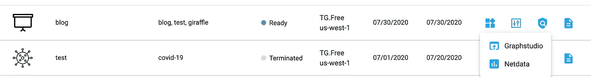

按下应用程序按钮，然后单击 GraphStudio 启动它。(图片由作者提供)

现在，回到您的终端，我们将使用我们添加的 createSchema 命令。键入:

```
gradle createSchema
```

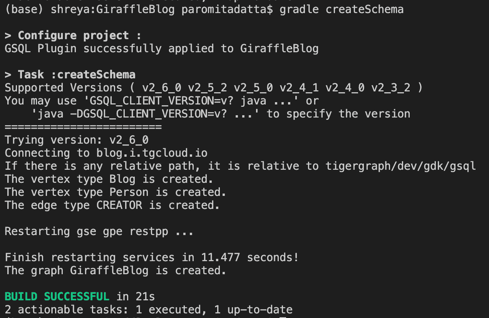

您应该得到一个显示成功的输出。如果出现任何其他错误，可能是出了问题。(图片由作者提供)

如果它工作，你的输出应该像上面一样。最后，如果您转到 GraphStudio 并点击 Design Schema，您应该能够看到您的模式。

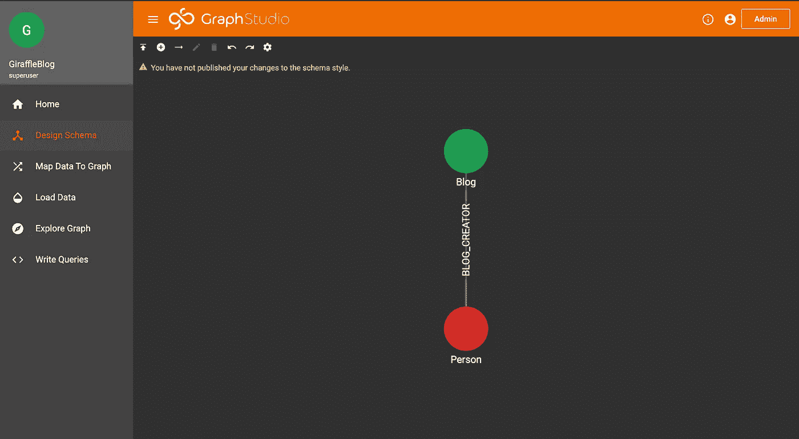

Graph Studio 中的模式(图片由作者提供)

恭喜你！您已经创建并加载了您的模式！

# 步骤 4:加载数据

接下来，我们将把实际数据加载到图表中。我将创建一个充满作者姓名和博客的 CSV。

在主目录下创建一个名为`data`的文件夹(应该和`db_scripts`在同一层，但不在里面。在`data`文件夹中，创建`data.csv`，并添加以下数据:

```
AUTHOR,TITLE"John Smith", "Cool Things to do in Paris""Jack Paul", "101 Best Tourist Spots""Alice Walker", "101 Best Tourist Spots""Blake Coles", "Lessons Learned from a Dog""Amelia-Rose Kim", "Cool New Places""Taha Wardle", "An Awesome Guide to Awesomeness""Bella Bloom", "Cool Things to do in Paris""Nakita Talbot", "Why Learn French?""Kaison Reilly", "Why Learn Spanish?""Philippa Palacios", "Five Habits of Successful People""Pawel Medrano", "101 Best Tourist Spots""Jasper Franklin", "Cool New Places""Abid Little", "How to Love Yourself""John Smith", "Cool Things to do in Lorraine""Alice Walker", "Five Habits of Successful People"
```

接下来，在`db_scripts/load`中，创建一个名为`loadData.gsql`的新文件。在该文件中，添加以下代码:

```
drop job loadData // deletes past load job called loadDatacreate loading job loadData for graph @graphname@ { // creating a load job called loadData define filename f1; // set the file load f1 // loads the file to vertex Blog values($1), // loads data from the 2nd column in the CSV to the vertex Blog to vertex Person values($0), // loads data from the 1st vertex to vertex Person to edge CREATOR values($1, $0) // connects all data from the 2nd column with the data from the 1st column using header="false", separator=","; // Comma separator, not using headers}
```

为此，我们创建了一个名为`loadData`的加载作业。如果您想创建更多的加载作业，将其他文件添加到`db_scripts/load`，并用您的加载作业名称替换`loadData`。

接下来，在您的`build.gradle.kts`中，在`tasks {`下，添加

```
register<GsqlTask>("createLoadData"){ scriptPath = "load/loadData.gsql" // Call the file you have the load job in. group = loadingGroup description = "Loads our data"}register<HttpTask>("loadData") { group = loadingGroup description = "Load data via the REST++ endpoint" post { httpConfig -> httpConfig.request.uri.setPath("/ddl/${gGraphName}") httpConfig.request.uri.setQuery( mapOf( "tag" to "loadData", "filename" to "f1", "sep" to ",", "eol" to "\n" ) ) httpConfig.request.setContentType("text/csv") val stream = File("data/data.csv").inputStream() // If your data file was called anything else, you can change the File(""). httpConfig.request.setBody(stream) }}
```

这里，我们创建两个任务:一个创建或“构建”文件，另一个将数据加载到图表中。

在将我们的更改加载到图表之前，我们需要生成一个秘密。进入 GraphStudio 并点击右上角的`Admin`按钮。点击后，点击左侧栏中的`User Management`。

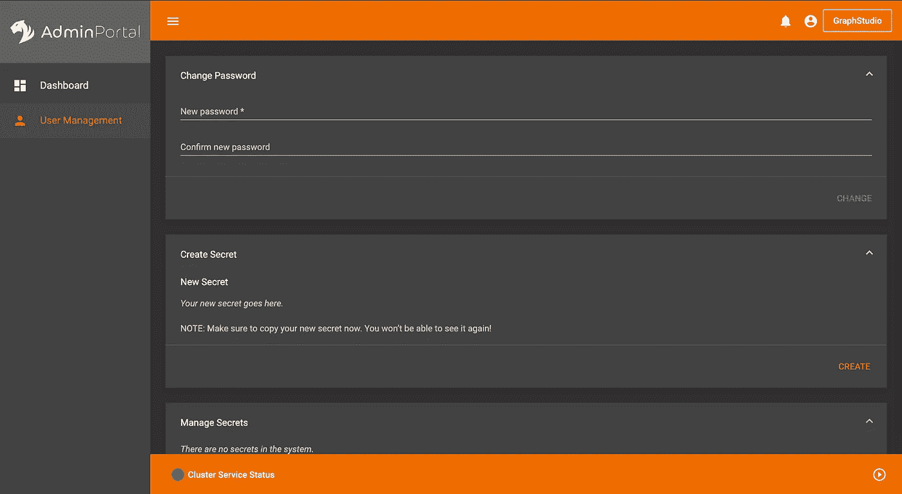

你应该在这里结束。(图片由作者提供)

最后，在标有 Create Secret 的框下，点击橙色的`Create`按钮并复制密码。

在`gradle-local.properties`中，添加一个新字段:

```
gSecret=SECRET_YOU_COPIED
```

要运行，只需:

```
gradle createLoadData
gradle loadData
```

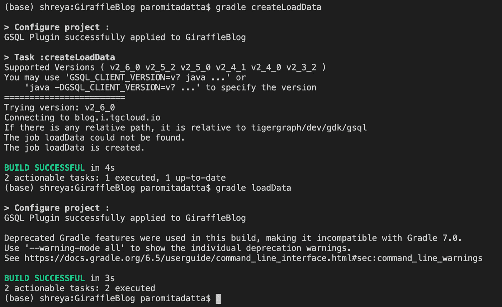

您的终端输出应该如下所示。(图片由作者提供)

最后可以去 Graph Studio。转到`Load Data`以确保所有东西都已装载。

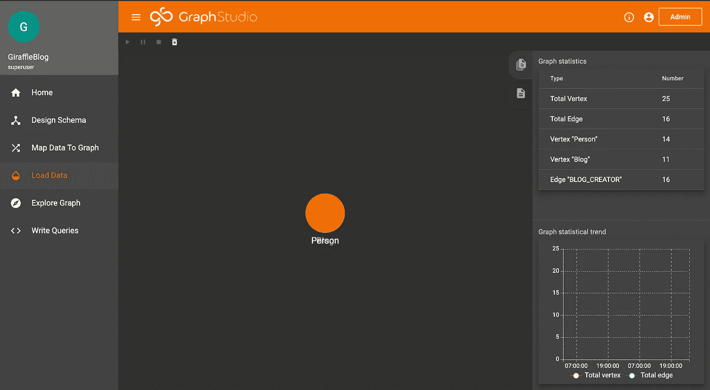

注意右边顶点和边的数字。因为它们不全是 0，我们的数据加载！(图片由作者提供)

接下来去`Explore Graph`看看数据。您可以选取几个顶点并双击它们，以探索与其连接的其他顶点。


探索图表的一些结果(图片由作者提供)

# 步骤 5:创建查询

最后，我们可以使用查询来分析数据。在`db_scripts/queries`中，用以下内容创建一个名为`selectAll.gsql`的文件:

```
drop query selectAllcreate query selectAll (STRING auth) for graph @graphname@ { ListAccum<EDGE> @@edgelist; People = {Person.*}; author = select s
              FROM People:s -() -:t
              where s.name == auth; blogs = select c
              from People:s -(BLOG_CREATOR:e) -Blog:c
              where s.name == auth ACCUM @@edgelist+=e;

     print author; print blogs; PRINT @@edgelist;}install query selectAll
```

接下来，在与加载任务相同的区域中，您需要为`build.gradle.kts`(在`tasks`部分中)中的查询添加一个任务。您应该添加以下内容:

```
register<GsqlTask>("createQuerySelectAll") { scriptPath = "query/selectAll.gsql" group = queryGroup description = "Creates a select all"}
```

最后，要将查询推送到解决方案，运行:

```
gradle createQuerySelectAll
```

转到 GraphStudio，转到查询，您应该会找到 selectAll。

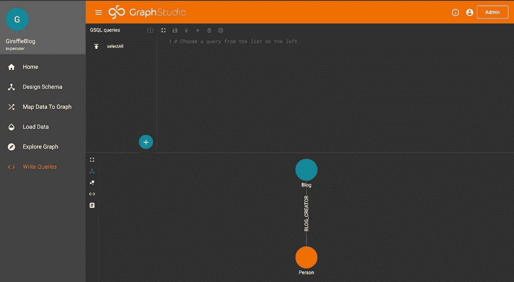

注意左上角附近的 selectAll。(图片由作者提供)

您可以单击 selectAll，按顶部的 play 按钮，然后它将运行查询并接收参数。现在，您可以运行自己的查询了！

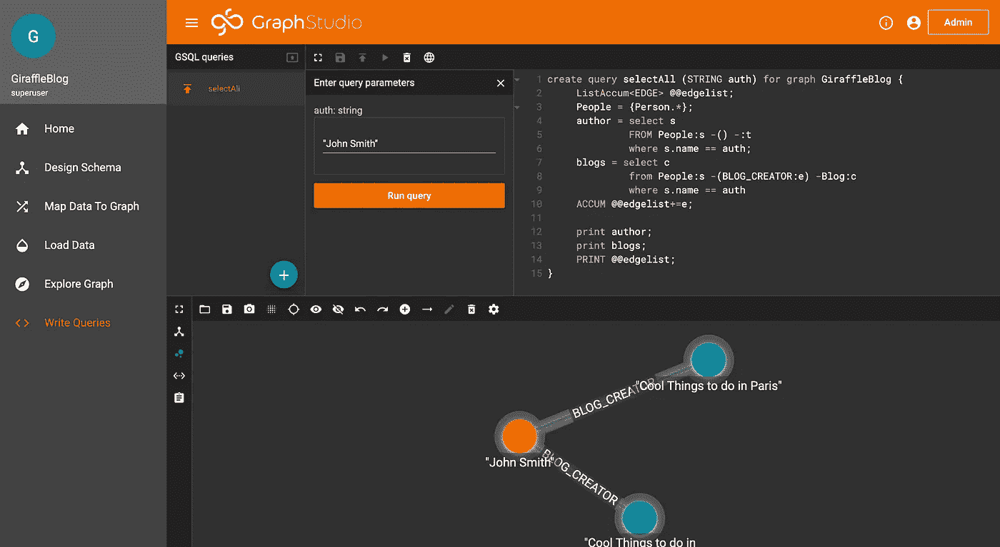

接受查询的名称(图片由作者提供)

# 第六步:创建你自己的项目！

恭喜你！您现在知道了如何用 Giraffle 以编程方式创建图形。现在，您可以开始为自己的项目建模和查询数据了。祝你好运！

# 额外资源

*   博客回购:[https://github.com/GenericP3rson/GiraffleBlog](https://github.com/GenericP3rson/GiraffleBlog)
*   TigerGraph 不和谐(如有问题):[https://discord.com/invite/F2c9b9v](https://discord.com/invite/F2c9b9v)