# 对 PCA 的逐步介绍

> 原文：<https://towardsdatascience.com/a-step-by-step-introduction-to-pca-c0d78e26a0dd?source=collection_archive---------4----------------------->

## 关于如何使用 python 对数据集应用主成分分析的指南


鸢尾花。图片由 S. Hermann & F. Richter 从 [Pixabay](https://pixabay.com/?utm_source=link-attribution&utm_medium=referral&utm_campaign=image&utm_content=2502898) 拍摄。

在本文中，我将讲述如何解决对高维数据集(即每个样本都有大量测量值的数据集)进行可视化、分析和建模的问题。对于这种类型的数据集，很难确定要素之间的关系，也很难可视化它们之间的关系。将模型应用于高维数据集时，通常会导致过拟合，即不在训练集中的样本性能较差。

我今天要讨论的方法是一种无监督的降维技术，称为主成分分析，简称 PCA。在这篇文章中，我将讨论执行 PCA 的步骤。我还将使用 python 演示数据集上的 PCA。你可以在这里找到完整的代码脚本。执行 PCA 的步骤如下:

1.  将数据标准化。
2.  从数据集中计算要素的协方差矩阵。
3.  对协方差矩阵执行特征分解。
4.  根据相应特征值的大小，按降序对特征向量进行排序。
5.  确定 k，即要选择的顶部主成分的数量。
6.  从所选数量的顶部主成分构建投影矩阵。
7.  计算新的 k 维特征空间。

# 选择数据集

为了使用示例演示 PCA，我们必须首先选择一个数据集。我选择的数据集是 Fisher 收集的虹膜数据集。

该数据集由来自三种不同类型鸢尾的 150 个样本组成:刚毛鸢尾、杂色鸢尾和海滨鸢尾。对于每个样本，数据集有四个测量值。这些测量值是萼片长度、萼片宽度、花瓣长度和花瓣宽度。为了访问这个数据集，我们将从 sklearn 库导入它:

```
from sklearn.datasets import load_iris
```

现在数据集已经导入，可以通过执行以下操作将其加载到数据框中:

```
iris = load_iris()
colors = ["blue", "red", "green"]
df = DataFrame(
    data=np.c_[iris["data"], iris["target"]], columns=iris["feature_names"] + ["target"]
)
```

既然数据集已经加载，我们可以像这样显示一些样本:

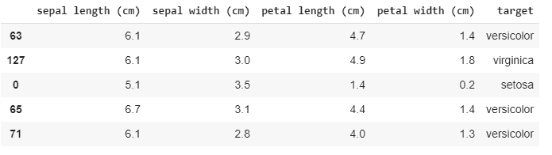

*使用 df.sample 从数据集中选择一些样本(n=5)。*

箱线图是可视化数据分布的好方法。可以使用以下方法创建一组箱线图:

```
df.boxplot(by="target", layout=(2, 2), figsize=(10, 10))
```

这给出了:

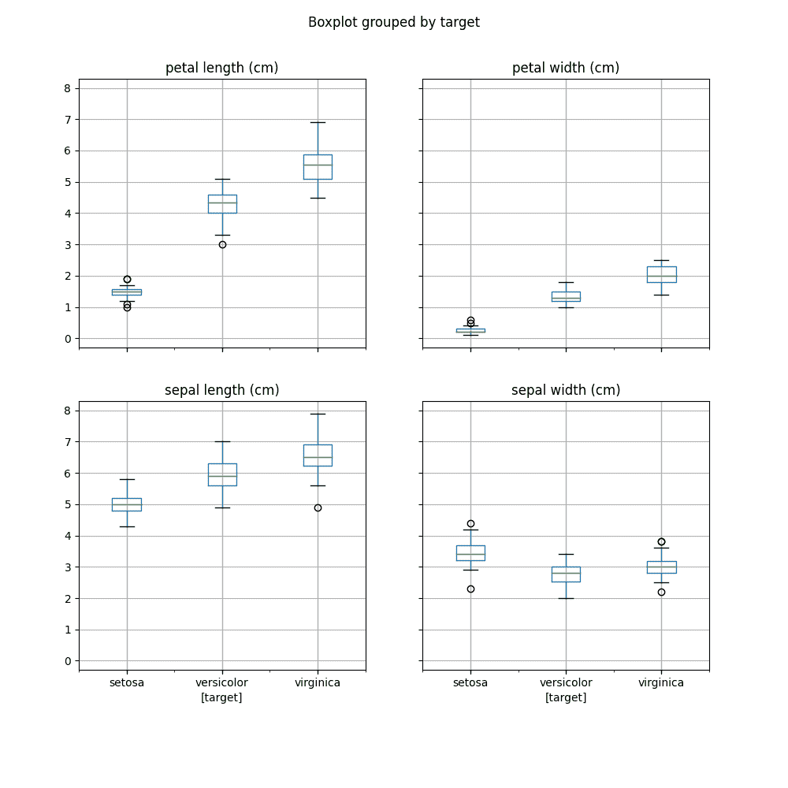

*箱线图显示每种类型虹膜的每次测量值的分布。*

箱线图向我们展示了许多细节，比如弗吉尼亚的花瓣长度中值最大。我们将在本文的后面回到这些箱线图。

# 使数据标准化

既然数据集已经加载，就必须为降维做准备。当所有特征都在同一尺度上时，大多数机器学习和优化算法的性能会更好。为了做到这一点，可以实施标准化方法。通过使用以下计算，特征值 xⁱ可以变成标准化的特征值 xⁱₛ:

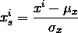

其中，μₓ是特征列的平均值，σₓ是相应的样本方差。这导致特征值具有平均值 0 和标准偏差 1，因此具有与正态分布相同的参数。例如，对于具有从 0 到 5 的值的特征列，应用标准化将产生以下新值:

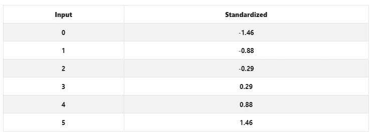

值从 0 到 5 被标准化的特征列的示例。

就我们的数据集而言，虹膜特征的标准化可以使用 sklearn 实现，如下所示:

```
X = StandardScaler().fit_transform(X)
```

# 计算协方差矩阵

协方差衡量两个要素之间的差异。正协方差表示要素同时增加和减少。反之，负协方差表示两个特征的变化方向相反。对于两个特征向量 xⱼ和 xₖ，它们之间的协方差σⱼₖ可以使用下面的等式来计算:

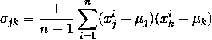

协方差矩阵包含要素之间的协方差值，形状为 d × d。因此，对于我们的数据集，协方差矩阵应如下所示:

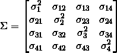

由于特征列已被标准化，因此它们各自的均值为零，协方差矩阵σ可通过以下公式计算:

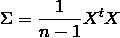

其中 Xᵗ是 x 的转置。如果你需要矩阵乘法如何工作的提示，[这里的](http://matrixmultiplication.xyz/)是一个很好的链接。

这可以用 python 实现，如下所示:

```
cov = (X.T @ X) / (X.shape[0] - 1)
```

# 执行特征分解

特征向量代表协方差矩阵的主要分量(最大方差的方向)。特征值是它们相应的大小。具有最大相应特征值的特征向量代表最大方差的方向。特征向量 v 满足以下条件:

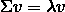

其中λ是一个标量，称为特征值。手动计算是相当复杂的，可能是一个帖子本身。然而，如果你想知道更多，我推荐你看看这个[视频](https://www.youtube.com/watch?v=3-xfmbdzkqc)。相反，我将使用 python 中的特征分解函数:

```
eig_values, eig_vectors = np.linalg.eig(cov)
```

这给出了协方差矩阵的特征向量(主分量)和特征值。

# 确定选择哪些主成分

既然已经计算了特征对，现在需要根据它们的特征值的大小对它们进行排序。这可以在 python 中通过执行以下操作来完成:

```
idx = np.argsort(eig_values, axis=0)[::-1]
sorted_eig_vectors = eig_vectors[:, idx]
```

既然已经根据主成分对应特征值的大小对主成分进行了排序，那么是时候决定选择多少主成分进行降维了。这可以通过绘制特征值的累积和来实现。累积和的计算方法如下:

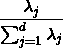

上述公式可以计算并绘制如下:

```
cumsum = np.cumsum(eig_values[idx]) / np.sum(eig_values[idx])
xint = range(1, len(cumsum) + 1)
plt.plot(xint, cumsum)

plt.xlabel("Number of components")
plt.ylabel("Cumulative explained variance")
plt.xticks(xint)
plt.xlim(1, 4, 1)
```

该图显示了以下内容:

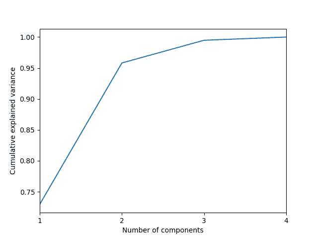

显示特征值累积和的图。

从图中，我们可以看到，超过 95%的方差包含在两个最大的主成分中。因此，选择前两个最大的主成分构成投影矩阵 w 是可以接受的。

# 计算转换

既然已经决定了有多少个主分量构成投影矩阵 W，则得分 Z 可以计算如下:

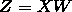

这可以在 python 中通过执行以下操作来计算:

```
eig_scores = np.dot(X, sorted_eig_vectors[:, :2])
```

# 绘制结果

现在数据集已经被投影到一个新的更低维度的子空间上，结果可以如下绘制:

```
def biplot(score, coeff, labels):
    xs = score[:, 0]
    ys = score[:, 1]
    n = coeff.shape[0]

    for i, u in enumerate(iris["target_names"]):
        xi = [
            score[j, 0] for j in range(score.shape[0]) if df["target"].tolist()[j] == u
        ]
        yi = [
            score[j, 1] for j in range(score.shape[0]) if df["target"].tolist()[j] == u
        ]
        plt.scatter(xi, yi, c=colors[i], label=u)
    for i in range(n):
        plt.arrow(
            0, 0, coeff[i, 0], coeff[i, 1], color="r", head_width=0.05, head_length=0.1
        )
        plt.text(
            coeff[i, 0] * 1.35,
            coeff[i, 1] * 1.35,
            labels[i],
            color="g",
            ha="center",
            va="center",
        )

plt.xlabel("PC{}".format(1))
plt.ylabel("PC{}".format(2))
plt.grid()

biplot(scores, sorted_eig_vectors, iris["feature_names"])
plt.legend()
```

这给出了:

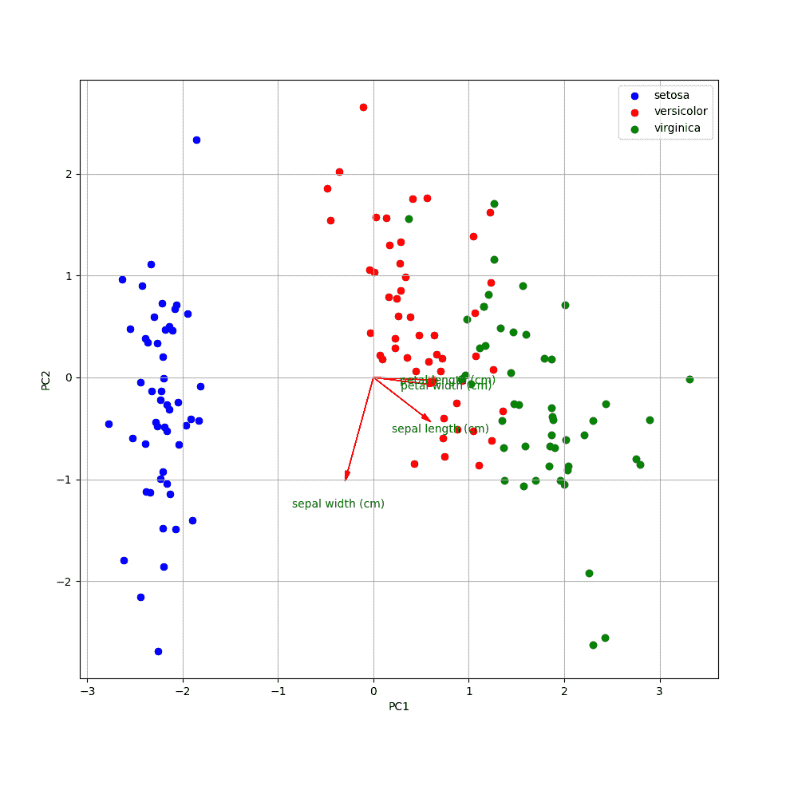

绘制在二维特征空间上的虹膜样本。

从图中可以看出，versicolor 和 virignica 样品之间的距离较近，而 setosa 与它们之间的距离较远。如果你还记得上面的双标图，海滨锦鸡儿有最大的平均萼片长度、花瓣长度和花瓣宽度。然而，刚毛藻具有最高的平均萼片宽度。通过跟踪原始特征的轴可以看出这是正确的。

# 使用奇异值分解(SVD)计算 X 的替代方法

特征分解的一些缺点是计算量大，并且需要一个方阵作为输入。部分由于这些原因，寻找 PCA 的主成分的更流行的方法是使用奇异值分解(SVD)。SVD 将矩阵分解为满足以下条件的三个独立矩阵:

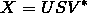

其中 U 是左奇异向量，V*是右奇异向量的复共轭，S 是奇异值。奇异值与从特征分解计算的特征值相关。SVD 的另一个有用特性是奇异值是数量级的，因此不需要重新排序。右奇异向量与通过特征分解得到的特征向量相同，因此 W=V。使用 python，矩阵的 SVD 可以如下计算:

```
u, s, vh = np.linalg.svd(X)
```

由此，现在可以计算分数:

```
svd_scores = np.dot(X, vh.T[:, :2])
```

从这些分数可以画出双标图，当使用特征分解时，将返回与上面相同的结果。查看[代码](https://gist.github.com/conorposullivan/7b40c9a84605ed9447ba520a5695a4bd)了解全部细节。

# 摘要

在这篇文章中，我们讨论了 PCA，以及如何使用它来更清楚地了解数据集特征之间的关系，同时消除不必要的噪声。我们经历了每一步，也讨论了不同的计算方法。我希望这篇文章能对您未来的数据科学工作有所帮助。

*原载于 2020 年 4 月 25 日 datasciencesamurai.com*[](https://datasciencesamurai.com/step-by-step-principal-component-analysis-pca-python)**。**

## *[**加入我的邮件列表，了解更多关于数据科学的知识。**](https://datasciencesamurai.ck.page/77020f333b)*