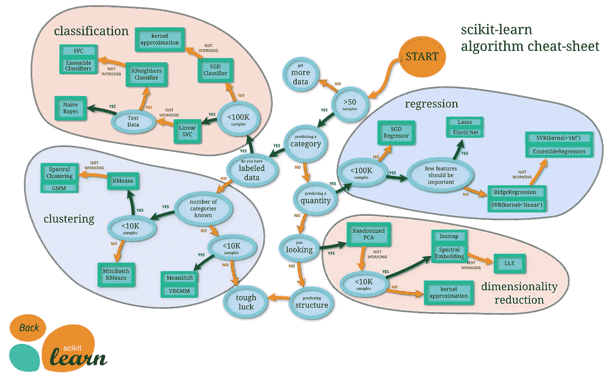

# 处理预测分析问题的一步一步的过程

> 原文：<https://towardsdatascience.com/a-step-by-step-process-to-deal-with-a-predictive-analytical-problem-bee174b68653?source=collection_archive---------33----------------------->

马库斯·斯皮斯克在 [Unsplash](https://unsplash.com/s/photos/prediction?utm_source=unsplash&utm_medium=referral&utm_content=creditCopyText) 上的照片

W 什么是机器学习项目？什么是真正的预测分析问题陈述？我们该如何解决这个问题？这些问题将在本文中得到解答，一些新颖的问题将会被提出，这将有助于我们更好地理解和更准确地解决问题

基本上，使用一些以前的信息，对未来的预测是机器学习模型的基础。提取信息和生成趋势的过程被称为**训练或建模**，讲述未来被称为**预测**。ML 模型包括各种步骤，如探索性数据分析、处理数据、特征工程、训练、预测、模型评估，以及我们如何改进我们的性能。我们将经历创建任何模型的非常基本的结构，并理解基本术语的含义。

# 数据

通常，我们的数据集是以一个 *CSV* (逗号分隔文件)或一个 Excel 文件或一个文本文件或图像和声音的形式给出的。

例如， *CVS* 文件或 Excel 文件有行和列。行基本上是一个观察，列是决定我们目标的特征。对于其他类型，我们需要通过一些规定的方法来提取特征信息，如定义图像包含像素值的三维矩阵，该矩阵可以转换为二维矩阵，用于训练深度学习模型。

但是为了方便起见，让我们考虑一下我们想要预测房价，你认为影响房价的基本因素是什么？(将在文章后面回答)

# 第一步:问题陈述

非常非常仔细地阅读问题陈述。大多数人和不成功的数据科学家都会犯这个错误。阅读问题是非常关键的一步，因为从中可以提取很多信息。

一旦你读完了，问自己这些基本问题

1.  有什么问题？
2.  为什么需要解决这个问题
3.  怎样才能解决问题？

我发现回答这些问题对于理解这个问题非常重要。我们可以使用有史以来最好的算法来获得最高的准确性，但如果我们解决了错误的问题，这将毫无意义。

这些问题不仅会向我们介绍一个问题，还会帮助我们理解和验证收集的数据，并改进结果。

# 步骤 2:假设生成

一旦你阅读了问题陈述，是时候利用我们的知识和经验来列出目标变量所依赖的因素了。这是一种头脑风暴。它让我们知道哪些因素是重要的，而哪些不是，这可以在稍后的 EDA 部分中证明。我们在预测房价。那么，它依赖于什么？可能是位置，大小，房子的年龄，房间的数量，中央空调的存在，停车场的可用性，该地区的人口密度，等等。也许房子的颜色也很重要？嗯，这些答案都可以找出来。

人们应该钦佩这一步是多么重要。这个过程是初学者的必经过程。在第一步，这不是准确性，我们的意图应该是成为一个好的数据科学家，而不仅仅是一个问题解决者！

# 第三步:阅读和理解

阅读你的数据，让自己适应它。阅读你的数据的中心趋势。问问自己什么是连续特征，什么是分类特征，是否有任何缺失值，涉及什么数据类型等。

# 步骤 4:探索性数据分析(EDA)

有两种类型的可视化分析，即单变量分析和双变量分析，

## 单变量分析:

它由一次一个特征的可视化组成。这些可以用来了解我们的连续特征是如何分布的，有没有异常值或者缺失值？对于分类特征，我们可以提取每个类别的数量。主要是，**直方图**和**箱线图**用于连续特征的情况，而**计数图**用于分类数据。

## 双变量分析:

当我们用目标变量来检验每个特征的趋势时，我们称之为双变量分析。数据是如何关联的，每个特征对目标变量的影响是什么，这些都是分析中回答的基本问题。
在对不同的特征、趋势和模式对进行双变量分析时，可以生成缺失值的插补。
对于连续-连续特征，我们使用**散点图**。它告诉我们特征之间的线性关系有多强。对于连续分类，我们使用 **violin 图**，因为它们包含了特征的范围和分布。对于分类-分类，我们可以使用在 Pandas 库中预定义的**跨表方法**。

# 第五步:特征工程

这是建模过程中最具创造性和决定性的因素。但是由于每一个难题都可以被分解成更小的简单问题，这也可以制定为两个主要部分，即。**特征生成**和**编码**。

*特征生成*是从现有特征生成新特征的过程。例如，给出一个字符串日期特征，可以提取关于年和月的信息。另一个很好的例子是，当预测一个商场的销售额时，价格和重量是可以给出的特征，我们可以生成新的特征，即每单位重量的价格。这有助于我们减少数据的维度，同时保持数据的质量。

在所有上述过程之后，我们的数据集已准备好进行模型构建，但问题是大多数机器学习算法无法读取诸如男性、女性、否、是等分类值。我们使用编码方法将它们转换成数值。这主要涉及标签编码、一键编码、计数编码等

# 步骤 6:建模和评估

这一步是关于机器学习算法的选择和我们的训练数据对它的拟合。选择算法取决于问题是分类的还是回归的，是有监督的还是无监督的。有各种型号可供选择。

## **线性算法:**

梯度下降，线性回归，逻辑回归，线性判别分析

## **非线性算法:**

分类和回归树，朴素贝叶斯，K 近邻，学习矢量量化，支持向量机

## **集成算法:**

装袋和随机森林、Boosting 和 AdaBoost

在使用算法将训练数据拟合到模型之后，我们对新数据进行一些预测，这对于模型来说是新的。

许多算法可以预测，但问题是哪一个是最好的？因此，我们需要评估我们的模型。目前，有各种方法来评估我们的模型，如 MSE、MAE、roc-curve、f1-score、log loss 等等。

> Scikit Learn 的备忘单
> 
> 下面的流程图旨在为用户提供一点粗略的指导，告诉他们如何处理关于使用哪些估计器来处理数据的问题。

来源:Scikit 学习算法备忘单:[https://scikit-learn.org/stable/_static/ml_map.png](https://scikit-learn.org/stable/_static/ml_map.png)

# 总结一下:

对于任何问题来说，这都是一个非常基础和幼稚的方法，但是对于初学者来说已经足够好了。一旦你掌握了这些步骤，并对预测建模有所了解，你可以从几个方面着手提高你的技能。

请分享你对这篇文章的看法，我很想听听！