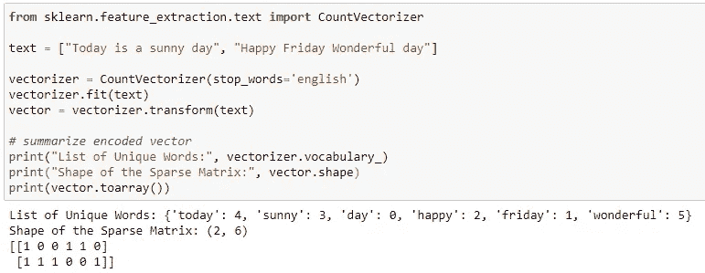
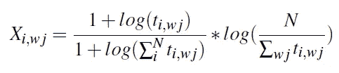
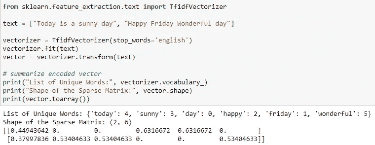
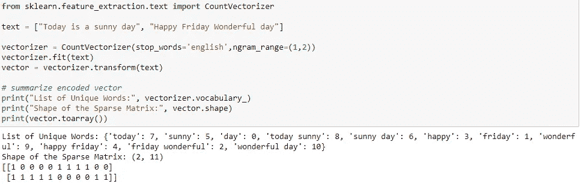

# 进行情感分析的分步指南

> 原文：<https://towardsdatascience.com/a-step-by-step-tutorial-for-conducting-sentiment-analysis-9d1a054818b6?source=collection_archive---------18----------------------->

由 [Unsplash](https://unsplash.com/s/photos/transformation?utm_source=unsplash&utm_medium=referral&utm_content=creditCopyText) 上的[hkon grim stad](https://unsplash.com/@grimstad?utm_source=unsplash&utm_medium=referral&utm_content=creditCopyText)拍摄的照片

## 第 2 部分:用 TFIDF 矢量器转换文本数据

在我的[上一篇文章](https://medium.com/@zzhu17/a-step-by-step-tutorial-for-conducting-sentiment-analysis-a7190a444366)中，我讨论了进行情感分析的第一步，即预处理文本数据。这个过程包括标记化、去除停用词和词条化。在本文中，我将讨论将“干净的”文本数据转换成稀疏矩阵的过程。具体来说，我将通过简单的例子讨论不同矢量器的使用。

在我们进入更多的技术之前，我想介绍两个在文本分析中广泛使用的术语。对于我们想要分析的文本数据集合，我们称之为*语料库*。一个语料库包含几个观察结果，如新闻文章、顾客评论等。这些观察结果中的每一个都被称为*文档*。从现在开始我将使用这两个术语。

转换步骤的作用是搭建一座桥梁，连接文本数据中携带的信息和机器学习模型。对于情感分析，要对每个文档进行情感预测，机器学习模型需要学习文档中每个唯一单词的情感得分，以及每个单词在那里出现的次数。例如，如果我们想要对某个产品的客户评论进行情感分析，在训练模型之后，机器学习模型更有可能从负面评论中提取像“糟糕”、“不满意”这样的词，而从正面评论中获得像“棒极了”、“棒极了”这样的词。

面对有监督的机器学习问题，为了训练模型，我们需要指定特征和目标值。情感分析是在解决一个分类问题，大多数情况下是一个二元分类问题，目标值定义为正和负。用于模型的特征是来自矢量器的转换的文本数据。不同的矢量器构造的特征也不同。在 Scikit Learn 中，有三个矢量器，CountVectorizer、TFIDFVectorizer 和 HashingVectorizer。我们先来讨论一下 CountVectorizer。

**计数矢量器**

CountVectorizer 使用单词包方法，该方法忽略文本结构，只从单词计数中提取信息。它会将每个文档转换成一个向量。向量的输入是这个文档中每个唯一单词的出现次数。当语料库中有 m 个文档，并且所有 m 个文档中有 n 个唯一单词时，CountVectorizer 会将文本数据转换为 m*n 稀疏矩阵。以下示例显示了计数矢量器的用法:

CountVectorizer 获取文档列表，并通过两步生成稀疏矩阵:拟合和转换。在拟合过程中，矢量器读入文档列表，计算语料库中唯一单词的数量，并为每个单词分配一个索引。对于上面的例子，我们可以看到这两个文档有六个不同的单词，我们根据字母顺序给它们分配了一个索引。请注意，您可以在这里指定停用字词来排除无用的字词。您可以使用默认列表，也可以自定义列表。或者如果已经对文本数据进行了预处理，就可以通过这一步。

下一步是转换拟合的数据。CountVectorizer 将计算每个文档中每个唯一单词的出现次数。这里我有两个文档和六个唯一的单词，因此我们将得到一个如上所示的 2*6 矩阵。为了更好地理解矩阵的元素，这里我有一个图表:

这里，行 id 与每个文档相对应，列 id 在匹配过程中跟随唯一单词的索引。例如，单词“day”在两个文档中都出现了，所以第一列输入是(1，1)。如果某个单词没有出现在文档中，则该单词在该文档行中的输入将为 0。随着文档数量的增加，矩阵变成稀疏矩阵，因为矩阵中会有更多的 0。

**tfidf 矢量器**

另一个更广泛使用的矢量器是 TFIDFVectorizer，TFIDF 是术语频率，逆文档频率的缩写。除了每个文档中的字数，TFIDF 还包括该单词在其他文档中的出现次数。具体来说，TFIDF 的计算公式如下:

其中 t_i，wj 是单词 wj 在文档 I 中出现的频率。通过检查等式，可以清楚地看到，第一项是计算术语频率，第二项是计算逆文档频率。第一项是评估单词 wj 在文档 I 中出现了多少次，用文档 I 的长度归一化。较高的词频率指示较高的 TFIDF 值，表明单词 wj 通过出现显著的次数而在文档 I 中扮演非常重要的角色。但是如果 wj 也出现在 I 之外的很多其他文档中，wj 的作用就会减弱，也就是说它是这个题目的常用词。这个过程被第二项捕获，第二项是 wj 出现的文档数除以文档总数的倒数。综合两种效果，文档 I 中 TFIDF 值高的一个词 wj，意味着 wj 在文档 I 中出现多次，在其他文档中只出现很少。

使用前一个示例的 TFIDF，区别如下:

我们可以看到每个元素的值都变小了，但是矩阵的形状还是一样的。

**哈希矢量器**

另一种常用的矢量器叫做哈希矢量器。它通常在处理大型数据集时使用。使用[特征散列](https://en.wikipedia.org/wiki/Feature_hashing)，散列矢量器是内存高效的，并确保大型数据集的更好的模型性能。在这篇文章里我不会讲太多细节，但是你可以在这里查阅更多信息[。](https://scikit-learn.org/stable/modules/generated/sklearn.feature_extraction.text.HashingVectorizer.html)

**附加功能输入**

除了指定和定制停用词，我们还可以定制矢量器中的标记化功能。正如我在[上一篇文章](https://medium.com/@zzhu17/a-step-by-step-tutorial-for-conducting-sentiment-analysis-a7190a444366)中所讨论的，在这里包含定制的 tokenize 函数会减慢矢量化过程。

在前面的例子中，我们正在构建只有单个单词的稀疏矩阵，我们可以通过包含二元模型来增加特征的数量。我们可以通过在函数中添加 *ngram_range* 来在函数中指定它。这里有一个例子:

通过包含 bigram，特性的数量从 6 个增加到 11 个。有时，当我们在文档中有“不错”这样的词时，包含 bigram 会提高模型性能。

您还可以在矢量函数中指定 *min_df* 和 *max_df* 。通过指定一个单词在不同的文档中出现多少次才能被认为是一个特征，我们过滤掉在语料库中不太常见的单词。此外，当设置一个单词在不同文档中出现的次数限制(max_df)时，我们忽略了太常见的内容，比如停用词。在不同场景中定制矢量器函数输入应该会提高模型性能。

了解矢量器的定制选项非常有用。更多选择，你可以访问每个矢量器的 [sklearn 文档](https://scikit-learn.org/stable/modules/generated/sklearn.feature_extraction.text.TfidfVectorizer.html)。为了确保最佳的模型性能，我们可以使用 GridSearchCV 来调整变压器的超参数。在我的[下一篇文章](https://medium.com/@zzhu17/a-step-by-step-tutorial-for-conducting-sentiment-analysis-cf3e995e3171)中，我将讨论在我的项目中应用 TFIDF 的更多细节，并构造估计器。

感谢您的阅读！这是我所有博客帖子的列表。如果你感兴趣的话，可以去看看！

 [## 我的博客文章库

### 我快乐的地方

zzhu17.medium.com](https://zzhu17.medium.com/my-blog-posts-gallery-ac6e01fe5cc3)  [## 阅读朱(以及媒体上成千上万的其他作家)的每一个故事

### 作为一个媒体会员，你的会员费的一部分会给你阅读的作家，你可以完全接触到每一个故事…

zzhu17.medium.com](https://zzhu17.medium.com/membership)