# 进行情感分析的分步指南

> 原文：<https://towardsdatascience.com/a-step-by-step-tutorial-for-conducting-sentiment-analysis-a7190a444366?source=collection_archive---------6----------------------->


科塞拉·博尔塔在 [Unsplash](https://unsplash.com/s/photos/feeling?utm_source=unsplash&utm_medium=referral&utm_content=creditCopyText) 上的照片

## 第 1 部分:预处理文本数据

[据估计，全球 80%的数据是非结构化的。](https://www.ibm.com/blogs/watson/2016/05/biggest-data-challenges-might-not-even-know/)因此，从非结构化数据中获取信息是数据分析的重要组成部分。文本挖掘是从非结构化的文本数据中获取有价值见解的过程，情感分析是文本挖掘的一个应用。它使用自然语言处理和机器学习技术从文本数据中理解和分类主观情绪。在商业环境中，情感分析广泛用于理解客户评论、检测电子邮件中的垃圾邮件等。本文是教程的第一部分，介绍了使用 Python 进行情感分析的具体技术。为了更好地说明这个过程，我将使用我的一个项目作为例子，在那里我对 WTI 原油期货价格进行新闻情绪分析。我将展示重要的步骤以及相应的 Python 代码。

**一些背景信息**

原油期货价格短期波动较大。虽然任何产品的长期均衡都是由供求状况决定的，但价格的短期波动反映了市场对该产品的信心和预期。在这个项目中，我使用原油相关的新闻文章来捕捉不断更新的市场信心和预期，并通过对新闻文章进行情绪分析来预测原油未来价格的变化。以下是完成此分析的步骤:

> 1、[收集数据:网络抓取新闻文章](https://zzhu17.medium.com/web-scraping-yahoo-finance-news-a18f9b20ee8a)
> 
> 2、预处理文本数据(本文)
> 
> 3、[文本矢量化:TFIDF](https://medium.com/@zzhu17/a-step-by-step-tutorial-for-conducting-sentiment-analysis-9d1a054818b6)
> 
> 4、[使用逻辑回归的情感分析](https://medium.com/@zzhu17/a-step-by-step-tutorial-for-conducting-sentiment-analysis-cf3e995e3171)
> 
> 5、使用 python flask web app 在 Heroku 部署模型

我将讨论第二部分，即本文中的文本数据预处理。如果您对其他部分感兴趣，请点击链接阅读更多内容(即将推出)。

**预处理文本数据**

我使用 NLTK、Spacy 和一些正则表达式中的工具对新闻文章进行预处理。要导入库并在 Spacy 中使用预构建的模型，您可以使用以下代码:

```
import spacy
import nltk# Initialize spacy ‘en’ model, keeping only component needed for lemmatization and creating an engine:nlp = spacy.load(‘en’, disable=[‘parser’, ‘ner’])
```

之后，我用熊猫来读取数据:

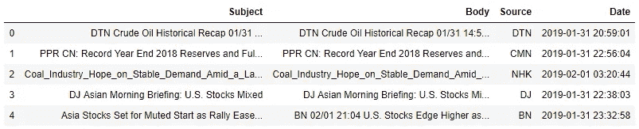

“Subject”和“Body”是我将对其应用文本预处理过程的列。我按照标准的文本挖掘程序对新闻文章进行预处理，从新闻内容中提取有用的特征，包括标记化、去除停用词和词条化。

***标记化***

预处理文本数据的第一步是将每一个句子分解成单个的单词，这就是所谓的标记化。采用单个单词而不是句子会破坏单词之间的联系。但是，这是一种用于分析大量文本数据的常用方法。通过检查什么词在文章中出现以及这些词出现了多少次，计算机分析文本数据是高效和方便的，并且足以给出有见地的结果。

以我的数据集中的第一篇新闻文章为例:

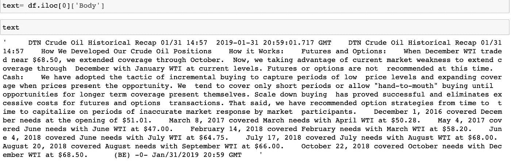

您可以使用 NLTK 标记器:

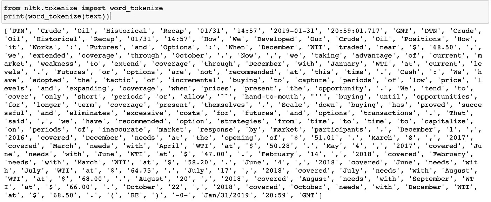

或者您可以使用 Spacy，记住 NLP 是上面定义的 Spacy 引擎:

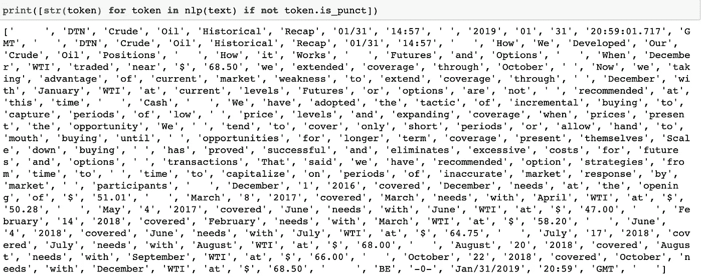

需要将每个令牌改为字符串变量

在标记化之后，每篇新闻都将转化为一系列单词、符号、数字和标点符号。您可以指定是否要将每个单词都转换成小写。下一步是删除无用的信息。例如，符号、数字、标点符号。我将使用 spacy 结合正则表达式来删除它们。

```
import re#tokenization and remove punctuations
words = [str(token) for token in nlp(text) if not token.is_punct] #remove digits and other symbols except "@"--used to remove email
words = [re.sub(r"[^A-Za-z@]", "", word) for word in words]#remove websites and email address
words = [re.sub(r”\S+com”, “”, word) for word in words]
words = [re.sub(r”\S+@\S+”, “”, word) for word in words]#remove empty spaces 
words = [word for word in words if word!=’ ‘]
```

应用上述转换后，原始新闻文章看起来是这样的:

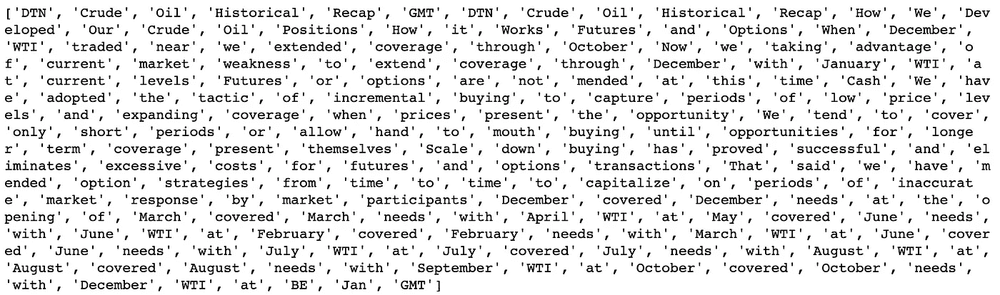

***停用词***

经过一些改造后，新闻文章更干净了，但我们仍然会看到一些我们不希望看到的词，例如，“和”，“我们”等。下一步是删除无用的词，即停用词。停用词是在许多文章中频繁出现但没有重要意义的词。停用词的例子有' I '，' the '，' a '，' of '。这些词如果被删除，将不会影响对文章的理解。要删除停用词，我们可以从 NLTK 库中导入停用词。除此之外，我还包括[其他在经济分析中广泛使用的停用词列表](https://sraf.nd.edu/textual-analysis/resources/StopWords.)，包括日期和时间，更一般的没有经济意义的词等。我是这样构造停用词列表的:

```
#import other lists of stopwords
with open(‘StopWords_GenericLong.txt’, ‘r’) as f:
 x_gl = f.readlines()
with open(‘StopWords_Names.txt’, ‘r’) as f:
 x_n = f.readlines()
with open(‘StopWords_DatesandNumbers.txt’, ‘r’) as f:
 x_d = f.readlines()#import nltk stopwords
stopwords = nltk.corpus.stopwords.words(‘english’)#combine all stopwords
[stopwords.append(x.rstrip()) for x in x_gl][stopwords.append(x.rstrip()) for x in x_n][stopwords.append(x.rstrip()) for x in x_d]#change all stopwords into lowercase
stopwords_lower = [s.lower() for s in stopwords]
```

然后从新闻文章中排除停用词:

```
words = [word.lower() for word in words if word.lower() not in stopwords_lower]
```

应用到前面的例子，它看起来是这样的:

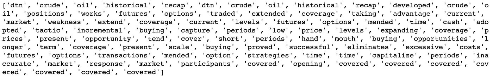

***词汇化***

除去停用词、符号、数字和标点符号，每篇新闻文章都将转化为一系列有意义的单词。然而，要统计每个单词的出现次数，就必须去除语法时态，将每个单词转换为其原始形式。例如，如果我们想计算单词“open”在一篇新闻文章中出现了多少次，我们需要计算“open”、“opens”、“opened”的出现次数。因此，词汇化是文本转换的一个重要步骤。另一种将单词转换成原始形式的方法叫做词干提取。它们之间的区别如下:

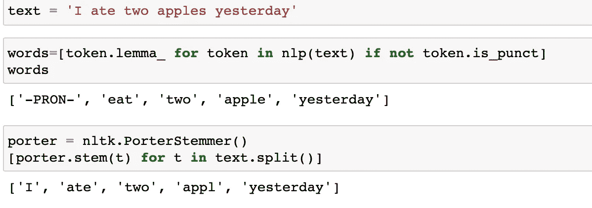

词干化是将一个单词提取到它的原始词干中，词干化是提取一个单词的语言学词根。我选择词汇化而不是词干化，因为词干化之后，一些单词变得难以理解。为了解释的目的，引理比语言根更好。

如上所示，用 Spacy 实现引理化非常容易，这里我调用。引理 _ 函数从空间开始。在词汇化之后，每篇新闻文章都将转化为一个单词列表，这些单词都是它们的原始形式。新闻报道现在变成了这样:

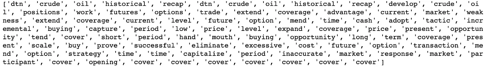

**总结步骤**

让我们总结一个函数中的步骤，并在所有文章中应用该函数:

```
def text_preprocessing(str_input):      #tokenization, remove punctuation, lemmatization
     words=[token.lemma_ for token in nlp(str_input) if not         token.is_punct]

     # remove symbols, websites, email addresses 
     words = [re.sub(r”[^A-Za-z@]”, “”, word) for word in words] 
     words = [re.sub(r”\S+com”, “”, word) for word in words]
     words = [re.sub(r”\S+@\S+”, “”, word) for word in words] 
     words = [word for word in words if word!=’ ‘]
     words = [word for word in words if len(word)!=0] 

     #remove stopwords     
     words=[word.lower() for word in words if word.lower() not in     stopwords_lower] #combine a list into one string   
     string = “ “.join(words) return string
```

上面的函数 text_preprocessing()结合了所有的文本预处理步骤，这里输出的是第一篇新闻文章:

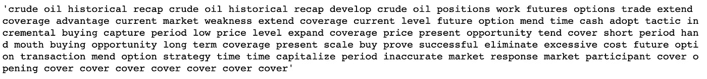

在推广到所有新闻文章之前，按照下面的代码，将它应用到随机的新闻文章中并看看它是如何工作的是很重要的:

```
import randomindex = random.randint(0, df.shape[0])
text_preprocessing(df.iloc[index][‘Body’])
```

如果有一些额外的词你想排除这个特定的项目或一些额外的多余信息你想删除，你可以随时修改该功能之前，适用于所有的新闻文章。这是一篇在标记化前后随机选择的新闻文章，去掉了停用词和词条。

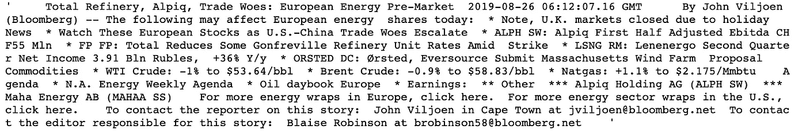

预处理前的新闻文章

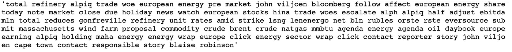

预处理后的新闻文章

如果一切正常，您可以将该功能应用于所有新闻文章:

```
df[‘news_cleaned’]=df[‘Body’].apply(text_preprocessing)
df[‘subject_cleaned’]=df[‘Subject’].apply(text_preprocessing)
```

**一些言论**

文本预处理是文本挖掘和情感分析中非常重要的一部分。有很多方法可以对非结构化数据进行预处理，使其对计算机可读，以便将来进行分析。下一步，我将讨论我用来将文本数据转换成稀疏矩阵的矢量器，以便它们可以用作定量分析的输入。

如果您的分析很简单，并且在预处理文本数据时不需要太多的定制，那么矢量器通常有嵌入式函数来执行基本步骤，比如标记化、删除停用词。或者，您可以编写自己的函数并在矢量器中指定自定义函数，这样您就可以同时对数据进行预处理和矢量化。如果您希望这样，您的函数需要返回一个标记化单词的列表，而不是一个长字符串。不过个人来说，我更倾向于先对文本数据进行预处理，再进行矢量化。通过这种方式，我不断地监控我的函数的性能，实际上这样更快，尤其是当你有一个大的数据集的时候。

我将在我的[下一篇文章](https://medium.com/@zzhu17/a-step-by-step-tutorial-for-conducting-sentiment-analysis-9d1a054818b6)中讨论转换过程。感谢您的阅读！这是我所有博客帖子的列表。如果你感兴趣的话，可以去看看！

[](https://zzhu17.medium.com/my-blog-posts-gallery-ac6e01fe5cc3) [## 我的博客文章库

### 我快乐的地方

zzhu17.medium.com](https://zzhu17.medium.com/my-blog-posts-gallery-ac6e01fe5cc3) [](https://zzhu17.medium.com/membership) [## 阅读朱(以及媒体上成千上万的其他作家)的每一个故事

### 作为一个媒体会员，你的会员费的一部分会给你阅读的作家，你可以完全接触到每一个故事…

zzhu17.medium.com](https://zzhu17.medium.com/membership)