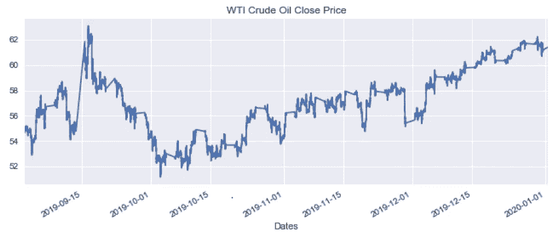
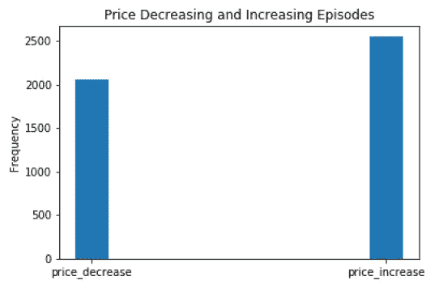
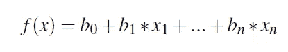
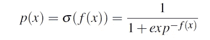
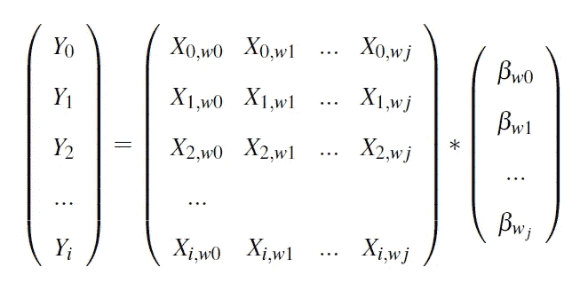
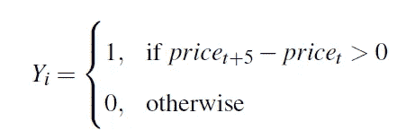
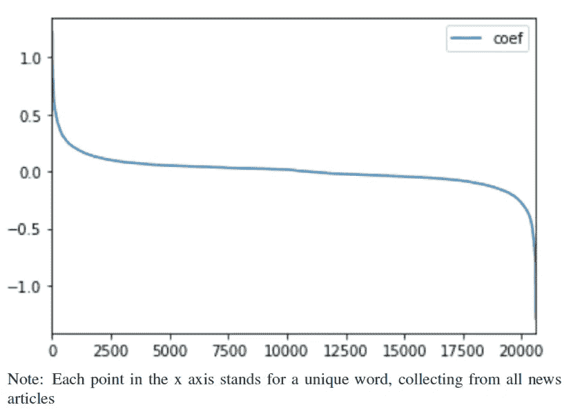
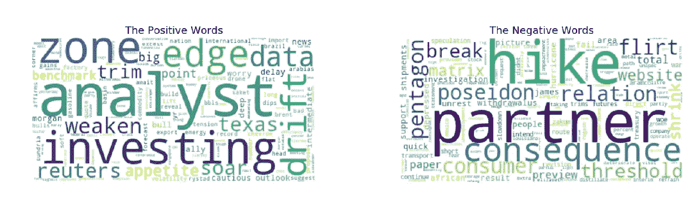
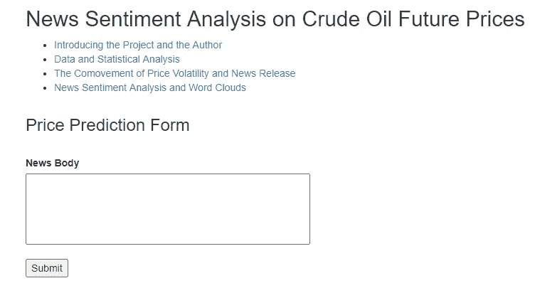

# 进行情感分析的分步指南

> 原文：<https://towardsdatascience.com/a-step-by-step-tutorial-for-conducting-sentiment-analysis-cf3e995e3171?source=collection_archive---------24----------------------->


马库斯·温克勒在 [Unsplash](https://unsplash.com/s/photos/machine-learning?utm_source=unsplash&utm_medium=referral&utm_content=creditCopyText) 上的照片

## **第三部分:最后一步，应用逻辑回归**

按照我以前文章中的步骤，我[对文本数据](/a-step-by-step-tutorial-for-conducting-sentiment-analysis-a7190a444366)进行了预处理，并且[将“清理”后的数据转换为稀疏矩阵](/a-step-by-step-tutorial-for-conducting-sentiment-analysis-9d1a054818b6)。请点击链接查看更多详情。

现在我正处于对 WTI 原油期货价格进行新闻情绪分析的最后阶段。在本文中，我将讨论逻辑回归的使用，以及我在项目中发现的一些有趣的结果。我这里有一些这个项目[的背景介绍](/a-step-by-step-tutorial-for-conducting-sentiment-analysis-a7190a444366)。

**定义并构建目标值**

正如我在以前的文章中简要讨论的那样，进行情感分析是通过机器学习模型和文本数据来解决分类问题(通常是二元的)。解决一个分类问题就是解决一个有监督的机器学习问题，在训练模型的时候既需要特征也需要目标值。如果是二元分类问题，目标值通常是正面情绪和负面情绪。它们是根据你的研究问题的上下文来分配和详细定义的。

以我的项目为例，我的项目的目的是从最近发布的新闻文章中预测原油期货价格的变化。我把好消息定义为预测价格上涨的消息，而坏消息则预测价格下跌。因为我已经收集并转换了文本数据，并将它们用作要素，所以现在需要为数据集分配目标值。

我的项目的目标值是不同新闻文章的价格变化方向。我从彭博收集了 WTI 原油期货收盘价的高频交易数据，每五分钟更新一次。我将数据绘制在下图中:



资料来源:彭博

数据是 2019 年最后一个季度的。价格有很多波动，但是没有明显的趋势，非常适合情绪分析。这里的价格数据是一个连续变量，我需要将它转换成一个带有二进制值的分类变量，以便进行情感分析。

假设金融市场是完全有效的，并且市场对新信息的反应足够快，我定义新闻对 WTI 原油期货价格的影响在新闻发布后的五分钟内得到反映。我建立了一个虚拟变量:如果一篇新闻文章发布后五分钟内价格上涨，价格虚拟变量将是 1。否则，如果价格下降或不变，虚拟价格将为零。在整个数据集的五分钟时间段内，价格几乎不可能保持不变。因此，当虚拟价格等于零时，意味着价格在新闻发布后的五分钟内下降。

对于每篇新闻文章，通过寻找发布后五分钟内的价格变化，本文将新闻和价格虚拟进行匹配。下图显示，通过比较价格上涨事件和价格下跌事件的数量，数据大致平衡:



**引入逻辑回归**

在构建目标值之后，我已经为每篇新闻文章准备好了文本特征(TFIDF 矢量化文本数据)和价格虚拟数据。现在我需要应用一个估计器来建立机器学习模型。解决二元分类问题的模型有很多，这里我选择的是 logistic 回归。

逻辑回归是一个线性分类器，它是一个线性函数的转换:



线性回归

其中 b0，b1…bn 是一组独立变量 **x** =(x_1，x_2…x_n)的回归系数的估计值。逻辑回归函数 p( **x** )是 f( **x** )的 sigmoid 函数:



sigmoid 变换

变换后 p( **x** )的值会在[0，1]之间，可以解释为一个概率。一般 p( **x** )解释为 **x** 在正类时的预测概率，1-p( **x** )是 **x** 在负类的概率。在本项目中，p( **x** )定义为新闻文章 I 发布后五分钟内 WTI 原油期货价格上涨的概率。

应用逻辑回归进行新闻情感分析，我将每篇新闻文章视为一个观察，将新闻文章中的内容视为特征，并通过以下等式估计β_w0，β_w1，… β_wj:



这里 I 代表每篇新闻文章作为观察，wj 是所有新闻文章中第 j 个唯一的词。在左边，Y_i 是上一节描述的价格变化虚拟值。具体而言，Y 的值由以下条件决定:



虚拟价格

在右边，第一项是一个稀疏矩阵，每行代表一篇新闻文章，每列代表一个独特的单词。在 4616 篇新闻文章中出现过超过 20，606 个独特的单词，它们表明了稀疏矩阵的形状。稀疏矩阵的每个值 X_{i，wj}被表示为每个新闻文章 I 中每个唯一单词 wj 的 TFIDF 值，有关 TFIDF 变换的更多详细信息，请查看我的[上一篇文章](/a-step-by-step-tutorial-for-conducting-sentiment-analysis-9d1a054818b6)。

**实施逻辑回归**

为了实现逻辑回归和训练模型，我首先将数据集分为训练集和测试集。“df['news']”这里是“干净的”新闻文章，“df['price']”是作为目标值的价格虚拟。为了找到最好的转换器和最好的估计器，我建立了一个机器学习管道，并使用 GridSearchCV 来找到最好的超参数。我在此附上代码供您参考:

```
#train and test split
X_train, X_test, y_train, y_test = train_test_split(df['news'], 
                                                    df['price'], 
                                                    random_state=0)#build a machine learning pipeline
est = Pipeline([(‘vectorizer’, TfidfVectorizer(lowercase=False)),
 (‘classifier’, LogisticRegression(solver=’liblinear’))])#GridSearchCV with a transformer and a estimator
parameters = {‘vectorizer__max_df’: (0.8,0.9), 
 ‘vectorizer__min_df’: [20,50,0.1],
 “classifier__C”:np.logspace(-3,3,7), 
 “classifier__penalty”:[“l1”,”l2"]}gs=GridSearchCV(est,param_grid=parameters)#fit the training data
gs.fit(X_train, y_train)#Evaluate the model
predictions = model.predict(vect.transform(X_test))
print('AUC: ', roc_auc_score(y_test, predictions))
AUC:  0.719221201684
```

如果没有指定，GridSearchCV 将寻找为模型评估生成最高精度的超参数。有时候，准确性不是评估模型的最佳指标，我们可能会使用其他指标。您可以通过在 GridSearchCV 函数中定义“计分”输入来指定它。对于如何选择合适的度量标准，我有一篇文章《[模型评估分类度量标准终极指南](/the-ultimate-guide-of-classification-metrics-for-model-evaluation-83e4cdf294d9)》详细回答了这个问题。

我使用 AUC 作为我的模型度量，它在我的测试集中达到 0.71。鉴于我必须训练模型的观察数量(超过 4000 篇新闻文章)，我相信模型已经准备好部署了。

**有趣的发现**

按照前面的步骤，我估计了每个唯一单词的系数(βs)。总的来说，我得到了超过 20，000 个独特的单词，下面的图显示了每个独特的单词的β:



x 轴上的每个点代表从所有新闻文章中收集的一个独特的词，总共有 20606 篇。y 轴代表每个单词的符号和系数的大小。该图表明，大多数独特词本身对价格的影响非常有限，其系数非常接近于零。但是，有一些词的系数绝对值超过 0.5，它们在估计价格变化时非常具有预测性。

使用 Python 单词云函数，根据系数的值，我绘制了预测不同方向价格变化的最积极和最消极的单词。字体越大，表示预测价格变化的影响越大。



部署在 Heroku

在构建和评估模型之后，我将模型实现为 Flask web 应用程序，并将其部署在 Heroku:



在“新闻正文”框中，您可以粘贴任何新闻文章并按“提交”，然后模型将预测该新闻文章的情绪，即该新闻发布后价格上涨的概率。

构建 web 应用程序需要在线部署训练好的模型，并根据新的输入进行预测。除了用 Python 编码来构建机器学习模型和构造 flask app，还需要一些 web app 的 HTML 背景知识。以后我会写一个关于部署机器学习模型的教程。

在 web 应用程序中，也有一些关于我的项目的解释性数据分析和其他有趣的发现。请随意查看并在这里玩。

这都是为了进行情感分析。如果您有任何意见或问题，请随时联系我。感谢您的阅读！

这是我所有博客帖子的列表。如果你感兴趣的话，可以去看看！

[](https://zzhu17.medium.com/my-blog-posts-gallery-ac6e01fe5cc3) [## 我的博客文章库

### 我快乐的地方

zzhu17.medium.com](https://zzhu17.medium.com/my-blog-posts-gallery-ac6e01fe5cc3) [](https://zzhu17.medium.com/membership) [## 阅读朱(以及媒体上成千上万的其他作家)的每一个故事

### 作为一个媒体会员，你的会员费的一部分会给你阅读的作家，你可以完全接触到每一个故事…

zzhu17.medium.com](https://zzhu17.medium.com/membership)