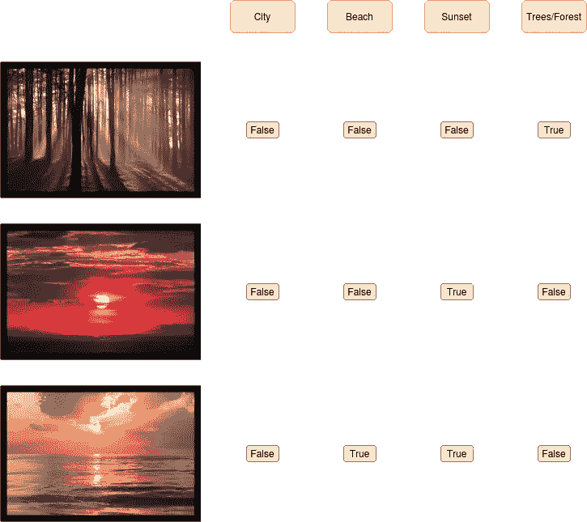
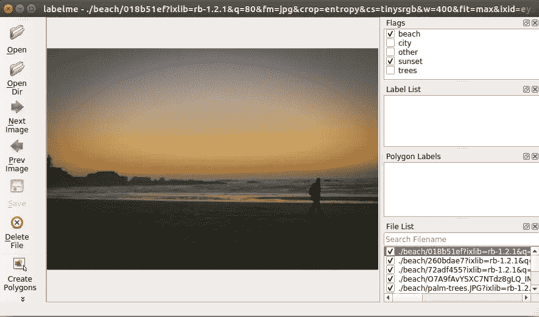
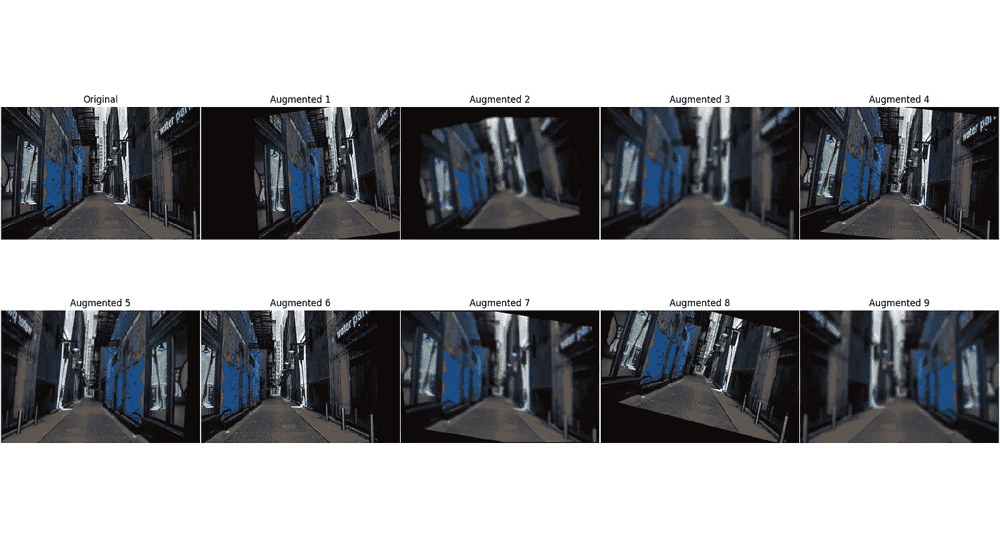
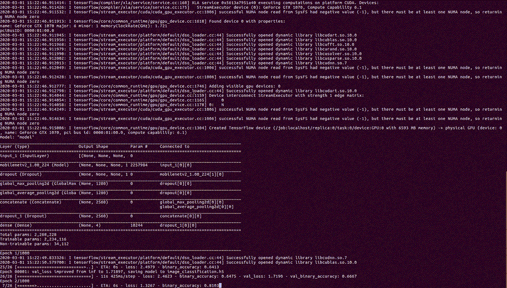
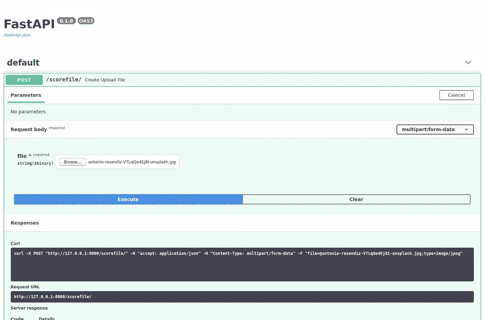
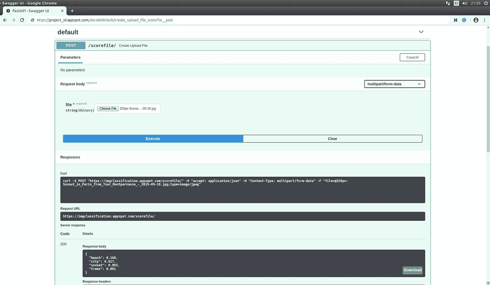

# 构建和部署影像分类 API 的分步教程

> 原文：<https://towardsdatascience.com/a-step-by-step-tutorial-to-build-and-deploy-an-image-classification-api-95fa449f0f6a?source=collection_archive---------7----------------------->

## 从使用 Labelme 的数据注释到使用 FastApi+Docker 的部署的所有步骤


图恩·nguyễn·明在 [Unsplash](https://unsplash.com/s/photos/build?utm_source=unsplash&utm_medium=referral&utm_content=creditCopyText) 上拍摄的照片

在这个小项目中，我们的目标是从头开始构建一个图像分类 API。
我们将经历实现这一目标所需的所有步骤:

*   数据注释(使用 Unsplash API + Labelme)
*   模型训练(使用 Tensorflow)
*   制作 API(使用 Uvicorn 和 FastApi)
*   在远程服务器上部署 API(使用 Docker 和 Google 云平台)

# 数据注释:

任何机器学习项目最重要的部分之一是注释数据的质量和数量。这是部署 API 时影响预测质量的关键因素之一。

在这个项目中，我们将尝试将输入图像分为四类:

*   城市
*   海滩
*   日落
*   树木/森林

我选择这些课程是因为很容易在网上找到大量代表它们的图片。我们使用这些类来定义多标签分类问题:



来自[https://unsplash.com/](https://unsplash.com/)的输入和目标/图像示例

现在我们已经定义了我们想要解决的问题，我们需要获得足够数量的标记样本来进行训练和评估。
为了做到这一点，我们将首先使用 [Unsplash](https://unsplash.com/) API 来获取给定多个搜索查询的图像的 URL。

```
# First install [https://github.com/yakupadakli/python-unsplash](https://github.com/yakupadakli/python-unsplash)
# Unsplash API [https://unsplash.com/documentation](https://unsplash.com/documentation)
import json
import osfrom unsplash.api import Api
from unsplash.auth import Authwith open('tokens.json', 'r') as f:
    data = json.load(f)client_id = data['client_id']
client_secret = data['client_secret']redirect_uri = ""
code = ""keyword = 'beach'auth = Auth(client_id, client_secret, redirect_uri, code=code)
api = Api(auth)photos = api.search.photos(keyword, per_page=1000, page=i)['results']for photo in photos:
    print(photo)
    print(photo.id)
    print(photo.urls)
    print(photo.urls.small)
```

我们将尝试获取与我们的目标类相关的图像 URL，加上一些其他随机图像，作为反面例子。

下一步是遍历所有的图像，并给每一个图像分配一组标签，如上图所示。为此，使用专为此任务设计的注释工具总是更容易，例如 [LabelMe，](https://github.com/wkentaro/labelme)它是一个 python 库，您可以从命令行轻松运行:

```
labelme . -flags labels.txt
```



Labelme 用户界面

使用 Labelme 我标记了大约一千张图片，并在这里提供了 urls 标签:[https://github.com/CVxTz/ToyImageClassificationDataset](https://github.com/CVxTz/ToyImageClassificationDataset)

# 模型

现在我们有了标记的样本，我们可以尝试使用 Tensorflow 构建一个分类器。我们将使用 MobileNet_V2 作为分类器的主干，因为它速度快，而且不太可能过度拟合。鉴于我们只有少量的标记样本，您可以通过从 keras_applications 导入它来轻松使用它:

```
from tensorflow.keras.applications import MobileNetV2base_model = MobileNetV2(include_top=False, input_shape=input_shape, weights=weights)
```

由于这是一个具有四个类别的多标签分类问题，我们将有一个具有 Sigmoid 激活的四个神经元的输出层(给定一个示例，我们可以将多个神经元激活或没有神经元激活作为目标)

## 迁移学习

解决标记样本缺乏的一个常用技巧是使用迁移学习。它是当你把从源任务(像带有不同标签集的图像分类)中学到的一些权重转移到你的目标任务，作为你训练的起点。与从随机开始相比，这允许更好的初始化，并且允许为我们的多标签分类重用在源任务上学习的一些表示。

这里我们将转移在 ImageNet 中训练得到的权重。在为 MobileNet_V2 使用 Tensorflow+Keras 时，做到这一点非常容易，您只需要在创建 MobileNetV2 的实例时指定 weights="imagenet "

```
base_model = MobileNetV2(include_top=False, input_shape=input_shape, weights="imagenet")
```

## 数据扩充

当有一小组带注释的样本时，提高性能的另一个技巧是进行数据扩充。应用随机扰动的过程保留了标签信息(扰动后的城市图片看起来仍然像一个城市)。一些常见的变换是垂直镜像、椒盐噪声或模糊。



数据扩充示例/图片来自[https://unsplash.com/](https://unsplash.com/)

为了实现这一点，我们使用了一个名为 imgaug 的 python 包，并定义了一系列变换及其幅度:

```
sometimes = **lambda** aug: iaa.Sometimes(0.1, aug)
seq = iaa.Sequential(
    [
        sometimes(iaa.Affine(scale={**"x"**: (0.8, 1.2)})),
        sometimes(iaa.Fliplr(p=0.5)),
        sometimes(iaa.Affine(scale={**"y"**: (0.8, 1.2)})),
        sometimes(iaa.Affine(translate_percent={**"x"**: (-0.2, 0.2)})),
        sometimes(iaa.Affine(translate_percent={**"y"**: (-0.2, 0.2)})),
        sometimes(iaa.Affine(rotate=(-20, 20))),
        sometimes(iaa.Affine(shear=(-20, 20))),
        sometimes(iaa.AdditiveGaussianNoise(scale=0.07 * 255)),
        sometimes(iaa.GaussianBlur(sigma=(0, 3.0))),
    ],
    random_order=**True**,
)
```

## 培养

我们将数据集分为两部分，训练和验证，并使用 binary_crossentropy 作为我们的目标，binary_accuracy 作为评估度量。

在更新一些配置文件后，我们从命令行运行培训:

```
# data_config.yaml for defnining the classes and input size **input_shape**: [null, null, 3]
**resize_shape**: [224, 224]
**images_base_path**: **'../example/data/'
targets**: [**'beach'**, **'city'**, **'sunset'**, **'trees'**]
**image_name_col**: **'name'**# training_config.yaml for defining some training parameters **use_augmentation**: true
**batch_size**: 32
**epochs**: 1000
**initial_learning_rate**: 0.0001
**model_path**: **"image_classification.h5"**
```

然后运行训练脚本:

```
**export PYTHONPATH=$PYTHONPATH:~/PycharmProjects/FastImageClassification/****python train.py --csv_path "../example/data.csv" \
       --data_config_path "../example/data_config.yaml" \
       --training_config_path "../example/training_config.yaml"**
```



我们最终得到的二进制验证准确率为 **94%**

# 制作 API

我们将使用 FastAPI 通过一个易于使用的 API 来公开一个预测器，该 API 可以将一个图像文件作为输入，并输出一个包含每个类的分类分数的 JSON。

首先，我们需要编写一个预测器类，它可以轻松地加载 tensorflow.keras 模型，并有一个方法来对文件对象形式的图像进行分类。

```
**class** ImagePredictor:
    **def** __init__(
        self, model_path, resize_size, targets, pre_processing_function=preprocess_input
    ):
        self.model_path = model_path
        self.pre_processing_function = pre_processing_function
        self.model = load_model(self.model_path)
        self.resize_size = resize_size
        self.targets = targets @classmethod
    **def** init_from_config_path(cls, config_path):
        **with** open(config_path, **"r"**) **as** f:
            config = yaml.load(f, yaml.SafeLoader)
        predictor = cls(
            model_path=config[**"model_path"**],
            resize_size=config[**"resize_shape"**],
            targets=config[**"targets"**],
        )
        **return** predictor @classmethod
    **def** init_from_config_url(cls, config_path):
        **with** open(config_path, **"r"**) **as** f:
            config = yaml.load(f, yaml.SafeLoader) download_model(
            config[**"model_url"**], config[**"model_path"**], config[**"model_sha256"**]
        ) **return** cls.init_from_config_path(config_path) **def** predict_from_array(self, arr):
        arr = resize_img(arr, h=self.resize_size[0], w=self.resize_size[1])
        arr = self.pre_processing_function(arr)
        pred = self.model.predict(arr[np.newaxis, ...]).ravel().tolist()
        pred = [round(x, 3) **for** x **in** pred]
        **return** {k: v **for** k, v **in** zip(self.targets, pred)} **def** predict_from_file(self, file_object):
        arr = read_from_file(file_object)
        **return** self.predict_from_array(arr)
```

我们可以使用一个配置文件来实例化一个 predictor 对象，该对象具有进行预测的所有参数，并将从项目的 GitHub 存储库中下载模型:

```
**# config.yaml
resize_shape**: [224, 224]
**targets**: [**'beach'**, **'city'**, **'sunset'**, **'trees'**]
**model_path**: **"image_classification.h5"
model_url**: **"https://github.com/CVxTz/FastImageClassification/releases/download/v0.1/image_classification.h5"
model_sha256**: **"d5cd9082651faa826cab4562f60e3095502286b5ea64d5b25ba3682b66fbc305"**
```

完成所有这些之后，当使用 FastAPI 时，我们的 API 的主文件变得微不足道:

```
**from** fastapi **import** FastAPI, File, UploadFile**from** fast_image_classification.predictor **import** ImagePredictorapp = FastAPI()predictor_config_path = **"config.yaml"**predictor = ImagePredictor.init_from_config_url(predictor_config_path) @app.post(**"/scorefile/"**)
**def** create_upload_file(file: UploadFile = File(...)):
    **return** predictor.predict_from_file(file.file)
```

我们现在可以用一个命令运行应用程序:

```
uvicorn main:app --reload
```

这使我们能够访问 Swagger UI，在那里我们可以在一个新文件上尝试我们的 API。



[http://127 . 0 . 0 . 1:8080/docs](http://127.0.0.1:8000/docs)


由 [Antonio Resendiz](https://unsplash.com/@antonioresendiz_?utm_source=unsplash&utm_medium=referral&utm_content=creditCopyText) 在 [Unsplash](https://unsplash.com/s/photos/city?utm_source=unsplash&utm_medium=referral&utm_content=creditCopyText) 上拍摄的照片

上传上面的图像会产生以下输出:

```
{"beach": **0**,"city": **0**.**999**,"sunset": **0**.**005**,"trees": **0** }
```

这是预期的输出！

我们还可以通过 curl 发送请求并计时:

```
time curl -X POST "[http://127.0.0.1:8080/scorefile/](http://127.0.0.1:8000/scorefile/)" -H  "accept: application/json" -H  "Content-Type: multipart/form-data" -F "file=[@antonio](http://twitter.com/antonio)-resendiz-VTLqQe4Ej8I-unsplash.jpg;type=image/jpeg">> {"beach":0.0,"city":0.999,"sunset":0.005,"trees":0.0}
>> real 0m0.209s
>> user 0m0.012s
>> sys 0m0.008s
```

# 部署应用程序

## 码头工人

如果一个应用在 Docker 这样的容器中，部署起来会更容易。

在安装正确的环境后，我们将创建一个 docker 文件，其中包含运行我们的应用程序所需的所有说明:

```
**FROM** python:3.6-slim
**COPY** app/main.py /deploy/
**COPY** app/config.yaml /deploy/
**WORKDIR** /deploy/
**RUN** apt update
**RUN** apt install -y git
**RUN** apt-get install -y libglib2.0-0
**RUN** pip install git+https://github.com/CVxTz/FastImageClassification
**EXPOSE** 8080**ENTRYPOINT** uvicorn main:app --host 0.0.0.0 --port 8080
```

安装 Docker:

```
sudo apt install docker.io
```

然后我们可以运行 Docker 构建:

```
sudo docker build -t img_classif .
```

我们最后运行容器，同时将容器的端口 8080 映射到主机的端口:

```
sudo docker run -p 8080:8080 img_classif .
```

## 在远程服务器上部署

我试图在 AWS 的 ec2 实例上这样做，但是 ssh 命令行很笨拙，终端在最后一个命令时会死机，不知道为什么。所以我决定使用谷歌云平台的应用引擎进行部署。点击链接到关于这个主题的更详细的教程[。](https://blog.machinebox.io/deploy-docker-containers-in-google-cloud-platform-4b921c77476b)

*   创建一个谷歌云平台账户
*   安装 gcloud
*   创建项目 project_id
*   克隆[https://github.com/CVxTz/FastImageClassification](https://github.com/CVxTz/FastImageClassification)并叫:

```
cd FastImageClassificationgcloud config set project_idgcloud app deploy app.yaml -v v1
```

最后一个命令需要一段时间，但是…瞧！



# 结论

在这个项目中，我们使用 Tensorflow、Docker、FastAPI 和谷歌云平台的应用引擎，从头开始构建和部署了机器学习支持的图像分类 API。所有这些工具使整个过程简单明了，相对容易。下一步是探索处理大量查询时与安全性和性能相关的问题。

重现结果的代码可从这里获得:[https://github.com/CVxTz/FastImageClassification](https://github.com/CVxTz/FastImageClassification)