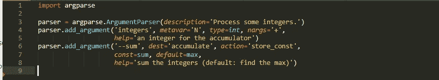
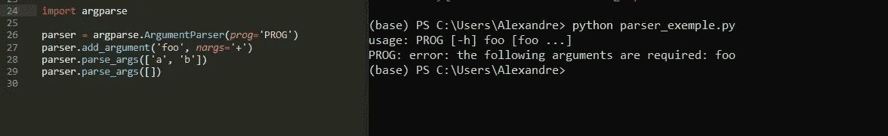
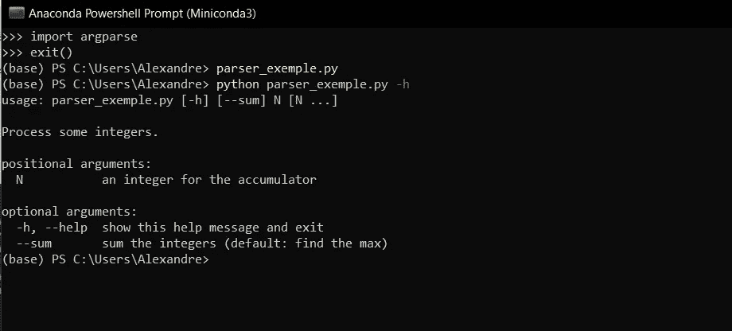
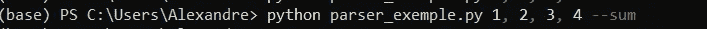
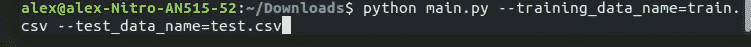

# 走向工业化的一步:用 pyspark 和 argparse 为您的代码提供参数

> 原文：<https://towardsdatascience.com/a-step-towards-industrialization-parameters-your-code-with-python-and-argparse-118783d09bfd?source=collection_archive---------31----------------------->

## 使用 argparse 创建您自己的命令行参数，并对 prophet 预测模型的运行进行参数化


【https://unsplash.com/photos/qjnAnF0jIGk 

# Argparse 是什么？

argparse 是一个 python 库，它允许我们编写自己的命令行，以便在代码中包含灵活性。我个人在我的许多脚本中使用它，以使我的数据管道更加灵活，并形成例如在移动时间窗口上的模型。快速浏览一下库之后，我们会看到一些用例。

## 参数化你的代码:生产力，灵活性和更高的质量。

首先，我们需要导入库。

```
import argparse
```

然后我们定义一个“解析器”

```
parser = argparse.ArgumentParser()
```

`[ArgumentParser](https://docs.python.org/3/library/argparse.html#argparse.ArgumentParser)`对象将保存将命令行解析成 Python 数据类型所需的所有信息。然后我们可以传递一些参数给解析器对象。

就说那个吧:

```
parser.add_argument(
    '--train_start',
    help='''Our algorithm deal with a moving window so we need to flexibilise our filename and so on it will be initialised with a flexible name like my_training_set_at_{train_start}''',
    required=True,
)
```

我们向解析器添加了一个名为“train_start”的参数，并创建了一个帮助消息，它定义了参数的用途和用法，或者您想要编写的任何内容。最后，我们设置一个顺序条件，强制使用该参数，如果为 False，则可以忽略。

## 先说教程:*(*[*https://docs.python.org/3/library/argparse.html*](https://docs.python.org/3/library/argparse.html)*)*

我们将把脚本复制到. py 文件中:



这里我们定义一个 ArgumentParser 对象来存储我们的参数。然后我们定义两个参数，一个有一个值，另一个会把它们加在一起，让我们来详述一下。

`ArgumentParser.**add_argument**` ( *名称或标志...* [，*动作* ][， *nargs* ][， *const* ][，*默认* ][，*类型* ][，*选择* ][，*必需* ][，*帮助* ][， *metavar* ][， *dest* ]

我们首先添加一个参数:

*   一个名称或标志:'**整数**'
*   类型:这里的数据类型是整数
*   帮助:帮助命令用户的消息
*   一个元变量:改变*显示的*名称。
*   nargs:它定义了应该使用的命令行参数的数量。这次行动`'+'`。就像`'*'`一样，所有存在的命令行参数都聚集到一个列表中。此外，如果没有至少一个命令行参数，将会生成一条错误消息。



在第二个增加的参数中

*   一个名字或旗帜:'- -sum '
*   默认操作:如果没有指定，则返回最大值
*   const:对整数列表求和的动作
*   a dest:要添加到由`[parse_args()](https://docs.python.org/3/library/argparse.html#argparse.ArgumentParser.parse_args)`返回的对象的属性的名称
*   助手消息

现在，我们将它保存为“parser _ exemple.py ”,然后打开控制台查看它:



那就试试吧



好了“教程”，现在让我们来看一个**真实的**例子。

# 几个使用的例子

> 我们将从我之前关于熊猫的一篇文章开始——UDF 和 prophet 对于这个脚本的预测和参数化，这将允许我们通过一个真实的例子使用 argparse 来参数化我们的脚本，避免一篇冗长无用的文章。下面是这篇文章的链接，其中包含了我们将要参数化的大部分代码

[*https://towards data science . com/py spark-forecasting-with-pandas-UDF-and-FB-prophet-e 9d 70 f 86d 802*](/pyspark-forecasting-with-pandas-udf-and-fb-prophet-e9d70f86d802)

## 它将成为我们的工作基地:

## 参数化你的文件名和文件路径

其实也不是很难，我们会在一个不同的文件里用几个参数定义我们的解析器(这是我个人的偏见:其实你可以在同一个空间里做所有的事情)。

因此，我们将定义一个函数来创建 ArgumentParser，向其中添加所需的参数并返回分析后的参数。

在 main 中，我们导入我们的函数并检索我们在启动 spark submit 时放入的参数。

然后使用正确的参数通过 shell 将其作为 python 作业或 spark 提交作业启动，就这样。



这些基本元素对于构建高度通用的管道是必不可少的，并且不需要特殊的开发技能。

# 最后

这看起来很简单，但是这种工具对于拥有灵活的管道和使生活变得更容易是绝对必要的。我在我的项目中经常使用它，特别是与气流一起使用，以便对一段时间内的重复预测进行编程——这将是未来文章的主题。

感谢您的关注，您会在我的 github*:*[*https://github.com/AlexWarembourg/*](https://github.com/AlexWarembourg/Medium)上找到所有的要点和要旨